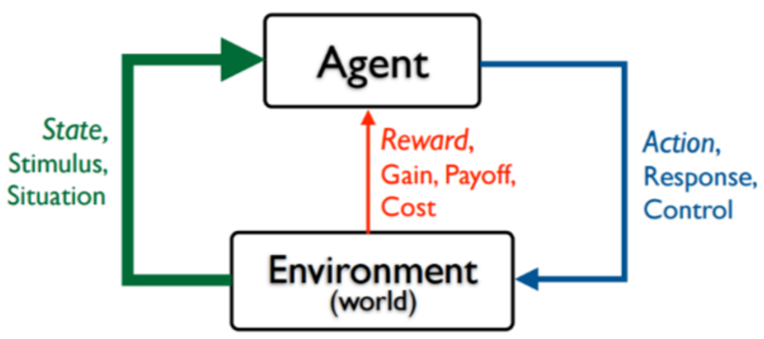

Copyright © Microsoft Corporation. All rights reserved.
  适用于[License](https://github.com/Microsoft/ai-edu/blob/master/LICENSE.md)版权许可

# 强化学习AI构建实战 - 基于“黄金点”游戏

**主要知识点：**

  - 强化学习算法介绍

  - 黄金点游戏介绍

  - 服务端接口介绍

  - 游戏AI策略介绍

  - 动手实现游戏AI并进行比赛

# 简介

强化学习(Reinforcement Learning)是机器学习的一种重要技术。本文首先简要介绍了强化学习的概念及思路，然后以Q-Learning算法为例介绍了如何进行训练。随后又介绍了黄金点游戏，并介绍了如何设计实现基于规则的、基于识别的、基于学习的策略BOT来进行比赛。

# 强化学习

## 人类如何学习？

在讲解强化学习之前，我们先来了解下人类是如何进行学习的。

我们在Azure Notebook上提供了一个可以线运行的示例环境：[HumanLearningDemo.ipynb](https://aka.ms/hldemo)，使用微软账号登录后就可以克隆并在线运行代码来体验这个环境，也可以将代码复制到本地来运行。

不看代码的话，人对这个示例环境是陌生的，只能输入1或者2，然后可以观察到状态A和状态B，并且在每次输入除了可以看到状态的变化，还可以看到得到了多少分，比如+10分、+40分、-10分等。目标是人需要适应这个新环境，尽可能让自己在环境中得到更多的好处，过得更好。对应于这个示例环境来说，就是要尽可能得到更多的得分。

如何才能得到更多的得分呢，作为一个人类，我们可以考虑下自已会怎么做。

对于刚开始的前几步，由于我们对这个环境一无所知，可能是随意的选择输入1或者输入2。

但是在进行了几步后，我们就可以观察到一些规律，比如有人会观察到状态A的时候输入1总是可以得10分，那我一直输入1就可以一直得分。

也有人愿意进行更大胆的试验，比如状态A时输入2，这时状态会变成B并扣10分，但是再次输入1时可以得到40分，相当于两个动作可以得到30分，比一直输入1更合适，然后再重复试验几次先2后1的组合会发现，这个得30的规律并不总是有效的，所以还要按这个规律出现的概率重新评估是否一直采用先2后1的组合。

状态<br>(A/B) | 动作<br>(1/2) | 得分
-|-|-
A | 1 | +10
A | 2 | -10
B | 1 | +40
A | 1 | +10
A | ... |

总结一下，人类在与这个环境交互的时候会观察并分析：
* 状态会如何随着动作输入进行变化？
* 在某个确定的状态下执行某个确定的动作会得到多少分？
* 怎样才能找到一个策略，可以让我的得分最高？

所以，我们可以理解为人类的学习过程就是`不停的在环境中探索，并根据环境变化及自己的收益情况，来不断调整更新自己的经验，最终学到在什么样的情况下怎么做才是最合适的`这么一个过程。

好了，接下来我们根据代码，揭晓一下这个示例环境的运行规则：


在这个环境下最优的策略如下：

状态 | 动作
-|-
A | 2
B | 1

大家可以把真实的环境和自己在环境中摸索的策略进行下比较。

## 强化学习

接下来我们看一下什么是强化学习。强化学习就是指Agent在一个环境中，为了达到一定的目的（比如延迟的反馈或奖励），不断地采取一系列的动作去尝试与环境进行交互，并在交互中根据反馈或奖励不断的调整策略，最终学到状态和动作的映射关系。



可以看出来，相对于其它机器学习算法，强化学习算法更加现实，更加接近人类的学习过程。

常见的强化学习算法有Q-Learning、策略梯度等，另外还有一些将强化学习和深度学习结合的算法，比如DQN(Deep Q Network)等，另外，前一段时间很火的AlphaGo，以及后来的Alpha Zero，也属于深度强化学习。

## Q-Learning

下面我们以Q-Learning为例，来简单介绍下算法的步骤。

Q-Learnig中会用到一个表格，我们叫它为Q Table，也叫Q表。Q表中存放着状态和动作的关系，每个状态是一行，每个动作是一列，表格中的数值代表在这个状态下采用这个动作后可以得到的回报，当然这是个估计值。

算法的迭代过程就是要一步步的调整Q表中的估计值，使得它离现实值越来越近。下图就描述了算法的迭代过程。


我们能不能用Q-Learning来解决刚才上面的问题呢，答案是肯定的。

针对上面的问题，状态可能的取值是A和B，是Q表中的行，动作可能的取值是1和2，是Q表中的列。先初始化Q表，初始值均为0.0

&nbsp; | 1 | 2
-|-|-
A | 0.0| 0.0
B | 0.0| 0.0

初始状态是A，此时如果输入动作1，新状态还是A，得分是10。套用前面算法中的公式计算Q表中Q(A,1)的值（这里计算时使用的学习率是0.1，未来回报的衰减率是0.9）

Q(A,1) = Q(A,1) + 0.1 \* (10 + 0.9 \* 0.0 - Q(A,1)) = 0.0 + 0.1 \* (10 + 0.9 \* 0.0 - 0.0)=1.0

所以此时Q表会变成

&nbsp; | 1 | 2
-|-|-
A | 1.0| 0.0
B | 0.0| 0.0

接着执行动作2，当前状态是A，执行动作2后状态变成B，得分是-10，再套用公式计算下Q(A,2)

Q(A,2) = Q(A,2) + 0.1 \* ( -10 + 0.9 \* 0.0 - Q(A,2))=0.0 + 0.1 \* ( -10 + 0.9 \* 0.0 - 0.0) = -1.0

所以此时Q表会变成

&nbsp; | 1 | 2
-|-|-
A | 1.0| -1.0
B | 0.0| 0.0

然后再执行动作1，当前状态是B，执行动作1后状态变成A，得分是40，再套用公式计算下Q(B,1)

Q(B,1) = Q(B,1) + 0.1 \* ( 40 + 0.9 \* 1.0 - Q(B,1))=0.0 + 0.1 \* ( 40 + 0.9 \* 1.0- 0.0) = 4.09

所以此时Q表会变成

&nbsp; | 1 | 2
-|-|-
A | 1.0| -1.0
B | 4.09| 0.0

...

在实际的训练过程中，Q-Learning往往会大概率选择当前状态下有最大Q值的动作（和选择动作的策略有关），这会导致算法难以发现有延迟回报的最优动作，往往需要训练很多回合才能达到最好的结果。

我们在Azure Notebooks上提供了用Q-Learning来解决这个问题的示例：[Q-LearningDemo.ipynb](https://aka.ms/qldemo)，大家可以在线运行一下。这个Notebook先分步讲解了Q表是如何更新的，然后又演示了在多回合学习后的Q表是什么样的，最后使用学习到的Q表在未知环境中取得了很高的得分。

# “黄金点”游戏介绍

笔者最早接触“黄金点”游戏是通过邹欣老师的软件工程教材《构建之法》及他的博客“[创新的时机 –
黄金点游戏](https://www.cnblogs.com/xinz/archive/2011/08/08/2130505.html)”，里面对游戏是这样介绍的：

>*N个同学（N通常大于10），每人写一个0~100之间的有理数
(不包括0或100)，交给裁判，裁判算出所有数字的平均值，然后乘以0.618（所谓黄金分割常数），得到G值。提交的数字最靠近G（取绝对值）的同学得到N分，离G最远的同学得到－2分，其他同学得0分。*

同时，邹老师的著作中还提到了这个游戏的来源：

>*这个游戏是经济学家Richar
Thaler构思的，1997年伦敦金融时报进行了一次公开竞猜活动，他们用的系数是2/3，所有人的平均值是18.91。2006年，我是在清华软件学院的一个培训班上第一次玩这个游戏。后来这个游戏成了我演讲和讲课的固定节目，在不少大学的计算机系都玩过。*

如果让你参与这个游戏，你会写下哪个数字呢？

通常大家会想，如果所有人随机出数，那么所有人的平均值将是50，50\*0.618=31，那是不是出31比较合适呢。但是很多人也会考虑到这一点，如果大家都出了31，那是不是出31\*0.618=19更合适呢。

如此循环下去你就会发现，这个数越来越小，那是不是出个很小的数胜率更大呢？也不尽然，很有可能其它参与者并没有想到那么深，你如果出的数过于超前也得不到分。

经过邹老师多次的观察，第一轮获胜的数字离17不远，另外，如果继续玩下去，10轮、20轮，从总体趋势来看，数值会逼近0，但是偶尔也会有小的反弹，然后又继续逼近0。


上图是邹老师在清华大学2008秋季学期连续12次黄金点游戏的记录。

在只有第一名得分、最后一名扣分的规则下，大家更愿意出小一些的数而不是去向上扰动黄金点的值。于是100轮甚至更多轮比赛时，往往变成了大家出了带一堆0的小数，然后比较哪个小数更接近黄金点。

基于此，我们对游戏规则进行了调整，允许每个玩家出两个数，鼓励玩家对黄金点进行扰动。可以一个数出的很大，来保证自己的另一个数比较接近黄金点，这样在失分的情况下也有机会同时得分；也可以两个数都去尝试猜中黄金点，双保险。

整理后新的规则如下：

  - 有N个玩家参与游戏

  - 每个玩家可以自由选择两个0-100之间的两个有理数（不包括0和100）进行提交

  - 所有2\*N个数提交后，计算所有数的平均值，然后将平均值乘以0.618得到这一轮的黄金点

  - 分别计算所有玩家提交的两个数字与黄金点的算术差的绝对值，值最小者得分，值最大者扣分，其它玩家不得分

具体计分规则如下：

  - N个玩家参与游戏时，离黄金点最近的玩家得N分，最远的扣2分，其它玩家不得分

  - 如果多个玩家在一轮内同时离黄金点最近，每个玩家得N分

  - 如果多个玩家在一轮内同时离黄金点最远，每个玩家扣2分

  - 如果一个玩家在一轮提交的两个数相同并得分或扣分时，只计一次分

  - 如果N=1，即只有一个玩家参与游戏时，不记分

  - 固定轮数（100轮或更多）比赛后，累加玩家每轮的得分得到总成绩，得分最高者为最终胜出玩家

按照新规则，我们组织一批学生写AI进行了两场比赛，第一场比赛200轮

|  | 
|:--:| 
| 第一场比赛 – 全部200轮黄金点走势图 |

| |
|:--:| 
| 第一场比赛 – 最后100轮黄金点走势图 |

从第一场比赛可以看出黄金点在刚开始的几轮急速下降，但下降到4~5之间时，一直在细微的波动，说明大家都比较谨慎，没有明显的扰局现象。另外从玩家得分上看，由于大家都比较保守的去预测黄金点，所以得分相对均匀。

随后我们公布了结果，并让大家改进AI，又组织进行了400轮的比赛

|  |
|:--:| 
| 第二场比赛 – 全部400轮黄金点走势图 |

|  |
|:--:| 
| 第二场比赛 – 最后100轮黄金点走势图 |

从第二场比赛可以看出明显第二场要比第一场激烈的多。一个有意思的现象是，在刚开始几轮急速下降后，走势并没有趋向于平稳，而是在有规律的跳动，明显是有玩家在有策略的扰动黄金点。

在事后我们对最终胜出的玩家进行了采访，他们提到在分析第一场的数据时，发现了一个有趣的现象：故意提交大数字的
玩家并没能扰乱黄金点的收敛趋势，反而被扣了很多分。但是他们转念一想，如果大家的结果都在上一轮的黄金点附近波动，那么可以用一个大数来制造扰动，然后根据自己的大数做出相应的调整，给出另一个输出（在比赛中，如果选择
99 作为大数，通常下一轮的 G 会增加
1.1）。

他们迅速实现了想法，并根据第一场的历史数据调整了预测参数。第二场比赛时，黄金点并没有平稳收敛，而是随着他们的扰动策略不断波动，而他们也顺理成章的取得了大把的得分。第二场同样有玩家选择了扰动策略，但却因为对扰动时机、扰动后的预测范围等细节把控不到位，而与胜利失之交臂，可见对细节的掌控也是稳定发挥的基础。

# 服务端接口

为了让大家的AI可以顺利地进行游戏，并验证我们对策略和AI的一些实现，我们需要一些基础设施来帮助我们完成一些工作。这些工作包括游戏回合的控制、参与者之间的数据同步、游戏数据的储存等功能。

为了简化这些基础工作，以便大家可以更好地集中于AI本身的设计和实现，我们搭建了一个服务器提供了一些基本的接口。使用这些接口，AI可以做到简单的调用REST
API接口实现游戏回合时间同步、获取历史数据、提交预测数据等功能。

下图描述了服务器如何驱动游戏一回合接着一回合的运转，同时指出了AI或客户端应何时与服务器交互。


当AI或客户端进入游戏后，应立即向服务器请求获取当前回合的状态，此时可以知道服务器上正在进行的游戏回合的编号，以及本回合还有多长时间结束。AI或客户端可以按照返回的回合编号向服务器提交预测值，并且可以根据本回合剩余时间，设定一个定时器，在下一回合开始时，再次执行获取回合状态的接口，来取得下一回合的状态。这样依次轮转下去，AI或客户端就可以一直参与在游戏中。
同时，AI或客户端还可以在每回合开始时，调用获取历史数据的接口，来得到前几回合的比赛数据。这样可以知道自己在上一回合是否得分胜出，并可以根据历史数据来指导当前回合的预测值。

## 接口概述

服务器地址是[https://goldennumber.aiedu.msra.cn](https://goldennumber.aiedu.msra.cn)，提供RESTful API接口。所有请求需要的参数都拼装在URL中，并且需要对值进行URL编码。所有的响应报文内容都是JSON格式。如果服务器响应代码不是2\*\*或3\*\*，表示该次请求失败。**失败的响应报文至少包含一个message属性：**

属性名 | 数据类型 | 备注
-|-|-
message | String | 出错的具体信息

服务端REST接口提供了Swagger描述文档： [swagger.json](https://goldennumber.aiedu.msra.cn/swagger/v1/swagger.json)  [中文版](https://goldennumber.aiedu.msra.cn/swagger/v1%20-%20Chinese/swagger.json) [英文版](https://goldennumber.aiedu.msra.cn/swagger/v1%20-%20English/swagger.json)
  
可以参考该API文档直接来调用服务器接口，也可以借助第三方工具从swagger文档生成所需语言的SDK来使用。比如，可以借助[SwaggerEditor](https://editor.swagger.io/)来生成各种语言版本的客户端SDK，可以极大的方便开发。

另外，服务端也提供了[API试用页面](https://goldennumber.aiedu.msra.cn/swagger/index.html#/Default)，可以方便直接的在线试验API接口。

下面是各个接口的详细描述：

## 新建玩家

请求方式：GET

路径：/api/NewUser

客户端使用该接口可以新建一个玩家。

请求需要用到的参数：

参数名 | 数据类型 | 是否必需 | 备注
-|-|-|-
nickName | String | 可选 | 用户昵称<br>如果长度超过20，将被截断<br>建议设置昵称，昵称相对于标识有更好的辨识度

响应报文内容中的属性：

属性名 | 数据类型 | 备注
-|-|-
userId | String | 用户标识，格式为Guid格式
nickName | String | 用户昵称

## 设置用户昵称

请求方式：POST

路径：/api/NickName

使用该接口可以用来修改用户的昵称，昵称相对于标识来说，有更佳的辩识度。

请求需要用到的参数：

参数名 | 数据类型 | 是否必需 | 备注
-|-|-|-
uid | String | 必需 | 用户标识
nickname | String | 必需 | 用户昵称，长度大于20会被截断

## 获取新游戏房间

请求方式：GET

路径：/api/NewRoom

使用该接口创建一个新的游戏房间并获取对应的编号。

请求需要用到的参数：

参数名 | 数据类型 | 是否必需 | 备注
-|-|-|-
uid | string | 必需 | 房间创建者的标识
numbers | Int | 可选 | 设置游戏支持的每个玩家可以提交的预测值的个数，目前支持提交1个或2个数<br>默认是1，表示每个玩家可以提交一个数
duration | Int | 可选 | 设置游戏中每回合的间隔时间<br>默认值是60秒，取值范围在10~200之间
userCount | int | 可选 | 设置游戏房间中允许的最大玩家数<br>默认值是0，表示没有限制<br>有玩家数量限制的房间，当所有玩家都提交预测值后，会立即计算本回合结果，并开始下一轮<br>注意：这里的玩家数量限制是针对房间的，不是针对一个回合，只要玩家在房间内任一回合提交过预测值，则认为该玩家始终在房间内
roundCount | int | 可选 | 设置比赛总回合数<br>默认值是0，表示没有限制<br>如果某一回合没有玩家提交数据，认为该回合无效，不计在回合数内<br>如果有效回合数达到设置的总回合数，游戏结束，不再允许提交数据
manuallyStart | Int | 可选 | 是否手动开始游戏<br>默认值0，表示创建完房间后，游戏自动开始<br>如果是1，表示需要由创建者手动开始游戏

响应报文内容中的属性：

属性名 | 数据类型 | 备注
-|-|-
roomId | Int | 游戏房间编号

## 开始游戏

请求方式：GET

路径：/api/StartGame

如果创建游戏时设置的是手动开始，那么游戏创建者可以调用该接口开始游戏。

请求需要用到的参数：

参数名 | 数据类型 | 是否必需 | 备注
-|-|-|-
uid | string | 必需 | 房间创建者的标识
roomid | int | 可选 | 房间编号<br>如果未设置，默认为0号游戏房间

## 获取游戏状态

请求方式：GET

路径：/api/State

客户端使用该接口可以获取当前房间内的游戏状态，可以根据当前游戏支持提交的预测值的个数进行提交。同时还可以知道当前回合什么时间结束，推算出什么时候可以取得本回合的比赛数据以及获取下一轮比赛的相关信息。

请求需要用到的参数：

参数名 | 数据类型 | 是否必需 | 备注
-|-|-|-
uid | String | 可选 | 用户标识
roomid | Int | 可选 | 房间编号<br>如果此参数为空，默认0号房间

响应报文内容中的属性：

属性名 | 数据类型 | 备注
-|-|-
userId | String | 用户标识
nickName | String | 用户昵称
roomId | Int | 房间编号
numbers | Int | 当前房间内的游戏支持提交的预测值的个数，1或2
roundId | string | 当前房间内正在进行的游戏回合标识
leftTime | int | 当前游戏回合还有多少秒截止提交
roundEndTime | datetime | 当前回合截止提交的UTC时间
state | int | 当前游戏状态<br>0代表进行中<br>1代表未开始，需要房间创建者手动开始<br> 2代表已结束，不允许再向房间内提交数据
hasSubmitted | bool | 当前用户本回合是否已提交预测值
isRoomCreator | bool | 当前用户是否是当前房间的创建者。<br>如果房间在创建时没有指定自动开始，需要创建者手动开始游戏
maxUserCount | int | 创建房间时设定的玩家数<br>0表示没有限制<br>最大不能超过200<br>设置人数上限的房间中，在获取格式化的历史数据时，会将未加入游戏的玩家的预测值用0来填补，保证每回合取到的数据都是固定列数的规整数据<br>同时，设置人数上限的房间中，如果所有玩家都已提交，则立该结束当前回合，并开始下一回合
currentUserCount | int | 当前房间内提交过预测值的玩家数量
totalRoundCount | int | 创建房间时设定的该房间可以进行的有效回合数
finishedRoundCount | int | 当前房间内已经进行的有效回合数<br>玩家提交过预测值的回合认为是有效回合，否则忽略该回合，继续等待玩家提交
enabledToken | bool | 当前房间是否已启用身份验证

## 提交预测值

请求方式：POST

路径：/api/Submit

客户端使用该接口可以向服务器提交预测值。每回合只允许提交一次，提交成功后不可修改。

如果当前房间设置了玩家人数上限，则当所有玩家提交了预测值后，立即计算本回合结果，并开始下一回合。

请求需要用到的参数：

参数名 | 数据类型 | 是否必需 | 备注
-|-|-|-
rid | String | 必需 | 要提交预测值的回合标识，需要是GUID的格式
uid | string | 必需 | 提交预测值的用户标识
n1 | Double | 必需 | 预测值，必须是0到100之间的有理数，不包括0和100
n2 | Double | 可选 | 第二个预测值，如果当前游戏是支持两个数的游戏，此参数也为必需项；如果当前游戏仅支持一个数，此参数将被忽略
token | string | 可选 | 启用身份验证的房间必须带有正确的验证信息才可以提交<br>由房间创建者提供原始令牌，将用户标识、回合标识、原始令牌连接为新字符串，先做一次SHA256，然后做一次Base64，得到的结果做为token的值

## 获取黄金点历史数据

请求方式：GET

路径：/api/TodayGoldenList

使用该接口可以获取当前房间内当天的黄金点历史数据，玩家可以基于此来预测下一轮的黄金点值。

请求需要用到的参数：

参数名 | 数据类型 | 是否必需 | 备注
-|-|-|-
roomid | String | 可选 | 房间编号<br>如果该参数为空，默认0号房间
roundCount | Int | 可选 | 查询的回合数量<br>如果此参数为空，默认最近100回合的数据<br>如果需要查询所有数据，需设置为-1<br>注意：当回合数特别大时，返回的数据包会特别大

响应报文内容中的属性：

属性名 | 数据类型 | 备注
-|-|-
goldenNumberList | Array | 房间中当天的黄金点历史数据，数组的最后一个值是最新一轮的黄金点值

## 获取玩家提交的历史数据

请求方式：GET

路径：/api/TodayNumbers

使用该接口可以获取当前房间内，当天已完成的回合中，所有玩家提交的历史数据。

玩家历史数据以数组形式返回，数组中每个元素都有用户索引号和回合索引号，可以按不同维度分别统计某个玩家的提交规律或某个回合详细数据，可以按照自己的需要，对该数据进行建模或训练对应的模型。

请求需要用到的参数：

参数名 | 数据类型 | 是否必需 | 备注
-|-|-|-
roomid | int | 可选 | 房间编号<br>如果未设置，默认为0号游戏房间
roundCount | Int | 可选 | 查询的回合数量<br>如果此参数为空，默认最近100回合的数据<br>如果需要查询所有数据，需设置为-1<br>注意：当回合数特别大时，返回的数据包会特别大

响应报文内容中的属性：

属性名 | 数据类型 | 备注
-|-|-
validNumbers | int | 当前房间支持的可提交数字个数，1或者2。<br>当为1时，下面的数据只有number1是有效的；<br>当为2时，下面的数据中number1和number2均为有效数字。
numberList | array | 用户提交的数字列表，数组中的每个元素包含以下属性：<br>userIndex, roundIndex, number1, number2
&nbsp;&nbsp;&nbsp;&nbsp;userIndex | int | 用户索引号，相同的用户索引号表示同一个用户在不同回合提交的数字
&nbsp;&nbsp;&nbsp;&nbsp;roundIndex | int | 回合索引号，相同的回合索引号表示不同用户在同一回合提交的数字
&nbsp;&nbsp;&nbsp;&nbsp;number1 | double | 用户提交的第一个数字
&nbsp;&nbsp;&nbsp;&nbsp;number2 | double | 用户提交的第二个数字，仅当validNumbers为2时有效

## 获取玩家得分

请求方式：GET

路径：/api/TodayScore

使用该接口可以查询游戏房间内所有玩家的得分情况。用户得分按从高到低排列。

请求需要用到的参数：

参数名 | 数据类型 | 是否必需 | 备注
-|-|-|-
roomid | int | 可选 | 房间编号<br>如果未设置，默认为0号游戏房间

响应报文内容中的属性：

属性名 | 数据类型 | 备注
-|-|-
scoreList | array | 数组中的每个元素包含以下属性：<br>userId, nickName, score, index
&nbsp;&nbsp;&nbsp;&nbsp;userId | string | 用户标识
&nbsp;&nbsp;&nbsp;&nbsp;nickName | string | 用户昵称
&nbsp;&nbsp;&nbsp;&nbsp;score | int | 得分
&nbsp;&nbsp;&nbsp;&nbsp;index | int | 该用户在当前房间内的索引号

## 获取分页历史数据

请求方式：GET

路径：/api/History

使用该接口可以获取当前房间内的历史数据，包括每回合的黄金点、每个玩家的预测值、得分等信息。

没有指定任何参数时，返回0号房间内最新的10回合的历史。

请求需要用到的参数：

参数名 | 数据类型 | 是否必需 | 备注
-|-|-|-
roomid | String | 可选 | 房间编号<br>如果该参数为空，默认0号房间
startrid | String | 可选 | 开始查询的游戏回合标识<br>如果该参数为空，默认为当前正在进行的回合
count | Int | 可选 | 指定从startrid开始返回多少回合的历史，不包括startrid回合<br>如果没有指定该参数，默认为10，最大不超过100
direction | Int | 可选 | 查询的方向<br>默认值是0，表示从startrid查询旧的历史数据<br>另一个值是1，表示从startrid查询更新数据

响应报文内容中的属性：

属性名 | 数据类型 | 备注
-|-|-
rounds | Array | 查询到的回合的数组，数组的每个元素包含以下属性：<br>roundId, time, goldenNumber, userNumbers
&nbsp;&nbsp;&nbsp;&nbsp;roundId | String | 回合标识
&nbsp;&nbsp;&nbsp;&nbsp;index | int | 该回合在当前房间中的索引编号
&nbsp;&nbsp;&nbsp;&nbsp;time | String | 该回合的截止时间，UTC
&nbsp;&nbsp;&nbsp;&nbsp;goldenNumber | Double | 该回合的黄金点
&nbsp;&nbsp;&nbsp;&nbsp;userNumbers | Array | 该回合所有玩家提交的数的数组，数组的每个元素所含以下属性：<br>userId, masterNumber, slaveNumber, score
&nbsp;&nbsp;&nbsp;&nbsp;&nbsp;&nbsp;&nbsp;&nbsp;userId | String | 用户标识
&nbsp;&nbsp;&nbsp;&nbsp;&nbsp;&nbsp;&nbsp;&nbsp;masterNumber | double | 用户提交的第一个预测值
&nbsp;&nbsp;&nbsp;&nbsp;&nbsp;&nbsp;&nbsp;&nbsp;slaveNumber | double | 用户提交的第二个预测值，仅当当前游戏支持提交两个数的时候有效
&nbsp;&nbsp;&nbsp;&nbsp;&nbsp;&nbsp;&nbsp;&nbsp;score | Int | 用户在当前回合的得分
nickNames | object | 用户编号和用户昵称的字典<br>用户编号是key，用户昵称是value


# 主体流程分析和实现

从上述的服务器接口描述和定义，我们可以看出，一个最基本的黄金点游戏程序应该具有哪些功能。

要顺利地进行游戏，最核心的两个功能，就是通过服务器提供的RESTful API进行**获取当前回合状态**（`GET /api/State`）和**提交数字**（`POST /api/Submit`）。这两个核心操作中，由于提交数字时必须知道当前的游戏设置（如需要提交一个数还是两个数），以及当前的回合ID，所以在提交之前，正确地获取当前回合的状态是必要的。否则提交会失败。有了这两个功能，我们前面列举的一些最简单的游戏策略就可以被实现了，比如提交随机数，提交固定的数等。

当然，上面提到的最简单的两个策略可能不会表现得很好。为此，我们还需要调用**获取黄金点历史数据**接口（`GET /api/TodayGoldenList`），这一接口为我们实现诸如重复上一轮的黄金点、计算以前数轮黄金点的均值提供了可能；另外，还可以调用**获取玩家提交的历史数据**接口（`GET /api/TodayNumbers`）来得到每个玩家的数据，从而可以推测他人策略、学习历史数据进行建模等。

对于上述三个主要的接口，上文已经对作为其输入的HTTP请求，和服务器输出的数据结构的格式做了一番说明，并提供了Swagger描述，可以方便的生成任何语言的客户端SDK。这里我们对主体流程和相关的要点做一下整理：

1. 创建新用户或使用已有的userId，获取当前回合状态，初始化客户端环境。包括玩家ID、回合倒计时等；
2. 尝试在回合倒计时结束前，向服务器提交数据。
    - 提交时必须声明提交针对的回合，已经过去的、不合法的回合会导致提交失败。
3. 倒计时结束后，获取新一回合——也即当前回合——的状态。
    - 由于时间同步可能不稳定，只有观察到回合ID较之前改变了，新回合才算开始。
4. 回到第2步。

伪代码如下：
```c
// 任一房间号。省略的话，默认是0号房间。
roomId=42

// 初始化。
user = NewUser(nickName="foo")
userId = user.userId // 整个循环中，只使用一个用户ID，以正确统计得分。

// 游戏主循环。
while true:   

    // 获取当前游戏的状态，包括当前回合的标识号，回合结束的剩余时间等
    state = GetState(uid=userId, roomId=roomId) 

    // 获取当前房间的历史记录。默认是从当前回合开始追溯。
    history = GetTodayGoldenList(roomId) 

    // 尝试在当前回合结束前，向服务器提交数据。
    while DateTime.now < state.roundEndTime:
        if HaveNotSubmittedForRound(state.roundId):

            // 核心：策略实现。
            num = Calculate(history) 

            Submit(num, uid=userId, rid=roundId) // 提交数据必须指定提交者ID和目标回合ID。

    while true:
        nextState = GetState(uid=userId, roomId=roomId) // 使用当前用户ID，避免分配新ID。

        // 直到确认新回合开始了，才更新客户端状态。
        if nextState.roundId != state.roundId: 
            state = nextState
            break
```

我们也提供了[C#和Python的几个Bot示例代码](https://aka.ms/goldenbotdemo)，大家可以尝试运行一下。


# 游戏策略

前面介绍了服务器的接口及BOT程序的主要框架，下面将讨论下可以使用哪些策略来玩这个游戏。

## 基于规则的策略

当我们思索游戏的制胜策略时，我们想到或许一些简单的策略就能取得出乎意料的效果。比如人在思索游戏对策的时候，经常想到的一种对策就是基于规则的，其表现为一系列“当对方……我就……”形式的条件和计划。当游戏的对手确实执行了我们预测中的操作时，我们从预先定义的计划里找到对应的手段并执行。这种基于规则的策略往往要求我们先尽可能地预测对手的行为，并做出针对性的压制计划。

典型的基于规则的策略有：重复上一回合的黄金点、上一回合黄金点乘以0.618、取最近十轮中黄金点的均值、使用固定值如42、生成（0，100）区间内的随机数等等。或者稍微复杂一些的规则，比如前面我们提到2018年微软学生夏令营中同学们的策略：当黄金点的取值连续多轮变化不大时，用一个比较大的值拉高黄金点的值，另一个值可以适应比前一轮黄金点高一些。

[Azure Notebooks](https://aka.ms/goldennotebook)中的`BotDemo.ipynb`就是一个简单的基于规则的Bot，可以在线运行试一下。

## 基于识别的策略

基于规则的策略能达到的成就或许有限，因为我们处于一个复杂且多变的游戏环境，我们可能很难有效地制定一些应对性的规则。除了简单规则之外，我们还可以尝试的一种手段是基于识别的策略，即我们可以先尝试识别对手使用的是怎样的策略，然后再预测其在下一轮比赛中可能采取的行动，然后再做针对性的应对。比如，如果我们识别了对手采取的是“重复上一轮黄金点”这一基于规则的策略，我们就能有效地进行应对（如提交任意比上轮黄金点小的数）。我们可以看出，这种策略比起基于规则的策略有着更为超前的视野。然而，考虑到游戏本身的复杂性，我们能有效识别的敌方策略，可能会很有限。

## 基于强化学习的策略

除了上述的策略，我们还可以采用基于强化学习的策略。观察过几组游戏的历史记录后，我们注意到这些历史记录中似乎是存在一定规律的，但是其潜在的规律难以用简单的规则或手工组织的程序来捕捉。对此，我们可以尝试通过强化学习的方式来完成这一任务。

以前面介绍的Q-Learning为例，首先我们要确定可能的状态和动作，但很明显，这里的状态空间和动作空间都是无限大的，我们尝试强行作个简化然后再使用Q-Learning。

对于状态空间来说，我们可以考虑将黄金点数据用特定的编码方式编码，如将黄金点的趋势转换为“上升/下降X%”的形式，其中X可以是几个固定的值如10、20、50等。更简单的还可以将最近几回合的黄金点趋势总结为上升/下降了几次。

对于动作空间来说，一种简单的处理是将前面基于规则和策略拿过来，多定义几种规则作为多个动作。

最后以这个有限的状态和动作来构造Q表进行强化学习的训练。

[Azure Notebooks](https://aka.ms/goldennotebook)中的`RLBotDemo.ipynb`就是一个简单的使用Q-Learning的Bot，可以在线运行试一下。

必须要提到的一点是，上面这种简化并不是特别合理，有时训练出来的模型可能比不过单纯基于简单规则的，所以需要大家尝试定义不同的状态空间和动作空间，看是否能玩的更好。

另外，由于这个游戏的状态空间及动作空间很大，深度强化学习可能更适合来解决这个问题。本案例后续会补充使用深度强化学习的Bot代码，感兴趣的同学可以提前自己尝试一下。

# 作业

1. 参照[挑战黄金点](https://aka.ms/goldenchallenge)的要求，尝试在房间0或房间1中取得高分
2. 在黄金点网站上新建房间，邀请同学进行Bot之间的对抗
