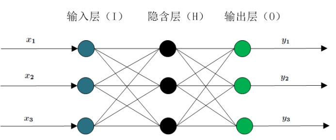
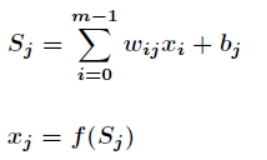
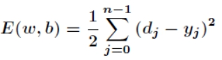
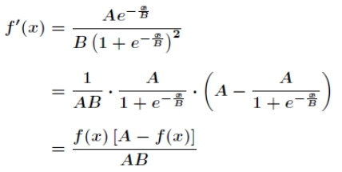
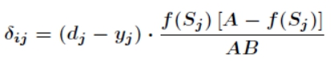
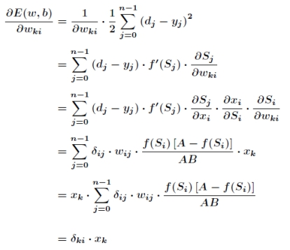
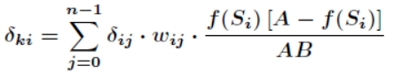
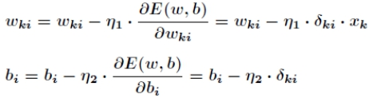
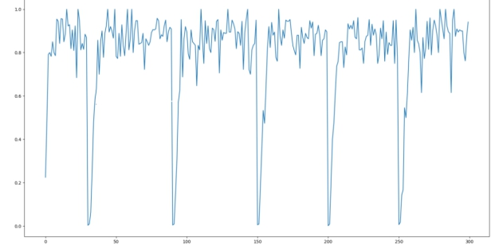

# **内容中心网络CCN缓存污染攻击防御**


# 1 CCN介绍

## 1.1 内容中心网络概念

CCN（Content Centric Network），内容中心网络，是由施乐公司的帕洛阿托研究中心（PARC）的Van Jacobson提出。在CCN中，不同的内容被赋予唯一的名字标识来区分，同时由于内容名字的层次化结构，使得网络中可以使用内容名称进行路由，从而取代IP网络中通过IP地址进行路由的机制，实现了改变当前互联网以IP协议为基础、以主机为中心的通信模型。CCN中的节点均内置缓存，当有内容经过节点，节点根据一定的策略将该内容存储在节点的缓存内，当其他用户发出相同内容的请求时，用户就可以在距离自己最近的节点处获得请求的内容。CCN主要关注的是找到并交付信息，而不是最终用户的可达性，也不是维持用户之间的通信。这种新的网络架构专注于信息对象、信息属性和用户属性，采用“信息共享通信”模型，从而实现高效可靠的信息分发。

## 1.2 CCN的通信方式

内容中心网络中的通信方式通过两种数据包来实现：兴趣（Interest）包和数据（Data）包。这两种包中都携带了一个名字，以指明感兴趣的数据类型或者是携带的数据类型。这个名字以层次结构命名。如对popular内容中的某一项感兴趣，这个名字则可以是“/popular/xxx”的形式。每个节点都维护了内容缓存（Content Store），未决请求表（Penging Interest Table）和前向转发库（Forwarding Information Base）。其中FIB保存了节点转发兴趣包的下一跳接口，PIT则用于记录了由于缓存没有命中而未响应的兴趣包及其到达本节点的接口。

这三个表的工作流程如下图所示：

 


当一个节点收到兴趣数据包，首先会检查自己的缓存，如果缓存命中，则回复数据包，如果没有命中，则在PIT中记录并按照FIB规则转发数据包，如果没有在FIB规则中找到相应的转发规则，则丢弃这个数据包。

当一个节点收到数据包时，会现在PIT中查找是否有记录，如果有，则转发数据包并在内容缓存中加入数据包，没有则丢弃该包。

CCN就是通过这种方式来实现各个节点之间的相互通信。

不难看出，这种通信方式对于缓存的依赖很大，缓存的性能直接影响到了整个网络的性能。因此缓存污染攻击会对CCN的整体性能造成较大的影响，提出一种能够有效检测缓存污染攻击的方法是十分有必要的。

# 2 相关技术简介

## 2.1 BP神经网络

BP(back propagation)神经网络是1986年由Rumelhart和McClelland为首的科学家提出的概念，是一种按照误差逆向传播算法训练的多层前馈神经网络，是目前应用最广泛的神经网络。

基本BP算法包括信号的前向传播和误差的反向传播两个过程。即计算误差输出时按从输入到输出的方向进行，而调整权值和阈值则从输出到输入的方向进行。正向传播时，输入信号通过隐含层作用于输出节点，经过非线性变换，产生输出信号，若实际输出与期望输出不相符，则转入误差的反向传播过程。误差反传是将输出误差通过隐含层向输入层逐层反传，并将误差分摊给各层所有单元，以从各层获得的误差信号作为调整各单元权值的依据。通过调整输入节点与隐层节点的联接强度和隐层节点与输出节点的联接强度以及阈值，使误差沿梯度方向下降，经过反复学习训练，确定与最小误差相对应的网络参数(权值和阈值)，训练即告停止。此时经过训练的神经网络即能对类似样本的输入信息，自行处理输出误差最小的经过非线形转换的信息。

BP神经网络分为两个过程：工作信号正向传递子过程和误差信号反向传递子过程。在BP神经网络中，单个样本有m个输入，有n个输出，在输入层和输出层之间通常还有若干个隐含层。实际上，1989年Robert Hecht-Nielsen证明了对于任何闭区间内的一个连续函数都可以用一个隐含层的BP网络来逼近，这就是万能逼近定理。所以一个三层的BP网络就可以完成任意的m维到n维的映射。即这三层分别是输入层（I），隐含层（H），输出层（O）。如下图所示:

 

 

**正向传递子过程：**

现在设节点i和节点j之间的权值为wij，节点j的阀值为bj，节点j的输出值为xj，而每个节点的输出值是根据上层所有节点的输出值、当前节点与上一层所有节点的权值和当前节点的阀值还有激活函数来实现的。具体计算方法如下：

 

其中f为激活函数，一般选取S型函数或者线性函数。正向传递的过程比较简单，按照上述公式计算即可。在BP神经网络中，输入层节点没有阀值。

 

**反向传递子过程：**

在BP神经网络中，误差信号反向传递子过程比较复杂，它是基于Widrow-Hoff学习规则的。假设输出层的所有结果为dj，误差函数如下:

 

而BP神经网络的主要目的是反复修正权值和阀值，使得误差函数值达到最小。Widrow-Hoff学习规则是通过沿着相对误差平方和的最速下降方向，连续调整网络的权值和阀值，根据梯度下降法，权值矢量的修正正比于当前位置上E(w,b)的梯度，对于第j个输出节点有：

 

假设激活函数为：

 

 

对激活函数求导，有：

 

接下来针对wij有：

 

其中有：

 

同样对于bj有:

​	

这就是著名的学习规则，通过改变神经元之间的连接权值来减少系统实际输出和期望输出的误差，这个规则又叫做Widrow-Hoff学习规则或者纠错学习规则。

上面是对隐含层和输出层之间的权值和输出层的阀值计算调整量，而针对输入层和隐含层和隐含层的阀值调整量的计算更为复杂。假设wij是输入层第k个节点和隐含层第i个节点之间的权值，那么有:

 

其中有：

 

有了上述公式，根据梯度下降法，那么对于隐含层和输出层之间的权值和阀值调整如下：

 

而对于输入层和隐含层之间的权值和阀值调整同样有：

 

以上，便是BP神经网络的基本原理。

## 2.2 Tensorflow

TensorFlow是一个用于各种机器学习任务的开源软件库[6]。最初由GoogleBrain团队开发，它有高度的灵活性，可移植性和多语言支持，其作为一个深度学习框架正在以迅猛的速度渗透到科研和生活之中。

## 2.3 Keras

Keras是一个高层神经网络API，它支持简易和快速的原型设计，并且高度模块化，可扩展性强。它最初由Google的一个工程师开发，现在已经被集成到Tensorflow之中。本次实验将使用Keras作为我们构建神经网络的工具。

## 2.4 ns-3模拟器

ns-3是一个离散事件的网络模拟器。ns是network simulator的缩写，正如它的名字一样，这个模拟器能够模拟网络的环境。

本次实验主要使用其中的ndnSIM模块，利用它就可以模型内容中心网络的运行，并记录下网络的状态以供之后的算法使用。

# 3 实验目标

本次实验的目标是利用TensorFlow平台实现对于内容中心网络CCN缓存污染攻击中的检测和防御。

在传统IP网络中，拒绝服务攻击（DOS）和分布式拒绝服务攻击（DDOS）是两种典型安全威胁。由于CCN缓存机制会导致攻击请求无法聚集于某一特地主机，所以传统的DOS和DDOS攻击对CCN无效。但CCN在解决传统安全问题的同时，又产生了新的安全隐患，在CCN中，主要存在两种特殊的DOS攻击，分别是兴趣泛洪攻击和缓存污染攻击。其中缓存污染攻击是本次实验的防御对象。众所周知，合法用户的请求内容流行度与请求分布服从Zipf-like分布，攻击者为了降低缓存服务，用不流行的缓存内容替换流行内容，导致用户无法获取其请求的流行内容，这就是缓存污染攻击。缓存污染攻击分为两类：分散攻击(locality-disruption attack)和集中攻击(false-locality attack)。对于分散攻击，攻击者不断产生对于不流行内容的新请求，因此破坏了缓存中内容分布。对于集中攻击，攻击者重复请求相同的不流行内容，导致这些内容长时间驻留在缓存中，排斥用户所关注内容，降低网络性能。

本次实验的目标是检测出locality-disruption attack，对于攻击者产生的大量不流行内容，会导致节点的缓存命中率发生剧烈的变化，本次实验也着眼于这一点，根据整个网络的缓存命中率状态来检测是否发生了LDA。

# 4 实验步骤

本次实验有三个步骤：

* 生成实验数据

* 构建神经网络并训练模型

* 评价神经网络的效果

步骤1和ns-3模拟器相关，用于生成数据。而步骤2、3根据步骤1生成的数据，利用Tensorflow实现的BP神经网络算法来进行训练和预测。

## 4.1 生成结果

实验数据主要有正常节点的数据和攻击节点的数据两种，而在模拟数据之前需要先设置网络的拓扑环境，因此实验数据的生成主要是这三个步骤：

* 建立网络拓扑结构

* 设计攻击场景

* 生成数据

### 4.1.1 网络拓扑结构

由于内容中心网络与当今传统的以IP为主导地位的网路不同，而是以内容为主导地位。因此对于网络拓扑的设计直接使用模拟器生成较为合理。

对于ns-3模拟器而言，只需要使用一个配置文件即可以完成对于网络拓扑j结构的设计，配置文件的大致内容如下：

```
router
# node   comment  yPos    xPos
Rtr1     NA        3        9
Rtr2     NA        9        9
Rtr3     NA        15       9
……
……
link
# srcNode   dstNode     bandwidth   metric    delay   queue
Src1        Rtr1        1000Mbps      1        10ms     100
Src2        Rtr1        1000Mbps      1        10ms     100
Src3        Rtr1        1000Mbps      1        10ms     100
Src4        Rtr2        1000Mbps      1        10ms     100
……
……
```

文件中定义了一共有哪些节点，以及哪些节点之间有链路，他们之间的带宽和延迟。

整个拓扑环境中有25个节点，这个配置文件描述的拓扑结构通过图3可以直观的看出：

 


建立好拓扑结构之后，还需要设置节点的缓存大小和缓存替换策略，关键代码如下：

```
// 将所有节点的缓存大小设置为80，缓存替换策略设置为LRU。  
ndnHelper.SetOldContentStore("ns3::ndn::cs::Lru", "MaxSize","80");   
// 将协议栈安装到每一个节点  
ndnHelper.InstallAll();  
```

至此，网络拓扑结构的设置就完成了。

### 4.1.2 设计攻击场景

在ndnSIM中这个模块中，可以把结点设置成两个角色：生产者（Producer）和消费者（Consumer）。正如他们的名字一样，消费者用于产生兴趣包，而消费者用于应答兴趣包。

在一个攻击场景中，既有正常请求流行内容的节点，也有恶意请求不流行内容的节点，通过相关代码可以进行设置。

(1) 对正常消费者和生产者的设置

我们需要对正常消费者节点的“发包请求内容的概率分布”和“发包的频率”进行设置。

关键代码如下：

```
// 使得数据包的请求符合Zipf分布。  
ndn::AppHelper consumerHelper("ns3::ndn::ConsumerZipfMandelbrot");  
// 设置攻击频率为90,即每秒发送90个数据包。  
consumerHelper.SetAttribute("Frequency", StringValue("90"));   
// 设置请求内容的前缀为“/popular”  
consumerHelper.SetPrefix("/popular");  
```

正常消费者请求的内容前缀为“/popular”。

对于生产者的设置，只需要指明生产者产生的内容即可。

关键代码如下：

```
// 设置生产者生产的内容。  
producerHelper.SetPrefix("/popular");  
```

(2) 攻击节点行为的设计。

因为本次实验的目标是检测LDA，因此攻击数据的设计也是设计能够模拟LDA攻击的形式，主要通过在某一时刻发送大量的数据包来体现。

我们只需要对“攻击时刻”和“发出数据包的数量”设置即可。通过这两个变量的设置，可以描述攻击发生的时刻和强度，关键设置代码如下：

```
ndn::AppHelper consumerHelper2("ns3::ndn::ConsumerBatches");  
// 设置攻击的时刻和强度  
consumerHelper2.SetAttribute("Batches", StringValue("30s 1000 50s 1100"));  
// 设置攻击内容前缀为/unpopular  
consumerHelper2.SetPrefix("/unpopular");  
```

不难发现攻击设置的形式是形如“30s 1000”的形式，这表示第30秒的时候发送1000次攻击包

我们通过ConsumerBatches类来描述攻击者的行为，因为这个类能够实现在特定的时刻开始发送特定数量的数据包，比较适合用来模拟攻击的行为。

### 4.1.3 收集数据

最后要做的就是对数据进行收集，代码如下：

```
// 模拟器在第10000秒停止，即运行10000秒。  
Simulator::Stop(Seconds(10000.0));  
// 将结果写入cs-trace.txt，间隔为1秒  
ndn::CsTracer::InstallAll("cs-trace.txt", Seconds(1));  
```

本次实验模拟的时间是10000秒，并且每间隔一秒钟将缓存命中的情况写入文件。

在“cs-trace.txt”,收集到的数据格式如下：

```
Time	Node	Type	    Packets	
1	    Rtr1   CacheHits	     65
1	    Rtr1   CacheMisses	 84
1	    Rtr2   CacheHits	     67
1	    Rtr2   CacheMisses	 82
1	    Rtr3   CacheHits	     22
1	    Rtr3   CacheMisses	 76
1	    Rtr7   CacheHits	     226
1	    Rtr7   CacheMisses	 130
…………
…………
…………
```

Time表示时刻，Node表示节点，Type表示缓存是否命中，Packets表示缓存命中和没有命中的数据包的个数。

产生的数据记录了在不同的时刻下各个节点命中缓存和没有命中缓存的次数，利用这些数据，就可以计算出每一个节点在每一秒的缓存命中率。

## 4.2 构建神经网络并训练模型

### 4.2.1 处理输入数据

在上一步中，我们收集了数据，但是数据还不能直接被我们的代码所使用。因为共25个节点，因此我们需要把每一秒的数据处理成“1行25列”的形式。

关键处理的代码如下：

```
if cnt%2==1:             # 读取在奇数行的“缓存命中”次数   
    val=int(wd[-1])   
else:                    # 读取在偶数行的“缓存未命中”次数并计算命中率    
    if int(wd[-1])+val==0:    
        val=1            # 如果Hit和Miss都为0，设置命中率100%    
    else:  
        val=val/(int(wd[-1])+val) # 计算缓存命中率  
    tmp.append(val)               # 添加当前这个节点的缓存命中率  
if cnt==50:                       # 处理完25个节点后开始添加标签    
    cnt=0  
    if int(wd[0]) in attacktime:  
        ret2.append([1])           # 如果是攻击时刻则把标签设为1  
    else:  
        ret2.append([0])           # 如果不是攻击时刻则把标签设为0  
    ret.append(tmp)                 # 添加一行的数据 
```

代码计算了每一个节点在每一个时刻的缓存命中率，并把网络中的25个节点在每一秒的缓存命中率作为一行输入数据。

模拟器总共运行了10000秒的时间，因此总共会产生10000行的数据，将其中的7000行作为样本集，3000行作为测试集。

其中RT3节点在前300秒的缓存命中率图像如下图所示：

 


RT3是在攻击节点附近的一个节点，可见在攻击发生时攻击节点附近的节点的缓存命中率会受到比较大的影响。

### 4.2.2 基于Keras库的BP神经网络的实现

在上一步中，我们收集了数据，那么接下来的一步就是构建神经网络，我们使用Tensorflow中的Keras模块构建网络，使用了如下库函数：

```
import numpy as np  
import tensorflow as tf 
```

对于神经网络的实现，我们使用的是Keras的序贯模型。序贯模型是多个网络层的线性堆叠，是线性、从头到尾的顺序结构。而BP神经网络作为一个多层感知机，用贯序模型来描述它正好合适。关键代码如下：

```
    # 设置输入数据的维度为25  
    inputs=tf.keras.Input(shape=(25,))  
      
    # 添加全连接层，输出维度为64，激活函数选用ReLU  
    x = tf.keras.layers.Dense(64, activation=tf.nn.relu)(inputs)  
    x = tf.keras.layers.Dense(64, activation=tf.nn.relu)(x)  
    x = tf.keras.layers.Dense(64, activation=tf.nn.relu)(x)  
      
    # 输出层维度为1,激活函数选用sigmoid  
    outputs = tf.keras.layers.Dense(1, activation=tf.nn.sigmoid)(x)  
    model=tf.keras.Model(inputs=inputs,outputs=outputs)  
```

因为模拟的环境中总共有25个节点，因此输入数据的维度为25。 

模型中使用Dense函数添加了全连接层，在全连接层中，每一个节点都与上一层的所有节点相连。

激活函数给神经网络引入非线性因素，使得神经网络能够无线逼近非线性函数。对于隐层的激活函数的选用我们的选择是使用ReLU函数。

因为判断是否发生了攻击可以看作一个二分类问题，因此我们把输出层的维度设置为1，并选用激活函数为sigmoid函数。

### 4.2.3 训练模型

在开始训练模型之前，需要先对训练的过程进行定义。在Keras中使用compile函数来进行定义。具体代码如下

```

model.compile(loss='binary_crossentropy',optimizer='rmsprop',
                metrics=['accuracy'])  
```

 “loss”参数指定了模型选用的损失函数。损失函数是用来度量模型的预测值和真实值不一致程度的一种函数，通常损失函数的值越小，模型的预测结果就越接近真实值。因此我们的目标是尽可能的减小损失函数的值。在本次实验中，我们选用的损失函数是对数损失函数。

“optimizer”参数指定了模型的优化方法。正如我们在介绍损失函数时提到的那样，我们的目的是尽可能的减少损失函数的值，而如何却优化这些值正是优化方法的工作。本次实验中选用的优化方法是RMSProp算法。

接下来开始训练模型，代码如下：

```
# 训练模型，迭代次数30次，batch size设置成100  
model.fit(x_train, y_train,epochs=30,batch_size=100)  
```

“epoches”指定了训练的迭代次数，每一次训练即为所有的数据前向传播和后向更新参数的一个完整过程。每一次的训练，我们都会看到损失函数和预测结果的正确率。本次实验中把迭代次数设置为30。

而“batch_size”参数正如它的名字一样，它表示了一个batch中样本的总数。在样本的数据量大，不适合一次性放入神经网络的话，就需要把数据集分割成几个batch，“batch_size”就表示了batch的大小。本次实验中batch_size设置成100。

# 5 实验结果

在模型的训练完成之后，我们在测试集上运行了这个模型，代码如下：

```
# 对测试集进行预测  
ans=model.predict(x_train)  
```

使用predict函数即可完成对于测试集的预测。完整实验结果如下：

```
7000/7000 [==============================] - 0s 45us/step - loss: 0.0952 - acc: 0.9629
Epoch 2/30
7000/7000 [==============================] - 0s 13us/step - loss: 0.0039 - acc: 0.9993
Epoch 3/30
7000/7000 [==============================] - 0s 13us/step - loss: 0.0033 - acc: 0.9993
Epoch 4/30
7000/7000 [==============================] - 0s 15us/step - loss: 0.0033 - acc: 0.9993
Epoch 5/30
7000/7000 [==============================] - 0s 12us/step - loss: 0.0033 - acc: 0.9993
Epoch 6/30
7000/7000 [==============================] - 0s 13us/step - loss: 0.0033 - acc: 0.9993
Epoch 7/30
7000/7000 [==============================] - 0s 11us/step - loss: 0.0033 - acc: 0.9993
Epoch 8/30
7000/7000 [==============================] - 0s 10us/step - loss: 0.0035 - acc: 0.9993
Epoch 9/30
7000/7000 [==============================] - 0s 11us/step - loss: 0.0032 - acc: 0.9993
Epoch 10/30
7000/7000 [==============================] - 0s 11us/step - loss: 0.0032 - acc: 0.9993
Epoch 11/30
7000/7000 [==============================] - 0s 11us/step - loss: 0.0031 - acc: 0.9993
Epoch 12/30
7000/7000 [==============================] - 0s 11us/step - loss: 0.0034 - acc: 0.9993
Epoch 13/30
7000/7000 [==============================] - 0s 14us/step - loss: 0.0032 - acc: 0.9993
Epoch 14/30
7000/7000 [==============================] - 0s 13us/step - loss: 0.0033 - acc: 0.9993
Epoch 15/30
7000/7000 [==============================] - 0s 13us/step - loss: 0.0033 - acc: 0.9993
Epoch 16/30
7000/7000 [==============================] - 0s 12us/step - loss: 0.0034 - acc: 0.9993
Epoch 17/30
7000/7000 [==============================] - 0s 12us/step - loss: 0.0031 - acc: 0.9993
Epoch 18/30
7000/7000 [==============================] - 0s 12us/step - loss: 0.0033 - acc: 0.9993
Epoch 19/30
7000/7000 [==============================] - 0s 13us/step - loss: 0.0033 - acc: 0.9993
Epoch 20/30
7000/7000 [==============================] - 0s 11us/step - loss: 0.0032 - acc: 0.9993
Epoch 21/30
7000/7000 [==============================] - 0s 11us/step - loss: 0.0032 - acc: 0.9993
Epoch 22/30
7000/7000 [==============================] - 0s 11us/step - loss: 0.0033 - acc: 0.9993
Epoch 23/30
7000/7000 [==============================] - 0s 11us/step - loss: 0.0033 - acc: 0.9993
Epoch 24/30
7000/7000 [==============================] - 0s 12us/step - loss: 0.0033 - acc: 0.9993
Epoch 25/30
7000/7000 [==============================] - 0s 15us/step - loss: 0.0033 - acc: 0.9993
Epoch 26/30
7000/7000 [==============================] - 0s 14us/step - loss: 0.0030 - acc: 0.9993
Epoch 27/30
7000/7000 [==============================] - 0s 13us/step - loss: 0.0035 - acc: 0.9993
Epoch 28/30
7000/7000 [==============================] - 0s 11us/step - loss: 0.0033 - acc: 0.9993
Epoch 29/30
7000/7000 [==============================] - 0s 10us/step - loss: 0.0032 - acc: 0.9993
Epoch 30/30
7000/7000 [==============================] - 0s 45us/step - loss: 0.0890 - acc: 0.9746
Epoch 2/30
7000/7000 [==============================] - 0s 12us/step - loss: 0.0042 - acc: 0.9993
Epoch 3/30
7000/7000 [==============================] - 0s 12us/step - loss: 0.0038 - acc: 0.9991
Epoch 4/30
7000/7000 [==============================] - 0s 12us/step - loss: 0.0034 - acc: 0.9993
Epoch 5/30
7000/7000 [==============================] - 0s 15us/step - loss: 0.0034 - acc: 0.9991
Epoch 6/30
7000/7000 [==============================] - 0s 13us/step - loss: 0.0034 - acc: 0.9993
Epoch 7/30
7000/7000 [==============================] - 0s 15us/step - loss: 0.0037 - acc: 0.9993
Epoch 8/30
7000/7000 [==============================] - 0s 13us/step - loss: 0.0035 - acc: 0.9993
Epoch 9/30
7000/7000 [==============================] - 0s 11us/step - loss: 0.0031 - acc: 0.9993
Epoch 10/30
7000/7000 [==============================] - 0s 12us/step - loss: 0.0037 - acc: 0.9993
Epoch 11/30
7000/7000 [==============================] - 0s 13us/step - loss: 0.0034 - acc: 0.9993
Epoch 12/30
7000/7000 [==============================] - 0s 13us/step - loss: 0.0033 - acc: 0.9993
Epoch 13/30
7000/7000 [==============================] - 0s 11us/step - loss: 0.0033 - acc: 0.9993
Epoch 14/30
7000/7000 [==============================] - 0s 12us/step - loss: 0.0033 - acc: 0.9993
Epoch 15/30
7000/7000 [==============================] - 0s 13us/step - loss: 0.0033 - acc: 0.9993
Epoch 16/30
7000/7000 [==============================] - 0s 13us/step - loss: 0.0030 - acc: 0.9993
Epoch 17/30
7000/7000 [==============================] - 0s 13us/step - loss: 0.0035 - acc: 0.9993
Epoch 18/30
7000/7000 [==============================] - 0s 14us/step - loss: 0.0029 - acc: 0.9993
Epoch 19/30
7000/7000 [==============================] - 0s 17us/step - loss: 0.0036 - acc: 0.9993
Epoch 20/30
7000/7000 [==============================] - 0s 12us/step - loss: 0.0030 - acc: 0.9993
Epoch 21/30
7000/7000 [==============================] - 0s 12us/step - loss: 0.0034 - acc: 0.9993
Epoch 22/30
7000/7000 [==============================] - 0s 12us/step - loss: 0.0033 - acc: 0.9993
Epoch 23/30
7000/7000 [==============================] - 0s 15us/step - loss: 0.0033 - acc: 0.9993
Epoch 24/30
7000/7000 [==============================] - 0s 12us/step - loss: 0.0037 - acc: 0.9993
Epoch 25/30
7000/7000 [==============================] - 0s 12us/step - loss: 0.0031 - acc: 0.9993
Epoch 26/30
7000/7000 [==============================] - 0s 13us/step - loss: 0.0033 - acc: 0.9993
Epoch 27/30
7000/7000 [==============================] - 0s 14us/step - loss: 0.0032 - acc: 0.9993
Epoch 28/30
7000/7000 [==============================] - 0s 13us/step - loss: 0.0035 - acc: 0.9993
Epoch 29/30
7000/7000 [==============================] - 0s 16us/step - loss: 0.0030 - acc: 0.9993
Epoch 30/30
7000/7000 [==============================] - 0s 12us/step - loss: 0.0032 - acc: 0.9993
-----------------------------------
The result is 1.000000 
```

我们可以看到该模型对于网络状态判断的准确率为99.93%，而对于是否发生了攻击的识别率为100.00%。可见该模型对于内容中心网络下的locality-disruption attack是否发生有一定的判断能力。