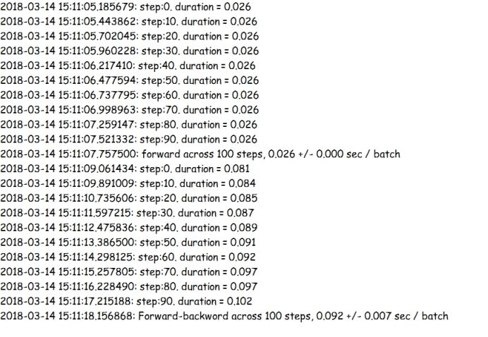

## **基于Visual Studio Tools for AI的TensorFlow编程实现CNN卷积神经网络**

### **1.** **背景介绍**

我们先来介绍一些卷积神经网络的相关知识。

在上一节中搭建的神经网络我们不难看出，普通的神经网络一般具有输入层，多个隐含层以及输出层，每层之间均采用的是全连接方式，即每层输入结点与输出结点之间均会有一个连接权重，随着网络层数的加深和隐藏层中隐含结点的增加，会出现参数量爆炸增长问题，最终导致神经网络过拟合(过度依赖于训练数据导致无法对其他数据集进行有效预测)以及时间复杂度，空间复杂度的大量提升，这样的结果显然不是我们想要的，同时也因为这个问题导致了神经网络在一段时期的没落，卷积神经网络概念最早是由科学家从猫的视觉神经系统得到启发，进而提出了感受野的概念，感受野说明猫眼的每一个视觉神经元只会处理整个图像的一小部分，这样大大提高了神经系统处理图像的效率，受此思想启发，在1998年，LeCun提出了真正意义上的第一个卷积神经网络LeNet-5，该神经网络的结构如下图所示，

 

输入为32\*32像素的图片，先经过含有6个5\*5卷积核的卷积层C1，之后连接了一个2\*2的平均池化层S2，然后又连接了含有16个5*5卷积核的卷积层C3，注意这里S2与C3是部分连接而不是完全连接，接下来连接了第二个22的池化层S4，再连接一个含有120个5\*5卷积核的卷积层C5，接下来连接了一个含有84个隐含结点的全连接层来提高模型的非线性变化能力，最终是通过欧式径向基函数单元输出最终分类的结果，在本节的相关技术简介中我们会介绍卷积层和池化层的作用。但是，这个模型对于当时的硬件性能来说要求很高，同时被一些当时的机器学习算法超越(例如SVM算法)，因此LeNet-5沉寂了很久，直到2006年Hinton教授发表了一篇论文，该论文说明了神经网络的复杂度可以通过逐层初始化来有效缓解，此时CNN开始逐渐走进了人们的视野，终于在2012年，AlexNet神经网络在LeNet-5的基础上进行了更深入的推广，在2012年的ImageNet竞赛中一鸣惊人，top-5错误率要远远低于上一届的冠军(top-5错误率指的是该模型最终分类结果的前5个中是否含有正确的分类)，可以说，AlexNet的成功对于深度学习发展有着重要的历史意义，本节我们参考TensorFlow源码来实现一个自创的AlexNet神经网络。


### **2.** **相关技术简介**

#### **1.** **卷积层的作用是什么?**

在以前的神经网络中，是将图片的每个像素点的rgb(red,green,blue)值作为输入(灰度化后的图片仅输入灰度值)，这样就丢失了节点之间的关联信息，在我们的常识中，临近的节点之间有关联性的可能也很高。卷积操作是通过卷积核来对图片的局部进行扫描，扫描区域的大小即为卷积核的大小，扫描区域的每个像素点会分别乘以卷积核相对应的权重，最终得到特征增强后的图片。以人脸识别为例，经过网络的后馈训练后，这些训练出的卷积核所代表的权重很可能代表鼻子，眼睛等这些高级特征，这样就省去了对每个像素点的训练并利用了像素点之间的空间信息，同时也大大减少了我们所训练的参数，如果以全连接方式进行训练，则总共需要训练的参数是输入结点\*输出结点数，以图中图片为例，如果训练这样大小的一个图片并连接一个相同大小的全连接层，那么总共需要训练的参数为1024\*1024 = 2^20个，如果使用卷积方式进行训练，那么训练的参数只需要卷积核数量*卷积核大小，图中6\*5\*5=150个，参数量大大减少，但是隐含层的节点数量并没有减少，隐含层节点的数量主要取决于卷积的方式和步长，如果步长为1，且卷积的方式为’SAME’，’SAME’方式会对图片边缘用0扩充图片后进行卷积，使得隐含层节点的数量与输入节点相同，如果卷积方式为’VALID’，即不对图片边缘进行处理，那么得到的隐含层的输出节点数量等于（input - size+1）/stride，input为输入节点的数量，size为卷积核的尺寸，stride为卷积核的步长，即间隔多少个像素点进行一次卷积操作，到此，我们就完成了卷积操作。

#### **2.** **池化层的作用是什么?**

池化层的作用主要是不变性和降采样，其中不变性指的是相同图像的不同位移、旋转、尺寸等池化后的结果都是相同的，大大增强了最终模型的泛化性。降采样指的是把图片的尺寸缩小，舍去一部分输入，这样就大大减少了参数量和输入量，这样就减轻了过拟合，提高了模型的泛化性。同时，池化分为两种：最大池化和平均池化，如果注重于提取图像局部信息，那么我们一般使用最大池化，如果注重于图像的整体信息，那么我们使用平均池化。

#### **3.** **AlexNet的结构是什么?**

Alex在原有LeNet-5基础上，加入了一下新的技术点:

1. 使用了ReLU作为卷积层的激活函数，ReLU激活函数在BP训练时效果要比Softmax函数好很多。

2. 使用了Dropout舍去了一部分输入，防止过拟合

3. 使用了LRN(Local Response Normalization)归一化层，使得反馈较大的局部神经元值变得相对更大，同时抑制了反馈较小的神经元，增加了模型的泛化能力。LRN层对ReLU这种没有上边界的激活函数效果很好。

4. 使用了数据增强(data augmentation)，对256\*256的图片随机切割到224\*224，之后进行水平翻转，这样数据量增大到之前的((256-224)^2)*2 = 2048倍，这样做的目的是为了降低参数量并减轻过拟合，测试时候，对左上、右上、左下、右下、中间做了5次crop，然后翻转，共10个crop，之后对结果求平均。同时会对图像的RGB空间做一个(0, 0.1)的高斯扰动，这样做也会提升模型的泛化能力。

5. 使用了GPU并行训练，GPU之间可以直接访问显存而无须访问内存，AlexNet作者让GPU之间的通信只在某些层进行，使得通信损耗降到最低。

接下来让我们看一下AlexNet的图示，在这里分为上下两部分意思是在两张显卡上进行训练。

 

如上图所示，AlexNet的结构及参数量为:

Input: 224*224图片

C1：96\*11\*11\*3(卷积核个数/宽/高/厚度) 34848个 

LRN层

3*3最大池化层
	C2：256\*5\*5\*48 						307200个 

LRN层

3\*3最大池化层
	C3：384\*3\*3\*256						884736个 
	C4：384\*3\*3\*192						663552个 
	C5：256\*3\*3\*192						442368个

3\*3最大池化层 
	F1：4096\*6\*6\*256					    37748736个 
	F2：4096\*4096 						16777216个 
	F3：4096\*1000 						4096000个

 

可以看到，AlexNet的参数量主要集中在全连接层部分，卷积层的参数量相对来讲要小很多很多，这就是卷积神经网络相对于传统ANN神经网络的优势所在，接下来让我们在TensorFlow平台上实现AlexNet吧。


### **3. 实验目标**

利用TensorFlow平台来实现简易的一个AlexNet神经网络，并测试AlexNet网络的前馈与反馈的时间。


### **4.** **实验步骤**

本次实验我们分为三个步骤:

* 载入所需要的库并预定义操作

* 构建神经网络

* 评价神经网络前馈与反馈的训练时间

(本节代码主要来源于TensorFlow的开源实现，并做了一些修改。)

 

#### **1)载入所需要的库并预定义操作**

首先让我们导入本次实验所需要的库，其中datetime库来获取本地时间，并定义每组输入32个数据，一共输入100组，同时我们定义函数print_activation用来查看卷积层和池化层输出的tensor的名称和尺寸，最后定义一个全连接函数用来定义全连接层，其中input代表输入，num_in代表输入维度，num_out代表输出维度，drop_out代表随机将部分权重置为0，并把其余权重放大到1/keep_prob倍，这么做会减轻神经网络的过拟合，这部分与第二节中构建的全连接神经网络是相同的。

```html
from datetime import datetime
import math
import time 
import tensorflow as tf


batch_size = 32
num_batches = 100

def print_activation(t):
print(t.op.name, ' ', t.get_shape().as_list())

def full_connect(input, num_in, num_out, drop_out=1.0):
    w = tf.Variable(tf.truncated_normal([num_in, num_out]))
    b = tf.Variable(tf.truncated_normal([num_out]))
return tf.nn.dropout(tf.nn.relu(tf.nn.bias_add(tf.matmul(input, w), b)), keep_prob = drop_out)
```


#### **2)构建神经网络**

接下来让我们按照之前讲过的AlexNet网络结构来搭建AlexNet网络，我们以第一个卷积层和池化层为例讲解一下在TensorFlow中卷积网络是怎么实现的，在这里with tf.name_scope定义一个作用域并命名为conv1，接下来在该作用域下定义一个卷积核，在这里卷积核是一个有着4个维度的Tensor，前两个维度定义了卷积核的尺寸，第三个维度代表卷积核的输入通道，对于第一个卷积层来讲即为图片的颜色通道，第四个维度代表着卷积核的数量，比如第一个卷积层conv1中的卷积核kernel，代表着第一个卷积层中输入通道为3，含有64个11\*11的卷积核，最后使用截断正态分布来初始化这些卷积核，对于这种深度较深的神经网络而言，卷积核的初始化权重很重要。定义好卷积核后，就开始进行卷积操作，在TensorFlow中，卷积操作是通过tf.nn.conv2d函数来实现，在代码中，images代表输入，kernel代表卷积所用的卷积核，strides代表卷积的步长，相当于跨多少个像素点进行卷积操作，步长也有四个维度，第一个维度是在样本块上的步长，即间隔几个样本取一次，第二个维度是在图片的宽的步长，第三个是在图片高上的步长，最后一个维度代表在信道上的步长，一般我们将第一个维度和最后一个维度置为1来遍历每个样本和信道，最后padding代表在边缘的处理方式为’SAME’，说明如果步长为1，那么卷积后得到的tensor与原尺寸是相同的，如果不为1，则会进行填充0的操作。接下来我们定义偏置biases，这个函数与我们之前学习到的函数是一样的，其中trainable=True参数在做优化时会用到。接下来将刚才得到的卷积层conv1加上我们所定义的偏置，这样一个卷积层就定义好了，接下来输出tensor的名称和尺寸，然后把卷积核和偏置的权重信息加入到参数列表中。接下来再连接一个LRN层，其中的参数会调节输入的值趋近于中间部分，使得神经元的反馈变得更大，接下来简介一个池化层pool1，这里采用最大池化来提取图片中的特征，ksize是一个四维的参数，代表着池化的尺寸，这里第一个维度是在样本块上的尺寸，第二个维度是在图片的宽的尺寸，第三个是在图片高上的尺寸，最后一个维度代表在信道上的尺寸。这里[1,3,3,1]代表着在每个样本的每个信道上，在33区域上进行最大池化，即取3*3区域上最大的那个像素点的rgb值，接下来的strides和padding与卷积层所代表的参数的含义是一样的，然后我们输出池化层所输出的tensor的名字和尺寸，这样我们就定义了一个卷积层与池化层，接下来根据AlexNet的示意图来构建剩下的卷积层与池化层，最终再连接三个全连接层fc_1, fc_2, fc3，这样我们就完成了一个简易的AlexNet网络搭建。

```
def inference(images):
    parameters = []
    
    with tf.name_scope('conv1') as scope:
        kernel = tf.Variable(tf.truncated_normal([11,11,3,64], stddev=1e-1, dtype=tf.float32), name='weights')
        conv = tf.nn.conv2d(images, kernel, strides=[1,4,4,1], padding='SAME')
        biases = tf.Variable(tf.constant(0.0, shape=[64], dtype=tf.float32),trainable=True,name='biases')
        bias = tf.nn.bias_add(conv, biases)
        conv1 = tf.nn.relu(bias, name=scope)
        print_activation(conv1)
        parameters += [kernel, biases]
        
    lrn1 = tf.nn.lrn(conv1, 4, bias = 1.0, alpha=0.001/9, beta=0.75, name='lrn1')
    pool1 = tf.nn.max_pool(lrn1, ksize=[1,3,3,1], strides=[1,2,2,1], padding='VALID', name='pool1')
    print_activation(pool1)
        
    with tf.name_scope('conv2') as scope:
        kernel = tf.Variable(tf.truncated_normal([5,5,64,192], stddev=1e-1, dtype=tf.float32), name='weights')
        conv = tf.nn.conv2d(pool1, kernel, strides=[1,1,1,1], padding='SAME')
        biases = tf.Variable(tf.constant(0.0, shape=[192], dtype=tf.float32), trainable=True, name='biases')
        bias = tf.nn.bias_add(conv, biases)
        conv2 = tf.nn.relu(bias, name=scope)
        parameters += [kernel, biases]
    
    print_activation(conv2)
    lrn2 = tf.nn.lrn(conv2, 4, bias = 1.0, alpha=0.001/9, beta=0.75, name='lrn2')
    pool2 = tf.nn.max_pool(lrn2, ksize=[1,3,3,1], strides=[1,2,2,1], padding='VALID', name='pool2')
    print_activation(pool2)
    
    with tf.name_scope('conv3') as scope:
        kernel = tf.Variable(tf.truncated_normal([3,3,192,384], stddev=1e-1, dtype=tf.float32), name='weights')
        conv = tf.nn.conv2d(pool2, kernel, strides=[1,1,1,1], padding='SAME')
        biases = tf.Variable(tf.constant(0.0, shape=[384], dtype=tf.float32), trainable=True, name='biases')
        bias = tf.nn.bias_add(conv, biases)
        conv3 = tf.nn.relu(bias, name=scope)
        parameters += [kernel, biases]
        
    print_activation(conv3)
    
    with tf.name_scope('conv4') as scope:
        kernel = tf.Variable(tf.truncated_normal([3, 3, 384, 256], stddev=1e-1, dtype=tf.float32), name='weights')
        conv = tf.nn.conv2d(conv3, kernel, strides=[1,1,1,1], padding='SAME')
        biases = tf.Variable(tf.constant(0.0, shape=[256], dtype = tf.float32), trainable=True, name='biases')
        bias = tf.nn.bias_add(conv, biases)
        conv4 = tf.nn.relu(bias, name=scope)
        parameters += [kernel, biases]
    print_activation(conv4)
    
    with tf.name_scope('conv5') as scope:
        kernel = tf.Variable(tf.truncated_normal([3, 3, 256, 256], stddev=1e-1, dtype=tf.float32), name='weights')
        conv = tf.nn.conv2d(conv4, kernel, strides=[1,1,1,1], padding='SAME')
        biases = tf.Variable(tf.constant(0.0, shape=[256], dtype=tf.float32), trainable=True, name='biases')
        bias = tf.nn.bias_add(conv, biases)
        conv5 = tf.nn.relu(bias, name=scope)
        parameters += [kernel, biases]
    
    print_activation(conv5)
    pool5 = tf.nn.max_pool(conv5, ksize=[1,3,3,1], strides=[1,2,2,1], padding='VALID', name='pool5')
    print_activation(pool5)
    
    flatten = tf.reshape(pool5, [-1, 6*6*256])
    fc_1 = full_connect(flatten, 6*6*256, 4096, 0.5)
    fc_2 = full_connect(fc_1, 4096,4096, 0.5)
    fc_3 = full_connect(fc_2, 4096,1000)
    return fc_3, parameters
```


#### **3) 评价神经网络前馈与反馈的训练时间**

由于AlexNet训练是相当耗时的，训练一次大概要几周的时间，在这里我们只进行一个batch块的网络的前馈和反馈时间的评价。首先我们定义一个AlexNet每轮的计算时间评价函数time_tensorflow_run，其中sesssion参数代表指定的会话，target参数代表指定评测的结点，info_string参数代表本次训练的名称。接下来定义评测所需要的一些变量num_steps_burn_in代表预热轮数为10，程序的预热会使得显存的catch更容易命中，这样会减少我们训练所需的时间，total_duration代表总时间，totol_duration_squared代表时间的平方和，以便之后计算方差时候使用。接下来开始计算训练所需要的时间，视同time.time()来获取当前时间，通过计算训练前后两次的时间差来计算训练所需要的时间duration，接下来在预热后每间隔10次输出一次训练的时间信息，最终，在所有训练结束时，计算每轮的平均时间mn, 和每轮训练时间的标准差sd，最终将这些信息输出。

```
def time_tensorflow_run(session, target, info_string):
    num_steps_burn_in = 10
    total_duration = 0.0
    total_duration_squared = 0.0
    
    for i in range(num_steps_burn_in + num_batches):
        start_time = time.time()
        _ = session.run(target)
        duration = time.time() - start_time
        if i>= num_steps_burn_in:
            if not i % 10:
                print(r'%s: step:%d. duration = %.3f' % (datetime.now(), i - num_steps_burn_in, duration))
            total_duration += duration
            total_duration_squared += duration * duration
    
    mn = total_duration / num_batches
    vr = total_duration_squared / num_batches - mn*mn
    sd = math.sqrt(vr)
    print(r'%s: %s across %d steps, %.3f +/- %.3f sec / batch' % (datetime.now(), info_string, num_batches, mn, sd))
```

接下来定义run_benchmark函数开始训练,其中with tf.Graph().as_default()指定在默认图中进行训练，接下来随机生成图片数据images，注意这里的images是一组，即32张。接下来开始训练，我们先计算前馈的时间与平方差，接下来我们使用tf.nn.l2_loss来计算全连接层的loss，再使用tf.gradients对这些loss的参数进行求导，这样就完成了后馈的时间计算，此时的target是对整个网络的梯度进行求导，最终运行这个函数。


```
def run_benchmark():
    with tf.Graph().as_default():
        image_size = 224
        images = tf.Variable(tf.random_normal([batch_size,image_size,image_size,3], dtype=tf.float32, stddev=1e-1))
    
        fc_3, parameters = inference(images)
        
        init = tf.global_variables_initializer()
        sess = tf.Session()
        sess.run(init)
        
        time_tensorflow_run(sess, fc_3, "forward")
        objective = tf.nn.l2_loss(fc_3)
        grad = tf.gradients(objective, parameters)
        time_tensorflow_run(sess, grad, 'Forward-backword')

run_benchmark()
```


### **5.** **实验结论**

结果如下:

 

 

最终，在不连接全连接层的情况下，我们可以发现后馈时间要比前馈时间慢3倍左右(这个数字跟GPU的性能有关)，目前，卷积神经网络发展的瓶颈还是在于训练时间过长，但是我们可以看到，卷积神经网络抽取特征的能力要远远强于传统的机器学习算法，这也是卷积神经网络在当代崛起的原因之一。