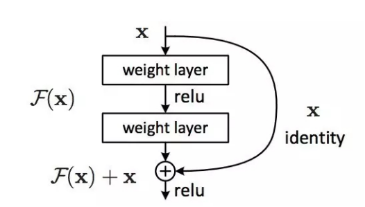
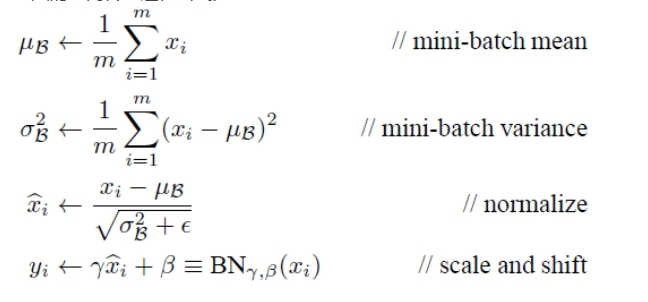

## **基于Visual Studio Tools for AI的TensorFlow编程实现ResNet深度残差网络**

### **1.** **背景介绍**

ResNet(Residual Neural Network)是由微软研究院的何凯明博士等4名华人提出，通过引入了残差学习单元，成功训练了152层极深的深度神经网络。ResNet还获得了2015年的ImageNet上的分类，检测，定位任务的冠军。从这时开始，神经网络可以向极深的方向发展，甚至能达到1000多层。后来的GoogLeNet Inception V4中也借鉴了这一结构。可以说ResNet的出现是神经网络的一个里程碑的突破。


### **2.** **相关技术简介**

#### **1.** **什么是残差学习单元?**

对于一个很深的神经网络而言，随着网络的不断加深，会出现一个退化的问题，即随着网络层数增加，准确率会不断趋近于饱和，再增加深度时就会使得神经网络在训练集上的正确率大幅度下降，为了解决这个问题，ResNet的作者何凯明博士引入了残差学习单元的概念，如下图所示，作者的思路是加入恒等映射(identity mapping)，恒等映射即令输出等于输入，为什么要加入恒等映射呢?假设我们现在有一个性能还不错的神经网络，这时我们在该神经网络的后面加入一些用来构造恒等映射的非线性层，即使可能中间某些层没有发挥太大的作用，但是这个加深的神经网络的性能一定是大于等于浅层神经网络的，VGGNet就证明了这一点，那么问题来了，神经网络的加深势必导致训练难度的增加，而且这个困难是指数式增长，那么我们该如何解决这个问题呢?作者的思路是这样的，把原先想要拟合的函数H(x)转换为F(x)+x，那么F(x) = H(x)-x，其中x代表原始输入，F(x)代表残差函数，这样，中间的非线性层由之前拟合H(x)变为拟合F(x)，最终目的是将F(x)逼近于0，这样就构造成了恒等映射，尽管最后拟合的都近似H(x)，但是学习的复杂度是存在着很大不同的，打个比方，原先我们所拟合的映射从H(100) = 101 变为 H(100) = 102，这个变化率才有1/101，但是引入残差之后，拟合的映射从F(100) = 1 变为 F(100) = 2，变化率有100%，可以看出引入残差之后训练的复杂程度大大减小。

 

接下来让我们来看一下深度残差网络与传统神经网络的一些不同。我们可以看到，在残差网络中会出现一些旁路直接连到后面的层，这种直连通道的结构相当于是shortcut，整个网络只需要学习输入与输出的残差。这样大大简化了学习的复杂度。注意的是，这样的残差学习单元应保持输入和输出的维度一致。

 

 

#### **2.** **ResNet的组成结构是怎样的?**

由上图我们已经大致了解了ResNet的组成，即由很多残差学习单元堆叠而成的神经网络，从下图中我们可以看到，ResNet基本是由两种残差学习单元组成，一种是3*3卷积的二层残差学习单元，另一种是由1\*1，3\*3，1\*1所连接的三层学习单元，其中三层学习单元的1\*1卷积核主要作用是先降维再升维，使得最终的输入，输出维度相匹配。

 

接下来让我们实现ResNet V2，V2与V1的最大区别是V2在每层中都使用了批标准化，这样可以得残差学习单元更容易训练并且防止过拟合，同时，V2把shortcut中的非线性激活函数被替换为恒等映射(y=x)，这是因为前馈和反馈信号可以直接传输，可以节省非线性计算的复杂度。


### **3. 实验目标**

利用TensorFlow平台高级组件contrib.slim库来实现ResNet V2神经网络，并测试神经网络的前馈与反馈的时间。


### **4.** **实验步骤**

本次实验我们分为三个步骤:

* 载入所需要的库并预定义操作

* 构建神经网络

* 评价神经网络前馈与反馈的训练时间

(本节代码主要来源于TensorFlow的开源实现)

本次实验涉及到的操作比较多，因此使用contrib.slim库来方便地创建ResNet。首先让我们导入本次实验所需要的库。其中collections库是python原生库，能方便地创建一个集合。

```
import collections
from datetime import datetime
import math
import time

import tensorflow as tf


slim = tf.contrib.slim
```

接下来让我们定义一个残差学习模块类，其中collections.namedtuple函数代表创建一命名为Block的元组，其中含有scope(残差学习单元的名称),，unit_fn(类型为残差学习单元)，args(该残差学习单元的参数)这几个命名元素，其中args列表中的每个元素都代表一个残差学习单元。以Block(*'block1'*, bottleneck, [(256,64,1)]*2 + [(256,64,2)])为例，我们创建了一个名为’block1’的残差学习模块，其中含有三个学习单元，每个残差学习单元都包含三个卷积层，以(256,64,3)为例，256代表第三层输出为256,64代表前两层输出为64,3代表中间那层的步长为3。这个构建函数我们会在后面具体看到。

```
class Block(collections.namedtuple('Block', ['scope', 'unit_fn', 'args'])):
    '''ResNet block'''
    
```

接下来我们定义一个函数来使用池化层来降采样，inputs代表输入，factor代表将输出的tensor降为1/factor，factor=1即不用降采样，这样可以防止过拟合。

```
def subsample(inputs, factor, scope=None):
    if factor == 1:
        return inputs
    else:
        return slim.max_pool2d(inputs, [1,1], stride=factor, scope=scope)
```

接下来我们定义conv2d_same函数来创建卷积层，这几个参数相信大家已经很眼熟了，这里就不一一介绍了。接下来定义如果卷积核步长为1，则直接使用SAME方式进行卷积，如果步长不为1，那么在卷积时很可能出现剩下的区域不够卷积的问题，这里我们使用tf.pad函数进行补0操作，其中inputs代表输入，后面的列表中的四个列表分别代表Tensor的四个输入维度(batch_size, 宽，高，通道数量)，接下来的每个对应维度的列表[x, y]向该维度正方向填充x个维度，负方向填充y个维度，以inputs = tf.pad(inputs, [[0,0], [pad_beg, pad_end], [pad_beg, pad_end],[0,0]])为例，意思是分别向图片上方填充pad_beg行，下方填充pad_end行，再向图片左面填充pad_beg列，右面填充pad_end列，这是为了让图片无法被卷积到的图片卷积到(我个人认为直接用SAME方式也可以的。。。)

```
def conv2d_same(inputs, num_outputs, kernel_size, stride, scope=None):
    if stride == 1:
        return slim.conv2d(inputs, num_outputs, kernel_size, stride=1, scope=scope)
   
    else:
        pad_total = kernel_size - 1
        pad_beg = pad_total // 2
        pad_end = pad_total - pad_beg
        inputs = tf.pad(inputs, [[0,0], [pad_beg, pad_end], [pad_beg, pad_end],[0,0]])
        return slim.conv2d(inputs, num_outputs, kernel_size, stride=stride, padding='VALID', scope=scope)
```

接下来我们定义一个函数用来堆叠残差学习单元模块组(Blocks)的函数stack_blocks_dense，其中net是输入，blocks是我们所定义的残差学习单元模块组，outputs_collections是用来收集各个模块输出层的列表。接下来遍历模块组中所有的模块中的所有残差学习单元中的配置，并使用unit_fn函数顺序创建并连接所有的残差学习单元，注意这里unit_fn并不是自带的函数，他只是一个命名为unit_fn的后面的bottleneck函数，最终使用collect_named_outputs函数将这些残差学习单元模块添加到集合中，并返回最终的网络net，同时不要忘记在函数前加上@slim.add_arg_scope 装饰器，该修饰器的作用是方便使用slim.arg_scope 函数直接为函数传入参数，这个在后面会用到。

```
@slim.add_arg_scope
def stack_blocks_dense(net, blocks, outputs_collections=None):
    for block in blocks:
        with tf.variable_scope(block.scope, 'block', [net]) as sc:
            for i, unit in enumerate(tuple(block.args)):
                with tf.variable_scope('unit%d' % (i+1), values=[net]):
                    unit_depth, unit_depth_bottleneck, unit_stride = unit
                    net = block.unit_fn(net, depth=unit_depth, depth_bottleneck=unit_depth_bottleneck, stride=unit_stride)
            net = slim.utils.collect_named_outputs(outputs_collections, sc.name, net)
    return net
```

接下来我们创建函数resnet_arg_scope用来定义ResNet网络的默认值，这样我们可以在后面节省相当多的代码，同时在这里我们使用到了BN算法，该算法认为随着网络权重的不断更新，每层的输出分布均会发生改变，最终可能因测试集上数据分布与原数据分布不同而导致模型的泛化能力变弱，同时若训练数据集的每个batch块数据分布不同，那么可能使得神经网络的迭代次数增加，使得神经网络无法收敛。该算法在每层的输入之前先进行预标准化以使得每层的输入分布情况相同，即使得每一维的均值为0，标准差为1。整个过程近似如下:

 

接下来让我们回到代码，其中参数is_training=True代表设置训练标记为True，batch_norm_decay代表批标准化中的的权重衰减速率，这部分起到了惩罚权重的作用，即控制权重不至于太大同时使得作用不大的权重逐渐变为0，batch_norm_epsilon是批标准化中设置的一个常量，batch_norm_scale=True允许平移和缩放(过程很复杂，有兴趣可以自行研究下BN算法)，接下来设置标准化器的参数字典batch_norm_params，字典中所含有的变量的值均由函数参数给出。接下来我们定义卷积层，默认参数为使用L2正则化(L2正则化也是一个比较复杂的数学过程，可以自行查阅)L2正则化只影响权重的更新而不影响偏置的更新。主要目的是来约束权重的范围，这个作用跟BN算法中的权重衰减是一样的，都是用来防止过拟合，接下来使用slim.arg_scope函数来共享参数，该函数的第一个参数时是一个列表，列表里面是所需要共享参数的函数，其余参数为该函数默认的参数, 也就是说在该作用域下定义的列表中的函数都会默认使用这些参数值。接下来我们将卷积层的权重的初始化器选择slim.variance_scaling_initializer()，激活函数设置为ReLU，标准化器为BN(Batch_Normalization)，标准化器的参数为batch_norm_params，BN层的参数设置为我们定义好的参数，最大池化层边缘的处理方式设置为’SAME’，最后将这几个嵌套的arg_scope作为结果返回。

```
def resnet_arg_scope(is_training=True, weight_decay=0.0001, batch_norm_decay=0.997, batch_norm_epsilon=1e-5, batch_norm_scale=True):
    batch_norm_params = {
         'is_training': is_training,
         'decay': batch_norm_decay,
         'epsilon':batch_norm_epsilon,
         'scale':batch_norm_scale,
         'updates_collections':tf.GraphKeys.UPDATE_OPS
    }
    
    with slim.arg_scope([slim.conv2d], 
                                        weights_regularizer=slim.l2_regularizer(weight_decay),
                                        weights_initializer=slim.variance_scaling_initializer(),
                                        activation_fn = tf.nn.relu,
                                        normalizer_fn = slim.batch_norm,
                                        normalizer_params=batch_norm_params):
        with slim.arg_scope([slim.batch_norm], **batch_norm_params):
            with slim.arg_scope([slim.max_pool2d], padding='SAME') as arg_sc:
                return arg_sc
```

接下来让我们定义生成残差学习单元的函数bottleneck，参数inputs代表输入，depth，depth_bottleneck，stride分别代表之前的残差学习单元参数。Outputs_collections用来存储残差学习单元，最后的scope代表这个残差学习单元的名称。接下来使用slim.utils.last_dimension来获取最后一个维度，即输出通道数，min_rank=4参数是使输入至少为4个维度，接下来进行BN，即批标准化，在这里直接使用slim.batch_norm函数进行批标准化即可，其中activation_fn函数为预激活函数，即把激活函数层放在批标准化层前面，这样做的效果比放在后面的效果要好很多。接下来我们定义shortcut直连通道，因为中间可能经过步长不为1的卷积操作而导致图片的尺寸发生改变，因此这里我们先判断残差学习单元的输入维度和输出维度是否一致，注意这里的输入输出跟图片的尺寸是没有关系的，输入输出只跟卷积核的数量(或是高级特征的数量有关)，一致的话根据步长使用subsample函数来进行降采样，如果不一致的话还要通过1\*1的卷积核操作来进行升未或降维操作，这样我们的shortcut就定义好了，接下来定义残差函数部分，根据之前所讲过的内容，残差部分即拟合H(x)-x，这里的残差一共有三层卷积，第一个卷积尺寸为1\*1，步长为1，输出通道数为depth_bottleneck，第二层卷积尺寸为3\*3，步长为stride，输出通道数为depth_bottleneck，第三层卷积为1*1，步长为1，输出通道数为depth_bottleneck，因前面定义了BN层，所以在这里我们无需使用正则项或是Dropout来防止过拟合。最终将残差与shortcut相加来拟合原先想要拟合的函数并添加到列表中。

```
@slim.add_arg_scope
#残差学习单元
def bottleneck(inputs, depth, depth_bottleneck, stride, outputs_collections=None, scope=None):
    with tf.variable_scope(scope, 'bottleneck_v2', [inputs]) as sc:
        #获取输入的最后一个维度数(输入通道数) 至少为4个维度
        depth_in = slim.utils.last_dimension(inputs.get_shape(), min_rank=4)
        #批标准化&使用激活函数进行预处理(预激活)
        preact = slim.batch_norm(inputs, activation_fn=tf.nn.relu, scope='preact')
        #如果残差学习单元输入通道数和输出通道数相同，进行降采样处理 
        if depth == depth_in:
            #shortcut 直连通道 根据stride步长降采样
            shortcut = subsample(inputs, stride, 'shortcut')
        else:
            shortcut = slim.conv2d(preact, depth, [1,1], stride=stride, normalizer_fn=None, activation_fn=None, scope='shortcut')
        #定义残差部分
        residual = slim.conv2d(preact, depth_bottleneck, [1,1], stride=1, scope='conv1')
        residual = conv2d_same(residual, depth_bottleneck, 3, stride, scope='conv2d')
        residual = slim.conv2d(residual, depth, [1,1], stride=1, normalizer_fn=None, activation_fn=None, scope='conv3')
        output = shortcut+residual
        
        return slim.utils.collect_named_outputs(outputs_collections, sc.name, output)
```

接下来我们定义生成ResNet的主函数，inputs代表输入，blocks代表我们所定义的残差学习单元模块列表，num_classes代表最终分类数，global_pool代表是否在最后使用全局平均池化，include_root_block标志是是否在之前加入7\*7，步长为2的卷积层及池化层，reuse标志是否可以复用变量，scope指的是整个网络的名称，接下来在该作用域内我们定义end_points_collections命名列表用以存放残差学习单元模块，便于堆叠残差学习单元。接下来开始创建ResNet网络，我们首先创建最前面的输出为64，卷积尺寸为7\*7，步长为2的卷积层，再连接一个步长为2的3\*3最大池化，连续经过了两次步长为2的层，使得图片尺寸变为原先的1/4，然后使用stack_blocks_dense函数来生成残差学习单元模块组，然后添加平均池化层，这里也可以使用tf.avg_pool函数来池化，不过使用tf.reduce_mean(这个函数是用来求均值的)效率会更高一点，下面添加一个输出维度为num_classes分类数的1*1卷积，再添加一个Softmax层，最终把end_points_collections转换为字典，再把Softmax层加入其中，最终返回Resnet和end_points_collections。

```
def resnet_v2(inputs, blocks, num_classes=None, global_pool=True, include_root_block=True, reuse=None, scope=None):
    with tf.variable_scope(scope, 'resnet_v2', [inputs], reuse=reuse) as sc:
        end_points_collection = sc.original_name_scope+'_end_points'
        with slim.arg_scope([slim.conv2d, bottleneck, stack_blocks_dense], outputs_collections=end_points_collection):
            net = inputs
            if include_root_block:
                with slim.arg_scope([slim.conv2d], activation_fn=None, normalizer_fn=None):
                    net = conv2d_same(net, 64, 7, stride=2, scope='conv1')
                net = slim.max_pool2d(net, [3,3], stride=2, scope='pool1')
            net = stack_blocks_dense(net, blocks)
            net = slim.batch_norm(net, activation_fn=tf.nn.relu, scope='postnorm')
            if global_pool:
                net = tf.reduce_mean(net, [1,2], name='pool5', keep_dims=True) 
            if num_classes is not None:
                net = slim.conv2d(net, num_classes, [1,1], activation_fn=None, normalizer_fn=None, scope='logits')
                end_points = slim.utils.convert_collection_to_dict(end_points_collection)
            if num_classes is not None:
                end_points['predictions'] = slim.softmax(net, scope='predictions')
            return net, end_points
```

接下来定义网络的配置，分别定义50层，101层，152层，200层，以resnet_v2_50为例，50层=1个7\*7卷积+1个3\*3池化+3*(block1中3个卷积层+block2中4个卷积层+block3中6个卷积层+block4中3个卷积层)。

```
def resnet_v2_50(inputs, num_classes=None, global_pool=True, reuse=None, scope='resnet_v2_50'):
    blocks = [
        Block('block1', bottleneck, [(256,64,1)]*2 + [(256,64,2)]),
        Block('block2', bottleneck, [(512, 128, 1)]*3 + [(512, 128, 2)]),
        Block('block3', bottleneck, [(1024, 256, 1)]*5 + [(1024, 256, 2)]),
        Block('block4', bottleneck, [(2048, 512, 1)]*3)]
    return resnet_v2(inputs, blocks, num_classes, global_pool, include_root_block=True, reuse=reuse, scope=scope)

def resnet_v2_101(inputs, num_classes=None, global_pool=True, reuse=None, scope='resnet_v2_50'):
    blocks = [
        Block('block1', bottleneck, [(256,64,1)]*2 + [(256,64,2)]),
        Block('block2', bottleneck, [(512, 128, 1)]*3 + [(512, 128, 2)]),
        Block('block3', bottleneck, [(1024, 256, 1)]*22 + [(1024, 256, 2)]),
        Block('block4', bottleneck, [(2048, 512, 1)]*3)]
    return resnet_v2(inputs, blocks, num_classes, global_pool, include_root_block=True, reuse=reuse, scope=scope)

def resnet_v2_152(inputs, num_classes=None, global_pool=True, reuse=None, scope='resnet_v2_50'):
    blocks = [
        Block('block1', bottleneck, [(256,64,1)]*2 + [(256,64,2)]),
        Block('block2', bottleneck, [(512, 128, 1)]*7 + [(512, 128, 2)]),
        Block('block3', bottleneck, [(1024, 256, 1)]*35 + [(1024, 256, 2)]),
        Block('block4', bottleneck, [(2048, 512, 1)]*3)]
    return resnet_v2(inputs, blocks, num_classes, global_pool, include_root_block=True, reuse=reuse, scope=scope)

def resnet_v2_200(inputs, num_classes=None, global_pool=True, reuse=None, scope='resnet_v2_50'):
    blocks = [
        Block('block1', bottleneck, [(256,64,1)]*2 + [(256,64,2)]),
        Block('block2', bottleneck, [(512, 128, 1)]*23 + [(512, 128, 2)]),
        Block('block3', bottleneck, [(1024, 256, 1)]*35 + [(1024, 256, 2)]),
        Block('block4', bottleneck, [(2048, 512, 1)]*3)]
    return resnet_v2(inputs, blocks, num_classes, global_pool, include_root_block=True, reuse=reuse, scope=scope)
```

接下来进行网络的评测，与前面卷积神经网络的评测方式相同。

```
def time_tensorflow_run(session, target, info_string):
    #预热轮数 增加cache 
    num_steps_burn_in = 10
    #总时间
    total_duration = 0.0
    #计算方差
    total_duration_squared = 0.0
    
    for i in range(num_steps_burn_in + num_batches):
        start_time = time.time()
        _ = session.run(target)
        duration = time.time() - start_time
        if i>= num_steps_burn_in:
            if not i % 10:
                print(r'%s: step:%d. duration = %.3f' % (datetime.now(), i - num_steps_burn_in, duration))
            total_duration += duration
            total_duration_squared += duration * duration
    
    #每轮迭代的平均耗时
    mn = total_duration / num_batches
    #标准差
    vr = total_duration_squared / num_batches - mn*mn
    sd = math.sqrt(vr)
    print(r'%s: %s across %d steps, %.3f +/- %.3f sec / batch' % (datetime.now(), info_string, num_batches, mn, sd))

batch_size = 32
height, width = 224, 224
inputs = tf.random_uniform((batch_size, height, width, 3))
with slim.arg_scope(resnet_arg_scope(is_training=False)):
    net, end_points = resnet_v2_152(inputs, 1000)

with tf.Session() as sess:
    tf.global_variables_initializer().run()
    num_batches=100
    time_tensorflow_run(sess, net, 'Forward')
```


### **5.** **实验结论**

实验结果如下:

 

我们可以看到ResNet虽然有152层深，但是在forward训练的过程中并没有很复杂的计算，从ResNet开始，神经网络开始正式支持超神神经网络的训练，有趣的是，有一篇论文指出，ResNet并不是表面上很深的神经网络，该神经网络的关键路径很短，可以看做是一些浅层网络的集合的投票机制，但是不论怎么说，ResNet已经成为了深度学习发展的一个里程碑，在今天仍有可借鉴的地方。

