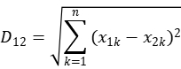
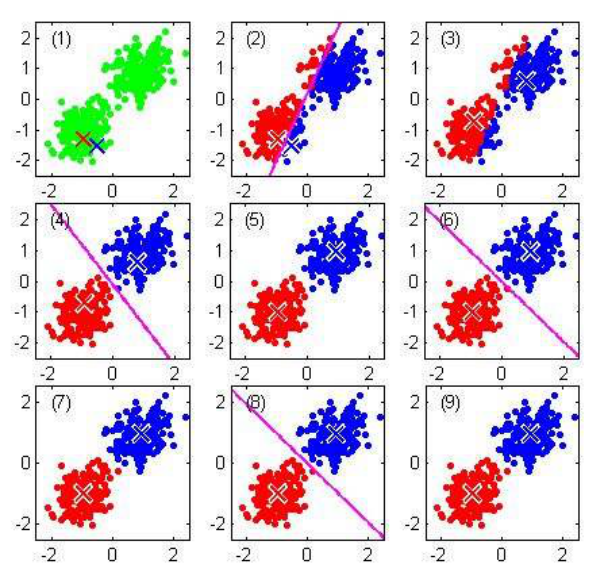
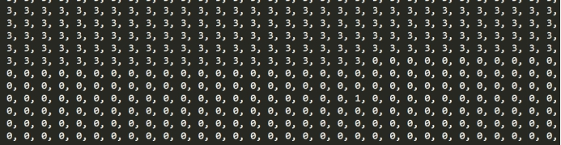
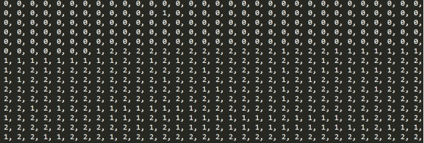

# **无监督学习的网络用户行为分析**


# 1. 背景介绍

　　网络用户行为分析是指在获得网站访问量基本数据的情况下，对有关数据进行统计、分析，从中发现用户访问网站的规律，并将这些规律与网络营销策略等相结合，从而发现目前网络营销活动中可能存在的问题，并为进一步修正或重新制定网络营销策略提供依据,满足网站的用户需求，提升网站信任度。


# 2. 相关技术简介

## 2.1. 无监督学习

　　现实生活中常常会有这样的问题：缺乏足够的先验知识，因此难以人工标注类别或进行人工类别标注的成本太高。很自然地，我们希望计算机能代我们完成这些工作，或至少提供一些帮助。根据类别未知(没有被标记)的训练样本解决模式识别中的各种问题，称之为无监督学习。常见的应用背景包括：

* 一从庞大的样本集合中选出一些具有代表性的加以标注用于分类器的训练。

* 先将所有样本自动分为不同的类别，再由人类对这些类别进行标注。

* 在无类别信息情况下，寻找好的特征。

　　无监督学习里典型例子是聚类。聚类的目的在于把相似的东西聚在一起，而我们并不关心这一类是什么。因此，一个聚类算法通常只需要知道如何计算相似度就可以开始工作了。聚类算法一般有五种方法，最主要的是划分方法和层次方法两种。划分聚类算法通过优化评价函数把数据集分割为K个部分，它需要K作为 输人参数。层次聚类由不同层次的分割聚类组成，层次之间的分割具有嵌套的关系。它不需要输入参数，这是它优于分割聚类 算法的一个明显的优点，其缺点是终止条件必须具体指定。我们的实验中所使用的方法是划分聚类算法中的K-MEANS算法。

## 2.2. K-MEAN简介

　　K-MEANS算法是输入聚类个数k，以及包含 n个数据对象的数据库，输出满足方差最小标准k个聚类的一种算法。K-MEANS算法接受输入量 k ；然后将n个数据对象划分为 k个聚类以便使得所获得的聚类满足：同一聚类中的对象相似度较高；而不同聚类中的对象相似度较小。

　　K-MEANS算法的工作过程说明如下：

　　首先从n个数据对象任意选择 k 个对象作为初始聚类中心；而对于所剩下其它对象，则根据它们与这些聚类中心的相似度（距离），分别将它们分配给与其最相似的（聚类中心所代表的）聚类；然后再计算每个所获新聚类的聚类中心（该聚类中所有对象的均值）；不断重复这一过程直到标准测度函数开始收敛为止。一般都采用均方差作为标准测度函数.

 

　　公式1 K-MEANS准测度函数

　　k个聚类具有以下特点：各聚类本身尽可能的紧凑，而各聚类之间尽可能的分开。K-MEANS算法是一种较典型的逐点修改迭代的动态聚类算法，其要点是以误差平方和为准则函数。逐点修改类中心：一个象元样本按某一原则，归属于某一组类后，就要重新计算这个组类的均值，并且以新的均值作为凝聚中心点进行下一次象元素聚类；逐批修改类中心：在全部象元样本按某一组的类中心分类之后，再计算修改各类的均值，作为下一次分类的凝聚中心点。

　　

　　图1 K-MEANS实现分类流程图

## 2.3. TensorFlow简介

　　TensorFlow是谷歌基于DistBelief进行研发的第二代人工智能学习系统，其命名来源于本身的运行原理。Tensor（张量）意味着N维数组，Flow（流）意味着基于数据流图的计算，TensorFlow为张量从流图的一端流动到另一端计算过程。TensorFlow是将复杂的数据结构传输至人工智能神经网中进行分析和处理过程的系统。TensorFlow将完全开源，任何人都可以用。TensorFlow 表达了高层次的机器学习计算，大幅简化了第一代系统，并且具备更好的灵活性和可延展性。TensorFlow一大亮点是支持异构设备分布式计算，它能够在各个平台上自动运行模型，从手机、单个CPU / GPU到成百上千GPU卡组成的分布式系统。


# 3. 数据集介绍

　　此数据集首先是美国国防部高级规划署（DARPA）在 MIT 林肯实验室进行的研究收集数据随后来自哥伦比亚大学的 Sal Stolfo 教授和来自北卡罗莱纳州立大学的 Wenke Lee 教授采用数据挖掘等技术对以上的数据集进行特征 分析和数据预处理，形成了一个新的数据集。该数据集用于 1999 年举行的 KDD CUP 竞赛中，成为著名的 KDD99 数据集。虽然年代有些久远，但 KDD99 数据集仍然是网络入侵检测领域的事实 Benckmark，为基于计算智能的网 络入侵检测研究奠定基础。 训练集大概包含 5,000,000 多个网络连接记录，测试数据大概包含 2,000,000 个网络连接记录。每个网络连接被 标记为正常（normal）或异常（attack），异常类型被细分为 4 大类共 39 种攻击类型，其中 22 种攻击类型出现在训 练集中，另有 17 种未知攻击类型出现在测试集中。 

　　KDD99 数据集中每个连接（*）用 41 个特征来描述，加上最后的标记（label），一共有 42 项：如下所示 

　　2, tcp, smtp, SF, 1684, 363, 0, 0, 0, 0, 0, 1, 0, 0, 0, 0, 0, 0, 0, 0, 0, 0, 1, 1, 0.00, 0.00, 0.00, 0.00, 1.0 0, 0.00, 0.00, 104, 66, 0.63, 0.03, 0.01, 0.00, 0.00, 0.00, 0.00, 0.00, normal. 

　　0, tcp, private, REJ, 0, 0, 0, 0, 0, 0, 0, 0, 0, 0, 0, 0, 0, 0, 0, 0, 0, 0, 38, 1, 0.00, 0.00, 1.00, 1.00, 0.03, 0.55, 0.00, 208, 1, 0.00, 0.11, 0.18, 0.00, 0.01, 0.00, 0.42, 1.00, portsweep. 

　　41 项特征分为 4 大类，具体介绍见附录 。


# 4. 实验目标

本次实验设定在一个存在四种网络行为（正常访问、smurf攻击、neptune攻击、back攻击）的网络环境中，使用TensorFlow平台高级组件及相关算法来实现无监督学习的聚类算法，并测试分类效果，对得出的效果进行网络用户行为分析。

根据我们数据集的实际情况，我们的分类算法输入的三种攻击类型为：

　　Smurf攻击：Smurf是一种简单但有效的DDoS攻击技术，它利用了ICMP。它的功能之一是与主机联系，通过发送一个“回音请求”（echorequest）信息包看看主机是否“活着”。Smurf是用一个偷来的帐号安装到一个计算机上的，然后用一个伪造的源地址连续ping一个或多个计算机网络，这就导致所有计算机所响应的那个计算机并不是实际发送这个信息包的那个计算机。这个伪造的源地址，实际上就是攻击的目标，它将被极大数量的响应信息量所淹没。对这个伪造信息包做出响应的计算机网络就成为攻击的不知情的同谋。

　　Neptune攻击：即SYN Flooding我们知道当用户进行一次标准的TCP连接时，会有一个3次握手过程。首先是请求服务方发送一个SYN消息，服务方收到SYN后，会向请求方回送一个SYN-ACK表示确认，当请求方收到SYN-ACK后，再次向服务方发送一个ACK消息，这样一次TCP连接建立成功。“SYNFlooding”则专门针对TCP协议栈在两台[主机](https://baike.baidu.com/item/%E4%B8%BB%E6%9C%BA)间初始化连接握手的过程进行DoS攻击，其在实现过程中只进行前2个步骤：当服务方收到请求方的SYN-ACK确认消息后，请求方由于采用源地址欺骗等手段使得服务方收不到ACK回应，于是服务方会在一定时间处于等待接收请求方ACK消息的状态。而对于某台[服务器](https://baike.baidu.com/item/%E6%9C%8D%E5%8A%A1%E5%99%A8)来说，可用的TCP连接是有限的，因为他们只有有限的内存[缓冲区](https://baike.baidu.com/item/%E7%BC%93%E5%86%B2%E5%8C%BA)用于创建连接，如果这一缓冲区充满了虚假连接的初始信息，该服务器就会对接下来的连接停止响应，直至缓冲区里的连接企图超时。如果恶意攻击方快速连续地发送此类连接请求，该[服务器](https://baike.baidu.com/item/%E6%9C%8D%E5%8A%A1%E5%99%A8)可用的TCP连接队列将很快被阻塞，系统可用资源急剧减少，网络可用带宽迅速缩小，长此下去，除了少数幸运用户的请求可以插在大量虚假请求间得到应答外，服务器将无法向用户提供正常的合法服务。

　　Back攻击：未查到相关资料。之后会根据分类结果分析其特点。


# 5. 实验步骤

　　本次实验我们分为三个步骤：

* 载入所需要的库并进行预定义操作

* 对数据进行预处理并规范数据格式

* 构建聚类分簇算法

  

## 5.1. 载入所需要的库并进行预定义操作

　　本次实验需要的库如下所示，其中的choice和shuffle用来随机选择聚类的初始簇头。

```
import tensorflow as tf  
from random import choice, shuffle  
from numpy import array  
import numpy  
```

## 5.2. 规范数据格式，对数据进行预处理

　　此处是读取本次实验使用的数据集的操作，其中numpy中的loadtxt()方法可以直接将csv数据直接转换为2维数组，此处设置变量data_matrix存储读出来的数据。

```
DATA_PATH = "D:\\TensorFlowData\\final_data\\final_data.csv" #未添加label的数据集  
data_matrix = numpy.loadtxt(open(DATA_PATH,"rb"),delimiter=",",skiprows=0)  
```

　　由于数据集内的某些数值较大，如：源主机到目标主机的字节数，目标主机到源主机的字节数等，这些数据严重影响KMEANS算法分类准确性，因此我们决定对KMEANS算法进行改进，将这类对算法准确性影响较大的数据分配较小的权值，进行加权处理。

　　此处为遍历整个数组，对于特定列的数据（即某些影响算法准确性的数据项）赋予特定的权值。

```
def handle(data_matrix):  
    row_data = data_matrix.size/len(data_matrix[0])  
    column_data = len(data_matrix[0])  
    for i in range(int(row_data)):  
        for j in range(column_data):  
            if j==0:  
                data_matrix[i][j]=data_matrix[i][j]*0.001  
            elif j==1:  
                data_matrix[i][j]=data_matrix[i][j]*0.001  
            elif j==27:  
                data_matrix[i][j]=data_matrix[i][j]*0.01  
            elif j==28:  
                data_matrix[i][j]=data_matrix[i][j]*0.01  
    return data_matrix  
```

## 5.3. 构建聚类分簇算法

　　下面是K-MEANS聚类分簇算法的实现。函数传入两个参数，分别是vector和noofcluster，其中vector是n*k的二维数组，n是向量的个数，k是向量的维度。而noofcluster是一个整数表示分簇的个数。

```
def TFKMeansCluster(vectors, noofclusters):  
    noofclusters = int(noofclusters)  
    assert noofclusters < len(vectors)  #保证分簇个数小于向量的个数
```

　　随机选取初始簇头节点信息，首先获取到向量的维度并记录到dim，结合使用list()和shuffle()方法来实现随机选取簇头。

```
dim = len(vectors[0])  
vector_indices = list(range(len(vectors)))  
shuffle(vector_indices)  
```

　　当每次调用函数的时候，都初始化一个默认的graph，这样可以确保当这个函数被调用很多次的时候，默认的graph不会因为没有使用的选项和来自之前调用的变量而变得越来越拥挤。

```
graph = tf.Graph()  
```

　　新建一个session会话，TensorFlow构建的计算图必须通过session会话才能执行。

　　并且要保证每个质心（或簇头）都有一个向量，从可用的数据点来初始化为一个向量。此时centriods内存储的就是向量，即簇头节点的信息。

```
with graph.as_default():  
    sess = tf.Session()   
    centroids = [tf.Variable((vectors[vector_indices[i]]))  
                for i in range(noofclusters)]  
```

　　使用TensorFlow的库函数placeholder()初始化一个保存簇头节点信息的变量，再使用assign()将质心节点的信息赋值到centriod变量。

```
centroid_value = tf.placeholder("float64", [dim])  
cent_assigns = []  
for centroid in centroids:  
    cent_assigns.append(tf.assign(centroid, centroid_value))  
```

　　此处将每一个向量的分簇变量初始化为0（即都属于同一个簇）。

```
assignments = [tf.Variable(0) for i in range(len(vectors))]  
```

　　和centriod赋值操作相同，向assignment变量赋值。

```
assignment_value = tf.placeholder("int32")  
cluster_assigns = []  
for assignment in assignments:  
    cluster_assigns.append(tf.assign(assignment, assignment_value))  
```

　　构建用于计算的一些变量。

```
#创建一个用于计算均值的变量  
mean_input = tf.placeholder("float", [None, dim])  
#用于获取输入的向量组，并从0维开始计算平均值  
mean_op = tf.reduce_mean(mean_input, 0)  
  
#用于计算欧氏距离的两个变量  
v1 = tf.placeholder("float", [dim])  
v2 = tf.placeholder("float", [dim])  
  
euclid_dist = tf.sqrt(tf.reduce_sum(tf.pow(tf.subtract(v1,v2), 2)))  
  
##构建一个根据欧氏距离分配向量到簇的变量  
centroid_distances = tf.placeholder("float", [noofclusters])  
cluster_assignment = tf.argmin(centroid_distances, 0)  
```

　　使用TensorFlow库函数构造变量初始化器，变量初始化器应该在所有变量被构造之后定义，以便每个变量都包含在初始化中。

```
#变量初始化器  
init_op = tf.initialize_all_variables()  
  
#初始化所有变量  
sess.run(init_op)  
```

　　此处为算法的主体部分，此处采用设置迭代次数的方法来作为算法的结束条件，本实验设置的10次迭代。此部分大致分为两个步骤，首先，根据上一次计算得到的簇头节点信息，计算每个向量与簇头节点的欧式距离，得到该向量应该分到哪个簇。其次，根据上一个步骤得到的状态变量，对每个簇，获取属于这个簇的所有节点信息，重新计算簇头节点。

　　此处使用了TensorFlow中的字典feed_dict，字典中给出所有用到的占位符的取值。如果不使用feed_dict，每次迭代的结果都用常量表示，那么TensorFlow的计算图会非常大，因为每增加一个常量就要在图上新增一个节点。而使用feed_dict，图中只会有占位符这一个节点。

```
noofiterations = 10  
for iteration_n in range(noofiterations):  
    #根据上一次计算得到的簇头计算每个向量应该被分配到哪个簇  
    #遍历每个向量  
    for vector_n in range(len(vectors)):  
        vect = vectors[vector_n]  
        #计算这个向量到每个簇头的欧式距离  
        distances = [sess.run(euclid_dist, feed_dict={  
            v1: vect, v2: sess.run(centroid)})  
                     for centroid in centroids]  
        #将分配节点信息和欧氏距离当做输入  
        assignment = sess.run(cluster_assignment, feed_dict = {  
            centroid_distances: distances})  
        #  
        #分配适当的状态变量  
        sess.run(cluster_assigns[vector_n], feed_dict={  
            assignment_value: assignment})  
  
    #根据上面得到的变量，计算质心的位置  
    for cluster_n in range(noofclusters):  
        #获取所有属于同簇的向量  
        assigned_vects = [vectors[i] for i in range(len(vectors))  
                          if sess.run(assignments[i]) == cluster_n]  
        #计算出新的簇头节点坐标  
        new_location = sess.run(mean_op, feed_dict={  
            mean_input: array(assigned_vects)})  
        #分配适当的变量  
        sess.run(cent_assigns[cluster_n], feed_dict={  
            centroid_value: new_location})  
  
centroids = sess.run(centroids)  
assignments = sess.run(assignments)  
  
return centroids, assignments  
```

# 6. 实验结论

这是根据本次实验的数据集最终分类完成得到的四个簇的簇头节点信息：

```
[array([5.43647156e+01, 8.24394798e+00, 0.00000000e+00, 0.00000000e+00,
       0.00000000e+00, 1.96570647e+00, 0.00000000e+00, 1.00000000e+00,
       9.68449950e-01, 0.00000000e+00, 0.00000000e+00, 0.00000000e+00,
       0.00000000e+00, 0.00000000e+00, 0.00000000e+00, 0.00000000e+00,
       0.00000000e+00, 0.00000000e+00, 3.38088703e+00, 3.63786006e+00,
       2.97668017e-03, 3.20530403e-03, 3.80155705e-02, 9.36168805e-02,
       9.98838603e-01, 2.33653421e-03, 1.12615459e-01, 2.07504010e+00,
       2.07504010e+00, 1.00000000e+00, 0.00000000e+00, 9.95890237e-03,
       0.00000000e+00, 2.13534688e-03, 2.13534688e-03, 4.91632447e-02,
       4.91632447e-02]), 
array([3.79984140e-01, 4.11462116e+00, 0.00000000e+00, 0.00000000e+00,
       0.00000000e+00, 6.53409064e-02, 0.00000000e+00, 9.31502521e-01,
       2.52525252e-03, 9.46969725e-04, 0.00000000e+00, 0.00000000e+00,
       6.31313131e-04, 0.00000000e+00, 6.31313131e-04, 0.00000000e+00,
       0.00000000e+00, 4.10353532e-03, 1.27850380e+01, 1.16748734e+01,
       4.64835875e-02, 4.64614891e-02, 3.16603528e-03, 3.25441896e-03,
       9.58999872e-01, 4.16351156e-03, 9.59089771e-02, 1.35745192e+00,
       2.28034520e+00, 9.39073324e-01, 8.83205235e-03, 6.72660097e-02,
       2.06218269e-02, 4.64677997e-02, 4.60606068e-02, 2.35479837e-03,
       2.35479837e-03]), 
array([3.60083696e-03, 0.00000000e+00, 0.00000000e+00, 0.00000000e+00,
       0.00000000e+00, 0.00000000e+00, 0.00000000e+00, 0.00000000e+00,
       0.00000000e+00, 0.00000000e+00, 0.00000000e+00, 0.00000000e+00,
       0.00000000e+00, 0.00000000e+00, 0.00000000e+00, 0.00000000e+00,
       0.00000000e+00, 0.00000000e+00, 1.80020584e+02, 1.12550592e+01,
       9.96510804e-01, 9.96510804e-01, 0.00000000e+00, 0.00000000e+00,
       6.80669546e-02, 6.40195310e-02, 0.00000000e+00, 2.54060411e+00,
       1.13516808e-01, 4.52826060e-02, 7.01233968e-02, 3.60432779e-03,
       0.00000000e+00, 9.96510804e-01, 9.96510804e-01, 0.00000000e+00,
       0.00000000e+00]), 
array([1.03198636e+00, 0.00000000e+00, 0.00000000e+00, 0.00000000e+00,
       0.00000000e+00, 0.00000000e+00, 0.00000000e+00, 0.00000000e+00,
       0.00000000e+00, 0.00000000e+00, 0.00000000e+00, 0.00000000e+00,
       0.00000000e+00, 0.00000000e+00, 0.00000000e+00, 0.00000000e+00,
       0.00000000e+00, 0.00000000e+00, 5.10121399e+02, 5.10121399e+02,
       0.00000000e+00, 0.00000000e+00, 0.00000000e+00, 0.00000000e+00,
       1.00000000e+00, 0.00000000e+00, 0.00000000e+00, 2.54782605e+00,
       2.53885627e+00, 9.95804846e-01, 1.07310530e-04, 9.95804846e-01,
       0.00000000e+00, 0.00000000e+00, 0.00000000e+00, 0.00000000e+00,
       0.00000000e+00])]
```

下面是部分结果的截图，截图中的0,1,2,3是簇头的序号，每个向量都有属于他自己的簇头，每个向量都有一个属于{0,1,2,3}的数值，代表这个向量属于哪个簇头。

　　图2（a） 部分结果图

 

　　图2（b）部分结果图

 

　　图2（c）部分结果图

 

　　图2（d）部分结果图

　　分类完成后的每簇含有的向量数

 

　　图3 簇内向量的数量

　　将得到的向量组的分簇结果（即图2（a）图2（b）图2（c）图2（d）显示的结果）和有标签的数据集进行对比可以得到每个簇代表的网络行为。因此得出，可以通过无监督学习的方式，分析出当前网络中存在的网络行为有几类，通过和有标签的数据集进行对比，分类正确率达到90%以上。

　　通过算法运行的结果得到的网络行为的分类，可以大致提取出这几种网络行为的特点，下面是对这几种网络行为的分析：

　　正常访问：所有的数据项取值分布比较均匀，没有出现数据项的值固定，过大或者过小的情况。

　　Smurf攻击：从源到目的主机发送的字节数固定为1032而从目的主机到源的字节数固定为0字节，也就是说可以得出Smurf攻击的特点，即Smurf在网络中发送的源地址为要攻击的主机地址，目的地址为广播地址的ICMP echo请求包，使许多的系统同时响应并发送大量的信息给被攻击主机（因为他的地址被攻击者假冒了）。

　　Back攻击：从源到目的主机发送的字节数和从目的主机到源发送的字节数基本是固定的54540和8314字节。可以推测出这种攻击是向服务器端发送大量相同的数据包来达到攻击效果的。

　　Neptune攻击：从源到目的主机发送的字节数和从目的主机到源发送的字节数均为0，这和其攻击特点相吻合，由于其攻击是向服务器端不断地成倍发送只有SYN标志的TCP连接请求，因此字节数为0。而服务器端忙于响应这些TCP请求，达到攻击的效果。 

## 7.附录:KDDCUP 99数据特征描述

　**1**. **TCP连接基本特征（共9种）**

（1） duration.  连接持续时间，以秒为单位，连续类型。范围是 [0, 58329] 。

（2） protocol_type. 协议类型，离散类型，共有3种：TCP, UDP, ICMP。

（3） service. 目标主机的网络服务类型，离散类型，共有70种。

（4） flag. 连接正常或错误的状态，离散类型，共11种。

（5） src_bytes. 从源主机到目标主机的数据的字节数，连续类型。

（6） dst_bytes. 从目标主机到源主机的数据的字节数，连续类型。

（7） land. 若连接来自/送达同一个主机/端口则为1，否则为0，离散类型，0或1。

（8） wrong_fragment. 错误分段的数量，连续类型，范围是 [0, 3]。

（9） urgent. 加急包的个数，连续类型，范围是[0, 14]。

　**2. TCP连接的内容特征（共13种）**

（10）hot. 访问系统敏感文件和目录的次数，连续，范围是 [0, 101]。

（11）num_failed_logins. 登录尝试失败的次数。连续，[0, 5]。

（12）logged_in. 成功登录则为1，否则为0，离散，0或1。

（13）num_compromised. compromised条件（**）出现的次数，连续，[0, 7479]。

（14）root_shell. 若获得root shell 则为1，否则为0，离散，0或1。root_shell是指获得超级用户权限。

（15）su_attempted. 若出现”su root” 命令则为1，否则为0，离散，0或1。

（16）num_root. root用户访问次数，连续，[0, 7468]。

（17）num_file_creations. 文件创建操作的次数，连续，[0, 100]。

（18）num_shells. 使用shell命令的次数，连续，[0, 5]。

（19）num_access_files. 访问控制文件的次数，连续，[0, 9]。

（20）num_outbound_cmds. 一个FTP会话中出站连接的次数，连续。

（21）is_hot_login.登录是否属于“hot”列表，是为1，否则为0，例如超级用户或管理员登录。

（22）is_guest_login. 若是guest 登录则为1，否则为0，离散，0或1。

　**3. 基于时间的网络流量统计特征 （共9种，23～31）**

（23）count. 过去两秒内，与当前连接具有相同的目标主机的连接数，连续，[0, 511]。

（24）srv_count. 过去两秒内，与当前连接具有相同服务的连接数，连续，[0, 511]。

（25）serror_rate. 过去两秒内，在与当前连接具有相同目标主机的连接中，出现“SYN” 错误的连接的百分比，连续，[0.00, 1.00]。

（26）srv_serror_rate. 过去两秒内，在与当前连接具有相同服务的连接中，出现“SYN” 错误的连接的百分比，连续，[0.00, 1.00]。

（27）rerror_rate. 过去两秒内，在与当前连接具有相同目标主机的连接中，出现“REJ” 错误的连接的百分比，连续，[0.00, 1.00]。

（28）srv_rerror_rate. 过去两秒内，在与当前连接具有相同服务的连接中，出现“REJ” 错误的连接的百分比，连续，[0.00, 1.00]。

（29）same_srv_rate. 过去两秒内，在与当前连接具有相同目标主机的连接中，与当前连接具有相同服务的连接的百分比，连续，[0.00, 1.00]。

（30）diff_srv_rate. 过去两秒内，在与当前连接具有相同目标主机的连接中，与当前连接具有不同服务的连接的百分比，连续，[0.00, 1.00]。

（31）srv_diff_host_rate. 过去两秒内，在与当前连接具有相同服务的连接中，与当前连接具有不同目标主机的连接的百分比，连续，[0.00, 1.00]。

　　注：这一大类特征中，23、25、27、29、30这5个特征是 “same host” 特征，前提都是与当前连接具有相同目标主机的连接；24、26、28、31这4个特征是 “same service” 特征，前提都是与当前连接具有相同服务的连接。

　**4**. **基于主机的网络流量统计特征 （共10种，32～41）**

（32）dst_host_count. 前100个连接中，与当前连接具有相同目标主机的连接数，连续，[0, 255]。

（33）dst_host_srv_count. 前100个连接中，与当前连接具有相同目标主机相同服务的连接数，连续，[0, 255]。

（34）dst_host_same_srv_rate. 前100个连接中，与当前连接具有相同目标主机相同服务的连接所占的百分比，连续，[0.00, 1.00]。

（35）dst_host_diff_srv_rate. 前100个连接中，与当前连接具有相同目标主机不同服务的连接所占的百分比，连续，[0.00, 1.00]。

（36）dst_host_same_src_port_rate. 前100个连接中，与当前连接具有相同目标主机相同源端口的连接所占的百分比，连续，[0.00, 1.00]。

（37）dst_host_srv_diff_host_rate. 前100个连接中，与当前连接具有相同目标主机相同服务的连接中，与当前连接具有不同源主机的连接所占的百分比，连续，[0.00, 1.00]。

（38）dst_host_serror_rate. 前100个连接中，与当前连接具有相同目标主机的连接中，出现SYN错误的连接所占的百分比，连续，[0.00, 1.00]。

（39）dst_host_srv_serror_rate. 前100个连接中，与当前连接具有相同目标主机相同服务的连接中，出现SYN错误的连接所占的百分比，连续，[0.00, 1.00]。

（40）dst_host_rerror_rate. 前100个连接中，与当前连接具有相同目标主机的连接中，出现REJ错误的连接所占的百分比，连续，[0.00, 1.00]。

（41）dst_host_srv_rerror_rate. 前100个连接中，与当前连接具有相同目标主机相同服务的连接中，出现REJ错误的连接所占的百分比，连续，[0.00, 1.00]。

 