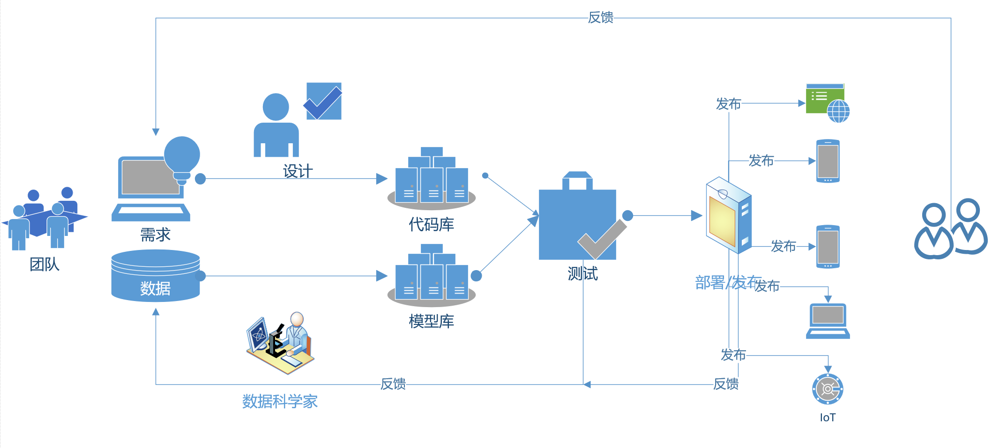

# AI 301 课程简介

## 人工智能发展简史

人工智能的发展历史，可以用下图简单地表示：

人工智能经历很多起起伏伏，其中有两个AI 的冬天，我们从中学到什么规律呢？AI 的冬天来自于认识和期望值的巨大落差，外行对AI的效果有巨大的期望值，内行则挣扎于各种具体困难中。 正如Roy Amara 指出的那样，“我们总是高估一项科技所带来的短期效益，却又低估它的长期影响”。经过几十年积累下来的AI 技术，在计算机算力提高，数据大量丰富的背景下，终于找到了爆发的突破口，神经网络和反向传播这些“旧”技术重新找到了用武之地，在过去的10年中不断给我们带来惊喜。这些惊喜又导致了巨大的期望值。

现在全国各地高校新建立了七十多个AI 学院和专业，这么快的速度的确和巨大的期望值有关。 我们不妨问自己，如果AI 的发展在几年后又会出现寒冬，那时候我们培养的AI 专业的学生刚刚毕业，他们还能通过自己的“人工智能”专业找到如意的工作么？ 那时候需要什么样的技能呢？

## 

## 人工智能的范围和难题

当人们谈论人工智能的时候，他们提到的各种上下文的范围很广， 广义的人工智能是指“通过计算机实现人类思维的效果，能从环境中获取感知并行动“ 的现象。我们大致可以把广义人工智能分为弱人工智能和强人工智能。

**弱人工智能：**

处理特定的问题，并不具有人类的感知能力。前两年名噪一时的AlphaGo 程序并不知道自己在下 “围棋”，它只是忙着处理矩阵运算…

弱人工智能包括了包含机器学习（Machine Learning)， 机器学习又包括了深度学习（Deep Learning）

**强人工智能：**

是具备与人类同等智慧、或超越人类的人工智能，能表现正常人类所具有的所有智能行为。

计算机似乎能拥有智能，这引起了人们对智能是什么的哲学的思考，其中一个著名的挑战是“中文房间”的问题：

一个对汉语一窍不通，只说英语的人关在一封闭房间中。房间里有一本用英文写成的手册，指示该如何处理收到的汉语讯息及如何以汉语相应地回复。房外的人不断向房间内递进用中文写成的问题。房内的人便按照手册的说明，查找到合适的指示，将相应的中文字符组合成对问题的解答，并将答案递出房间。

约翰·希尔勒 （John Searle）认为，尽管房里的人可以以假乱真，让房外的人以为他确确实实说汉语，他却压根不懂汉语。在上述过程中，房外人的角色相当于程序员，房中人相当于计算机，而手册则相当于计算机程序：每当房外人给出一个输入，房内的人便依照手册给出一个答复（输出）。而正如房中人不可能通过手册理解中文一样，计算机也不可能通过程序来获得理解力。既然计算机没有理解能力，所谓“计算机于是便有智能”便更无从谈起了。

读者在网上经常碰到一些聊天机器人，你给它一个中文句子， 它回答你一个中文句子，有些时候的对答很有意思，用户也乐此不疲，那么，这个聊天机器人是真的有“智能”呢？还是一个在中文房间里的翻书很快的程序？

## 

## AI 还是会来

正如我们前面说的，“我们总是高估一项科技所带来的短期效益，却又低估它的长期影响。”，AI 还是会到来。 下面是对科学家的统计结果\[1\]：

## 

## 目前人工智能的专业领域

目前要打造一个人工智能的系统和应用，需要很多知识，我们分层次来看， 从离用户最近的，到离机器最近的。

  - 交叉应用层：和其他学科的交叉融合

    人工智能要和其他学科的知识结合起来，才能发挥实际的作用，例如，如果要做智能驾驶，我们就要和汽车工业，交通，规划等行业有很深的了解。人工智能可以看病，那么，我们就要和医药行业做融合，医生要了解人工智能工具需要什么数据，人工智能专家也要了解各种医学数据和流程。

  - 平台系统：机器学习平台，工具，AI 程序设计

    我们需要一个平台来支撑机器学习的训练，程序开发，测试，以及各种探索工作，新的程序设计语言说不定会发明出来（例如Julia语言），我们也要学习并让这个语言和平台上的其它模块一起工作。

  - 支撑技术：模式识别，计算机视觉，语音信息处理，启发式搜索，自动规划，多智能体系统

    人工智能以及有很多比较成熟的子领域，这些技术能让我们在其基础上构建更复杂和丰富的应用。

  - 核心基础：机器学习，知识表示与处理

    人工智能的核心还是我们如何有效地表达知识，如何表达在客观世界中我们习以为常的“常识”，如何把把知识，规律转化为机器能掌握的形式，并能逐步提高。

怎么样达到人工智能呢？历史上有不少努力，大致可以分为下面三个方向：

  - 方法论 - 逻辑

    如果程序可以用逻辑解决一切问题， 那么我们能否用逻辑表达人类的智能呢？

  - 方法论 - 仿人类智能

    人的大脑经过千万年的进化，它可以学习，那我们能否模拟人类大脑（以及神经）的交流方式，从而构造出一个能学习的程序呢？目前的深度学习的方法模拟了一些神经元交流信息的方式，但是人类对于人脑如何处理信息，如何形成概念，如何做决定还是没有明确的结论，我们的人工智能的算法是基于统计模型的结论，所以有precision/recall等概念。

  - 方法论 - 智慧基础设施（Intelligent Infrastructure）和智慧增强（Intelligence
    Augmentation）

    我们用计算能力和数据构建服务，它们可以增强人类的智力和创造能力。例如搜索引擎，它并不是模仿人脑思维而构造而成，但是它对于人类的贡献是十分巨大的，而且大家都觉得它是有“智能”的。

    我们可以用计算能力数据和相关物理实体组成一个网络，它可以帮助人类在物流运输，医药、商业和金融这样的领域中更快速地处理事务，这也不是模仿人脑和神经的信息传播方式而得来的。\[2\]

## 弱AI 理论 – 算法 – 框架 – 应用

我们回到 “弱AI”这个领域，我们可以用下面这个图来看各个层次都有什么：

## AI，计算机科学和软件工程

很多人说AI 应该脱离计算机科学和软件工程， 成为一门独立的学科，那么，我们可以看看计算机科学和软件工程的关系， 从 2002年开始，中国有30多所示范性软件学院开始创立，他们的毕业生也是学习算法，数据结构，好像和传统的计算机系的学生学习的科目没有什么不同，那么他们有什么区别呢？

下表总结了二者一些明显的区别：

从上表看出，软件工程和计算机科学研究的侧重点的确不一样， 所以，它成为一个独立的学科是有道理的。
那么人工智能学科呢？

如果我们用逻辑来表示智能，那么人工智能就是逻辑学的应用；如果我们走仿人类的方向，那么我们的理论基础并不明确，除了数学和统计学的那些基础之外；如果我们走的是智慧基础设施（Intelligent Infrastructure）和智慧增强（Intelligence Augmentation）的道路，那么，人工智能就是一个复杂的工程学和系统科学的新分支。

我们看目前在“AI”领域的人，他们大致分为几个方向：

  - 做AI的理论研究，在某个细分领域做算法或模型的研究

  - 做AI的应用，基于某个理论的突破，在某个实际环境中解决实际问题，这也是“智慧增强”的一个表现，例如，让语音识别更加准确，让搜索更加准确。

  - 做智慧基础设施的工程，例如智能城市，物联网，智能仓储，等。

  - 做AI 系统本身的研究，让AI （特别是目前的Deep Learning 系统）跑得又快又节约资源。

## AI本身的工程

下面是AI 系统本身的工程问题的一个例子：

如何从系统层面优化深度学习的计算效率？

问题：

  - 深度学习是基于大样本数据的反复处理，很多模型需要几天-几周的时间才能完成

  - 模型需要迅速迭代，线上推理需要极致的性能要求

解决方案：

  - 如何减少通信的开销，提高多核的并行度？

  - 如何提高单个硬件计算单元的效率？

  - 如何更好利用内存资源?

  - 如何对特定的优化做合理的抽象使其更加灵活？

（MSRA 伍鸣研究员的成果）

## AI 的理论问题

作为一个例子，我们引用 朱纯松 《浅谈人工智能》一文的例子：

计算机视觉研究的理论挑战：

  - 几何常识推理与三维场景构建

  - 场景识别的本质是功能推理

  - 物理稳定性与关系的推理

  - 意向、注意和预测

  - 任务驱动的因果推理与学习

## AI 是否导致了软件开发的范式转换？

AI 来势汹汹，很多人说它会颠覆一切，那么在科学历史上发生了几次颠覆性的改变（范式转换）呢？ 我们通过 Jim Gray 的文章可以看到，我们说的 AI 大潮是属于 data exploration 这个范式转换的一部分：

## AI 应用的生命周期 – 单线程

在一些领域内， 我们可以看到 AI 的确发挥了关键性的作用，从AI 工程师的角度来看， 开发流程似乎是这样的：

那么，AI 的工程是否有特别的规律，可以不按照传统的 SE 方法来做？

在这种情况下， AI 模型是否也应该像软件的模块那样，支持持续集成和持续部署？

  - 有版本控制

  - 有单元测试和回归测试

  - 跟踪版本和各种依赖关系

  - 部署版本并保持高效的更新？

## AI 应用的生命周期 – 协同合作

在大多数情况下， AI 工程师和软件设计工程师应该是携手工作的，如下图所示：

## 案例： AI 模型和APP 的持续集成和发布

在我们用Windows ML 来开发识别动物的APP 中，我们看到下面的流程：

1.  AI 训练**三个动物**的分类器

2.  集成到APP 中并发布

3.  用户已经使用了这个APP

…

4.  AI 训练**四个动物**的分类器

5.  如何集成到App 中发布？

**方案：**

1)  更新所有APP

2)  用RESTFul API

3)  把模型作为数据传到客户App中

哪一个是最优的解法呢？

## AI 产生的新职业：调参工程师，数据科学家，会有变化么？

AI 对很多工作有一定的威胁，一些职位会因为AI 程序的出现而消失，那么AI 的开发也导致了一些新的职位的出现，例如调参工程师 – 主要工作就是调整AI 训练的各种参数，并选择一个比较好的模型；例如数据科学家 – 主要是处理各种数据并研究各种数据的规律，AI 在发展的过程中，说不定也会对这些AI 职位有威胁， 例如，自动调参的系统AutoML 让人工调参的效率相形见绌；工具的易用化和普及，让数据科学家不再神秘，也许和和Excel 操作是同样的难度。

## 如何学习AI

如何学习AI 呢？ 专家给出了一些建议：

  - **有科学家素养的工程师** – 郑南宁院士

    - 这个需求和 IT 行业历年来的需求有区别么？找出规律：
    
      - 数学基础好 + 专业理论（CS）和工程（SE）基础扎实
    
      - **技术热点** 知识全面
    
      - 1960: 结构化编程； 1980：OO编程；1990：数据库；2000：互联网；2010：大数据/移动；2018：AI

    - 对学生元技能的要求
    
      - 有自主学习的能力

  - **在人工智能领域具备*源头创新能力*，具备解决企业关键技术难题能力的人才** – 周志华
    
      - 数学基础好，计算机+软件工程基础扎实，人工智能知识全面

      - **源头创新能力**：如果要培养源头创新能力，那么我们就要打开一些黑盒子， 刨根问底，而不能满足于仅仅会调用一些函数，使用一些现成的工具。

## 核心能力是什么？

我们要培养的能力是计算思维，简而言之，它是：

  - 观察，找到事物变化的模式和关系

  - 逻辑地组织和分析数据

  - 把问题解法变为有组织、可重复的步骤

  - 把问题的解法抽象、变为更通用，应用在更多领域

如何培养呢？ 我们在教学体系中， 要强调“动手 + 动脑”， 不要急于学最时髦的东西，而是要把基础数学和基础编程搞好， 锻炼高质量的工程能力，鼓励自己提出问题，解决问题。

## 人工智能开放科研教育平台

微软的人工智能平台：

## AI 课程体系

日程 | 内容 | 学生活动
--- | --- | ---
15-16 | 学生总结和进一步开发 | 进一步开发
14 | 项目复审 | 展示
13 | 实战项目 指导 | 项目开发
12 | AI 研究课题介绍  实战项目 指导 | 项目开发
11 | AI 研究课题介绍 | 阅读
10 | 分布式训练平台 (PAI) | 项目总结
9 | 实战项目 指导 | 项目开发
8 | 软工项目管理 介绍，实战项目 指导 | 项目开发
7 | AI 与伦理，社会 | 分析报告
6 | Bot Service, Hands-on AI game | 项目实践
5 | classical ML vs. Deep Learning | 阅读、实验
4 | Self-build AI, analysis of an AI Model | 实验
3 | Custom AI, Cognitive Services (NLP) | 实验
2 | Pre-built AI, Cognitive Services (Image) | 实验
1 | AI 介绍 | 设置环境，团队建立

1.  来源：
    [https://www.researchgate.net/publication/280838978\_Future\_Progress\_in\_Artificial\_Intelligence\_A\_Survey\_of\_Expert\_Opinion](https://www.researchgate.net/publication/280838978_Future_Progress_in_Artificial_Intelligence_A_Survey_of_Expert_Opinion)

2.  来源：Michael Jordan 的文章 Artificial Intelligence — The Revolution
    Hasn’t Happened Yet
    [https://medium.com/@mijordan3/artificial-intelligence-the-revolution-hasnt-happened-yet-5e1d5812e1e7](https://medium.com/@mijordan3/artificial-intelligence-the-revolution-hasnt-happened-yet-5e1d5812e1e7)
