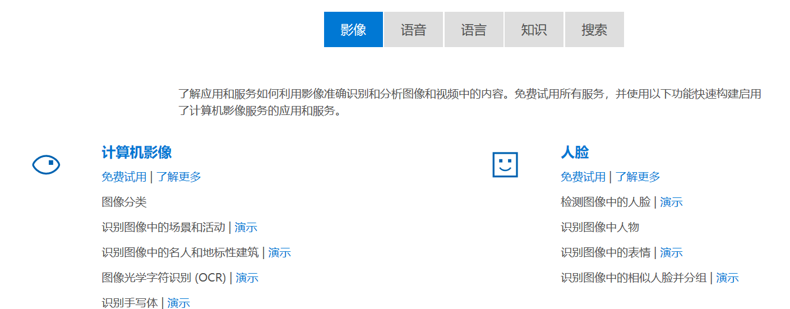
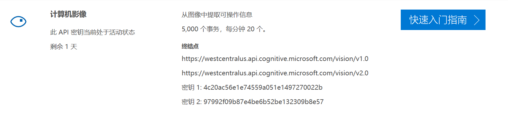
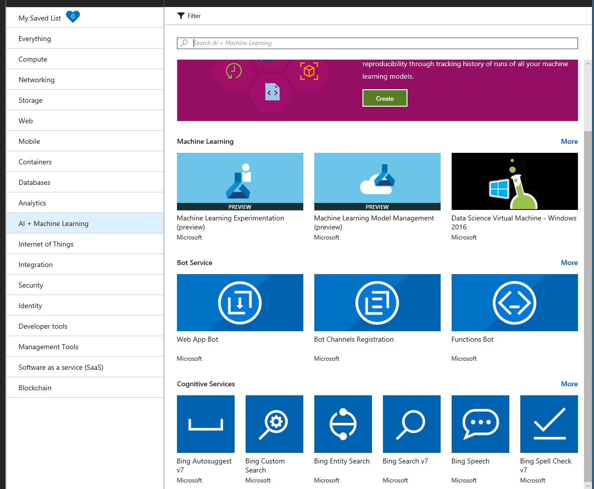
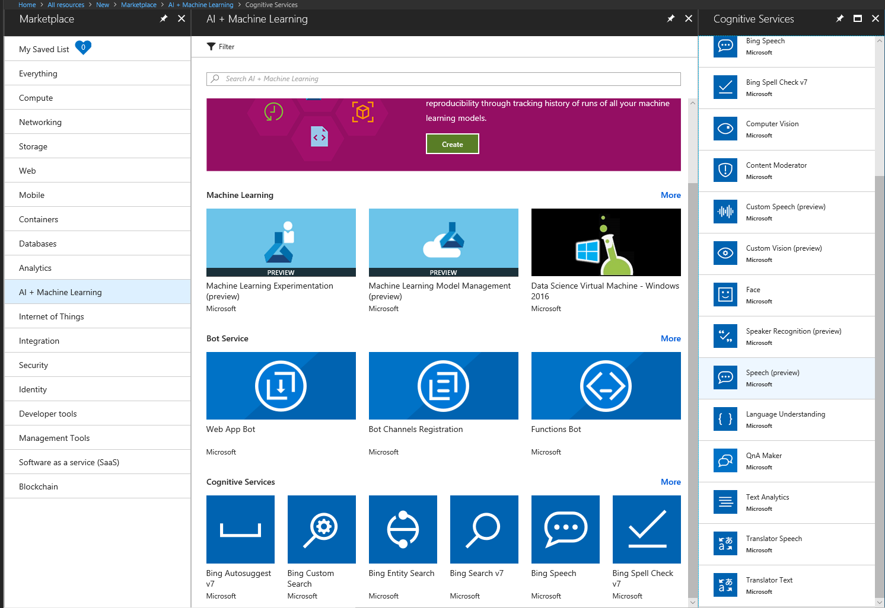
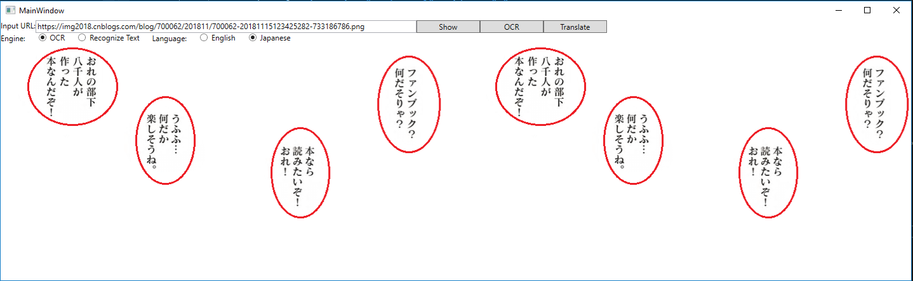

# 目录

Copyright © Microsoft Corporation. All rights reserved.
  适用于[License](https://github.com/Microsoft/ai-edu/blob/master/LICENSE.md)版权许可
  
[知识点](#知识点)

[概述](#概述)

[环境准备](#环境准备)

[申请微软认知服务密钥](#申请微软认知服务密钥)

  - [申请OCR服务密钥](#申请ocr服务密钥)

  - [申请Text Translate文本翻译服务密钥](#申请text-translate文本翻译服务密钥)

  - [使用VS Tools for AI](#使用vs-tools-for-ai)

  - [小结](#小结)

[构建代码](#构建代码)

 - [界面设计](#界面设计)

 - [界面设计代码](#界面设计代码)

 - [处理事件](#处理事件)

    - [按钮”Show”的事件](#按钮show的事件)

    - [按钮”OCR”的事件](#按钮ocr的事件)

    - [按钮”Translate”的事件](#按钮translate的事件)

    - [选项按钮的事件](#选项按钮的事件)

 - [API数据访问部分](#api数据访问部分)

    - [与认知服务交互](#与认知服务交互)

    - [OCR服务的数据类定义](#ocr服务的数据类定义)

    - [翻译服务的数据类定义](#翻译服务的数据类定义)

[运行程序](#运行程序)

[习题与进阶学习](#习题与进阶学习)

 - [增加容错代码让程序健壮](#增加容错代码让程序健壮)

 - [改进本应用让其自动化和产业化](#改进本应用让其自动化和产业化)

 - [使用新版本的Engine做字符识别](#使用新版本的engine做字符识别)

 - [OCR纠错处理](#ocr纠错处理)

 - [聚类处理待翻译的文字](#聚类处理待翻译的文字)

# 知识点

  - Visual Studio Tools for AI

  - Microsoft
Azure上的服务申请流程

  - 微软认知服务（影像服务/文本翻译服务）的申请与使用

  - 小型客户端软件的界面设计与实现

# 概述

微软认知服务包括了影像、语音、语言、搜索、知识五大领域，通过对这些认知服务的独立或者组合使用，可以解决很多现实世界中的问题。作为AI小白，我们可以选择艰难地攀登崇山峻岭，也可以选择像牛顿一样站在巨人的肩膀上。本章节的内容就以“漫画翻译”为例，介绍如何灵活使用微软认知服务来实现自己的AI梦想。

日本漫画非常著名，如海贼王，神探柯南等系列漫画在中国的少年一代中是非常普及。国内专门有一批志愿者，全手工翻译这些漫画为中文版本，过程艰辛复杂，花费时间很长。能否使用AI来帮助加快这个过程呢？

小提示：漫画是有版权的，请大家要在尊重版权的前提下做合法的事。

漫画翻译，要做的事情有三步：

1.  调用微软认知服务，用OCR(光学字符识别)服务识别出漫画上所有文字；

2.  调用微软认知服务，用Text Translate(文本翻译)服务把日文翻译成中文；

3.  自己写逻辑代码把中文文字贴回到以前的漫画中，覆盖以前的日文，生成新的漫画帧。

下图是展示最后的翻译效果，左侧是原漫画，右侧是翻译成中文的结果（由于版权问题，我们自己模仿原漫画做了几个对话气泡）：


# 环境准备

安装Windows 10版本 1803，低一些的Windows 10版本也可以使用。Windows
7也可以运行本示例程序，但不建议使用，Windows
7的官方技术支持到2020/01/14结束。

小提示：如果您的机器不能运行Windows
10，说明硬件性能还是有些不够的。AI是建立在软硬件快速发展的基础上的，不建议您使用低配置的机器来做AI知识的学习。

安装Visual Studio 2017
Community。点击这里下载，对于本案例，安装时选择“.NET桌面开发”即可满足要求。

# 申请微软认知服务密钥

## 申请OCR服务密钥

[点击进入此页面](https://azure.microsoft.com/zh-cn/services/cognitive-services/directory/vision/)：



在上图所示页面中“计算机影像”下点击“免费试用”：


根据自己的实际情况选择以上三个选项之一，这里以选择第一个“来宾”选项为例：


选择一个热爱的国家/地区，在上下两个复选框上（“我同意”，“我接受”）都打勾，点击“下一步”：


上图中以选择”Microsoft”账户为例继续：



最后得到了上面这个页面，这里的密钥(Key)和终结点(Endpoint)要在程序中使用，请保存好！

小提示：上面例子中的密钥只能再使用1天了，因为是7天的免费试用版本。所以当你的程序以前运行正常，某一天忽然从服务器不能得到正常的返回值时并且得到错误代码Unauthorized
(401)，请首先检查密钥状态。

小提示：当试用的Key过期后，你是无法再申请试用Key的，只能申请正式的Key，这就要通过Azure门户。在Azure门户中申请好Computer
Vision服务（包括OCR服务）的Key后，它会告诉你Endpoint是…../vision/v1.0，这个不用管它，在code里还保持……/vision/v2.0就可以了，两者的Key是通用的。

## 申请Text Translate文本翻译服务密钥

用自己的Azure账号登录Azure门户：


在上图中点击左侧的“All resources”:


在上图中点击上方的 “+ Add”图标来创建资源，得到资源列表如下 ：


在上图中点击右侧列表中的“AI + Machine Learning”，得到下图的具体服务项目列表：


这里有个坑，文本翻译不在右侧的列表中，需要点击右上方的”See all”来展开所有项目：



哦，好吧，还是没有！保持耐心，继续点击Cognitive Services栏目的右侧的”More”按钮，得到更详细的列表：



还是没有？卷滚一下看看？到底，到底！OK，终于有了Translator Text，就是Ta：


创建这个服务时，我们选择F0就可以了。如果要是做商用软件的话，你可以选择S1或其他，100万个字符才花10美元，不贵不贵！

## 使用VS Tools for AI

是不是以上申请Key的过程太复杂了？那是因为Azure内容庞杂，网页设计层次太多！其实这个过程是可以简化的，因为我们有个Visual
Studio Tools for AI扩展包！

打开VS2017，菜单上选择“工具(Tools)-\>扩展和更新(Extensions and
Updates)”，在弹出的对话框左侧选择“联机(Online)”，在右侧上方输入”AI”
进行搜索，会看到”Microsoft Visual Studio Tools for AI”扩展包，下载完毕后关闭VS，这个扩展包就会自动安装。

安装完毕后，再次打开VS2017，点击菜单View-\>Server Explorer。如果安装了Tools for AI，此时会看到以下界面：


在AI Tools-\>Azure Cognitive
Services下，可以看到我已经申请了2个service，ComputerVisionAPI和TranslateAPI就是我们想要的，这两个名字是自己在申请服务时指定的。

假设你还没有这两个服务，那么在Azure Cognitive Services上鼠标右键，然后选择Create New Cognitive
Service，出现以下对话框：


在每个下拉框中显示的内容可能会每个人都不一样，绝大多数是用下拉框完成填充的，很方便。假设我想申请TextTranslation服务，那么我在Service
Name上填写一个自己能看懂的名字就行了，比如我填写了”TranslateAPI”，这样比较直接。同理可以创建ComputerVisionAPI服务。服务的名字不会在Code中使用。

## 小结

我们废了老鼻子劲，得到了以下两个REST API的Endpoint和相关的Key：

OCR服务

Endpoint:
<https://westcentralus.api.cognitive.microsoft.com/vision/v2.0>

Text Translate文本翻译服务

Endpoint:
<https://api.cognitive.microsofttranslator.com/translate?api-version=3.0>

小提示：以上两个Endpoint的URL是目前最新的版本，请不要使用旧的版本如v1.0等等。

咱们是洗洗睡了，还是写代码？看天色还早，继续写代码吧！

# 构建代码

构建这个PC桌面应用，我们需要几个步骤：

在得到第一次的显示结果后，经过测试，有很大可能会根据结果再对界面进行调整，实际上也是一个局部的软件工程中的迭代开发。

## 界面设计

启动Visual Studio 2017, 创建一个基于C\#语言的WPF(Windows Presentation
Foundation)项目：


WPF是一个非常成熟的技术，在有界面展示和交互的情况下，使用XAML设计/渲染引擎，比WinForm程序要强101倍，再加上有C\#语言利器的帮助，是写PC桌面前端应用的最佳组合。

给Project起个名字，比如叫“CartoonTranslate”，选择最新的.NET Framework
(4.6以上)，然后点击”OK”。我们先一起来设计一下界面：


Input URL：用于输入互联网上的一张漫画图片的URL

Engine：指的是两个不同的算法引擎，其中，OCR旧引擎可以支持25种语言，识别效果可以接受；而Recognize
Text新引擎目前只能支持英文，但效果比较好。

Language：制定当前要翻译的漫画的语言，我们只以英文和日文为例，其它国家的漫画相对较少，但一通百通，一样可以支持。

右侧的一堆Button了解一下：

Show：展示Input URL中的图片到下面的图片区

OCR：调用OCR服务

Translate：调用文本翻译服务，将日文或者英文翻译成中文

下侧大面积的图片区了解一下：

Source Image：原始漫画图片

Target Image：翻译成中文对白后的漫画图片

## 界面设计代码

我们在MainWindow.xaml文件里面填好以下code：

```xml
<Window x:Class="CartoonTranslate.MainWindow"
        xmlns="http://schemas.microsoft.com/winfx/2006/xaml/presentation"
        xmlns:x="http://schemas.microsoft.com/winfx/2006/xaml"
        xmlns:d="http://schemas.microsoft.com/expression/blend/2008"
        xmlns:mc="http://schemas.openxmlformats.org/markup-compatibility/2006"
        xmlns:local="clr-namespace:CartoonTranslate"
        mc:Ignorable="d"
        Title="MainWindow" Height="450" Width="800">
    <Grid>
        <Grid.RowDefinitions>
            <RowDefinition Height="Auto"/>
            <RowDefinition Height="Auto"/>
            <RowDefinition Height="Auto"/>
            <RowDefinition Height="*"/>
        </Grid.RowDefinitions>
        <StackPanel Orientation="Horizontal" Grid.Row="0">
            <TextBlock Grid.Row="0" Text="Input URL:"/>
            <TextBox x:Name="tb_Url" Grid.Row="1" Width="600"
                     Text="http://stat.ameba.jp/user_images/20121222/18/secretcube/2e/19/j/o0800112012341269548.jpg"/>
            <Button x:Name="btn_Show" Content="Show" Click="btn_Show_Click" Width="100"/>
            <Button x:Name="btn_OCR" Content="OCR" Click="btn_OCR_Click" Width="100"/>
            <Button x:Name="btn_Translate" Content="Translate" Click="btn_Translate_Click" Width="100"/>
        </StackPanel>
        <StackPanel Grid.Row="1" Orientation="Horizontal">
            <TextBlock Text="Engine:"/>
            <RadioButton x:Name="rb_V1" GroupName="gn_Engine" Content="OCR" Margin="20,0" IsChecked="True" Click="rb_V1_Click"/>
            <RadioButton x:Name="rb_V2" GroupName="gn_Engine" Content="Recognize Text" Click="rb_V2_Click"/>
            <TextBlock Text="Language:" Margin="20,0"/>
            <RadioButton x:Name="rb_English" GroupName="gn_Language" Content="English"/>
            <RadioButton x:Name="rb_Japanese" GroupName="gn_Language" Content="Japanese" IsChecked="True" Margin="20,0"/>
        </StackPanel>
        <Grid Grid.Row="3">
            <Grid.ColumnDefinitions>
                <ColumnDefinition Width="*"/>
                <ColumnDefinition Width="40"/>
                <ColumnDefinition Width="*"/>
            </Grid.ColumnDefinitions>
            <TextBlock Grid.Column="0" Text="Source Image" VerticalAlignment="Center" HorizontalAlignment="Center"/>
            <TextBlock Grid.Column="2" Text="Target Image" VerticalAlignment="Center" HorizontalAlignment="Center"/>
            <Image x:Name="imgSource" Grid.Column="0" Stretch="None" HorizontalAlignment="Left" VerticalAlignment="Top"/>
            <Image x:Name="imgTarget" Grid.Column="2" Stretch="None" HorizontalAlignment="Left" VerticalAlignment="Top"/>
            <Canvas x:Name="canvas_1" Grid.Column="0"/>
            <Canvas x:Name="canvas_2" Grid.Column="2"/>
        </Grid>
</Grid>
</Window>
```

## 处理事件

关于XAML语法的问题不在本文的讨论范围之内。上面的XAML写好后，编译时会出错，因为里面定义了很多事件，在C\#文件中还没有实现。所以，我们现在把事件代码补上。

局部变量定义（在MainWindow.xaml.cs的MainWindow class里面）：

```c#
// using “OCR” or “Recognize Text”
private string Engine;
// source language, English or Japanese
private string Language;
// OCR result object
private OcrResult.Rootobject ocrResult;
```


### 按钮”Show”的事件

点击Show按钮的事件，把URL中的漫画的地址所指向的图片加载到窗口中显示：
```C#
private void btn_Show_Click(object sender, RoutedEventArgs e)
{
    if (!Uri.IsWellFormedUriString(this.tb_Url.Text, UriKind.Absolute))
    {
        // show warning message
        return;
    }
    // show image at imgSource
    BitmapImage bi = new BitmapImage();
    bi.BeginInit();
    bi.UriSource = new Uri(this.tb_Url.Text);
    bi.EndInit();
    this.imgSource.Source = bi;
    this.imgTarget.Source = bi;
}
```
在上面的代码中，同时给左右两个图片区域赋值，显示两张一样的图片。

### 按钮”OCR”的事件

点击OCR按钮的事件，会调用OCR REST API，然后根据返回结果把所有识别出来的文字用红色的矩形框标记上：

```C#
private async void btn_OCR_Click(object sender, RoutedEventArgs e)
{
    this.Engine = GetEngine();
    this.Language = GetLanguage();
    if (Engine == "OCR")
    {
        ocrResult = await CognitiveServiceAgent.DoOCR(this.tb_Url.Text, Language);
        foreach (OcrResult.Region region in ocrResult.regions)
        {
            foreach (OcrResult.Line line in region.lines)
            {
                if (line.Convert())
                {
                    Rectangle rect = new Rectangle()
                    {
                        Margin = new Thickness(line.BB[0], line.BB[1], 0, 0),
                        Width = line.BB[2],
                        Height = line.BB[3],
                        Stroke = Brushes.Red,
                        //Fill =Brushes.White
                    };
                    this.canvas_1.Children.Add(rect);
                }
            }
        }
    }
    else
    {
    }
}
```


在上面的代码中，通过调用DoOCR()自定义函数返回了反序列化好的类，再依次把返回结果集中的每个矩形生成一个Rectangle图形类，它的left和top用Margin的方式来定义，width和height直接赋值即可，把这些Rectangle图形类的实例添加到canvas\_1的Visual
Tree里即可显示出来（这个就是WPF的好处啦，不用处理绘图事件，但性能不如用Graphics类直接绘图）。

### 按钮”Translate”的事件

点击Translate按钮的事件：

```C#
private async void btn_Translate_Click(object sender, RoutedEventArgs e)
{
    List<string> listTarget = await this.Translate();
    this.ShowTargetText(listTarget);
}

private async Task<List<string>> Translate()
{
    List<string> listSource = new List<string>();
    List<string> listTarget = new List<string>();
    if (this.Version == "OCR")
    {
        foreach (OcrResult.Region region in ocrResult.regions)
        {
            foreach (OcrResult.Line line in region.lines)
            {
                listSource.Add(line.TEXT);
                if (listSource.Count >= 25)
                {
                    List<string> listOutput = await CognitiveServiceAgent.DoTranslate(listSource, Language, "zh-Hans");
                    listTarget.AddRange(listOutput);
                    listSource.Clear();
                }
            }
        }
        if (listSource.Count > 0)
        {
            List<string> listOutput = await CognitiveServiceAgent.DoTranslate(listSource, Language, "zh-Hans");
            listTarget.AddRange(listOutput);
        }
    }
    return listTarget;
}
private void ShowTargetText(List<string> listTarget)
{
    int i = 0;
    foreach (OcrResult.Region region in ocrResult.regions)
    {
        foreach (OcrResult.Line line in region.lines)
        {
            string translatedLine = listTarget[i];
            Rectangle rect = new Rectangle()
            {
                Margin = new Thickness(line.BB[0], line.BB[1], 0, 0),
                Width = line.BB[2],
                Height = line.BB[3],
                Stroke = null,
                Fill =Brushes.White
            };
            this.canvas_2.Children.Add(rect);
            TextBlock tb = new TextBlock()
            {
                Margin = new Thickness(line.BB[0], line.BB[1], 0, 0),
                Height = line.BB[3],
                Width = line.BB[2],
                Text = translatedLine,
                FontSize = 16,
                TextWrapping = TextWrapping.Wrap,
                Foreground = Brushes.Red
            };
            this.canvas_2.Children.Add(tb);
            i++;
        }
    }
}
```


上面这段代码中，包含了两个函数：this.Translate()和this.ShowTargetText()。

我们先看第一个函数：最难理解的地方可能是有个“25“数字，这是因为Translate
API允许一次提交多个字符串并一起返回结果，这样比你提交25次字符串要快的多。翻译好的结果按顺序放在listOutput里，供后面使用。

再看第二个函数：先根据原始文字的矩形区域，生成一些白色的实心矩形，把它们贴在右侧的目标图片上，达到把原始文字覆盖（扣去）的目的。然后再根据每个原始矩形生成一个TextBlock，设定好它的位置和尺寸，再设置好翻译后的结果(translatedLine)，这样就可以把中文文字贴到图上了。

### 选项按钮的事件

点击Radio Button的事件：

```C#
private void rb_V1_Click(object sender, RoutedEventArgs e)
{
    this.rb_Japanese.IsEnabled = true;
}
private void rb_V2_Click(object sender, RoutedEventArgs e)
{
    this.rb_English.IsChecked = true;
    this.rb_Japanese.IsChecked = false;
    this.rb_Japanese.IsEnabled = false;
}
private string GetLanguage()
{
    if (this.rb_English.IsChecked == true)
    {
        return "en";
    }
    else
    {
        return "ja";
    }
}
private string GetEngine()
{
    if (this.rb_V1.IsChecked == true)
    {
        return "OCR";
    }
    else
    {
        return "RecText";
    }
}
```


## API数据访问部分

我们需要在CatroonTranslate工程中添加以下三个.cs文件：

  - CognitiveServiceAgent.cs

  - OcrResult.cs

  - TranslateResult.cs

### 与认知服务交互

CognitiveServiceAgent.cs文件完成与REST API交互的工作，包括调用OCR服务的和调用翻译服务的代码：

```C#
using Newtonsoft.Json;
using System;
using System.Collections.Generic;
using System.Diagnostics;
using System.Linq;
using System.Net.Http;
using System.Net.Http.Headers;
using System.Text;
using System.Threading.Tasks;
using System.Web;

namespace CartoonTranslate
{
    class CognitiveServiceAgent
    {
        const string OcrEndPointV1 = "https://westcentralus.api.cognitive.microsoft.com/vision/v2.0/ocr?detectOrientation=true&language=";
        const string OcrEndPointV2 = "https://westcentralus.api.cognitive.microsoft.com/vision/v2.0/recognizeText?mode=Printed";
        const string VisionKey1 = "4c20ac56e1e7459a05e1497270022b";
        const string VisionKey2 = "97992f0987e4be6b5be132309b8e57";
        const string UrlContentTemplate = "{{\"url\":\"{0}\"}}";

        const string TranslateEndPoint = "https://api.cognitive.microsofttranslator.com/translate?api-version=3.0&from={0}&to={1}";
        const string TKey1 = "04023df3a4c499b1fc82510b48826c";
        const string TKey2 = "9f76381748549cb503dae4a0d80a80";

        public static async Task<List<string>> DoTranslate(List<string> text, string fromLanguage, string toLanguage)
        {
            try
            {
                using (HttpClient hc = new HttpClient())
                {
                    hc.DefaultRequestHeaders.Add("Ocp-Apim-Subscription-Key", TKey1);
                    string jsonBody = CreateJsonBodyElement(text);
                    StringContent content = new StringContent(jsonBody, Encoding.UTF8, "application/json");
                    string uri = string.Format(TranslateEndPoint, fromLanguage, toLanguage);
                    HttpResponseMessage resp = await hc.PostAsync(uri, content);
                    string json = await resp.Content.ReadAsStringAsync();
                    var ro = Newtonsoft.Json.JsonConvert.DeserializeObject<List<TranslateResult.Class1>>(json);
                    List<string> list = new List<string>();
                    foreach(TranslateResult.Class1 c in ro)
                    {
                        list.Add(c.translations[0].text);
                    }
                    return list;
                }
            }
            catch (Exception ex)
            {
                Debug.WriteLine(ex.Message);
                return null;
            }
        }

        private static string CreateJsonBodyElement(List<string> text)
        {
            var a = text.Select(t => new { Text = t }).ToList();
            var b = JsonConvert.SerializeObject(a);
            return b;
        }

        /// <summary>
        /// 
        /// </summary>
        /// <param name="imageUrl"></param>
        /// <param name="language">en, ja, zh</param>
        /// <returns></returns>
        public static async Task<OcrResult.Rootobject> DoOCR(string imageUrl, string language)
        {
            try
            {
                using (HttpClient hc = new HttpClient())
                {
                    ByteArrayContent content = CreateHeader(hc, imageUrl);
                    var uri = OcrEndPointV1 + language;
                    HttpResponseMessage resp = await hc.PostAsync(uri, content);
                    string result = string.Empty;
                    if (resp.StatusCode == System.Net.HttpStatusCode.OK)
                    {
                        string json = await resp.Content.ReadAsStringAsync();
                        Debug.WriteLine(json);
                        OcrResult.Rootobject ro = Newtonsoft.Json.JsonConvert.DeserializeObject<OcrResult.Rootobject>(json);
                        return ro;
                    }
                }
                return null;
            }
            catch (Exception ex)
            {
                Debug.Write(ex.Message);
                return null;
            }
        }

        private static ByteArrayContent CreateHeader(HttpClient hc, string imageUrl)
        {
            hc.DefaultRequestHeaders.Add("Ocp-Apim-Subscription-Key", VisionKey1);
            string body = string.Format(UrlContentTemplate, imageUrl);
            byte[] byteData = Encoding.UTF8.GetBytes(body);
            var content = new ByteArrayContent(byteData);
            content.Headers.ContentType = new MediaTypeHeaderValue("application/json");
            return content;
        }
    }
}
```


其中，DoTranslate()函数和DoOCR()函数都是HTTP调用，很容易理解。只有CreateJsonBodyElement函数需要解释一下。前面提到过我们一次允许给服务器提交25个字符串做批量翻译，因此传进来的是个List\<string\>，经过这个函数的简单处理，会得到以下JSON格式的数据作为HTTP的Body：

```
// JSON Data as Body
[
        {“Text” : ”第1个字符串”},
        {“Text” : ”第2个字符串”},
        ……..
        {“Text” : ”第25个字符串”},
]
```


### OCR服务的数据类定义

OcrResult.cs文件是OCR服务返回的JSON数据所对应的类，用于反序列化：

```C#
using System;
using System.Collections.Generic;
using System.Linq;
using System.Text;
using System.Threading.Tasks;

namespace CartoonTranslate.OcrResult
{
    public class Rootobject
    {
        public string language { get; set; }
        public string orientation { get; set; }
        public float textAngle { get; set; }
        public Region[] regions { get; set; }
    }

    public class Region
    {
        public string boundingBox { get; set; }
        public Line[] lines { get; set; }
    }

    public class Line
    {
        public string boundingBox { get; set; }
        public Word[] words { get; set; }

        public int[] BB { get; set; }
        public string TEXT { get; set; }


        public bool Convert()
        {
            CombineWordToSentence();
            return ConvertBBFromString2Int();
        }

        private bool ConvertBBFromString2Int()
        {
            string[] tmp = boundingBox.Split(new char[] { ',' }, StringSplitOptions.RemoveEmptyEntries);
            if (tmp.Length == 4)
            {
                BB = new int[4];
                for (int i = 0; i < 4; i++)
                {
                    int.TryParse(tmp[i], out BB[i]);
                }
                return true;
            }
            return false;
        }

        private void CombineWordToSentence()
        {
            StringBuilder sb = new StringBuilder();
            foreach (Word word in words)
            {
                sb.Append(word.text);
            }
            this.TEXT = sb.ToString();
        }

    }

    public class Word
    {
        public string boundingBox { get; set; }
        public string text { get; set; }
    }
}
```

需要说明的是，服务器返回的boundingBox是个string类型，在后面使用起来不太方便，需要把它转换成整数，所以增加了CovertBBFromString2Int()函数。还有就是返回的是一个个的词(Word)，而不是一句话，所以增加了CombineWordToSentence()来把词连成句子。

### 翻译服务的数据类定义

TranslateResult.cs文件翻译服务返回的JSON所对应的类，用于反序列化：

```C#
namespace CartoonTranslate.TranslateResult
{
    public class Class1
    {
        public Translation[] translations { get; set; }
    }

    public class Translation
    {
        public string text { get; set; }
        public string to { get; set; }
    }
}
```


小提示：在VS2017中，这种类不需要手工键入，可以在Debug模式下先把返回的JSON拷贝下来，然后新建一个.cs文件，在里面用Paste
Special从JSON直接生成类就可以了。

# 运行程序

好啦，大功告成！现在要做的事就是点击F5来编译执行程序。如果一切顺利的话，将会看到界面设计部分所展示的窗口。

我们第一步先点击”Show”按钮，会得到：



再点击”OCR”按钮，等两三秒（取决于网络速度），会看到左侧图片中红色的矩形围拢的一些文字。有些文字没有被识别出来的话，就没有红色矩形。


最后点击”Translate”按钮，稍等一小会儿，会看到右侧图片的变化：


Wow\!
大部分的日文被翻译成了中文，而且位置也摆放得很合适。

# 习题与进阶学习

## 增加容错代码让程序健壮

目前的代码中没有很多容错机制，比如当服务器返回错误时，访问API的代码会返回一个NULL对象，在上层没有做处理，直接崩溃。再比如，当用户不按照从左到右的顺序点击上面三个button时，会产生意想不到的情况。

## 改进本应用让其自动化和产业化

本应用处理单页的漫画，并且提供了交互，目的是让大家直观理解工作过程，实际上这个过程可以做成批量自动化的，也就是输入一大堆URL，做后台识别/翻译/重新生成图片后，把图片批量保存在本地，再进行后处理。

当然，识别引擎不是万能的，很多时候不可能准确识别/翻译出所有对白文字。所以，可以考虑提供一个类似本应用的交互工具，让漫画翻译从业者在机器处理之后，对有错误的地方进行纠正。

小提示：请严格遵守知识产权保护法！在合法的情况下做事。

## 使用新版本的Engine做字符识别

还记得前面提到过新旧引擎的话题吗？我们在界面上做了一个Radio Button “Recognize
Text”，但是并没有使用它。因为这个新引擎目前还只能支持英文的OCR，所以，如果大家对漫威Marvel漫画（英文为主）感兴趣的话，就可以用到这个引擎啦，与旧OCR引擎相比，不能同日而语，超级棒！

旧OCR引擎的文档在这里：<https://westus.dev.cognitive.microsoft.com/docs/services/5adf991815e1060e6355ad44/operations/56f91f2e778daf14a499e1fc>

新Recognize
Text引擎的文档在这里：

<https://westus.dev.cognitive.microsoft.com/docs/services/5adf991815e1060e6355ad44/operations/587f2c6a154055056008f200>

新的引擎在API交互设计上，有一个不同的地方：当你提交一个请求后，服务器会立刻返回Accepted
(202)，然后给你一个URL，用于查询状态的。于是需要在客户端程序里设个定时器，每隔一段时间（比如200ms），访问那个URL，来获得最终的OCR结果。

返回的结果JSON格式也有所不同，大家可以自己试着实现一下：

## 聚类处理待翻译的文字

观察力好的同学，可能会发现一个问题，如下图所示，左侧图的一个对白气泡里，有四句话，但其实它们是一句话，分开写到4列而已。


这种情况带来的问题是：这四句话分别送给翻译引擎做翻译，会造成前后不连贯，语句不通顺。可以考虑的解决方案是，先根据矩形的位置信息，把这四句话合并成同一句话，再送给翻译引擎。这就是标准的聚类问题，通过搜索引擎可以找到一大堆参考文档，比如这些：

<https://blog.csdn.net/summer_upc/article/details/51475512>

<https://www.ibm.com/developerworks/cn/analytics/library/ba-1607-clustering-algorithm/index.html>
