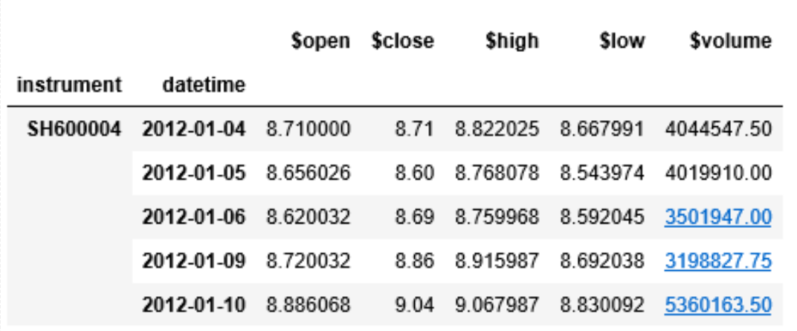
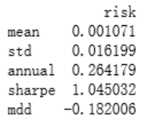

Copyright © Microsoft Corporation. All rights reserved.
  适用于[License](https://github.com/Microsoft/ai-edu/blob/master/LICENSE.md)版权许可
  

# 量化交易

1. 案例介绍

   - 1.1  案例说明

     机器学习与人工智能在金融领域已有成熟的应用。用统计模型来预测股票等金融产品的价格并自动交易，这是其中的经典问题。价格预测的模型是这个应用场景中的核心问题，在预测价格变化的基础上，通过一定的交易规则来获利。价格预测的准确率不需要很高，超过50%在理论上就有盈利的空间。每次交易的获利也不需要太高，只要高于交易成本，就能通过长期、多次的交易来积累盈利，形成显著的收益。

     本案例基于股市每日股票价格数据进行建模，用60天的历史数据作为特征，来预测第二天的收盘价格。然后根据价格预测的结果来进行模拟交易的回溯测试，通过测试结果来评估算法性能。本案例采用了回归模型，将股票价格与大盘价格的差作为目标，来减小均方差。有了预测值之后，调用回溯函数来进行模拟交易。

     本案例的模型是回归问题。因此，任何回归问题的算法都适用于本案例。本案例可用于其它分类或回归算法的教学实践，还可以贯穿于整个机器学习教学过程，让学生不断尝试用新学的算法来解决此问题。

     根据此案例，学生们能够了解量化交易中核心的股价预测的建模理念，以及量化交易的经典过程。在此基础上，还可以进一步提升模型表现，或将其包装成量化交易的应用。

   - 1.2 文件列表

     |文件名|用途|
     |----------------|----------------------|
     |data_loader.py|在模型中import此文件，调用load_data函数来读取数据，并切分成训练数据、验证数据和测试数据。|
     |evaluate.py|用于评估算法的 模拟回溯交易函数。|
     |gbdt_model.py|采用梯度提升决策树的模型。直接运行即可完成模型训练。|
     |nn_model.py|采用多层神经网络的模型。直接运行即可完成模型训练。|
     |prepare_features.py|在训练模型前运行此代码，将原始数据文件转换为特征数据文件。|
     |raw_data.pickle|原始数据|

   - 1.3 数据说明

     - 1.3.1 原始数据

       本案例的原始数据为A股中证500从2012年初到2018年初的数据，包括每日的开盘数据、收盘数据、最高价、最低价、交易量。这些数据均为复权后的量价，即去除了分股、行权等对价格变化的影响。

       

     - 1.3.2 特征工程

       本案例通过历史数据来建模，将每日的前59天的数值展开为特征。具体情况如下

       1. 特征数据

          - a. 生成的特征值有295个，命名如：$open1, $open2, … , $open59, $close1, …, $high1, …, $low1, …, $volume1, …, $volume59。

          - b. 每条数据为前n天的对应正规化后的值，如：$open1对应1天前的开盘价正规化后的值，$volume59对应59天前的交易量正规化后的值。

          - c. 正规化。可通过代码看出，前n天的开盘价、收盘价、最高价、最低价都是除以当日收盘价为正规化后的值。交易量除了除以当日交易量，并通过ln求自然对数来减少数量级的差别。

       2. 标记数据。根据第二天价格是否能跑赢大盘来作为标记数据。如果高于大盘，则为正数，低于大盘则为负数。

       3. 有些股票无法回溯59天的历史股价，在训练模型前，会将这些数据条目删除。

       4. 数据按照时间段来拆分：

          - a. 2008~2013年为训练数据集，346817条。
          - b. 2014~2015年为验证数据集，170756条。
          - c. 2016~2018年为测试数据集，217554条。

     - 1.3.3 回溯测试 

       回溯测试用于评估模型的性能。回溯测试会根据价格预测模型来进行模拟交易，从而测试出能够获得的理论收益。本案例文件evaluate.py中的backtest函数包含了回溯测试的逻辑，也可作为量化交易策略。

       回溯测试会将每日预测涨幅最高的50只股票找出来，并将其买入。买入金额在要买入的股票间平均分配。若上一日持仓的股票不在今日前50只股票中，则会将其卖出。

2. 教学目标

   1. 了解股价预测的基本建模方法。
   2. 熟悉特征工程的一般方法。
   3. 熟悉梯度提升决策树模块（lightbgm）的使用方法。
   4. 熟悉深度学习神经网络框架（Keras）的简单使用。

3. 教学过程

   - 3.1 准备环境

     环境准备应在实验之前完成，且需要网络才能完成Python环境的安装。

     - 3.1.1 环境要求
        1. 64位Python 3.6或以上版本

     - 3.1.2 准备环境
        1. 通过pip命令安装以下python包。

           ```
           pip install scikit-learn pandas lightgbm numpy keras tensorflow
           ```
        2. 将代码与原始数据拷贝至目标机器某目录下

   - 3.2 准备数据

      1. 运行以下命令，从原始数据生成特征（feature）。生成时间大约需要几分钟，请耐心等待。生成的数据文件约有1.5G，也可以复制到其它环境中直接重用，避免再次生成。

         ```
         python prepare_features.py
         ```

   - 3.3 训练模型

      本案例提供了梯度提升决策树和多层神经网络的模型脚本。分别运行脚本即可训练出模型，并预测其性能。

      - 3.3.1 梯度提升决策树
        1. 运行以下命令：
           ```
           python gbdt_model.py
           ```
        2. 脚本会输出LightGBM的一些信息，然后输出训练过程中的损失值(loss)，最终输出结果。

       - 3.3.2 神经网络
          1. 运行以下命令：
             ```
             python nn_model.py
             ```
          2. 脚本会输出训练的过程，包括损失值(loss)，精度(accuracy)等等。神经网络比梯度提升决策树训练慢，且结果会差一些。本例只是比较简单的神经网络，因此，此结论不宜推广到所有神经网络建模方法上。

   - 3.4 分析结果

      模型训练的最终结果通过risk_analysis函数输出，并打印在训练模型的最后面。通过这些分析能够从多方面来评价模型的效果。

      

      1. mean。平均每日收益率。如上例中的每日平均收益为0.1071%。
      2. std。每日收益的标准方差。标准方差能够看出收益的波动范围，方差越小，表示收益越稳定。
      3. annual。平均年化收益。将每日收益累计计算出的平均年化收益。因为股票交易收益能用于下一次购买，所以是按照复利的方式来计算年化收益的。
      4. sharpe。夏普比率。表示承受每单位的风险能够获得的收益。此值越大越好。
      5. mdd。最大回撤（Max Drawdown）。表示最低价值与最高价值的比值，此值越大越好。如上面数据中，表示最差的一天，账户价值比最高值下跌了18.2006%。

4. 作业安排

   根据学生理论学习进度，难度安排以及教学目标，可以参考以下方向安排作业。

   - 4.1 书写实验总结

      上述案例包括了数据预处理、训练模型、分析结果等过程，并包括了梯度提升决策树和神经网络两种模型训练方式。可让学生对实验过程分析，总结两种模型训练方式的比较，自己对机器学习模型训练的心得、收获等等。

   - 4.2 实现梯度提升决策树 

      本案例通过lightgbm来使用了梯度提升决策树。为了更进一步理解梯度提升决策树的工作原理，可通过代码实现，并检查是否能达到示例代码的效果。

   - 4.3 实现神经网络 

      本案例通过调用Keras创建了神经网络。为了更进一步理解神经网络算法的工作原理，可实现神经网络的结构、激活、往回传播等功能，并检查是否能达到示例代码的效果。

   - 4.4 改进价格预测模型

      本案例可用任何分类或回归算法来建模。本案例仅给定了基本的模型样例，精度较低。通过选择其它算法或神经网络结构，改变目标函数、添加新的原始数据、重新进行特征工程等方法尝试，可训练出更好的预测模型。

   - 4.5 改进回溯测试交易策略 

      根据当前模型，改进backtest函数，尝试找到更好的量化交易策略来获得更高、更稳定的收益。

   - 4.6 实现量化交易应用 

      通过实现量化交易应用来在实践中检验模型是否能够达到预期的效果。可模拟自动买卖股票来计算某段时间内的收益。整个应用需要考虑从数据采集到数据处理的数据流水线、用户使用界面等全方位的问题，较为复杂。建议组成小团队来完成。