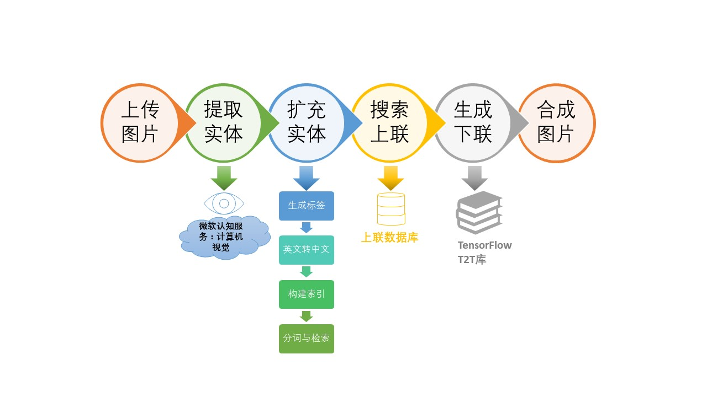

Copyright © Microsoft Corporation. All rights reserved.
  适用于[License](https://github.com/Microsoft/ai-edu/blob/master/LICENSE.md)版权许可


# 智能对联

自然语言处理（Natural Language Processing, NLP）是人工智能领域中最重要的分支之一。本案例使用深度学习的方法，利用常见的机器翻译模型，构建了一个智能对联生成的微信小程序。通过对该案例的学习，读者能够了解NLP领域的基础理论，包括词嵌入（Word Embedding）、编码解码模型（Encoder-Decoder）、注意力机制（Attention）等重要知识点，并具备应用、实践能力。通过阅读详实的步骤介绍和参考代码，读者也能了解RNN、LSTM、GRU、Transformer等流行算法，以及Tensor2Tensor等模型库的使用，从而在应用场景中将NLP的理论知识转变成相应的实战技能。

该案例面向对象广泛，扩展性强，不但覆盖了NLP的几大主要知识点，还进一步结合了计算机视觉（Computer Vision）中目标检测、图像分割、图像标注等知识点。初学者可通过复现此案例来学习NLP相关的理论知识，在实践中加深对理论的理解、提高动手能力；对于进阶者，可以通过研究优化对联生成模型等方面，对该案例应用做进一步的扩展，从而提高分析、研究能力。

# 目录

* [案例介绍](#案例介绍)
  * [使用场景](#使用场景)
  * [发展历程及实现方法](#发展历程及实现方法) 
  * [案例价值](#案例价值)
* [核心知识点](#核心知识点)
* [先修知识](#先修知识)
* [环境与工具](#环境与工具)
  * [软件依赖](#软件依赖) 
* [案例大纲](#案例大纲)
* [推荐学习时长](#推荐学习时长)
* [案例详解](#案例详解)
  * [程序结构](#程序结构)
  * [工具包的选择](#工具包的选择)
  * [数据收集](#数据收集)
  * [数据预处理](#数据预处理)
  * [模型训练](#模型训练)
  * [模型推理](#模型推理)
  * [搭建后端服务](#搭建后端服务)
* [作业和挑战](#作业和挑战)


# 案例介绍

## 使用场景

对联是汉语语言特有的文学形式，是中华民族的文化瑰宝，是我国的重要文化遗产。在我国民间，对联有着十分广泛的应用。其中，最为常见的当属春联了。快过年的时候，每家每户必定会在自家门口贴上一副精选挑选的春联，这里面饱含着劳动人民对新的一年最美好的期盼和最朴实的祝愿：或是期许家庭和睦，或是盼望身体健康，亦或期待学有所成……

在万千词海中，我们如何才能带着对未来的期盼，找到最适合自己的又最为独特的对联？《联景联情》或是你最佳的选择。在这个案例中，我们开发了一款由图片生成对联的微信小程序《联景联情》。上传代表你的祝愿的图片，让《联景联情》为你创作专属于你的对联：希望新年考上理想大学，那就上传你心中的梦想学校大门的图片吧；希望尝遍人间美味，那就上传你还没吃过的美食照片吧！

用户在《联景联情》中任意上传一张图像，AI小程序可以根据识别出的场景和意境，结合信、达、雅的准则，智能生成3组5-7字的美文上下联，用户可以选择喜欢的对联配图发朋友圈/微博抒情，或者在其他特定场合展示文采，适合传播的属性非常适合现代人的社交展示使用场景。

扫描如下二维码即可打开小程序体验：


在此案例中，我们将重点介绍对联生成的实现过程。

## 发展历程及实现方法

机器翻译的发展经历了以下几个阶段（图源自[知乎](https://www.zhihu.com/question/24588198/answer/634996172?edition=yidianzixun&utm_source=yidianzixun)）：


由最初的基于规则的方法，发展到统计机器翻译，再到现在的神经网络机器翻译。

### 基于规则

基于规则的方法是由人来提供翻译规则，从词语到词语的对应，都由人来提供。由于该方法需要人类语言专家来设计规则，且规则复杂，因此开发周期长，成本高。由于基于规则的方法，通常是字字对应的转化，没有考虑上下文，因此翻译质量通常会由于使用场景的不同而产生较大的差异。


### 统计机器翻译

在基于统计的机器翻译中，规则是由机器自动从大规模的语料中学习得到的，而非由人主动提供完整的规则。这种方法的成本较低，因为机器可以利用大量数据自动学习对应的规则，而无需人的参与。由于统计机器翻译基于大量的语料库，因此翻译质量易受语料库的多寡影响。

微软亚洲研究院周明老师团队早在十几年前就已经使用基于短语的统计机器学习的方法，实现了电脑自动对联系统，效果非常好，很好的展现了中国经典文化的魅力，收获了非常多的赞誉。在线体验地址是 [这里](http://duilian.msra.cn)。

### 神经网络机器翻译

近年来，深度神经网络学习的发展为机器翻译提供了新的思路。通常情况下，神经机器翻译使用编码器-解码器框架。编码阶段将整个源序列编码成一个（或一组）向量，解码阶段通过最大化预测序列概率，从中解码出整个目标序列，完成翻译过程。


编码器、解码器通常使用 RNN、LSTM 来实现，也有的用 CNN 来实现，达到了比较好的性能和结果。

在本次案例中，我们将使用深度学习的方法，实现一个对联自动生成的应用。

当前，常见的深度学习算法有
    [RNN](../B6-神经网络基本原理简明教程/Step9%20-%20RNN/19.0-循环神经网络.md)、
    [LSTM](../B6-神经网络基本原理简明教程/Step9%20-%20RNN/20.1-LSTM基本原理.md)、[GRU](../B6-神经网络基本原理简明教程/Step9%20-%20RNN/20.3-GRU基本原理.md)、
    [Transformer](http://jalammar.github.io/illustrated-transformer/)。

由于前馈神经网络的输入都是一批静态数据，无法处理对于随着时间变化的连续数据，或者说无法捕捉时间序列的关系，因此科学家提出了循环神经网络（RNN，Recurrent Neural Network），通过连接多个前馈神经网络的隐藏层，从而获取每个相邻时间步之间的联系。在RNN的基础上，科学家又引入了大量优化理论并从此衍生出许多改进算法，如长短期记忆网络（Long Short-Term Memory networks, LSTM）、门控循环单元网络（Gated Recurrent Unit networks, GRU）等。

LSTM主要解决了RNN中容易出现的梯度爆炸和梯度消失的问题，而GRU在LSTM的基础上，做了进一步的简化，但它们始终是基于RNN的算法，十分地消耗计算资源。Transformer算法则基于全新的Attention机制，放弃了循环和卷积，采用了编码器和解码器的结构，在翻译任务上的表现也更优。因此，在这里我们选择使用transformer模型来实现我们的任务。


## 案例价值

此案例特色显明，生动有趣，可以激发学生们对深度学习的兴趣。在技术层面，此案例使学生对深度学习的时序模型有直观的了解。该案例面向对象广泛，扩展性强。对初学者，可重复案例的过程；对于进阶者，不论在模型选择上，还是在模型推理上，都可以有更多的扩展，可提高学生们的探索研究能力。


# 核心知识点

* 使用微软认知服务（Cognitive Service）中计算机视觉（computer vision）服务
* NLP 相关知识
   * Sequence2Sequence 模型
   * 相关算法： RNN，LSTM，GRU，Transformer
* 模型库的使用
   * Tensor2Tensor
   * Fairseq
* 在OpenPAI上训练模型


# 先修知识
* 了解RNN的基本概念和原理
  
  参考链接： [循环神经网络](../B6-神经网络基本原理简明教程/Step9%20-%20RNN/19.0-循环神经网络.md)

* Seq2Seq模型的基本概念
  
  参考链接：[序列到序列](../B6-神经网络基本原理简明教程/Step9%20-%20RNN/20.4-序列到序列.md)

* 了解主流深度学习框架
 
  参考链接：[tensorflow](https://www.tensorflow.org/tutorials/quickstart/beginner), [Pytorch](https://pytorch-cn.readthedocs.io/zh/latest/)

* 熟悉github的使用
 
  参考链接：[GitHub入门](https://help.github.com/cn/github/using-git)


# 环境与工具

本案例运行在Azure虚拟机上，虚拟机的系统为Ubuntu 16.04

需要的软件环境如下：

* Python 3.5
* tensorflow 1.14.0
* tensor2tensor 1.14.1

## 软件依赖

在开始之前，请确保安装好以下依赖：

1. 训练所需 python packages 在文件 [train_requirements.txt](./code/train/train_requirerments.txt) 中。
2. 服务所需 python packages 在文件 [conda_requirements.txt](./code/service/conda_requirements.txt) 中。

安装示例：
```
pip install -r train_reqquirements.txt
```

# 案例大纲

|序号|内容|关键知识点|收获实战技能|
|:---:|---|---|---|
| 1 | 图片信息提取 | Cognitive Service | 使用Cognitive Service提取图像内容 |
| 2 | 分词与词检索 | 结巴分词；构建用于词检索的KD-Tree | 结巴分词库的使用； KD-Tree的构建与应用 |
| 3 | 文本表征 | 词嵌入与词向量 | 掌握常用词嵌入的方法； 用向量表征文本； 词向量库的使用 |
| 4 | 语言模型简介| 传统语言模型； 基于神经网络的语言模型 | 了解语言模型发展历程及基本原理 |
| 5 | Seq2Seq序列模型 | Seq2Seq, Encoder-Decoder, Attention, Transformer | 掌握Seq2Seq模型原理 |
| 6 | 模型库的使用 | Tensor2Tensor, Fairseq | 使用模型库构建并训练语言模型；使用训练好的模型进行推理 |
| 7 | 应用开发 | 后端开发 | HTTP服务搭建 | 

# 推荐学习时长

* 初次学习的实战者：5~8 小时
* 有一定经验学习者：3~5 小时


# 案例详解

## 程序结构

本案例的基本程序结构如下图所示：



后续将会对每个部分进行详细说明。


## 工具包的选择

想要完成一个自动生成对联的小程序，想法十分美好，但想要达到这个目标，光拍拍脑袋想想是不够的，需要训练出一个能完成对联生成的自然语言理解模型。于是乎，就有两个选择：

1. 自己写一套完成对联生成工作的深度学习模型。这个工作量相当之大，可能需要一个NLP专业团队来进行开发，调优。
2. 应用已有的深度学习模型，直接应用。这个选择比较符合客观需要。我们找到了两个工具包：

    + Tensor2Tensor 工具包：Tensor2Tensor（以下简称T2T）是由 Google Brain 团队使用和维护的开源深度学习模型库，支持多种数据集和模型。T2T 在 github 上有完整的介绍和用法，可以访问[这里](https://github.com/tensorflow/tensor2tensor)了解详细信息。

    + Fairseq 工具包：[Fairseq](https://github.com/pytorch/fairseq) 是 Facebook 推出的一个序列建模工具包，这个工具包允许研究和开发人员自定义训练翻译、摘要、语言模型等文本生成任务。这里是它的 PyTorch 实现。

    本案例中，我们使用 T2T 工具包进行模型训练。


## 数据收集

有了模型，还需要数据。巧妇难为无米之炊，没有数据，什么都是浮云。数据从哪里来呢？GitHub 上有很多开源贡献者收集和整理了对联数据，可以进行下载使用。

本案例从下面几个渠道获取对联数据：
1. Github网站上的开源对联数据： https://github.com/wb14123/couplet-dataset/releases
2. Github网站上的开源古诗数据： https://github.com/chinese-poetry/chinese-poetry
3. 微软亚洲研究院提供的10万条对联数据（非公开数据）。


## 数据预处理

### 生成源数据文件

网上提供的对联数据形式各异，需要整理成我们需要的格式。我们创建两个文本文件，命名为 train.txt.up 和 train.txt.down，存放上联和下联数据。每个上联/下联为一行，用换行符 ‘\n’ 分隔。

### 生成词表文件

接下来我们要统计上下联中出现多少不同的字，用于后续的模型推理。


1. 将上下联数据每个字以“空格”分隔，合并成一个文件。

    a. 分隔数据的python代码 (split_data.py)：

    ```
    import sys

    filename = sys.argv[1]
    with open(filename, 'r', encoding='utf-8') as infile:
        with open(filename + '.clean', 'w', encoding='utf-8') as outfile:
            lines = infile.readlines()
            for line in lines:
                out = ""
                for i in line.strip():
                    out += i + (' ')
                out = out[:-1]
                out += '\n'
                outfile.write(out)
    ```

    b. 执行如下命令完成文件分隔

    ```
    python split_data.py train.txt.up
    python split_data.py train.txt.down
    ```

    分隔后生成两个文件：train.txt.up.clean 和 train.txt.down.clean

    c. 合并文件为 merge.txt

    ```
    cat train.txt.up train.txt.down > merge.txt
    ```

2. 统计文件中出现的不同字和每个字的出现次数。
   
    ```
    subword-nmt get-vocab -–input merge.txt -–output merge.txt.vocab
    ```

3. 去掉出现次数，只保留字
    
    ```
    cat merge.txt.vocab | awk ‘{print $1}’ > merge.txt.vocab.clean
    ```

4. 将 merge.txt.vocab.clean 的前三行填充如下内容，并将字表字数加3：
    
    ```
    <pad>
    <EOS>
    <UNK>
    ```

5. 生成测试集。

    取训练集中前 100 个数据作为测试集。（在实际训练过程中，没有用到测试集）

    ```
    head -n 100 train.txt.up > dev.txt.up
    head -n 100 train.txt.down > dev.txt.down
    ```

完成以上预处理以后，我们最终得到以下文件：

* train.txt.up.clean
* train.txt.down.clean
* merge.txt.vocab.clean

将上述文件放到`data_dir`目录。

### 自定义T2T问题

1. 新建`usr_dir`目录。

2. 在[merge_vocab.py](./code/train/usr_dir/merge_vocab.py) 文件中编写下联生成模型的问题定义。

    修改如下参数：
    1. `SRC_TRAIN_DATA` 为训练集上联数据文件
    2. `TGT_TRAIN_DATA` 为训练集下联数据文件
    3. `SRC_DEV_DATA` 为测试集上联数据文件
    4. `TGT_DEV_DATA` 为测试集下联数据文件
    5. `MERGE_VOCAB` 为最终字表文件
    6. `VOCAB_SIZE` 为字表文件中字的个数

    该文件注册了问题类 ```TranslateUp2down``` ，用于指出如何进行上下联翻译。其中 ```generate_encoded_samples``` 函数用于处理词表、编码、创建完成时序任务的生成器的工作。

3. 添加一个 `__init__.py`文件，导入`merge_vocab.py`。
    ```
    from . import merge_vocab
    ```

### 检查目录

完成上述步骤后，请确保你的文件按如下的目录结构放置。

```
usr_dir \
    __init__.py
    merge_vocab.py
data_dir \
    train.txt.up.clean
    train.txt.down.clean
    merge.txt.vocab.clean
```

### 生成训练数据

在本案例中，若要使用 T2T 工具包进行训练，需要把数据转换成T2T认可的二进制文件形式。

使用如下命令生成训练数据。

```
USR_DIR=./usr_dir
DATA_DIR=./data_dir
PROBLEM=translate_up2down

t2t-datagen \
  --t2t_usr_dir=${USR_DIR} \
  --data_dir=${DATA_DIR} \
  --problem=${PROBLEM}
```

其中，

`t2t_usr_dir`：指定了一个目录，该目录中包含 \_\_init\_\_.py 文件，并可以导入处理对联问题的 python 模块。在该目录中，编写 merge_vocab.py 文件，注册对联问题。

`data_dir`：数据目录。存放生成训练数据所需的所有源数据资源，以及生成的训练数据文件。

`problem`：定义问题名称，本案例中问题名称为 translate_up2down
当命令执行完毕，将会在 data 目录下生成两个文件：

    translate_up2down-train-00000-of-00001
    translate_up2down-dev-00000-of-00001

这便是我们需要的训练数据文件。


## 模型训练

有了处理好的数据，我们就可以进行训练了。你可以选择**本地训练**或**在OpenPAI上训练**。

### OpenPAI上训练
OpenPAI 作为开源平台，提供了完整的 AI 模型训练和资源管理能力，能轻松扩展，并支持各种规模的私有部署、云和混合环境。因此，我们推荐在OpenPAI上训练。

完整训练过程请查阅：
[在OpenPAI上训练](docs/train_on_pai.md)


### 本地训练

如果你的本地机器性能较好，也可以在本地训练。

模型训练的代码请参考[train.sh](./code/train/train.sh)。


训练过程依然调用t2t模型训练命令：`t2t_trainer`。具体命令如下：
```
TRAIN_DIR=./output
LOG_DIR=${TRAIN_DIR}
DATA_DIR=./data_dir
USR_DIR=./usr_dir

PROBLEM=translate_up2down
MODEL=transformer
HPARAMS_SET=transformer_small

t2t-trainer \
--t2t_usr_dir=${USR_DIR} \
--data_dir=${DATA_DIR} \
--problem=${PROBLEM} \
--model=${MODEL} \
--hparams_set=${HPARAMS_SET} \
--output_dir=${TRAIN_DIR} \
--keep_checkpoint_max=1000 \
--worker_gpu=1 \
--train_steps=200000 \
--save_checkpoints_secs=1800 \
--schedule=train \
--worker_gpu_memory_fraction=0.95 \
--hparams="batch_size=1024" 2>&1 | tee -a ${LOG_DIR}/train_default.log
```

各项参数的作用和取值分别如下：

1) `t2t_usr_dir`：如前一小节所述，指定了处理对联问题的模块所在的目录。

2) `data_dir`：训练数据目录

3) `problem`：问题名称，即translate_up2down

4) `model`：训练所使用的 NLP 算法模型，本案例中使用 transformer 模型

5) `hparams_set`：transformer 模型下，具体使用的模型。transformer 的各种模型定义在 tensor2tensor/models/transformer.py 文件夹内。本案例使用 transformer_small 模型。

6) `output_dir`：保存训练结果

7) `keep_checkpoint_max`：保存 checkpoint 文件的最大数目

8) `worker_gpu`：是否使用 GPU，以及使用多少 GPU 资源

9) `train_steps`：总训练次数

10) `save_checkpoints_secs`：保存 checkpoint 的时间间隔

11) `schedule`：将要执行的 `tf.contrib.learn.Expeiment` 方法，比如：train, train_and_evaluate, continuous_train_and_eval,train_eval_and_decode, run_std_server

12) `worker_gpu_memory_fraction`：分配的 GPU 显存空间

13) `hparams`：定义 batch_size 参数。

好啦，我们输入完命令，点击回车，训练终于跑起来啦！如果你在拥有一块 K80 显卡的机器上运行，只需5个小时就可以完成训练。如果你只有 CPU ，那么你只能多等几天啦。
我们将训练过程运行在 Microsoft OpenPAI 分布式资源调度平台上，使用一块 K80 进行训练。

如果你想利用OpenPAI平台训练，可以查看[在OpenPAI上训练](docs/train_on_pai.md)。

4小时24分钟后，训练完成，得到如下模型文件：
   - checkpoint
   - model.ckpt-200000.data-00000-of-00003
   - model.ckpt-200000.data-00001-of-00003
   - model.ckpt-200000.data-00002-of-00003
   - model.ckpt-200000.index
   - model.ckpt-200000.meta

我们将使用该模型文件进行模型推理。


## 模型推理

在这一阶段，我们将使用上述训练得到的模型文件进行模型推理，利用上联生成下联。

### 新建推理脚本文件`inference.sh`

点击查看[inference.sh](./code/train/inference.sh)的代码。

在推理之前，需要注意如下几个目录：
- `TRAIN_DIR`：上述的训练模型文件存放的目录。
- `DATA_DIR`：训练字典文件存放目录，即之前提到的`merge.txt.vocab.clean`。
- `USR_DIR`：自定义问题的存放目录，即之前提到的`merge_vocab.py`文件。

```
TRAIN_DIR=./output
DATA_DIR=./data_dir
USR_DIR=./usr_dir

DECODE_FILE=./decode_this.txt

PROBLEM=translate_up2down
MODEL=transformer
HPARAMS=transformer_small

BEAM_SIZE=4
ALPHA=0.6

poet=$1
new_chars=""
for ((i=0;i < ${#poet} ;++i))
do
new_chars="$new_chars ${poet:i:1}"
done

echo $new_chars > decode_this.txt

echo "生成中..."

t2t-decoder \
--t2t_usr_dir=$USR_DIR \
  --data_dir=$DATA_DIR \
  --problem=$PROBLEM \
  --model=$MODEL \
  --hparams_set=$HPARAMS \
  --output_dir=$TRAIN_DIR \
  --decode_from_file=$DECODE_FILE \
  --decode_to_file=result.txt >> /dev/null 2>&1

echo $new_chars
cat result.txt
```

### 开始推理
   
给`inference.sh`增加可执行权限
```
chmod +x ./inference.sh
```

使用如下命令推理
```
./inference.sh [上联]
 ```

例如，

```
./inference.sh 西子湖边逢暮雨
```

等待推理完成后，你可能会得到下面的输出。当然，下联的生成和你的训练集、迭代次数等都有关系，因此大概率不会有一样的结果。

```
生成中...
西 子 湖 边 逢 暮 雨
故 里 乾 坤 日 盖 章
```

推理结果也保存到了`result.txt`文件中。


## 搭建后端服务

### 实体提取

当用户通过小程序上传图片或照片时，程序需要从图片中提取出能够描述图片的信息。本案例编写了utils.py文件。其中 do_upload_image 函数完成从上传的图片中提取实体的工作。具体过程如下：

1. 将传入的图片，去掉网络报头，提取图片文件的二进制信息，并存入 raw_images 目录，供后续合成图片时使用。
2. 调用微软认知服务（Cognitive Service）中的计算机视觉服务（Computer Vision），完成图片中实体的提取。本案例编写 cognitive_service.py 文件，编写 `call_cv_api` 函数来完成调用过程。
为了使用微软认知服务，用户需要在微软认知服务的网站上申请计算机视觉服务。可以申请30天试用版，也可以创建 Azure 账号，申请免费的服务。
3. 调用结束，返回的结果包含了提取出的实体信息。一张图片可以提取多个实体，组成实体数组。


### 上联匹配

提取完实体信息，我们要找出与实体相匹配的上联数据。find_shanglian 函数实现了该需求，具体函数实现在 word_matching.py 中，感兴趣的同学可以查看源代码。

#### 使用数据

在上联匹配中，我们需要用到如下几个数据文件，它们的描述如下表：

---
文件名 | 描述 | 格式 |
:----:|------|------
**train.txt.up** | 存储5-7字上联数据 | 文本格式，每行一个上联，‘\n’为分隔符。（如果句中有逗号，按两句分开处理）
**en2cn_dict.txt** | 实体字词中英文翻译，cache 文件 | 以词典形式存储，初始为空。key 为英文实体字词，value为中文翻译结果
**synonyms_words_dict.txt** | 同义词表，保存实体中文字词的三个同义词，cache 文件 | 以词典形式存储，初始为空。key 为中文实体词语，value 为同义词
**dict_1.txt** | 单个字在上联中出现的位置 | 以词典形式存储。key 为单个字，value 为数组，表示在train.txt.up 中的第几条中出现
**dict_2.txt** | 实体词语在上联中出现的位置 | 以词典形式存储。key 为一个词语，value 为数组，表示在train.txt.up 中的第几条中出现

---

其中，dict_1.txt 和dict_2.txt 文件需要根据上联数据文件 train.txt.up 进行处理。
- dict_1：统计上联数据出现的每个字，作为 key 。并找到 train.txt.up 中含有该字的上联 ID，将该 ID 作为 value 数组的元素，生成词表。
- dict_2：将上联两两相连的字组成词语（有可能两个相连字并不能称为词语，但依然组合在一起），作为key。并找到 train.txt.up 中含有该词语的上联 ID ，将该 ID 作为 value 数组的元素，生成词表。


#### 传入参数

函数 find_shanglian 传入至少5个参数：

（1） 实体信息

（2） 上联数据

（3） dict_1 文件，初始化为空，保存单个字在上联中出现的位置

（4） dict_2 文件，初始化为空，保存一个词语在上联中出现的位置

（5） 返回上联结果的数目

#### 实体标签翻译

从微软认知服务得到的实体标签（Tag）都是英文的，需要先翻译成中文。程序调用有道 API 完成中英翻译（在 Translate 函数中实现），并将{英文标签：中文翻译}保存在词典文件 en2cn_dict.txt 中。每次先在该文件中查找有否翻译完成的实体，如没有，再调用有道API。

#### 查找同义词

为了更多找到相关对联，我们还需要对实体词语进行同义词扩展。这用到名为 **synonyms** 的 python 包。该包的提供 nearby 方法，寻找并返回输入词语的同义词，以及他们的得分。本案例针对对每个实体标签，找到并保留至多三个得分大于 **0.7** 的同义词，并将结果在文件 synonyms_words_dict.txt 文件中缓存，方便下次查找。

#### 随机筛选词语

对每个实体，都找到至多三个同义词，并保存在同一个数组中。程序可以从当前数组包含的词语中，随机筛选75%的词汇，生成最终实体词汇列表，用于后续操作。剩下的词汇，保存在备用列表中。

#### 遍历词表

将实体词汇列表中的实体在词表文件 dict_1.txt 和 dict_2.txt 中进行遍历，找到含有该词汇的上联ID。具体步骤如下：

1. 将实体Tag拆分成单个字，在 dict_1 中遍历，寻找包含该词语的上联。

2. 将实体Tag过滤掉超过两个字的Tag，剩下的在 dict_2 中遍历，寻找包含该词语的上联。

3. 合并两次得到的上联 ID 结果，去重，并保存在 results 字典中，key = 上联 ID，value = 出现次数，作为得分。出现次数越多，得分越高。

4. 将结果按出现次序从高到低排序。

5. 返回指定数目的上联 ID，存在数组中。指定数目=要求返回上联数目+10。如果程序要求返回5个结果，则在这里返回15个结果。

6. 如果每个结果都只有一分，则将备用列表中的实体词汇也检索一遍，扩充上联 ID。

7. 在做一遍操作5

8. 根据最终上联 ID，得到具体上联数据。返回该数据。


### 生成下联

得到了所需要的上联数据，就要开始生成下联的工作了。该工作在 utils.py 的 `do_upload_image` 函数中继续完成。

调用 up2down_class.py 中的 `get_next` 函数，将上联数据作为参数一并传入。程序会用训练好的NLP模型进行推理（解码工作），对每一个候选上联，生成一个下联。

### 合成对联

接下来，程序将每个上联和生成的下联合成一个以逗号分隔的对联形式，并以 json 的格式返回 ID 和前 N 个对联的结果（本案例中目前 code 写死为前三个）。

### 重新创作

如果生成的下联用户不喜欢，可以更换对联。程序会根据当前上联，再次调用 `get_next` 函数，生成新的下联。该功能在函数 `do_modify_poetry` 中实现（ utils.py 文件）。

### 合成图片

程序生成下联后，会显示几个备选对联（默认是3个）。用户可以选择自己喜欢的对联，并和上传的图片合成新的对联。具体处理过程如下：

1. 获取元数据信息

获取此次服务请求的 id 和选中的对联项。

2. 合成最终图片

包括：1) 用户上传图片 2) 程序背景图片3) 程序二维码图片 4) 微信图片 5) Logo图片 6) 对联内容

具体程序在 synthesis_2.py 文件中实现。合成好的图片保存在相应目录下，供前端应用查找并显示给用户。


### 启动服务

我们在Azure上申请了一个VM，部署好我们的环境和代码，运行后端服务。

1. 登录VM，进入程序所在目录。
2. 若 VM 开启了 nginx 服务，则先关闭服务：
    ```
    sudo service nginx stop
    ```
3. 本案例使用 anaconda python 3.6 virtual environment，所以需要先激活 environment 。命令如下：
    ```
    activate py3_backend
    ```
4. 启动tmux，进入不同工作窗口进行工作：
    ```
    tmux new -s engine
    ```
5. 创建新的 tmux window，同时按下 ctrl+b，再按c
6. 在新窗口跳转到 syn_images 目录：`cd syn_images`
7. 启动 master 进程，并使用 https 访问的443默认端口：
    ```
    sudo python ~/code/Poetic-Image/tunnel.py 443
    ```
8. 重复步骤5
9.  在新窗口启动 slave server 1，用于生成下联的服务：
    ```
    python ~/code/Poetic-Image/http_server_py3.py 8001
    ```
10. 重复步骤5
11. 在新窗口启动 slave server 2，同样用于生成下联的服务：
    ```
    python ~/code/Poetic-Image/http_server_py3.py 8002
    ```
12. 重复步骤5
13. 在新窗口启动 slave server 3 ，用于合成对联和图片的服务：
    ```
    python ~/code/Poetic-Image/http_server_py3.py 8003
    ```

程序启动完毕。这时，在微信小程序端就可以使用对联服务啦。


# 作业和挑战

1. 程序复现

    从 GitHub 上下载70万条[对联数据](https://github.com/wb14123/couplet-dataset/releases)（couplet.tar.gz 文件），按照上述教程进行数据预处理，并使用 Tensor2Tensor 库进行模型训练。

2. 增量改进

   1. 数据收集：在 GitHub 上收集更多对联数据，进行模型训练。

   2. 使用 [Fairseq](https://github.com/pytorch/fairseq) 库进行模型训练，并对比两种模型库库不同算法之间的训练效果。

   3. 自己编写用户交互程序，调用模型推理API，完成给出上联，自动生成下联的工作。

   4. 扩展对联生成程序，用于古诗、绝句等的自动生成。


# 总结

本案例利用深度学习方法构建了一个上联预测下联的对联生成模型。首先通过词嵌入对数据集编码，再利用已编码的数据训练一个Encoder-Decoder模型，从而实现对联生成的功能。另外，该案例还结合微软Cognitive Service中的目标检测，对用户上传图片进行分析，利用分析结果匹配上联，再通过训练好的模型生成下联。最后，搭建后端服务实现完整的应用功能。该案例很好地演示了从模型选择、训练、推理到搭建后端服务等完整的应用开发流程，将理论与实践结合。


# 推荐阅读

## 最新论文

* [ACL 2019 | 微软8篇精选论文解读，一览最新研究进展](https://www.msra.cn/zh-cn/news/features/acl-2019)

## 深度文章

* [参数少一半，效果还更好，天津大学和微软提出Transformer压缩模型](https://www.msra.cn/zh-cn/news/features/a-tensorized-transformer-for-language-modeling)
* [通过全新学习和推断机制提升seq2seq 模型的语法改错性能](https://www.msra.cn/zh-cn/news/features/fluency-boost-learning-and-inference-for-neural-grammatical-error-correction)
* [微软亚洲研究院发布业界最全面的语义分析数据集MSParS](https://www.msra.cn/zh-cn/news/features/mspars)
* [七大NLP任务最新方法与进展](https://www.msra.cn/zh-cn/news/features/machine-reasoning)
* [机器推理在常识问答任务中的应用](https://www.msra.cn/zh-cn/news/features/machine-reasoning-for-commonsense-question-answering)
* [机器推理在事实检测任务中的应用](https://www.msra.cn/zh-cn/news/features/machine-reasoning-for-fact-checking)
