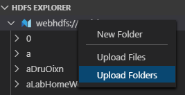

# 在OpenPAI上训练

> OpenPAI 作为开源平台，提供了完整的 AI 模型训练和资源管理能力，能轻松扩展，并支持各种规模的私有部署、云和混合环境。
> ## 适用场景
> 1. 在团队间共享强大的 AI 计算资源（例如，GPU、FPGA 集群）。
> 2. 在组织内共享或重用 AI 资产（如模型、数据、运行环境等) 。
> 3. 构建易于 IT 运维管理的 AI 计算平台。
> 4. 在同一个环境中完成模型训练过程。


## 前提准备
在开始之前，我们需要在自己的高性能服务器上[部署OpenPAI](https://github.com/microsoft/pai/blob/master/README_zh_CN.md#%E9%83%A8%E7%BD%B2)。
如果你的学校或公司已经部署了OpenPAI，那么你需要先注册一个OpenPAI账号。

## 安装OpenPAI的VS Code插件
为了方便我们提交任务到OpenPAI上，我们可以使用VS Code中的插件Open Platform for AI。

1. 按F1，输入“install extensions”，选择 `Extensions: Install Extensions` 。

    


2. 搜索“openpai”，选择 `OpenPAI VS Code Client` ，点击“Install”即可完成安装。

    


3. 安装完成后，左侧边栏可以看到OpenPAI的图标。
   
   

## 配置OpenPAI账号信息

1. 点击侧边栏 `PAI CLUSTER EXPLORER` 的“+”号。或者，按`F1`后，输入“Add Pai Cluster”，选择`PAI:Add Pai Cluster`。

    


2. 输入OpenPAI的服务器IP后回车，会自动生成一份配置文件，我们需要修改文件中的`username`和`password`字段为自己的账号密码，保存文件即可。

    

3. 此时，按“Ctrl+Shift+E”后，我们可以看到侧边栏 `PAI CLUSTER EXPLORER` 中会显示已经登录的服务器。

    

    点击侧边栏的OpenPAI的图标，我们可以在 `HDFS EXPLORER` 中看到已登录的服务器的资源，可以新建文件夹或上传文件。

    


至此，我们就成功完成了登录。


## 提交训练任务

OpenPAI的每一个任务是通过创建一个独立的Docker环境进行的，Docker的文件系统与服务器的文件系统是隔离的，所以在Docker中无法通过相对路径或绝对路径直接访问到我们需要训练的数据。因此，在提交任务之前，我们需要先将训练数据上传至服务器，以便提交任务后能够将数据下载到Docker环境中训练，训练完成后，我们也需要将数据导出至服务器，以便我们下载使用训练数据。具体流程可以参考下图。


### 上传数据

为了上传数据方便，我们将`usr_dir`和`data_dir`合并为一个文件夹，目录结构如下。

```
data \
    __init__.py
    merge_vocab.py
    train.txt.up.clean
    train.txt.down.clean
    merge.txt.vocab.clean
```
因此，在上传时仅需上传data文件夹即可。

但是，需要注意的是，在后续训练的目录定义中，需要将`t2t_usr_dir`和`data_dir`都指定为该data目录。


上传数据的方式有几种：

#### 1. OpenPAI中的HDFS

> **注意：** OpenPAI 部署了一个 HDFS 服务来保存日志和其它文件。 虽然此 HDFS 也可用来存储文件，但**不推荐**这样做。 因为 OpenPAI 集群的服务器可能会频繁增减，磁盘空间也有可能不够，因此无法保证存储的质量。

由于我们使用的管理员就是用户，因此使用 HDFS 来简化部署。

我们可以直接在`HDFS EXPLORER`中选择文件夹后右键，选择上传文件或文件夹。



我们只需要将预处理完后的data文件夹上传至相应的目录即可。在此，我们选择上传到`/demo/data`，当然，你也可以上传到其他目录，该目录在后续下载数据到Docker时会使用到。


#### 2. 其余方法（推荐）
除HDFS外，我们更推荐使用共享文件夹，直接内置文件到 Docker 映像中，或复制进出 Docker 容器。通用流程与HDFS一致，区别主要在于数据的上传和下载。

具体操作请参考：[主要方法](https://github.com/microsoft/pai/blob/master/docs/zh_CN/user/storage.md#%E4%B8%BB%E8%A6%81%E6%96%B9%E6%B3%95)。


### 新建文件
要提交训练任务，我们需要新建如下几个文件：
* [train.sh](../src/pai_config/train.sh)
* [run_samples.py](../src/pai_config/run_samples.py)
* [new_job.pai.json](../src/pai_config/new_job.pai.json)


以上文件（除`new_job.pai.json`外）会随任务的提交自动上传至服务器（需要配置`.vscode/settings.json`，后续会提到），同时也会自动下载到Docker环境中，因此我们可以在Docker中访问到它们，这里面包含了训练任务的脚本。

#### 1. `train.sh`

此为用于训练的脚本，包含了tensor2tensor的安装，以及执行训练的命令。

```
#!/bin/bash
HOME_DIR=$(cd `dirname $0`; pwd)
echo $HOME_DIR
cd $HOME_DIR
    
# install tensor2tensor
export LC_ALL=C
pip3 install tensor2tensor==1.14.1
pip3 install requests==2.21.0

# set environment
TRAIN_DIR=${HOME_DIR}/output
LOG_DIR=${TRAIN_DIR}
DATA_DIR=${HOME_DIR}/data
USR_DIR=${DATA_DIR}

PROBLEM=translate_up2down
MODEL=transformer
HPARAMS_SET=transformer_small

mkdir -p ${TRAIN_DIR}

# generate data
echo start generate data...

t2t-datagen \
--t2t_usr_dir=${USR_DIR} \
--data_dir=${DATA_DIR} \
--problem=${PROBLEM}

# train model
setting=default

echo start training...

t2t-trainer \
--t2t_usr_dir=${USR_DIR} \
--data_dir=${DATA_DIR} \
--problem=${PROBLEM} \
--model=${MODEL} \
--hparams_set=${HPARAMS_SET} \
--output_dir=${TRAIN_DIR} \
--keep_checkpoint_max=1000 \
--worker_gpu=1 \
--train_steps=200000 \
--save_checkpoints_secs=1800 \
--schedule=train \
--worker_gpu_memory_fraction=0.95 \
--hparams="batch_size=1024" 2>&1 | tee -a ${LOG_DIR}/train_${setting}.log

```

#### 2. `run_samples.py` 

   此为用于执行任务的运行脚本，包含了下载数据至Docker，调用`train.sh`脚本开始训练，以及完成训练以后的数据上传。这是我们训练任务程序运行的入口，在OpenPAI开始任务后，我们会首先调用此脚本，具体调用方法在`new_job.pai.json`中介绍。
   
   注意这里需要替换以下几个变量：
1. `hdfs_url` ： 替换为openPAI中的pai-master结点
2. `hdfs_user_name` ：替换为你的用户名
3. `root_dir` ：替换为存放数据的根目录，用于下载训练数据至Docker。在此，由于我们将数据上传至了`/demo/data`，因此将`root_dir`替换为`/demo`。项目训练完成后会将结果上传至`/demo/output`。

```
import os
import sys
import hdfs
import subprocess

hdfs_url = "YOUR_HDFS_URL" 
hdfs_user_name = "YOUR_HDFS_USERNAME"
root_dir = "YOUR_PROJECT_ROOT_DIR"

class HDFSHelper(object):

    def __init__(self, hdfs_url, hdfs_user_name, hdfs_root):
        self.__client = hdfs.InsecureClient(hdfs_url, root=hdfs_root, user=hdfs_user_name)
        self.__client.set_permission(hdfs_root,777)

    def Download(self, hdfs_path, local_path):
        print("Downloading from {} to {}".format(hdfs_path, local_path))
        os.makedirs(local_path, exist_ok=True)
        self.__client.download(hdfs_path, local_path)

    def Upload(self, local_path, hdfs_path):
        print("Uploading from {} to {}".format(local_path, hdfs_path))
        self.__client.makedirs(hdfs_path)
        self.__client.upload(hdfs_path, local_path, overwrite=True)

hdfsHelper = HDFSHelper(hdfs_url, hdfs_user_name, root_dir)

# Downloading data
hdfsHelper.Download(os.path.join(root_dir, "data"), ".")

# Call train.sh
subprocess.call("./train.sh", shell=True)

# Uploading data
jobName = os.environ['PAI_JOB_NAME']
output_dir = os.path.join(root_dir, "output", jobName)
hdfsHelper.Upload("./output/", output_dir)
```


#### 3. `new_job.pai.json`
此为用于提交训练任务的配置文件，其中`taskRoles`字段下的`command`为openPAI创建完Docker环境后开始执行的命令，`image`字段用于指定docker hub中的Docker镜像。

```
{
    "jobName": "train_couplet_demo",
    "image": "vzich/poet:tensorflow",
    "codeDir": "$PAI_DEFAULT_FS_URI/$PAI_USER_NAME/$PAI_JOB_NAME",
    "taskRoles": [
        {
            "name": "demo_001",
            "taskNumber": 1,
            "cpuNumber": 2,
            "gpuNumber": 1,
            "memoryMB": 8192,
            "command": "pip3 --quiet install future && cd $PAI_JOB_NAME && ls -al && chmod +x train.sh && python3 run_samples.py"
        }
    ]
}
```

我们在此文件中配置`command`为
```
pip3 --quiet install future && cd $PAI_JOB_NAME && ls -al && chmod +x train.sh && python3 run_samples.py
```
这就实现了在任务一开始便运行`run_samples.py`。


### 提交任务
1. 在提交任务之前，我们需要修改`.vscode/settings.json`为：

    ```
    {
        "pai.job.upload.enabled": true,
        "pai.job.upload.exclude": [],
        "pai.job.upload.include": [
            "**/*.py",
            "**/*.sh"
        ],
        "pai.job.generateJobName.enabled": true
    }
    ```
    完成以后，提交任务会自动将当前目录中的.py文件和.sh文件一起上传。

2. 右键`new_job.pai.json`，选择`Submit Job to PAI Cluster`。

    

    此时，就完成了任务的提交。

成功提交任务后，VS Code会将上一步新建的若干.py和.sh文件同时上传至此次任务的目录，在Docker创建完后会自动执行`new_job.pai.json`文件中`taskRoles`下的`command`字段内容。


### 下载数据

在任务运行完成后，Docker会自动销毁，对此我们在`run_sample.py`中实现了让Docker训练完成后自动将结果上传至服务器相应的目录。因此，我们只需要在`HDFS EXPLORER`的相应目录中找到我们训练的结果即可。在示例中，我们可以在`/demo/output`中找到训练结果。

找到对应的结果，右键可以选择下载到本地。


至此，我们便完成了OpenPAI的任务提交、训练以及获取训练结果啦。