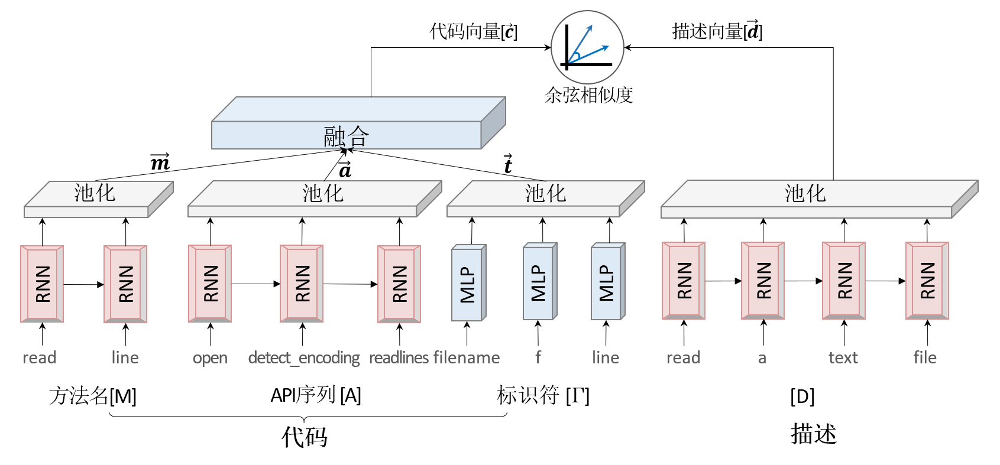

<!--Copyright © Microsoft Corporation. All rights reserved.
  适用于[License](https://github.com/Microsoft/ai-edu/blob/master/LICENSE.md)版权许可-->

# 基于深度学习的代码搜索案例

1. [背景](#背景)
2. [开发环境](#开发环境)
3. [准备数据](#准备数据)
4. [模型介绍](#模型介绍)
5. [数据预处理](#数据预处理)
6. [训练模型](#训练模型)
7. [模型的应用](#模型的应用)
8. [课后练习](#课后练习)

<a name="背景"></a>

## 1. 背景

近年来，人工智能逐渐进入各个领域并展现出了强大的能力。在计算机视觉领域，以ImageNet为例，计算机的图像分类水平已经超过了人类。在自然语言处理(NLP)领域，BERT、XLNet以及MASS也一遍遍的刷新着任务榜单。当人工智能进入游戏领域，也取得了惊人的成绩，在Atari系列游戏中，计算机很容易超过了大部分人类，在围棋比赛中，Alpha Go和Alpha Zero也已经超越了人类顶尖棋手。

随着近年来人工智能的自然语言处理（Natural Language Processing, NLP）技术在拼写检查、机器翻译、语义分析和问答方面的快速发展及广泛应用，人们期望可以从大型代码库（如GitHub）中发现类似于自然语言的模式，并利用相关技术来辅助程序员高效地编写无错代码。程序代码是一系列的语法记号，虽然看起来很像人类自然语言编写的文本，但是和人类文本有一些显著区别。比如程序代码是可执行的，在语义上常常很脆弱，很小的改动就能彻底改变代码的含义，而自然语言中如果出现个别错误可能也不会影响人们的理解。这些差异给我们直接应用现有的NLP技术带来了挑战，因此需要一些新的方法来处理程序代码。

人工智能在程序语言（Programming Language，PL）/软件工程（Software Engineering ，SE)领域可以有很多现实的应用，如语义搜索、代码补全（完形填空）、自动生成单元测试、代码翻译、代码缺陷检测、代码转文本、自然语言生成代码等。这里面有的方向是很有难度的，如自然语言自动产生代码，需要理解自然语言并按要求产生可用的代码，但是我们可以尝试先从简单的任务开始做些挑战。

我们选择“代码搜索（Code Search）”作为案例：接收用户的自然语言查询语句，在预定义代码集中找到符合用户需求的代码片段返回给用户。这个任务非常有意义。

当程序员遇到不熟悉的编程语言或问题时，通常会在网上查询相关的代码作为参考。

传统的代码搜索，比如GitHub，通常是以关键字进行匹配的，也就是说用户需要知道代码中用到了哪些API，或者明确的知道代码中写了哪些注释，才有可能搜索到理想的结果。

但是实际情况很可能是程序员知道要做一件什么事，但是不知道用哪些API，不知道怎么实现，这时，我们通常会使用通用搜索引擎(Google/Bing/百度等)，它们是通过代码及其配对的说明（如网页中的介绍、注释中的文本、某些函数名或者库的名称）与搜索语句之间文本的匹配程度进行的。这样搜索到的结果比较局限，只能通过文本上的匹配来确定是否是相同的含义。另外，这些引擎返回的是一系列的网页，需要用户依次打开进行二次挖掘。

StackOverflow是专业性的网站，表现的比通用搜索引擎好一些，虽然可以使用自然语言进行查询，但问题的相关解答中可能并不包含程序员所需的代码信息，需要用户自已进行二次深挖。

我们期望的Code Search是一种新的代码搜索方式，首先获取自然语言的语义，与所有已经搜集到的代码的语义进行比较，找到语义上最接近的结果，这样就可以极大地提高程序员的生产效率。

<a name="开发环境"></a>


## 2. 开发环境

本案例可以在`Windows`或`Ubuntu`平台上运行，需要安装`Python` 3.6或以上的环境。

需要安装的依赖包在`requirements.txt`中，可以通过执行以下命令来安装

``` shell
pip install -r src/requirements.txt
```

有的机器可能会提示`torch`安装失败，可以尝试下面的命令来安装

``` shell
pip install torch===1.2.0 -f https://download.pytorch.org/whl/torch_stable.html
```

或者前往[PyTorch官网](https://pytorch.org/get-started/locally)，根据自己的环境定制合适的安装命令。

数据处理时用到了`spacy`库里的`en_core_web_lg`数据集，需要单独下载，可执行以下命令

``` shell
python -m spacy download en_core_web_lg
```

部分安装包比较大，如果网速较慢，需要耐心等待。

训练时可以使用CPU来训练，但是速度太慢。

有条件的话尽量使用GPU来训练，也可以考虑付费使用[Azure N系列 虚拟机](https://azure.microsoft.com/zh-cn/pricing/details/virtual-machines/series/)，有多种规格GPU可以选择。在校学生还可以申请Azure学生账号，可按照[如何申请Azure的学生账号](https://github.com/microsoft/ai-edu/tree/master/D-%E7%AD%94%E7%96%91%E4%B8%8E%E4%BA%A4%E6%B5%81#Azure-Student-Account)来操作。

<a name="准备数据"></a>


## 3. 准备数据

我们尝试在网上寻找现成的数据集，但是并没有找到合适的；同时，GitHub是世界上最大的开源社区，拥有庞大的源代码数据，因此我们决定自己写爬虫爬取GitHub上的源代码来准备训练数据。

`Python`是目前最火的语言，本案例也以`Python`语言的代码搜索为例进行介绍和实战。

### 3.1 确定要爬取的代码仓库

GitHub上的代码是按仓库进行存放的，而且代码的好坏可以由仓库的star数量直观的反映出来，所以我们考虑对
star数比较高的GitHub仓库列表爬取。

GitHub上可以按照代码star数对搜索结果进行排序，排序后爬取的结果最多只有1000个仓库（如果直接从网页上获取，是每页10个，一共100页；如果直接调用api，不论设置每页多少条总共只会返回前1000个）。

对GitHub高星仓库列表的爬取，可以有2种方法：

**1. 爬GitHub仓库搜索页**

直接用`requests`或者`selenium`发送请求的方式进行爬取GitHub搜索结果页面，GitHub搜索仓库的结果页面是：

[https://github.com/search?l=Python&o=desc&p=1&q=python+license%3Amit&s=stars&type=Repositories](https://github.com/search?l=Python&o=desc&p=1&q=python+license%3Amit&s=stars&type=Repositories)

* `l`表示要查询的代码的语言，如`Python`或`JavaScript`等
* `p`指定显示第多少页的结果，默认情况下每页10条数据，最多可以显示100页的数据
* `q`表示要查询的内容，实际操作中发现，查询的内容直接填语言的名字时，如`python`或`javascript`等，搜索结果比较好；后面的`+license%3Amit`转码后是`license:mit`，意思是只看MIT开源协议的仓库
* `s`表示如何排序，`stars`表示按加星数从高向低排序
* `type`指定要搜索的类型，这里用`Repositories`表示搜索的类型是仓库

发送请求后返回的数据为html页面的内容，需要对页面进行分析，按照需要提取出仓库列表。同时，由于GitHub的反爬虫机制比较严格，我们在爬取时还要采取一些反反爬虫的策略，如随机间隔一段时间后重新爬取。

我们已准备好该部分的代码，可以在终端窗口中运行如下命令：

``` shell
python src/1PrepareData/getRepoList.py
```

运行结束后，该脚本会将收集到的仓库列表放在`data/py/repoList`目录下的`json`文件中，下一步我们会编写别的脚本将这些代码下载下来。

**2. 使用[GitHub官方API](https://developer.github.com/v3/)**

查找代码仓库的API示例：

[https://api.github.com/search/repositories?q=python+license%3Amit&language=python&sort=stars&page=1](https://api.github.com/search/repositories?q=python+license%3Amit&language=python&sort=stars&page=1)

* `q`表示要查询的内容，实际操作中发现，查询的内容直接填语言的名字时，如`python`或`javascript`等，搜索结果比较好；后面的`+license%3Amit`转码后是`license:mit`，意思是只看MIT开源协议的仓库
* `language`表示要查询的代码的语言，如`python`或`javascript`等
* `sort`表示如何排序，`stars`表示按加星数从高向低排序
* `page`指定显示第多少页的结果，默认情况下每页30条数据，最多可以显示34页的数据

该API返回的结果是格式化好的JSON结构，很好处理，这里不额外提供代码的，感兴趣的同学可以自己动手试一下。

另外，除了直接在GitHub上搜索高星项目外，还可以通过对应语言的包管理器来查找质量比较好的仓库，如`Python`的`pip`、`JavaScript`的`npm`等，感兴趣的同学可以自己收集。

### 3.2 拉取仓库到本地

在收集到我们想要的GitHub仓库列表后，对数据进行下载和初步筛选是很重要的一步。

使用git工具进行clone或pull在目前没有发现有特别严厉的反爬虫策略，所以直接对列表中仓库采取下列步骤：

1. 将数据clone下来，这一步中可以设置`--depth=1`参数来指定不拉取历史记录，这样可以减小下载量
2. 使用`sparse-checkout`文件来配置需要保留哪些文件在本地，对`Python`来说，可以配置保留`py`文件，对`JavaScript`来说，可以配置保留`js`文件和`package.json`
3. 获取仓库的commitid信息，并且将仓库中剩余的文件移动到以commitid为目录的路径下，保留commitid可以让我们更好的追溯到代码的来源，即使该代码片段在以后的提交中被删除了，也可以通过当前的commitid定位到
4. 删除.git目录

此部分的代码也已经准备好，可以在终端窗口中运行如下命令

```shell
python src/1PrepareData/getDataWithFullGitPath.py
```

运行结束后，该脚本会将下载的代码存放在`data/py/repos`目录下，每个仓库的相关代码被放置在`用户名/仓库名/commitid`的子目录中。

另外，我们也提供了一份爬取好的[数据集](https://aka.ms/CodeSearchGithubPyDataset)，同学们也可以直接下载使用。

PS：数据集越大，训练时间越长，如果没有GPU资源，可以适当删减一些代码仓库，减小数据集的大小以加速训练，当然这样也会影响到模型预测的精度。


<a name="模型介绍"></a>


## 4. 模型介绍

### 4.1 选择模型

在开始训练之前，我们找了一些前人的解决方案，依次复现并进行了比较。以下我们试过的几种模型：

* [How To Create Natural Language Semantic Search For Arbitrary Objects With Deep Learning](https://towardsdatascience.com/semantic-code-search-3cd6d244a39c)
  * https://github.com/hamelsmu/code_search
* [Deep API Learning](https://guxd.github.io/papers/deepapi.pdf)
  * https://github.com/guxd/deepAPI
* [Deep Code Search](https://guxd.github.io/papers/deepcs.pdf)
  * https://github.com/guxd/deep-code-search
* [code2vec: Learning Distributed Representations of Code](https://arxiv.org/pdf/1803.09473.pdf)
  * https://code2vec.org/

经过复现和比较，我们认为`Deep Code Search`论文中(DCS论文)提到的`CODEnn(Code-Description Embedding Neural Network)`模型表现的较好。

以下我们将以`CODEnn`模型为例，介绍一下模型的原理、如何对数据进行预处理、如何构建并训练模型。

### 4.2 原理介绍

我们的目的是要通过自然语言的查询语句来搜索对应的代码，但是自然语言和程序代码是异构的两种数据，直观上找不到任何相似性，无法进行有效的搜索。如果我们可以将这两种异构的数据嵌入(映射)到同一个向量空间,如下图所示(修改自DCS论文):


这样带有相同或相似语义的自然语言查询语句和对应的代码就会离的很近，而不相关的自然语言查询语句和代码则会离得很远。我们只要在该空间内找到距离最近的代码就可以了。

所以Code Search的整体系统架构可以由下图(修改自DCS论文)来表示：


圆圈代表事先训练好的模型，这个模型可以把程序代码和自然语言嵌入到同一个向量空间。虚线框内是线下的处理过程，事先将所有的代码片段输入到模型中，分别算出它们的向量，并记录下来。当在线查询时，将自然语言的查询语句输入到模型中，模型可以返回对应的查询语句向量，然后与事先计算好的大量代码向量进行比较，找出相似度最高的几个向量，将这几个向量对应的原始代码片段做为查询的结果返回即可。

### 4.3 模型介绍

基于上面的思路，最核心的部分就是上图圆圈中的模型部分，它可以把程序代码和自然语言嵌入到同一个向量空间。

`Deep Code Search`论文中提出的模型叫做`CODEnn(Code-Description Embedding Neural Network)`，可以由下图(修改自DCS论文)来表示：


该模型分为三个部分：
* 代码嵌入网络(CoNN)，这个网络可以将代码转换为向量表示。代码不仅是单纯的文本，里面还包括了API、控制流等其它信息。在CoNN中我们抽取了代码的方法名、API序列、标识符来计算代码对应的向量。
* 描述嵌入网络(DeNN)，这个网络可以将描述转换为向量表示。
* 相似度比较模块，这个部分用来计算两个向量之间的相似度，这里用的是余弦相似度

具体模型的细节可以参考下图(修改自DCS论文)：



其中方法名、API序列、描述，都是以序列的形式存在的，我们使用循环神经网络(RNN)对其作处理。对于标识符，我们抽取的是代码片段中的单词，并做去重处理，不关心其顺序关系，所以只使用MLP即可。

另外，上图中RNN部分、池化部分以及激活函数都是有多种选择的。比如RNN部分，可以选取普通RNN或LSTM或GRU，并且这几种模型都支持单向和双向；池化部分可以选择最大池化、均值池化、求和池化；激活函数可以选择ReLU、tanh等。

> 想深入了解[RNN](https://aka.ms/aieRNN)、[池化](https://aka.ms/aiePooling)、[激活函数](https://aka.ms/aieActivation)相关知识的小伙伴可移步[神经网络基本原理简明教程](https://aka.ms/beginnerAI)

我们尝试对以上不同方法的不同组合进行比较，由于大数据集上的调参需要较大的时间和资源，我们假设在小数据集上表现较好的模型在大数据集上也会表现得很好。所以我们选用了GitHub上的`Numpy`仓库的代码来做实验，比较各种参数的选择。

下图是各个调参后训练的结果，这里有两条蓝线，起初在下方后来在上方的是单向RNN，另一条是双向RNN。improved曲线是指使用了均值池化、GRU和ReLU激活函数的训练，横坐标是epoch。


从上图可以看出，使用均值池化、GRU、ReLU激活函数都能对模型有所帮助，而单向/双向的影响比较小。所在在这个案例中，我们将使用均值池化、双向GRU、ReLU激活函数来训练CODEnn。

同时，我们还对字典大小、epoch数量进行了试验，最终选取的的字典大小为10000，epoch大小为800。

<a name="数据预处理"></a>


## 5. 数据预处理

确定了模型以后，我们需要将数据集处理成模型需要的格式，主要分为以下几步：

### 5.1 抽取方法名、API序列、标识符、描述等信息

这一步主要借助`astor`包来处理`Python`代码，它可将代码解析为抽象语法树，这样程序可以直接访问结构化的数据，很方便的取到代码中的函数、描述、方法名等信息。然后将抽取到的每个函数的信息写入到`CSV`文件中，每行代表一个函数。每行都有函数所在的本地文件路径、GitHub链接、函数开始所在行号、方法名、API序列、标识符、描述等信息。

具体代码在`src/2PreProcessData/codenn-step0-extract_py.py`中，对应的执行命令为

``` shell
python src/2PreProcessData/codenn-step0-extract_py.py data/py/repos data/py/extract
```

其中`data/py/repos`是前面数据准备时下载的GitHub上的源代码，`data/py/extract`目录用来存放抽取过的函数信息，存放在`data.csv`文件中。

### 5.2 数据清洗

这一步我们进一步处理上一步得到的数据并做清洗。

首先，对于方法名，如果方法名过短(少于3个字母)，我们认为这是无意义的数据，舍弃；有些函数，比如初始化函数`__init__`一类的，也舍弃掉；另外，我们还需要对方法名按驼峰命名或`_`进行分割，得到一个类似于句子的序列，比如，将`readFile`和`read_file`处理为`read file`。

然后，如果一个描述为多行文本，我们只取第一行作为描述。如果一个代码段没有对应的描述，那么它不能参与训练，但可以放在最后查询的代码库中。

最后需要对数据进行去重。小伙伴们可能深有体会，很多人在写代码的时候，经常会将别人的实现原封不动的搬过来的，所以需要对代码片段数据进行去重。

具体清洗的代码在`src/2PreProcessData/codenn-step1-clean.py`中，对应的执行命令为

``` shell
python src/2PreProcessData/codenn-step1-clean.py data/py/extract data/py/clean
```

其中`data/py/extract`是上一步抽取的数据，`data/py/clean`目录用来存放清洗过的数据，存放在`data.csv`文件中。

### 5.3 切分数据集

清洗过的数据可以作为最后查询的代码库来使用，但只有包含描述信息的数据可以用于训练模型。

用于训练的数据按8:1:1再次拆分为训练集、验证集和测试集。

具体的切分代码在`src/2PreProcessData/codenn-step2-split.py`中，对应的执行命令为

``` shell
python src/2PreProcessData/codenn-step2-split.py data/py/clean data/py/split
```

其中`data/py/clean`是上一步清洗过的数据，`data/py/split`目录用来存放拆分后的数据，`total.csv`中存放的是所有数据，可以用于最后的查询，`withdoc.csv`中是有描述信息的数据，该数据按8:1:1拆分后存放在`train.csv`、`valid.csv`、`test.csv`中用于训练模型。


### 5.4 导出为模型需要的格式

这一步按照模型的要求将上面切分好的数据导出为`HDF5`格式的数据文件。

具体的代码在`src/2PreProcessData/codenn-step3-convert.py`中，对应的执行命令为

``` shell
python src/2PreProcessData/codenn-step3-convert.py data/py/split data/py/final
```

其中`data/py/split`是上一步切分过的数据，`data/py/final`目录用来存放训练模型时需要的输入文件，`code2word*`和`word2code*`文件中存放的是几种序列数据的字典，用来将序列中的元素进行编码和解码，`user.codemap.csv`中包含所有的函数代码信息，可用于最后的查询，其它文件中存放的是转换格式后的数据集。

另外，我们也提供了一份预处理好的[数据集](https://aka.ms/CodeSearchGithubPyDatasetForCodenn)，同学们也可以直接下载使用。

至此，模型需要的数据预处理就完成了。


<a name="训练模型"></a>

## 6. 训练模型

以下使用`PyTorch`来定义和训练模型，由于篇幅原因，这里省略了很多代码，只贴出了部分关键代码，可执行的完整代码可参照`src/3Model/joint_embedder.py`。

### 6.1 定义模型

从前面模型细节图中可以看到，我们对方法名、API序列、描述都使用了同样的编码器，我们可以针对序列数据统一定义一个编码器：

``` Python
class SeqEncoder(nn.Module):
  def __init__(self, vocab_size, embed_size, hidden_size, rnn='lstm',
               bidirectional=True, pool='max', activation='tanh'):
    self.embedding = nn.Embedding(vocab_size, embed_size, padding_idx=0)
    self.rnn = rnn_choices[rnn](embed_size, hidden_size, bidirectional)
    self.pool = pool_choices[pool]
    self.activation = activations_choices[activation]

  def forward(self, input):
    embedded = F.dropout(self.embedding(input), 0.25, self.training)
    rnn_output = F.dropout(self.rnn(embedded)[0], 0.25, self.training)
    return self.activation(self.pool(rnn_output, dim=1))
```

同样的，针对标识符使用的MLP，我们也定义一个编码器：

``` Python
class BOWEncoder(nn.Module):
  def __init__(self, vocab_size, embed_size, pool='max', activation='tanh'):
    self.embedding = nn.Embedding(vocab_size, embed_size)
    self.pool = pool_choices[pool]
    self.activation = activations_choices[activation]

  def forward(self, input):
    embedded = F.dropout(self.embedding(input), 0.25, self.training)
    return self.activation(self.pool(embedded, dim=1))
```

这样，我们的代码编码网络`CoNN`可以定义为：

``` Python
def forward_code(self, name, apis, tokens):
  name_repr = SeqEncoder(name)
  apis_repr = SeqEncoder(apis)
  tokens_repr = BOWEncoder(tokens)
  code_repr = nn.Linear(torch.cat((name_repr, apis_repr, tokens_repr), 1))
  return torch.tanh(code_repr)
```

描述编码网络`DeNN`可以定义为：

``` Python
def forward_desc(self, desc):
  return SeqEncoder(desc)
```


### 6.2 训练模型

真实训练时，我们给每个代码段两个描述，一个是原始描述，即正确的描述，另一个是随机描述，即错误描述，然后选取下面的值作为loss:

``` Python
def forward(self, name, apis, tokens, desc_good, desc_bad):
  code_repr = forward_code(name, apis, tokens)
  good_sim = F.cosine_similarity(code_repr, forward_desc(desc_good))
  bad_sim = F.cosine_similarity(code_repr, forward_desc(desc_bad))
  return (margin - good_sim + bad_sim).clamp(min=1e-6)
```

具体的代码在`src/3Model/codenn.py`中，对应的训练命令为

``` shell
python src/3Model/codenn.py --dataset_path data/py/final --model_path data/py/model --batch_size 512 --epoch 800 --gpu
```

其中，`--dataset_path`和`--model_path`是必选参数，分别表示训练时输入文件所在的目录和训练后的模型保存的目录。另外还有一些可选参数，如：

* `--batch_size`，指定训练时的batch size，默认32，这里指定为512
* `--epoch`，指定训练多少个epochs，默认200，这里指定为800
* `--gpu`，指定在GPU上运行，后面还可以跟上逗号分隔GPU的ID，如`--gpu 0,2`，来指定在第0块和第2块GPU上训练
* `--load`，如果训练中途停止，可以使用该参数加载已保存过的模型继续训练
* `--save_every_epoch`，指定多少个epochs后保存一次模型
* 更多参数可以执行`python src/3Model/codenn.py --help`来查看

模型的训练过程中，可以在控制台或命令行窗口看到类似如下的输出结果


另外，训练过程中使用了`tensorboardX`库记录一些关键信息，可以借助`tensorboard`可视化这些信息，来直观的分析训练数据。运行以下命令

``` shell
python -m tensorboard.main --logdir runs
```

成功运行后，可以看到命令行窗口中显示出了`tensorboard`服务运行在哪个端口，默认是在6006端口。使用浏览器打开`http://localhost:6006`即可看到训练数据。

其中，loss的变化如下图所示：


另外，DCS论文中还定义了4种评价指标Precision@K、MAP、MRR和NDCG来评估模型。关于这几种指标，感兴趣的同学可以详细阅读下论文，或者参看这个Slides：[Information Retrieval - web.stanford.edu](https://web.stanford.edu/class/cs276/handouts/EvaluationNew-handout-6-per.pdf)。这些指标都是越高越好。


模型训练完成后可以在`--model_path`目录下找到扩展名为`pth`的文件，我们的模型就保存在其中。

<a name="模型的应用"></a>


## 7. 模型的应用

回顾一下前面提到的代码搜索的整体系统架构图(修改自DCS论文)：


### 7.1 计算所有代码片段的向量

除了训练好模型外，我们还要将所有的代码片段提前算好代码向量，这样可在在查询的时候直接进行比较。

主要的代码就是对所有的代码片段执行前面定义的`forward_code`方法，即`CoNN`模型。

具体的实现在`src/3Model/codenn.py`中，对应的执行命令为

``` shell
python src/3Model/codenn.py --dataset_path data/py/final --model_path data/py/model --task repr --load 800 --batch_size 512 --gpu
```

其中，`--dataset_path`和`--model_path`与训练时一样，是必选参数。

另外，`--load`参数的值指定为`800`，表示加载前面第800个epoch保存出来的模型；`--task`参数的值需要指定为`repr`，表示计算所有代码片段对应的向量。

最终计算好的向量会保存在`--model_path`下的`use.codes.pkl`文件中。


### 7.2 查询距离最近的代码

用户输入查询语句后，对用户的查询语句执行前面定义的`forward_desc`方法，即`DeNN`模型，得到查询语句的向量。然后计算查询语句和所有向量之间距离并排序，最终得到最近的几个代码向量，从而即可得到最近的几个代码片段。

我们封装了一个可交互进行查询的工具，具体的实现在`src/3Model/codenn.py`中，对应的执行命令为

``` shell
python src/3Model/codenn.py --dataset_path data/py/final --model_path data/py/model --task search --load 800
```

其中，`--dataset_path`和`--model_path`与训练时一样，是必选参数。

另外，`--load`参数的值指定为`800`，表示加载前面第800个epoch保存出来的模型；`--task`参数的值需要指定为`search`，表示启动查询代码的交互式命令行。还可以用`--search_top_n`参数来指定返回最近的几个参数。

最终的执行效果如下图所示：


### 7.3 提供web服务

除了在本地提供服务外，代码搜索更适合封装为web服务。

这里使用了`tornado`库封装并提供web服务，具体的代码就不放在这里了，感兴趣的同学可以参考`src/3Model/codenn.py`文件。也可以直接运行以下命令启动服务：

``` shell
python src/3Model/codenn.py --dataset_path data/py/final --model_path data/py/model --task serve --load 800
```

其中，`--dataset_path`和`--model_path`与训练时一样，是必选参数。

另外，`--load`参数的值指定为`800`，表示加载前面第800个epoch保存出来的模型；`--task`参数的值需要指定为`serve`，表示作为web服务来启动。

最终程序会在`8080`端口提供服务，也可以使用`--port`来指定端口。

启动成功后，API所在路径为`search`，可以在浏览器中打开`http://localhost:8080/search?q=open+file+and+write+something&n=2`来进行测试。

其中，`q`后面是自然语言表示的查询语句，这里用的示例是`open file and write something`，注意要进行Url编码，`n`后面是一个整数，用来表示需要几条查询结果。

查询结果是`JSON`格式的，其中`results`字段是一个数组，数组里面的每一个元素是一条结果，每条结果中都有`code`和`url`两个属性，分别是对应的源代码片段和GitHub上代码的链接。

<a name="课后练习"></a>


## 8. 课后练习

1. `VSCode`是广大程序员首选的IDE之一，而且`VSCode`提供丰富的接口，可以在上面开发各种插件。[Extension API](https://code.visualstudio.com/api)介绍了`VSCode`提供了哪些接口、可以实现哪些功能，并且提供了一些插件的开发示例。同学们可以尝试在`VSCode`中集成我们前面完成的代码搜索服务，方便大家更好的使用。

2. 随着NLP技术的发展，各种新的模型、改进模型不断的被提出，可以尝试将上面中的部分模型换成新的模型，看下效果如何。

3. 除了用API序列来表示代码外，请思考还可以抽取出哪些信息来表示代码的语义。

