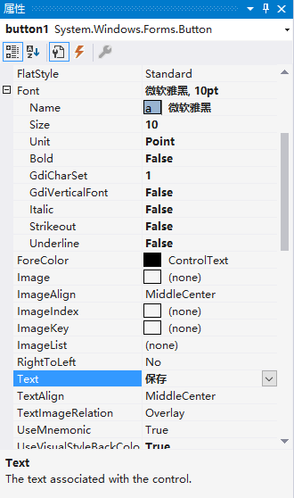

# 使用场景
随着NLP（自然语言处理）技术的发展，NLP的应用场景正在逐渐扩大，这大大地方便了我们的生活。其中，TTS（Text To Speech）的应用在生活中极为广泛。例如，在过去，许多城市的公交及地铁报站的语音皆为人工录制，线路的临时变更等各种因素导致不得不多次重复录制语音内容，但是应用TTS技术之后，我们可以轻易地生成语音，而无需重新录制语音内容。再者，如今各类手机厂商、智能家居系统、车载系统等的语音助手也在广泛应用该技术，这让人机对话成为了可能。对于个人而言，TTS也极大地改善了我们的生活，如对视障人士十分友好的听书、语言学习者的词典发音等。
# 应用的技术

# 应用的构建

该案例利用了Azure的TTS-api服务构建了一个TTS桌面应用程序，实现了中文文本转语音，并能够保存语音文件。

构建分为以下几个步骤：
1. 申请TTS-api
2. 构建窗体界面
3. 调用api实现TTS


## 申请TTS-api

Azure提供了30天的免费使用版，如果需要注册免费试用，请转到[试用认知服务](https://azure.microsoft.com/zh-cn/try/cognitive-services/)。

1. 完成注册或登录Azure账户之后，请按照[在Azure中创建语音资源](https://docs.microsoft.com/zh-cn/azure/cognitive-services/speech-service/get-started#create-a-speech-resource-in-azure)的指引申请TTS-api。

2. 完成TTS-api的申请后，登录[Azure主页](https://ms.portal.azure.com/#home)，点击“最新资源”下的“TTS-api”。


3. 进入“TTS-api”后可以查看自己的**Key**和**终结点**，你需要记下它们，因为这将在后续的开发中使用。


## 构建窗体界面

1. 打开Visual Studio 2019，选择“创建新项目”。


   
选择语言为“C#”，选择“Windows窗体应用(.NET Framework)”。


修改项目名称为“TTS_Demo”，点击“创建”。


2. 点击左侧“工具箱”，选择“公共控件”，选择“Button”。


将“button”拖至右侧界面中适当位置，调整大小至合适尺寸。


右侧属性框可以设置按钮属性。将Text设置成“保存”，Font设置成“微软雅黑, 10pt”。



将Design中的Name设置成“saveButton”。


3. 按上述方法依次创建按钮“播放”、“生成”，并放置到适当的位置，将其属性框内Design中的Name分别设置成“playButton”、“transferButton”。


4. 在“工具箱”中选择“TextBox”，拖至右侧界面中适当位置。在属性框内的Behavior中的Multiline设置为“True”。在界面中调整TextBox大小至合适尺寸。


5. 在“工具箱”中选择“Label”，拖至界面适当位置，设置属性框中的Text属性为“文本转语音服务”，并设置适当字体。同理，新建“Label”并修改Text属性为“请在下方输入内容”，设置适当字体及颜色。


至此，窗体界面的搭建就完成了。

## 调用api实现TTS
注：如对api的使用有任何疑问可以查阅[文本转语音 REST API](https://docs.microsoft.com/zh-cn/azure/cognitive-services/speech-service/rest-text-to-speech)。


1. 选择右侧“解决方案资源管理器”中的“TTS_Demo”，右键选择“添加”->“新建项”。

    选择“类”，名称为“Authentication.cs”，点击“添加”。


2. 在 **Authentication.cs** 文件中，引用如下命名空间。

```
using System.Net.Http;
using System.IO;
```

    添加如下代码。

```
namespace TTS_Demo
{
    public class Authentication
    {
        private string subscriptionKey;
        private string tokenFetchUri;

        public Authentication(string tokenFetchUri, string subscriptionKey)
        {
            if (string.IsNullOrWhiteSpace(tokenFetchUri))
            {
                throw new ArgumentNullException(nameof(tokenFetchUri));
            }
            if (string.IsNullOrWhiteSpace(subscriptionKey))
            {
                throw new ArgumentNullException(nameof(subscriptionKey));
            }
            this.tokenFetchUri = tokenFetchUri;
            this.subscriptionKey = subscriptionKey;
        }

        public async Task<string> FetchTokenAsync()
        {
            using (var client = new HttpClient())
            {
                client.DefaultRequestHeaders.Add("Ocp-Apim-Subscription-Key", this.subscriptionKey);
                UriBuilder uriBuilder = new UriBuilder(this.tokenFetchUri);

                var result = await client.PostAsync(uriBuilder.Uri.AbsoluteUri, null).ConfigureAwait(false);
                return await result.Content.ReadAsStringAsync().ConfigureAwait(false);
            }
        }

    }
}
```

3. 同理，新建类文件 **TTSApi.cs**，并添加如下代码。

```
namespace TTS_Demo
{

        
    class TTSApi
    {
        //语言配置信息
        string locale = "zh-CN";
        string voiceName = "Microsoft Server Speech Text to Speech Voice (zh-CN, HuihuiRUS)";
      
        string accessToken;
        Authentication auth = new Authentication("https://westus.api.cognitive.microsoft.com/sts/v1.0/issuetoken", "REPLACE_WITH_YOUR_KEY");
        string host = "https://westus.tts.speech.microsoft.com/cognitiveservices/v1";


        //转换文本并保存
        public async Task textToSpeechAsync(string text, string savePath)
        {
            try
            {
                accessToken = await auth.FetchTokenAsync().ConfigureAwait(false);
            }
            catch (Exception ex)
            {
                Console.WriteLine(ex);
            }

            string body = "<speak version='1.0' xmlns='https://www.w3.org/2001/10/synthesis' xml:lang='"+locale+"'>"
              +"<voice name='"+voiceName+"'>" + text + "</voice></speak>";

            using (var client = new HttpClient())
            {
                using (var request = new HttpRequestMessage())
                {
                    // Set the HTTP method
                    request.Method = HttpMethod.Post;
                    // Construct the URI
                    request.RequestUri = new Uri(host);
                    // Set the content type header
                    request.Content = new StringContent(body, Encoding.UTF8, "application/ssml+xml");
                    // Set additional header, such as Authorization and User-Agent
                    request.Headers.Add("Authorization", "Bearer " + accessToken);
                    request.Headers.Add("Connection", "Keep-Alive");
                    // Update your resource name
                    request.Headers.Add("User-Agent", "YOUR_RESOURCE_NAME");
                    request.Headers.Add("X-Microsoft-OutputFormat", "riff-24khz-16bit-mono-pcm");
                    // Create a request
                    Console.WriteLine("Calling the TTS service. Please wait... \n");
                    using (var response = await client.SendAsync(request).ConfigureAwait(false))
                    {
                        response.EnsureSuccessStatusCode();
                        // Asynchronously read the response
                        using (var dataStream = await response.Content.ReadAsStreamAsync().ConfigureAwait(false))
                        {
                            using (var fileStream = new FileStream(savePath, FileMode.Create, FileAccess.Write, FileShare.Write))
                            {
                                await dataStream.CopyToAsync(fileStream).ConfigureAwait(false);
                                fileStream.Close();
                            }

                        }
                    }
                }
            }

        }
    }
}

```


    其中，需要特别注意以下代码片段：
```
        string locale = "zh-CN";
        string voiceName = "Microsoft Server Speech Text to Speech Voice (zh-CN, HuihuiRUS)";
      
        string accessToken;
        Authentication auth = new Authentication("https://westus.api.cognitive.microsoft.com/sts/v1.0/issuetoken", "REPLACE_WITH_YOUR_KEY"); //替换为你的终结点和Key
        string host = "https://westus.tts.speech.microsoft.com/cognitiveservices/v1";


```
* 上述`Authentication`的初始化中，需要替换你在TTS-api中分配的终结点和Key。

* 上述的`locale`和`voiceName`允许用户更改不同的语言及发音。具体可选值可以查阅[标准语音](https://docs.microsoft.com/zh-cn/azure/cognitive-services/speech-service/language-support#standard-voices)。

    以中文为例，我们这里选择了“zh-CN”的“HuiHuiRUS”。
因此我们根据查表内容，将`locale`和`voiceName`变量设置成对应值。其中，`voiceName`可以选择“完全服务名称映射”或“短语音名称”。


4. 在 **Form1.cs** 中，添加如下代码至`Form1`类。
```
    string tempFile = "temp.wav"; //临时文件存储路径
    TTSApi tts = new TTSApi(); 
```


5. 在 **Form1.cs[设计]** 界面中双击“生成”按钮，会自动生成函数`transferButton_Click`，该函数绑定了“生成”按钮的点击事件，当用户点击“生成”按钮时会自动调用该函数。

    完成此函数代码。
```
 private async void transferButton_Click(object sender, EventArgs e)
        {

            string text = textBox1.Text; //获取用户输入
            
            if (text.Length > 0)
            {

                await tts.textToSpeechAsync(text, tempFile);
                
            }

        }
```

6. 同理，双击“播放”按钮，完成`playButton_Click`函数代码。

```
       private void playButton_Click(object sender, EventArgs e)
        {
            SoundPlayer playSound = new SoundPlayer(tempFile);
            playSound.Play();
        }
```

7. 双击“保存”按钮，完成`saveButton_Click`函数代码。
   
```
 string filePath = "";
            //取前10个字符作为文件名
            string fileName = (textBox1.Text.Length < 10) ? textBox1.Text : textBox1.Text.Substring(0, 10);

            SaveFileDialog saveFile = new SaveFileDialog();
            saveFile.FileName = fileName;
            saveFile.Filter = "音频文件 (*.wav) | *.wav";
            saveFile.RestoreDirectory = true;//保存并显示上次打开的目录 

            //点了保存按钮进入 
            if (saveFile.ShowDialog() == DialogResult.OK)
            {
                filePath = saveFile.FileName.ToString(); //获得文件路径

                if (File.Exists(tempFile))
                {
                    File.Copy(tempFile, filePath, true);
                }
                else
                {
                    Console.WriteLine("音频文件不存在");
                }
            }
```

至此，我们就构建好了整个窗体应用。按`F5`即可运行程序。


在教程中，我们省略了部分细节，更多内容可以查看源代码。