<!--Copyright © Microsoft Corporation. All rights reserved.
  适用于[License](https://github.com/Microsoft/ai-edu/blob/master/LICENSE.md)版权许可-->

# 第21章 生成对抗网络

## 21.0 生成对抗网络简介

### 21.0.1 提出问题

前面讲到卷积神经网络的时候可以看出，神经网络很厉害，不仅可以对图片进行分类，还可以进行目标检测，找到图片中包含的物体。早在2015年时，ResNet就已经在ImageNet数据集上超过了人类（当然，模型的泛化能力仍远不及人类）。

那么既然神经网络这么厉害，它可不可以做些更复杂的任务呢，比如生成图片、修改图片等。答案是肯定的，有多种网络可以做到生成图片，其中做的最好就是**生成对抗网络**（英语：**G**enerative **A**dversarial **N**etwork，简称GAN）。

这章就给大家介绍生成对抗网络，先带大家看一下这个网络可以做些什么事情，然后给大家介绍下它的原理，最后动手实现并训练生成对抗网络。

### 21.0.2 历史和发展

生成对抗网络最早是由Ian J. Goodfellow等人在2014年提出的。在这之后，有关生成对抗网络的研究以及相关变种如雨后春笋般的出现。Avinash Hindupur在GitHub上开源了the-gan-zoo[\[1\]](#the-gan-zoo)项目，用来收集生成对抗网络相关的论文。图21-1展示了截止到2018年9月份，每月公开发表的与生成对抗网络相关的论文累计数量。


图21-1 每月发表的与生成对抗网络相关的论文累计数量

从图21-1中可以看出，生成对抗网络相关的研究及变种几乎呈现出指数增长的趋势。截止到2018年9月份，生成对抗网络相关的变种已达到了500多种。

卷积神经网络之父杨立昆（Yann LeCun）曾高度评价过生成对抗网络。在美版知乎Quora上有网友提问：深度学习最近有哪些突破性的进展？杨立昆亲自作答，他提到“在我看来，最重要的一个是对抗训练，也就是生成对抗网络，它和它的变种现在被认为是机器学习最近十年来最有趣的想法”。[\[2\]](#quora)图21-2是杨立昆在美版知乎Quora上的回答。


图21-2 杨立昆在美版知乎Quora上的回答

### 21.0.3 变种和应用

生成对抗网络之所以这么火，离不开该网络及其变种的强大能力。下面就通过该网络相关的论文来看一下，生成对抗网络有多么的酷炫。

首先是生成对抗网络的开篇论文，2014年Ian J. Goodfellow在他提出生成对抗网络的论文[\[3\]](#gan)中展示了该网络生成图片的能力，如图21-3所示。


图21-3 生成对抗网络生成的图片

图21-3中，左侧五列是模型生成的图片，最右侧一列是在原始数据集中找出的和第五列最接近的图片，可以看到这些图片确实是新生成的，并不包含在原始数据集中。

上面的生成的图片看起来有那么一点意思，但是生成的内容却是不可控的。 Mehdi Mirza等人提出GAN一个变种CGAN（Conditional Generative Adversarial Nets）[\[4\]](#cgan)，可以指定一些条件来控制生成的结果，比如在MNIST数据集中可以生成指定的数字。如图21-4所示，每行都是一个指定的数字（0-9）。

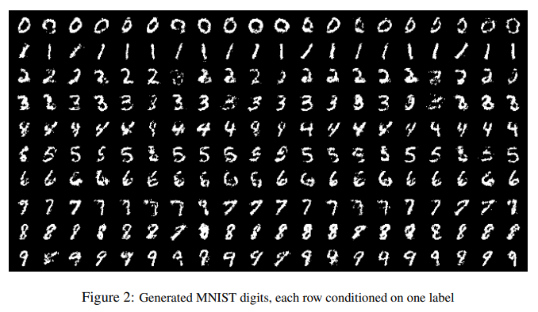

图21-4 CGAN的结果

Xi Chen等人也提出了一种变种，叫做InfoGAN[\[5\]](#infogan)，它使用无监督的方法来学习特征，也可以产生不同属性的数据，该网络的效果如图21-5所示。

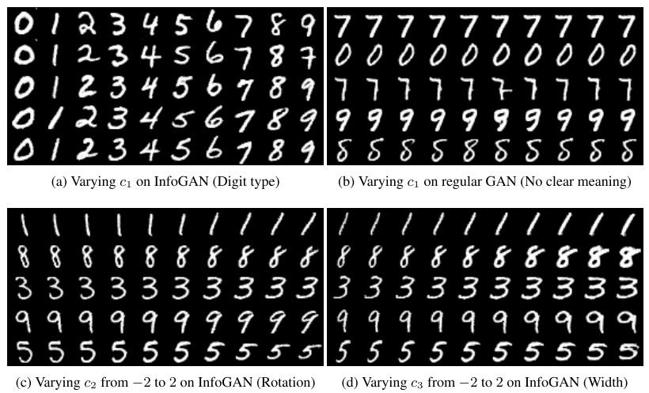

图21-5 InfoGAN的结果

在图21-5中，(a)显示变量c1可以控制数字的类型（0-9），(c)显示变量c2可以控制数字的倾斜度，(d)显示变量c3可以控制笔划的粗细。

Scott Reed等人还做了更复杂的试验[\[6\]](#gancls)，将文本和图像联系起来，可以跟据文本句子的描述生成对应的图像，如图21-6所示。

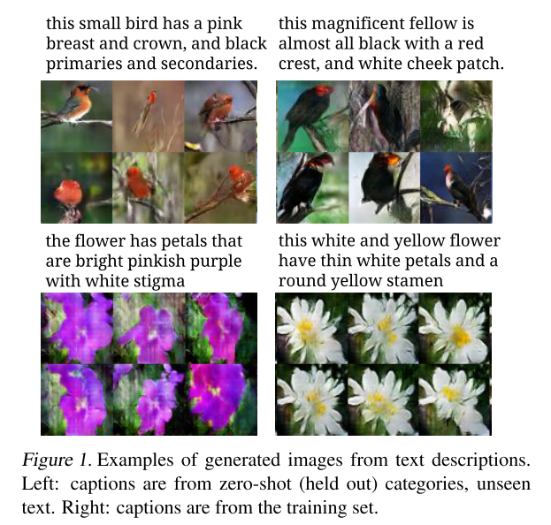

图21-6 根据文本描述生成图片的结果

除了生成图片外，生成对抗网络还可以用于图像的转换。Jun-Yan Zhu等人在他们的论文中提出了CycleGAN[\[7\]](#cyclegan)，只要给定两组不同的风格的数据集，就可以实现图片在不同几格之间互相转换。图21-7是论文中展示的示例，分别是艺术画与真实照片的转换、斑马与普通马的转换、季节转换以及模仿不同画家不同风格的艺术画。

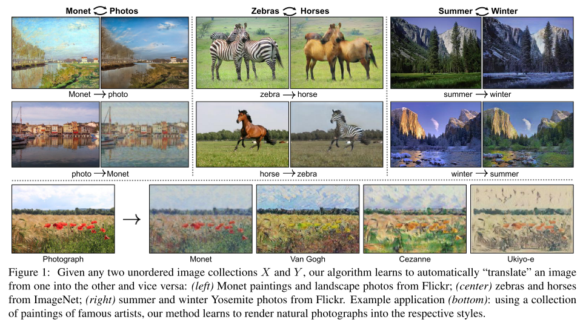

图21-7 图片风格转换

生成对抗网络还可以用于图像编辑。Yunjey Choi等人提出了StarGAN[\[8\]](#stargan)，可以对人脸进行编辑，包括改变头发颜色、性别、年龄、肤色以及表情。如图21-8所示。

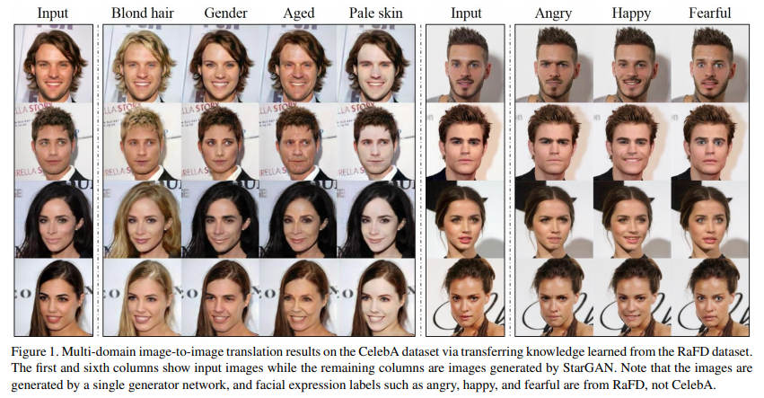

图21-8 人脸编辑

生成对抗网络也可以用于图片的超分辨率重建。Christian Ledig等人使用SRGAN[\[9\]](#srgan)对图片进行超分辨率重建，图21-9是几种重建结果的比较，可以看到SRGAN的清晰度更高，效果更好。

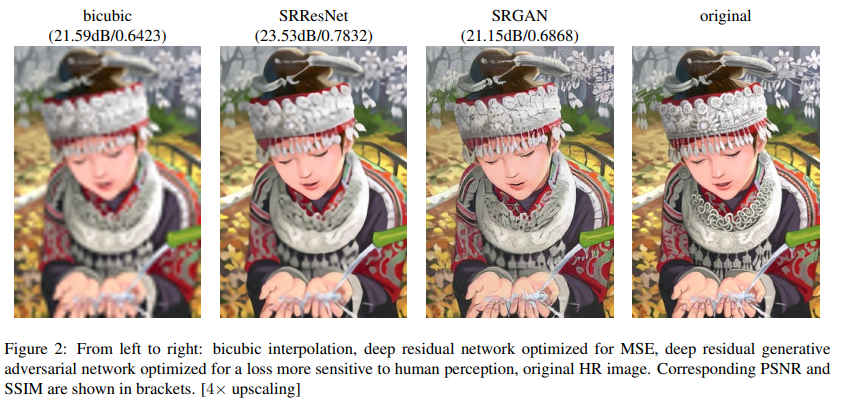

图21-9 超分辨率重建

以上只是列出了生成对抗网络众多变种中的一小部分，它们除了可以生成图片和对图片进行处理外，还可以完成视频预测、生成三维物体等任务，这里就不一一列出了。

## 21.1 生成对抗网络原理及实现

前面一整节讲述了生成对抗网络的历史、取得的评价以及各种酷炫的应用，这一节就来讲一下生成对抗网络到底是什么，它的原理是什么样的，以及如何用代码实现一个生成对抗网络。

### 21.1.1 原理介绍

**字面理解**

什么是生成对抗网络，可以直接从字面上进行理解。

首先，生成非常好理解，是指该网络中包含一个生成网络，这个生成网络输入随机噪声，产生假样本。产生的假样本越真实，该生成网络越好。

其次是对抗，这个需要做下额外的解释。生成对抗网络中不只是包含一个生成网络，它还包含一个判别网络。这个判别网络输入生成网络产生的假样本或训练集中的真样本，判别样本的真假并输出。判别网络的任务是要尽可能正确的区分出真假样本，而前面讲过生成网络的任务是尽可能生成更逼真的假样本。在训练网络时两个网络交替进行训练，相互对抗，不断调整参数，最终生成网络可以生成非常逼真的样本，判别网络也无法区分哪些是真样本，哪些是假样本。

有的地方也称这个生成网络为生成模型（Generative model）或生成器（Generator），简称G；称这个判别网络为判别模型（Discriminative model）或判别器（Discriminator），简称D。

**通俗理解**

为了更好的理解生成对抗网络，这里以父母教小孩子学写数字的过程为例来解释下。

幼儿园的小朋友还没学会怎么拿笔，让这样的小朋友写数字时，他们完全是在随便涂鸦。但是父母对幼儿园小朋友的容忍度也是很高的，只要涂鸦稍微有点数字的意思，哪怕数字3的小耳朵写在了左边，都会对小朋友进行表扬。时间长了，小朋友就会倾向于写像数字一样的涂鸦。

当小朋友进入学前班后，父母对小朋友的要求就变高了，要写出正确的数字才会得到父母的表扬。只要是把3的小耳朵写在右边，哪怕是头重脚轻、歪歪扭扭，也是能接受的。这样小朋友就会注意纠正错误的写法，保证每个数字都是正确的。

当小朋友升入小学后，父母的要求再次变高，不光要写正确，还要写的规范工整才可以得到父母的表扬。这样经过父母一步步的引导，慢慢提高的要求，小朋友书写数字的水平就会一步步的提高，最终就能写出漂亮的数字了。

当然现实世界中的小朋友学写字并不是这样的，通常经过描红和模仿就可以学会了。这里的故事之所以这样讲，主要是想让大家可以更通俗易懂的了解生成对抗网络是怎么进行学习的，其中小朋友就是生成器，父母就是判别器，父母对孩子的要求就是判别器的性能。

**数学理解**

图21-10是生成对抗网络的数据流图，可以看到生成器与判别器之间的关系，帮助大家理解生成对抗网络。

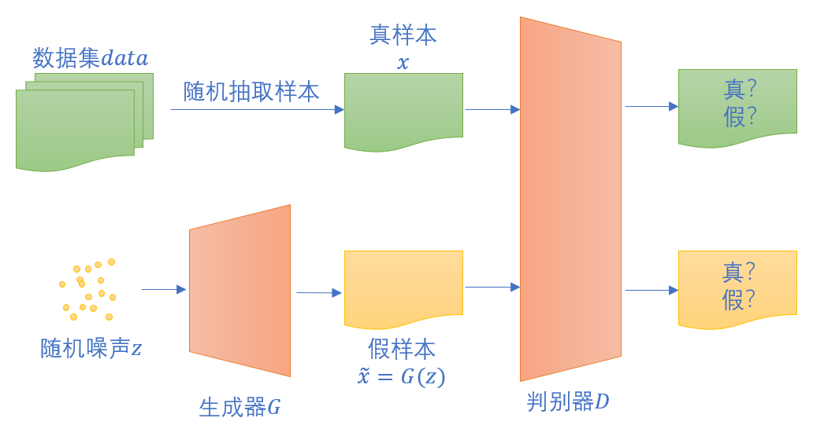

图21-10 生成对抗网络的数据流图

其中，真样本$x$是从真实数据集$data$中抽取的，假样本$\widetilde{x}=G(z)$是随机初始化的噪声$z$经过到生成器G后生成的。

将它们输入到判别器D中去判别真假，判别器的目标是尽可能正确的判别真假。这是一个二分类问题，可以回顾下前面第3.2章讲过的交叉熵损失函数，这里使用二分类问题的交叉熵函数：

$$
loss =-[y \log a + (1-y) \log (1-a)]
$$

对于真实样本$x$来说，它的标签是1，对应的损失为：

$$
\begin{aligned}
loss_{real} &=-[y \log a + (1-y) \log (1-a)] \\
&=-[1 \log D(x) + (1-1) \log (1-D(x))] \\
&=-\log D(x)
\end{aligned}
$$

对于生成的假样本$G(z)$来说，假样本的标签是0，对应的损失为：

$$
\begin{aligned}
loss_{fake} &=-[y \log a + (1-y) \log (1-a)] \\
&=-[0 \log D(G(z)) + (1-0) \log (1-D(G(z)))] \\
&=-\log (1-D(G(z)))
\end{aligned}
$$

所以对于一对数据（一个真样本和一个假样本），总的损失为：

$$
loss = loss_{real} + loss_{fake} = -[\log D(x) + \log (1-D(G(z)))]
$$

对于判别器来说，它希望更准确的进行区分真假样本，所以$loss$应该越小越好，即，$\log D(x) + \log (1-D(G(z)))$越大越好。

对于生成器来说，它希望生成的样本不被正确的判别为假样本，所以$loss$应该越大越好，即，$\log D(x) + \log (1-D(G(z)))$越小越好。

这就是Goodfellow在论文中提到的生成器G和判别器D对价值函数$V(D,G)$进行的二元极小极大化博弈：

$$
\min_{G} \max_{D} V(D,G) = \mathbb{E}_{x \sim p_{data}{(x)}}[\log{D(x)}] + \mathbb{E}_{z \sim p_{z}{(z)}}[\log{(1 - D(G(z)))}]
$$

额外补充一点，在训练生成器G的时候，第一项和G无关，可以考虑只要使得$\log (1-D(G(z)))$最小即可。更进一步，Goodfellow提到还可以在真实训练用最大化$\log D(G(z))$来代替，其实也可以换个思路来看，生成器G的目标是让判别器D无法正确将假样本判别为假，即它的目标是让判别器D给每个假样本都判别为真。那么可以将所有假样本的标签置为1，这样一来，对应的损失即为：

$$
\begin{aligned}
loss &=-[y \log a + (1-y) \log (1-a)] \\
&=-[1 \log D(G(z)) + (1-1) \log (1-D(G(z)))] \\
&=-\log D(G(z)))
\end{aligned}
$$

最小化这个loss等同于最大化$\log D(G(z))$，和Goodfellow的表述一致。

所以在训练生成器时，可以将假样本的标签置为1来训练，这样和之前最小化损失函数的思路都是一致的，比较容易实现。

### 21.1.2 代码实现

前面第12章使用多入多出的三层神经网络解决了MNIST手写数字数据集的识别问题，这里依然使用MNIST数据集来训练生成对抗网络。

对于生成器和判别器可以使用多入多出的三层神经网络来定义，和前面第12章中使用的代码基本相同，只有最后一层激活函数不同，判别器只需要判别样本的真假，最后一层使用logistic激活，生成器最后一层使用tanh激活。

由于判别器最后的输出是二分类，所以可以用二分类交叉熵做为损失函数。

``` Python
loss_func = LossFunction_1_2(NetType.BinaryClassifier)
```

反向传播时需要注意的是，整个网络可以看做是由生成器的三层网络加上判别器的三层网络组成的六层网络，但是不能一次更新全部参数，需要交替更新判别器和生成器的参数。

每个mini-batch中，首先更新判别器的参数，此时反向传播三层即可，同时计算这三层的梯度，并按学习率进行更新。

然后更新生成器，此时用更新后的判别器重新输入假样本，得到新的输出后，再次进行反向传播，此时需要传播六层一直到生成器，但是只有生成器的三层需要计算梯度并更新。

如图21-11显示了这个反向传播和更新的过程。

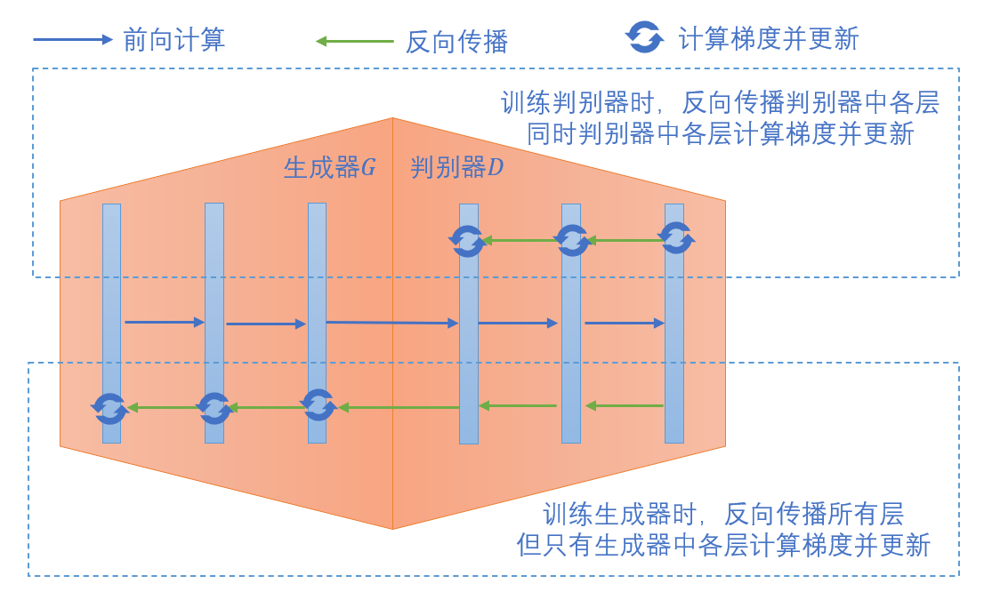

图21-11 生成对抗网络的反向传播与更新

下面的代码展示了判别器和生成器交替训练的主流程。

``` Python
for epoch in range(max_epoch):
  dataReader.Shuffle()
  for iteration in range(max_iteration):
    # 真样本
    real_x, _ = dataReader.GetBatchTrainSamples(batch_size, iteration)
    current_batch_size = real_x.shape[0]
    
    g_random_input = np.random.normal(size = (current_batch_size,100))
    # 生成器产生假样本
    fake_x = gan.g_forward(g_random_input)

    # 将真假样本一起输入到判别器
    d_input = np.append(real_x, fake_x, axis=0)
    d_output = gan.d_forward(d_input)
    d_label = np.append(np.ones((current_batch_size,1)), np.zeros((current_batch_size,1)), axis=0)

    # 判别器反向传播并更新参数
    gan.d_backward(d_input, d_label, d_output)
    gan.d_update()
    
    # 用更新过参数的判别器重新判别假样本
    d_out_fake = gan.d_forward(fake_x)

    # 生成器反向传播并更新参数
    gan.g_backward(g_random_input, np.ones((current_batch_size, 1)), d_out_fake)
    gan.g_update()
```

上面只是部分代码展示，完整的代码实现可以在[./src/GAN.py](./src/GAN.py)中找到。

### 21.1.3 运行结果

在训练过程中可以定期将生成器产生的假样本保存下来，这样可以更直观的看到生成器的输出结果的变化过程，表21-1中展示了某次训练过程中不同epoch中生成器产生的假样本。

表21-1 生成对抗网络生成的手写数字

| epoch 0 | epoch 5 | epoch 20 | epoch 200 |
| - | - | - | - |
|  |  | 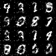 |  |

刚开始的时候，随机噪声经过未训练的生成器，产生的假样本是随机的雪花。5个epochs后，生成器倾向于在图片中心画些东西。20个epochs后，生成器产生的图片开始有点神似数字。再一直训练下去，就可以看到生成器慢慢可以写出一些正常的数字。

## 21.2 生成对抗网络变种 — CGAN

### 21.2.1 提出问题

上一节中训练好的生成对抗网络只能随机的输出数字，杂乱无章，无法进行控制。这在实际应用中并有没有太大的意义，实际需求通常会要求生成指定的数字。

生成对抗网络是否可以做到呢？答案是肯定的。前面在生成对抗网络的变种及应用中就介绍过CGAN、InfoGAN，可以生成指定的数字，除此以外，还有一些其它的变种也可以做到。

这节将以CGAN为例，来分析并动手完成一个可以指定数字进行生成的生成对抗网络。

### 21.2.2 原理介绍

还是以上一节中父母教小孩子写数字的过程为例来进行说明。父母在小孩子写数字前会指明要求写数字几，这时父母的评判标准不光要看小孩子写的像不像个数字，还要看是不是自己要求的数字。只有像数字并且接近指定的数字，才可以得到表扬。

长时间这样练习下去，小孩子就会逐渐有概念哪个数字对应的长什么样，慢慢的也就可以学会按要求写指定的数字。

对应到生成对抗网络的模型上，相当于生成器除了将随机噪声做为输入外，还要把指定的条件$c$做为输入，此时，生成器的输出为假样本$G(z,c)$。

当样本经过判别器时，同样需要将条件$c$和样本一起输入到判别器中，判别器除了判别生成的图片的质量外，还要看图片和指定的要求是否相符，只有质量高且和要求相符的图片才判别为真。

可以参考图21-12帮助理解带条件的生成对抗网络结构。

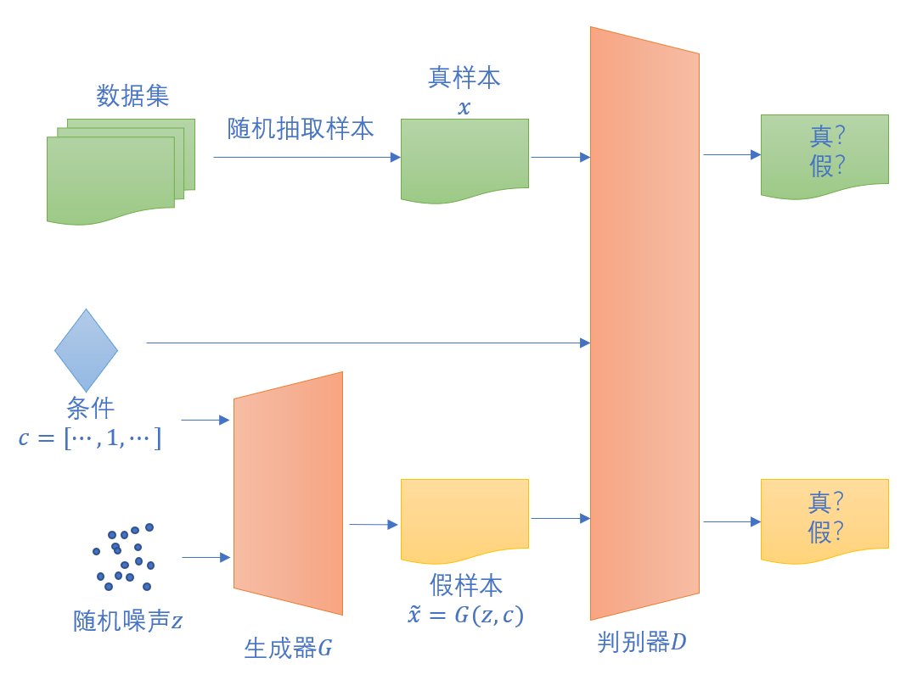

图21-12 带条件的生成对抗网络

此时，需要解决的二元极小极大化博弈价值函数$V(D,G)$变为：
$$
\min_{G} \max_{D} V(D,G) = \mathbb{E}_{x \sim p_{data}{(x)}}[\log{D(x|c)}] + \mathbb{E}_{z \sim p_{z}{(z)}}[\log{(1 - D(G(z|c)))}]
$$

### 21.2.3 代码实现

带条件的生成对抗网络相对于普通的生成对抗网络而言，分别在生成器和判别器的输入中增加了条件$c$。以MNIST手写识别数据集为例，条件$c$指数字0-9。在训练代码中，用one-hot编码来表示，编码后的长度为10。

将上一节中已实现好的生成对抗网络进行改造，原始生成器的第一层的输入长度为100，现在需要增加为110，将噪声和条件连接后一同输入到生成器中。原始判别器的第一层的输入长度为784，现在需要增加为794，将样本和条件连接后一同输入到判别器中。

``` python
# 生成器和判别器的首层输入长度加10
self.g_wb1 = WeightsBias_1_0(100 + 10, 256, self.init_method, self.eta)
self.d_wb1 = WeightsBias_1_0(784 + 10, 512, self.init_method, self.eta)
```

训练的主过程和原始网络基本一致，只需要把输入连接上对应的条件

``` python
# 真样本和对应的标签（one-hot）
real_x, real_labels = dataReader.GetBatchTrainSamples(batch_size, iteration)
# 连接真样本和对应的标签
real_x_with_label = np.hstack((real_x, real_labels))
```

``` python
# 随机产生噪声
g_random_input = np.random.normal(size = (current_batch_size,100))
# 随机产生对应的标签（条件）
fake_labels = np.eye(10)[np.random.randint(0, 10, current_batch_size)]
# 将噪声和条件连接在一起，之后输入到生成器
g_random_input_with_label = np.hstack((g_random_input, fake_labels))
```

具体的实现代码可以在[./src/CGAN.py](./src/CGAN.py)中找到。直接运行该文件即可开始训练，训练中会定期产生指定条件0-9后的验证结果，并保存在图片文件中以供比较查看。表21-2是某次训练过程中epoch 10和epoch 200时生成的数字。

表21-2 带条件的生成对抗网络生成的手写数字

| epoch 10 | epoch 200 |
| - | - |
| 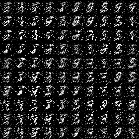 |  |

## 21.3 参考资料

<a name="the-gan-zoo"></a>

[1] the-gan-zoo. https://github.com/hindupuravinash/the-gan-zoo

<a name="quora"></a>

[2] What are some recent and potentially upcoming breakthroughs in deep learning? https://www.quora.com/What-are-some-recent-and-potentially-upcoming-breakthroughs-in-deep-learning#

<a name="gan"></a>

[3] Goodfellow, I. J., Pouget-Abadie, J., Mirza, M., Xu, B., Warde-Farley, D., Ozair, S., … Bengio, Y. (2014). Generative Adversarial Networks. 1–9. Retrieved from http://arxiv.org/abs/1406.2661

<a name="cgan"></a>

[4] Mirza, M., & Osindero, S. (2014). Conditional Generative Adversarial Nets. 1–7. Retrieved from http://arxiv.org/abs/1411.1784

<a name="infogan"></a>

[5] Chen, X., Duan, Y., Houthooft, R., Schulman, J., Sutskever, I., & Abbeel, P. (2016). InfoGAN: Interpretable representation learning by information maximizing generative adversarial nets. Advances in Neural Information Processing Systems, 2180–2188.

<a name="gancls"></a>

[6] Reed, S., Akata, Z., Yan, X., Logeswaran, L., Schiele, B., & Lee, H. (2016). Generative adversarial text to image synthesis. 33rd International Conference on Machine Learning, ICML 2016, 3, 1681–1690.

<a name="cyclegan"></a>

[7] Zhu, J. Y., Park, T., Isola, P., & Efros, A. A. (2017). Unpaired Image-to-Image Translation Using Cycle-Consistent Adversarial Networks. Proceedings of the IEEE International Conference on Computer Vision, 2017-October, 2242–2251. https://doi.org/10.1109/ICCV.2017.244

<a name="stargan"></a>

[8] Choi, Y., Choi, M., Kim, M., Ha, J. W., Kim, S., & Choo, J. (2018). StarGAN. Proceedings of the IEEE Computer Society Conference on Computer Vision and Pattern Recognition, 8789–8797. https://doi.org/10.1109/CVPR.2018.00916

<a name="srgan"></a>

[9] Ledig, C., Theis, L., Huszár, F., Caballero, J., Cunningham, A., Acosta, A., … Shi, W. (2017). Photo-Realistic Single Image Super-Resolution Using a Generative Adversarial Network. Proceedings - 30th IEEE Conference on Computer Vision and Pattern Recognition, CVPR 2017, 2017-Janua, 105–114. https://doi.org/10.1109/CVPR.2017.19

<a name="pytorchgan"></a>

[10]  PyTorch-GAN. https://github.com/eriklindernoren/PyTorch-GAN 

<a name="kerasgan"></a>

[11]  Keras-GAN. https://github.com/eriklindernoren/Keras-GAN 