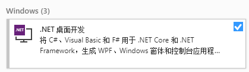
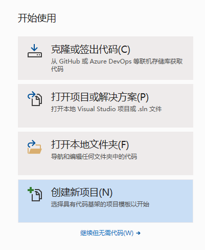
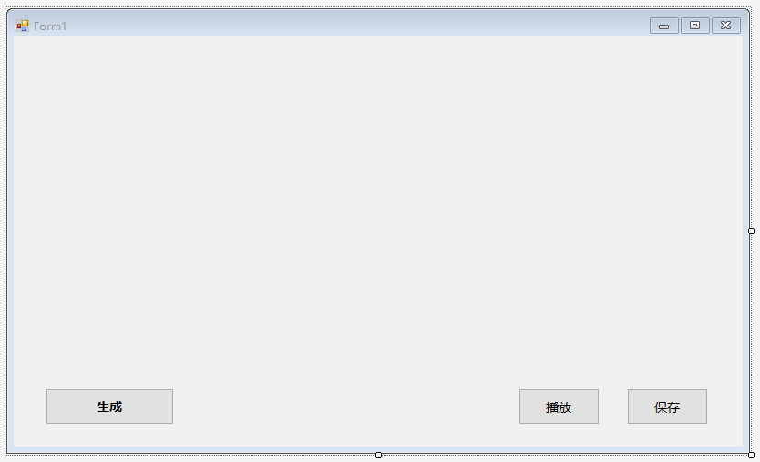
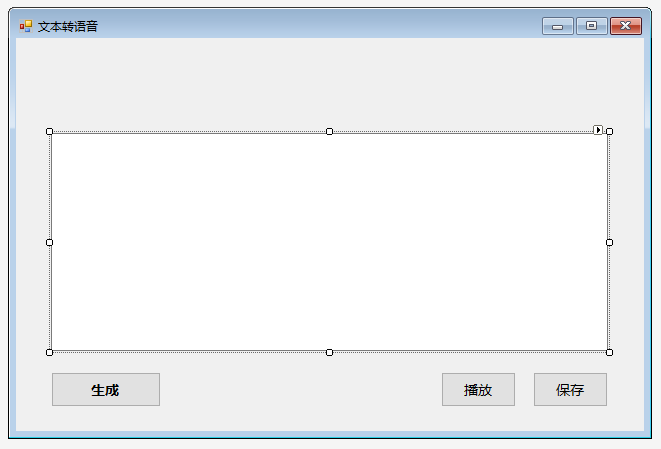
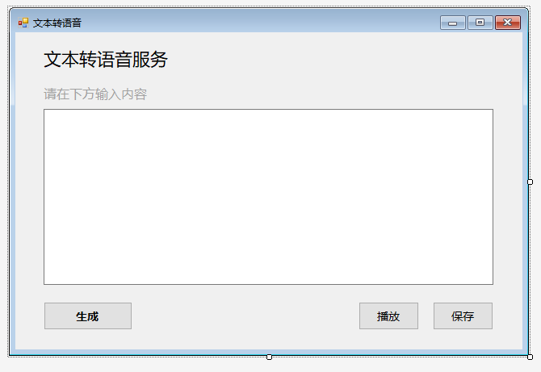
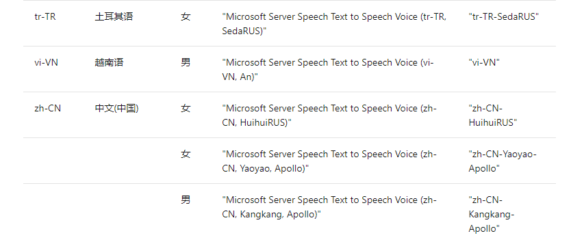
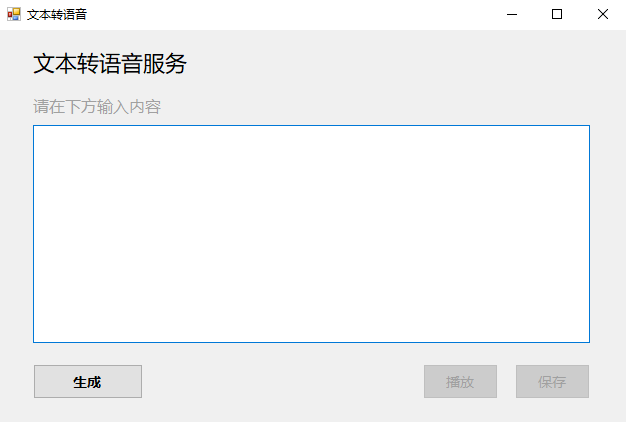
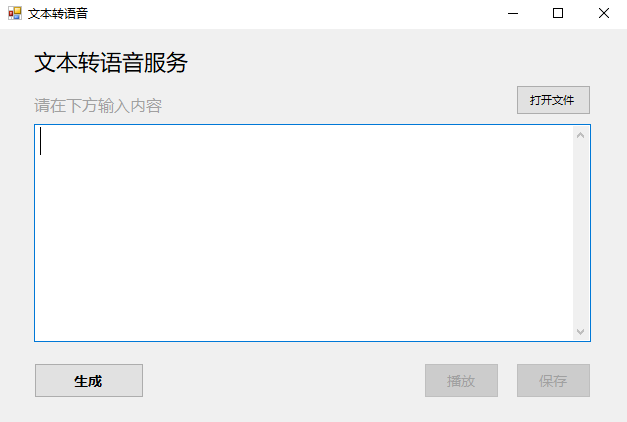
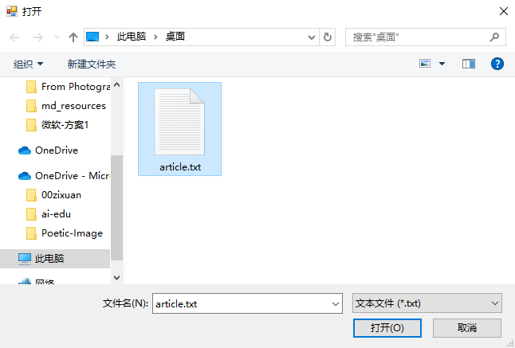

# 案例介绍
随着NLP（Natural Language Processing）技术的发展，NLP的应用场景正在逐渐扩大，这大大地方便了我们的生活。其中，TTS（Text To Speech）的应用在生活中极为广泛。

在过去，许多城市的公交及地铁报站的语音皆为人工录制，线路的临时变更等各种因素导致不得不多次重复录制语音内容，但是应用TTS技术之后，我们可以轻易地生成语音，而无需重新录制语音内容。再者，如今各类手机厂商、智能家居系统、车载系统等的语音助手也在广泛应用该技术，这让你的手机、音响和你的车可以开口“说话”了。曾经科幻电影才有的情景，突然就在不知不觉间成为了现实。

对于个人而言，TTS也极大地改善了我们的生活。在过去，对于视障人士而言，阅读是一件极其困难的事情，因为他们需要首先先学习盲文，并且只能购买资源十分有限的盲文书籍来阅读。而且，由于盲文的表达能力不及自然语言，阅读盲文的速度也不及正常阅读的速度，这进一步影响了他们的阅读体验。然而，利用TTS技术，我们可以轻易让计算机朗读现有的电子版书籍，从而帮助他们实现无障碍“听书”。再者，对于工作繁忙的上班族，他们也可以利用平时在路上通勤的时间听书，让通勤不再枯燥。

由于现在TTS的技术已经较为成熟，微软就提供了完整丰富的TTS-api，让我们无需关注TTS内部复杂的实现，这极大地降低了企业或个人开展TTS相关业务的难度。在此案例中，我们将学习如何利用微软的TTS-api快速构建一个文本朗读的桌面应用程序，从而实现“听书”。


# 先修知识
无需先修知识。

我们在案例中使用的微软的[认知服务](https://docs.microsoft.com/zh-cn/azure/cognitive-services/)（Cognitive Services）下的[语音服务](https://docs.microsoft.com/zh-cn/azure/cognitive-services/speech-service/)，可以让我们在不了解TTS知识的情况下，快速实现TTS功能，完成桌面应用的开发。


> **什么是Azure认知服务?**
> 
> Azure 认知服务是 API、SDK 和服务，可帮助开发人员生成智能应用程序，而无需具备直接的 AI 或数据科学技能或知识。 开发人员使用 Azure 认知服务能够轻松地将认知功能添加到其应用程序中。 Azure 认知服务的目标是帮助开发人员创建可以看、听、说、理解甚至开始推理的应用程序。 Azure 认知服务中的服务目录可分为五大主要支柱类别：视觉、语音、语言、Web 搜索和决策。
>  
> [了解更多](https://docs.microsoft.com/zh-cn/azure/cognitive-services/welcome)


# 案例核心知识点

该案例涉及了以下几个知识点：

1. **TTS-api的申请和使用**
2. **TTS应用的构建**
3. **TTS功能的实现**

上述内容将会在应用的构建中涉及。

虽然我们的案例并没有涉及TTS核心技术的开发，但是在开始之前，我们还是有必要简单了解TTS的基本原理。TTS的实现涉及了极其繁多和复杂的步骤，在看完之后，你或许能够体会到TTS核心技术开发的困难所在，从而理解利用一个TTS-api究竟能给开发者带来多大的便利。

## TTS基本原理

### 传统常见模型
TTS的常见模型通常将文本转语音任务分解成两个部分：**文本分析（Text Analysis）** 和 **语音合成（Speech Synthesis）**。先是对输入的文本进行分析，提取出用于生成语音的信息，再利用特定的算法合成出语音。

#### 1. 文本分析
    
该部分主要是对输入文本进行分析，提取出语音合成必需的信息，如音素、语调等。

通常有以下几个步骤：
   * 利用语句切分算法，将输入的文本切分成独立的语句
   * 对于每个句子，我们需要进一步分析词语，将句子分词成连续的Token序列
   * 分析Token，由于Token可能包含数字、日期等非自然语言，因此我们需要使用一定的规则将这些非自然语言转换成自然语言
   * 进行基础的语音语调分析，如找出语句中的重点部分等

其中，上述的每一个步骤都有各自的算法，对于不同的任务可能有着对应不同的实现，由于篇幅有限，在此不再展开，感兴趣的同学可以查阅[《Text-to-Speech Synthesis》](http://citeseerx.ist.psu.edu/viewdoc/download?doi=10.1.1.118.5905&rep=rep1&type=pdf)。


#### 2. 语音合成
    
该部分的工作是利用文本分析提供的信息，合成出相应的语音。由此可见，如果文本分析提取的信息不够准确，势必会导致生成的语音效果不佳。除此之外，不同的语音合成算法也会对生成的语音的效果有影响。

目前，语音的合成主要有以下几类方法：

1. 波形拼接法

    在合成之前，我们会预先录制大量语料，预先录制的语音可以通过波形片段的形式储存在数据库。在合成阶段，我们需要把我们分析出来的词语编码为音素，再通过查询预先录制的语音数据库，找出尽可能匹配的声音波形片段。当选出特定的波形片段序列后，我们可以使用信号处理的方式将它们拼接在一起，形成连续的声波语音。通常来说，拼接法生成的语音最为自然。常见的方法有：单元选择合成（Unit Selection Synthesis）、双音合成（Diphone Synthesis）、特定领域合成（Domain-specific Synthesis）。

2. 参数生成法
   
    参数生成法是通过分析语音中的参数如基频、发声、音长等，建立声学模型，再使用不同的参数组合转化为声波。参数生成法在生成语音时不会像波形拼接法一样，使用预先录制的语音，而是通过参数和模型生成一段语音。当然，利用这种方法也需要预录制语音，但是需要录制的内容会少于波形拼接法，且录制下来的内容主要用于学习参数，不直接用于生成内容。常见的方法有：共振峰合成（Formant Synthesis）、隐马尔可夫模型合成（Hidden Markov Model Synthesis）等。

### 深度学习方法
   
   除了传统的常见模型以外，如今也有不少团队尝试使用深度学习来实现TTS。深度学习的方法通常不会明显地划分文本分析和语音合成部分，而是利用了深度神经网络（Deep Neural Networks），通过特定的网络结构和训练大量的文本和语音数据，实现端到端的文本转语音。例如，Google的[Tacotron](https://arxiv.org/abs/1703.10135)、DeepMind的[WaveNet](https://deepmind.com/blog/article/wavenet-generative-model-raw-audio)等。


### 其他模型

#### 1. 信号到信号模型（Signal-to-Signal model）
    
在此模型里，处理过程可以看作直接将文本信号转换为语音信号，而不再显式地划分文本分析和语音合成的阶段。例如，上述的深度学习方法。其中，谷歌的深度学习模型Tacotron便是实现了端到端的TTS转换。

#### 2. 流水线模型（Pipelined model）
   
熟悉编译原理的同学应该会对此模型比较熟悉。流水线模型将任务划分了不同的模块，每个模块负责特定的任务，上个模块的输出将作为当前的输入，当前的输出也将作为下个模块的输入。许多Signal-to-Signal的模型便是使用了流水线模型来实现的。

我们在这里只提到了部分模型，更多的模型请查阅[《Text-to-Speech Synthesis》](http://citeseerx.ist.psu.edu/viewdoc/download?doi=10.1.1.118.5905&rep=rep1&type=pdf)。

# 环境与工具

操作系统：`Windows 10`

开发环境：`Visual Studio 2019`

开发语言：`C#`

注：在安装`Visual Studio 2019`时，请确保已勾选“.NET 桌面开发”。



# 推荐学习时长

该案例推荐学习时长为：1.5小时


# 应用的构建

该案例利用了Azure的TTS-api服务构建了一个文本朗读的桌面应用程序，实现了中文文本转语音，并能够保存生成的音频文件。

构建分为以下几个步骤：
1. 申请TTS-api
2. 构建窗体界面
3. 调用api实现TTS


## 申请TTS-api

Azure提供了30天的免费使用版，如果需要注册免费试用，请转到[试用认知服务](https://azure.microsoft.com/zh-cn/try/cognitive-services/)或参考 **B4-定制化－语言理解应用案例－智能家居** 中的[申请试用语音转文本](../../B4-定制化－语言理解应用案例－智能家居/微软-方案1/README.md#申请试用)。


1. 完成注册或登录Azure账户之后，请按照[在Azure中创建语音资源](https://docs.microsoft.com/zh-cn/azure/cognitive-services/speech-service/get-started#create-a-speech-resource-in-azure)的指引申请TTS-api。

2. 完成TTS-api的申请后，登录[Azure主页](https://ms.portal.azure.com/#home)，点击“最新资源”下的“TTS-api”。

    

3. 进入“TTS-api”后可以查看自己的**Key**和**终结点**，你需要记下它们，因为这将在后续的开发中使用。

    


## 构建窗体界面

1. 打开Visual Studio 2019，选择“创建新项目”。

    
   
    选择语言为“C#”，选择“Windows窗体应用(.NET Framework)”。

    

    修改项目名称为“TTS_Demo”，点击“创建”。

    

2. 点击左侧“工具箱”，选择“公共控件”，选择“Button”。

    

    将“button”拖至右侧界面中适当位置，调整大小至合适尺寸。
    
    

    右侧属性框可以设置按钮属性。将Text设置成“保存”，Font设置成“微软雅黑, 10pt”。

    

    将Design中的Name设置成“saveButton”。

    

3. 按上述方法依次创建按钮“播放”、“生成”，并放置到适当的位置，将其属性框内Design中的Name分别设置成“playButton”、“transferButton”。

     

4. 在“工具箱”中选择“TextBox”，拖至右侧界面中适当位置。在属性框内的Behavior中的Multiline设置为“True”。在界面中调整TextBox大小至合适尺寸。

    

5. 在“工具箱”中选择“Label”，拖至界面适当位置，设置属性框中的Text属性为“文本转语音服务”，并设置适当字体。同理，新建“Label”并修改Text属性为“请在下方输入内容”，设置适当字体及颜色。

    

至此，窗体界面的搭建就完成了。


## 调用api实现TTS
注：如对api的使用有任何疑问可以查阅[文本转语音 REST API](https://docs.microsoft.com/zh-cn/azure/cognitive-services/speech-service/rest-text-to-speech)。


1. 选择右侧“解决方案资源管理器”中的“TTS_Demo”，右键选择“添加”->“新建项”。

    选择“类”，名称为“Authentication.cs”，点击“添加”。

    

2. 在 **Authentication.cs** 文件中，引用如下命名空间。

    ```
    using System.Net.Http;
    using System.IO;
    ```

    添加如下代码。


    ```
    namespace TTS_Demo
    {
        public class Authentication
        {
            private string subscriptionKey;
            private string tokenFetchUri;

            public Authentication(string tokenFetchUri, string subscriptionKey)
            {
                if (string.IsNullOrWhiteSpace(tokenFetchUri))
                {
                    throw new ArgumentNullException(nameof(tokenFetchUri));
                }
                if (string.IsNullOrWhiteSpace(subscriptionKey))
                {
                    throw new ArgumentNullException(nameof(subscriptionKey));
                }
                this.tokenFetchUri = tokenFetchUri;
                this.subscriptionKey = subscriptionKey;
            }

            public async Task<string> FetchTokenAsync()
            {
                using (var client = new HttpClient())
                {
                    client.DefaultRequestHeaders.Add("Ocp-Apim-Subscription-Key", this.subscriptionKey);
                    UriBuilder uriBuilder = new UriBuilder(this.tokenFetchUri);

                    var result = await client.PostAsync(uriBuilder.Uri.AbsoluteUri, null).ConfigureAwait(false);
                    return await result.Content.ReadAsStringAsync().ConfigureAwait(false);
                }
            }

        }
    }
    ```

3. 同理，新建类文件 **TTSApi.cs**，并添加如下代码。

    ```
    namespace TTS_Demo
    {      
        class TTSApi
        {
            //语言配置信息
            string locale = "zh-CN";
            string voiceName = "Microsoft Server Speech Text to Speech Voice (zh-CN, HuihuiRUS)";
        
            string accessToken;
            Authentication auth = new Authentication("https://westus.api.cognitive.microsoft.com/sts/v1.0/issuetoken", "REPLACE_WITH_YOUR_KEY");
            string host = "https://westus.tts.speech.microsoft.com/cognitiveservices/v1";

            //转换文本并保存
            public async Task textToSpeechAsync(string text, string savePath)
            {
                try
                {
                    accessToken = await auth.FetchTokenAsync().ConfigureAwait(false);
                }
                catch (Exception ex)
                {
                    Console.WriteLine(ex);
                }

                string body = "<speak version='1.0' xmlns='https://www.w3.org/2001/10/synthesis' xml:lang='"+locale+"'>"
                +"<voice name='"+voiceName+"'>" + text + "</voice></speak>";

                using (var client = new HttpClient())
                {
                    using (var request = new HttpRequestMessage())
                    {
                        // Set the HTTP method
                        request.Method = HttpMethod.Post;
                        // Construct the URI
                        request.RequestUri = new Uri(host);
                        // Set the content type header
                        request.Content = new StringContent(body, Encoding.UTF8, "application/ssml+xml");
                        // Set additional header, such as Authorization and User-Agent
                        request.Headers.Add("Authorization", "Bearer " + accessToken);
                        request.Headers.Add("Connection", "Keep-Alive");
                        // Update your resource name
                        request.Headers.Add("User-Agent", "YOUR_RESOURCE_NAME");
                        request.Headers.Add("X-Microsoft-OutputFormat", "riff-24khz-16bit-mono-pcm");
                        // Create a request
                        Console.WriteLine("Calling the TTS service. Please wait... \n");
                        using (var response = await client.SendAsync(request).ConfigureAwait(false))
                        {
                            response.EnsureSuccessStatusCode();
                            // Asynchronously read the response
                            using (var dataStream = await response.Content.ReadAsStreamAsync().ConfigureAwait(false))
                            {
                                using (var fileStream = new FileStream(savePath, FileMode.Create, FileAccess.Write, FileShare.Write))
                                {
                                    await dataStream.CopyToAsync(fileStream).ConfigureAwait(false);
                                    fileStream.Close();
                                }
                            }
                        }
                    }
                }
            }
        }
    }

    ```

    其中，需要特别注意以下代码片段：

    ```
            string locale = "zh-CN";
            string voiceName = "Microsoft Server Speech Text to Speech Voice (zh-CN, HuihuiRUS)";
        
            string accessToken;
            Authentication auth = new Authentication("https://westus.api.cognitive.microsoft.com/sts/v1.0/issuetoken", "REPLACE_WITH_YOUR_KEY"); //替换为你的终结点和Key
            string host = "https://westus.tts.speech.microsoft.com/cognitiveservices/v1";
    ```

   * 上述`Authentication`的初始化中，需要替换你在TTS-api中分配的终结点和Key。

   * 上述的`locale`和`voiceName`允许用户更改不同的语言及发音。具体可选值可以查阅[标准语音](https://docs.microsoft.com/zh-cn/azure/cognitive-services/speech-service/language-support#standard-voices)。

       以中文为例，我们这里选择了“zh-CN”的“HuiHuiRUS”。
   因此我们根据查表内容，将`locale`和`voiceName`变量设置成对应值。其中，`voiceName`可以选择“完全服务名称映射”或“短语音名称”。

   

4. 在 **Form1.cs** 中，添加如下代码至`Form1`类。
   
    ```
    string tempFile = "temp.wav"; //临时文件存储路径
    TTSApi tts = new TTSApi(); 
    ```


5. 在 **Form1.cs[设计]** 界面中双击“生成”按钮，会自动生成函数`transferButton_Click`，该函数绑定了“生成”按钮的点击事件，当用户点击“生成”按钮时会自动调用该函数。

    完成此函数代码。

    ```
    private async void transferButton_Click(object sender, EventArgs e)
        {
           string text = textBox1.Text; //获取用户输入
                
            if (text.Length > 0)
            {
                await tts.textToSpeechAsync(text, tempFile);        
            }
        }
    ```

6. 同理，双击“播放”按钮，完成`playButton_Click`函数代码。

    ```
    private void playButton_Click(object sender, EventArgs e)
        {
            SoundPlayer playSound = new SoundPlayer(tempFile);
            playSound.Play();
        }
    ```

7. 双击“保存”按钮，完成`saveButton_Click`函数代码。
   
    ```
    private void saveButton_Click(object sender, EventArgs e)
        {
            string filePath = "";
            //取前10个字符作为文件名
            string fileName = (textBox1.Text.Length < 10) ? textBox1.Text : textBox1.Text.Substring(0, 10);

            SaveFileDialog saveFile = new SaveFileDialog();
            saveFile.FileName = fileName;
            saveFile.Filter = "音频文件 (*.wav) | *.wav"; 
            saveFile.RestoreDirectory = true; //保存并显示上次打开的目录

            if (saveFile.ShowDialog() == DialogResult.OK)
            {
                filePath = saveFile.FileName.ToString(); 

                if (File.Exists(tempFile))
                {
                    File.Copy(tempFile, filePath, true);
                }
                else
                {
                    Console.WriteLine("音频文件不存在");
                }
            }
        }
    ```

至此，我们就构建好了整个窗体应用。按`F5`即可运行程序。




将待朗读的文章复制到文本框，点击“生成”按钮，等待片刻即可生成对应的语音，你可以直接保存生成的音频文件，以便自己使用或分享给家人朋友。


在教程中，我们省略了部分细节，更多内容可以[查看源代码](./TTS_Demo/TTS_Demo)。


# 作业和挑战
## 1. 程序复现

按照上述的教程，复现一遍文本朗读的桌面应用程序，要求实现输入文本后能够生成语音并保存到本地。


## 2. 增加从文件读取文本信息的功能

当前的程序需要手动输入或复制内容到文本框，再点击“生成”。但是，当我们需要让计算机朗读长文章时，手动复制内容会十分地麻烦。那么，是否能增加一个功能，从文本文件中读取内容到文本框呢？

可参考如下交互方式来实现。

1. 点击按钮“打开文件”

    


2. 选择文本文件

    


3. 根据选择的文件自动加载

    

注：我们在源代码中已实现了该功能，可以参考[源代码](./TTS_Demo/TTS_Demo)完成该作业。


# 参考阅读

1. [《Text-to-Speech Synthesis》](http://citeseerx.ist.psu.edu/viewdoc/download?doi=10.1.1.118.5905&rep=rep1&type=pdf), Paul Taylor, University of Cambridge