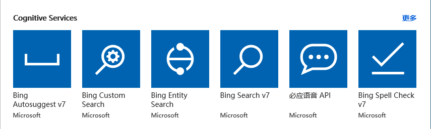
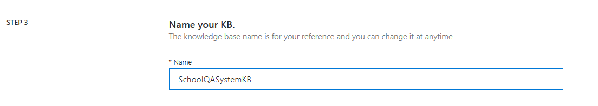
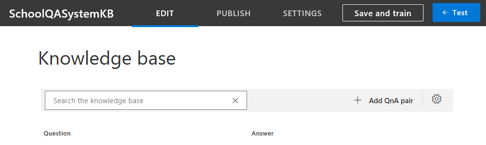
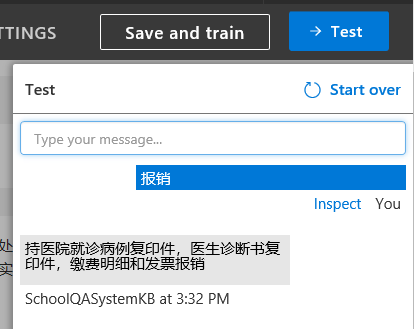
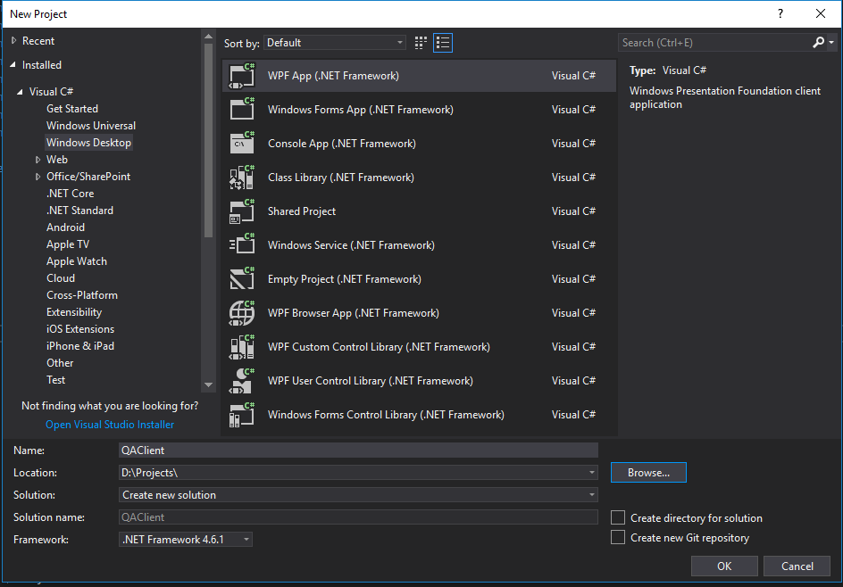
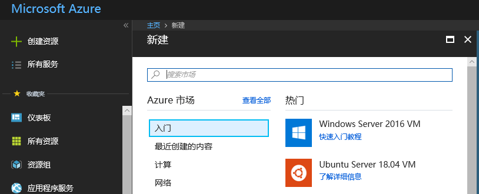
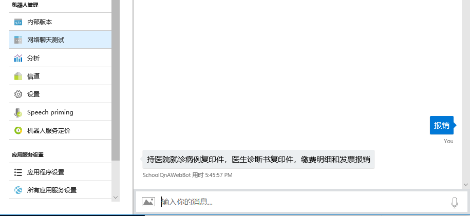

# 自动问答系统案例

# 目录

[知识要点](#知识要点)

[建立知识库](#建立知识库)

> [什么叫QnA Maker?](#什么叫qna-maker)
> 
> [在Azure中申请QnA Maker服务](#在azure中申请qna-maker服务)
> 
> [在QnA Maker网站上建立知识库](#在qna-maker网站上建立知识库)
> 
> [用代码访问QnA知识库](#用代码访问qna知识库)

[建立对话机器人服务](#建立对话机器人服务)

> [什么是机器人服务？](#什么是机器人服务)
> 
> [创建对话机器人](#创建对话机器人)
> 
> [连接知识库](#连接知识库)
> 
> [连接已有应用](#连接已有应用)

[习题与进阶学习](#习题与进阶学习)

> [利用已有数据创建知识库](#利用已有数据创建知识库)
> 
> [使用REST API管理知识库](#使用rest-api管理知识库)
> 
> [把机器人服务发布到实际应用环境](#把机器人服务发布到实际应用环境)
> 
> [结合LUIS到QnA Maker中](#结合luis到qna-maker中)

# 

# 知识要点

  - 微软认知服务中知识库服务的申请与搭建

  - 如何用REST API访问知识库数据

  - 微软认知服务中机器人服务的申请与搭建

  - 如何无缝集成知识库服务与机器人服务

# 建立知识库

## 什么叫QnA Maker?

知识库，就是人们总结出的一些历史知识的集合，存储、索引以后，可以被方便的检索出来供后人查询/学习。QnA Maker是用于建立知识库的工具，使用
QnA Maker，可以根据 FAQ（常见问题解答）文档或者 URL 和产品手册等半结构化内容打造一项问题与解答服务。
可以生成一个问题与解答模型，以便灵活地应对用户查询，即用户不必输入精确的查询条件，而是提供以自然对话方式受训的机器人来响应。

下图中是知识库与Bot
Service的结合使用架构图：


与“半结构化数据”并列的是“结构化数据”和“非结构化数据”，其中结构化数据可以用关系式数据库来解决，非结构化数据用搜索引擎技术来解决。实际上搜索引擎就是把散落在互联网各个角落的非结构信息变成半结构化或结构化信息。

不同于搜索引擎，本文介绍的基于半结构化数据的QnA系统实现方式，是基于小规模数据量的，比如Million级别，而搜索引擎的技术要高级很多，因为要面对Billion级别的数据。但是从原理上讲，大家可以管中窥豹可见一斑。

## 在Azure中申请QnA Maker服务

用MSA登录Azure门户，点击“创建资源”，然后点击“AI + Machine Learning”：


在下图中点击“查看全部”：


在下图中点击“更多：”



在下图中点击“QnA Maker”:


在下图中的有红色\*的输入框中，输入必要的信息，比如在Name中输入“ SchoolQASystem”：


点击“创建”后，稍等一会儿，会得到以下通知消息：


> 小提示：可以点击“固定到仪表板”，方便后续查找。

至此，我们的QnA服务已经申请好了，下一步是建立知识库，填写数据。

## 在QnA Maker网站上建立知识库

用Edge浏览器打开<https://www.qnamaker.ai>，登录自己的MSA账号。如果是第一进入该网站，你的My knowledge
bases将会是空白页，点击Create a knowledge base来建立自己的第一个知识库：


> 小提示：这里用的MSA账号应该与申请认知服务的MSA账号相同。

STEP 1我们已经做过了，现在在STEP 2中从下拉列表中选择自己的相关信息：


在STEP 3中填写一个知识库的名字，比如SchoolQASystemKB：



在STEP 5中点击“Create your KB”来建立知识库：


> 小提示：STEP 4可以运行用户通过提供一个静态网页或者一个固定格式的文件，来自动提取问题和答案。

稍等一会儿，进入如下页面：



我们以学校中常用的一些问答信息为例，点击“+ Add QnA
pair”填写如下数据：


当然可以根据实际情况，填写其它一些信息。需要注意的是，每个Question需要有唯一的一个Answer来对应，而每个Answer可以有很多个Question，是N:1的关系。

> 小提示：以上数据均为虚构，请填写符合自己学校实际情况的数据。

数据填写的差不多了（一次填写不完没关系，可以以后修改），点击“Save and
train”按钮，稍等一会儿，点击那个“Test”按钮，进行在线测试。在问题框中输入“报销”，可以很快得到系统的回复，如下图就是测试结果：



此时也可以点击”Inspect”来看细节，比如Confidence
score的值是79.75分，也可以在左侧填写更多的问题来对应这个答案，比如“看病报销”：


觉得满意后，点击“PUBLISH”按钮来发布这个知识库：


稍等一会儿，得到如下信息：


好啦！到目前位置，我们已经成功建立了第一个知识库。

> 小提示：保留这个网页或者请记住上图中的信息，一会儿我们还会用到它。上图中的Key/Endpoint等是经过修改不可用的，请用自己申请的服务数据代替。

下面我们有两个选择：

1）写代码来访问这个知识库，提供界面供他人使用。

2）用微软的另外一项技术 – 聊天机器人技术，以问答方式来提供访问该知识库的界面。这个内容我们在下一个大章节讲述。

## 用代码访问QnA知识库

打开利器VS2017，新建一个Windows Desktop WPF项目，给个名字叫QAClient：



在MainWindow.xaml中填写如下XAML界面设计代码：

```xml
<Window x:Class="QAClient.MainWindow"
        xmlns="http://schemas.microsoft.com/winfx/2006/xaml/presentation"
        xmlns:x="http://schemas.microsoft.com/winfx/2006/xaml"
        xmlns:d="http://schemas.microsoft.com/expression/blend/2008"
        xmlns:mc="http://schemas.openxmlformats.org/markup-compatibility/2006"
        xmlns:local="clr-namespace:QAClient"
        mc:Ignorable="d"
        Title="MainWindow" Height="450" Width="800">
    <Grid>
        <Grid.RowDefinitions>
            <RowDefinition Height="*"/>
            <RowDefinition Height="40"/>
        </Grid.RowDefinitions>
        <TextBox Name="tb_Dialog" Grid.Row="0"/>
        <Grid Grid.Row="1">
            <Grid.ColumnDefinitions>
                <ColumnDefinition Width="*"/>
                <ColumnDefinition Width="80"/>
            </Grid.ColumnDefinitions>
            <TextBox Name="tb_Question" MaxLines="1" Grid.Column="0"/>
            <Button Name="btn_Send" Content="Send" Grid.Column="1" Click="btn_Send_Click"/>
        </Grid>
    </Grid>
</Window>
```


在MainWindow.xaml.cs中添加按钮事件处理函数：

```C#
public partial class MainWindow : Window
{
    public MainWindow()
    {
        InitializeComponent();
    }
    private async void btn_Send_Click(object sender, RoutedEventArgs e)
    {
        // send http post request to qa service
        Answers results = await QAServiceAgent.DoQuery(this.tb_Question.Text);
        if (results.answers != null && results.answers.Length > 0)
        {
            this.tb_Dialog.Text += "问：" + this.tb_Question.Text + "\r\n";
            this.tb_Dialog.Text += results.answers[0].ToString() + "\r\n";
        }
    }
}
```

在工程中添加QAServiceAgent.cs文件，填写以下内容：

```C#
using System;
using System.Diagnostics;
using System.Net.Http;
using System.Text;
using System.Threading.Tasks;

namespace QAClient
{
    class QAServiceAgent
    {
        const string Endpoint = "/knowledgebases/90690b7-dae-4e0d-bda9-16c05e0f163/generateAnswer";
        const string Host = "https://openmindqnamaker.azurewebsites.net/qnamaker";
        const string Key = "e7e3c51-dc5-4d65-aa3-8da1024c3e13";
        const string ContentType = "application/json";
        // {"question":"<Your question>"}

        public static async Task<Answers> DoQuery(string question)
        {
            try
            {
                using (HttpClient hc = new HttpClient())
                {
                    hc.DefaultRequestHeaders.Add("authorization", "EndpointKey " + Key);
                    string jsonBody = CreateJsonBodyElement(question);
                    StringContent content = new StringContent(jsonBody, Encoding.UTF8, ContentType);
                    string uri = Host + Endpoint;
                    HttpResponseMessage resp = await hc.PostAsync(uri, content);
                    string json = await resp.Content.ReadAsStringAsync();
                    var ro = Newtonsoft.Json.JsonConvert.DeserializeObject<Answers>(json);
                    return ro;
                }
            }
            catch (Exception ex)
            {
                Debug.WriteLine(ex.Message);
                return null;
            }
        }

        private static string CreateJsonBodyElement(string question)
        {
            string a = "{\"question\":\"" + question + "\"}";
            return a;
        }
    }
}
```

> 小提示：上面代码中的Endpoint和Key是不可用的，请用你自己申请的数据来代替。

在工程中添加另外一个文件Result.cs，用于反序列化JSON数据：

```C#
namespace QAClient
{
    public class Answers
    {
        public Answer[] answers { get; set; }
    }

    public class Answer
    {
        public string[] questions { get; set; }
        public string answer { get; set; }
        public float score { get; set; }
        public int id { get; set; }
        public string source { get; set; }
        public object[] metadata { get; set; }

        public override string ToString()
        {
            return string.Format("Answer: {0}, Score:{1}", answer, score);
        }
    }
}
```


代码完成！搓搓双手，按Ctrl+F5走起一波！哇哦！好俊的界面：


在下方的输入框中输入“报销”、“开学日期”、“补考”等问题，都会得到预定的答案。输入“校长是谁”就没有match到任何答案，因为我们没有在数据中准备这个问题。

我们是用客户端形式做了一个问答界面，当然也可以在网站上用REST API实现同样的功能。同时，微软提供了Bot
Service，下一章我们看看如何在不写任何代码的情况下，完成机器人与QnA服务的集成。

# 建立对话机器人服务

## 什么是机器人服务？

机器人是用户使用文本、图形（卡片）或语音通过聊天的方式进行交互的应用。
它可以是一个简单的问答对话，也可以是一个复杂的机器人，允许用户使用模式匹配、状态跟踪和与现有业务服务完美集成的人工智能技术通过智能的方式与服务进行交互。
常见的机器人服务有以下几类：

  - 商务/金融服务，如银行提供的在线客服

  - 信息服务，如政府部门的常用信息问答服务

  - 产品服务，如企业提供的产品咨询服务

总之，机器人服务就是用计算机代替人来完成一些具有标准化流程的人机对话服务。

微软提供的机器人服务的概述[在这个链接里面](https://docs.microsoft.com/zh-cn/azure/bot-service/bot-service-overview-introduction?view=azure-bot-service-4.0)，建立一个机器人服务和一般的软件其实没多大区别，也要经过以下几个步骤然后再迭代：


计划：确定需求，需要什么类型的机器人服务

构建：选择工具/语言/框架等等

测试：机器人其实知识界面，后端连接了一堆智能服务，要通过机器人界面测试好所有功能

发布：发布的Azure上或者自己的Web服务器上

连接：可以将机器人连接到以有的客户端软件上，方便用户接入，比如Cortana、Skype等

评估：根据运行日志获得基本运行指标，如流量、延迟、故障等等，作为迭代的依据

## 创建对话机器人

用MSA登录Azure门户，点击“创建资源”：



小提示：此MSA账号需要与前面的QnA服务的MSA账号相同。

选择“AI + Machine Learning”，在右侧选择“Web App Bot”：


在上图中选择Web App Bot，在右侧弹出的窗口中点击“创建”按钮，得到下图：


在上图中填写必要的信息，比如机器人名称是“SchoolQnAWebBot”，机器人模板要选择“Question and
Answer”，可以关闭Application Insights来简化过程。

> 小提示：记住要点击“选择”按钮，否则不生效。

最后点击“创建”按钮，稍等一会儿，得到以下通知：


> 小提示：此时可以固定到仪表板，方便以后访问。

## 连接知识库

在仪表板上点击这个机器人，然后点击左侧的“网络聊天测试”：


在上图中下方输入“报销”，机器人傻傻的回了一句“you said
报销”。因为这个机器人刚刚建立，还没有连到上面创建的知识库上，所以它并不知道如何回答你的问题。所以点击左侧的“应用程序设置”，看到一个吓人的页面，不要慌，镇定地向下卷滚，直到看到QnA开头的项目，一共有三个，如下图：


这三个值本来是空的，我们需要用以前得到一个信息来填写：


把颜色对应的信息填写到空白处就可以了。填写完毕后，点击最上方的“保存”按钮，稍等一会儿，这个Bot
service会被重新编译部署。等到部署完毕收到通知后，可以再测试一下，输入“报销”并回车，机器人就会给你返回知识库中的答案：



WoW\!
我们没写一行code，就完成了知识库和机器人的连接，龙颜大悦，喝口燕窝银耳汤，看看还有什么好玩儿的！

## 连接已有应用

这个机器人虽然已经建立起来了，可是用什么常见的客户端来激活这个机器人呢？

我们在下图中点击左侧那个“信道”看看：


很神奇的样子，好像可以连接这么多种客户端！我们用Skype先试验一下。点击Skype图标，进入一个页面，但是可以不管它，退回到“信道”页面，可以看到下图：


点击那个“Skype“文字链接（不是点击图标），会另起一个网页：


点击“Add to Contacts”，如果机器上安装了Skype
UWP版（如下图），就可以启动它了。如果没有安装，刚才那个网页会给你一个“Download
Skype”的选项。


Skype启动后，SchoolQnAWebBot会作为一个联系人出现在对话中，我们可以问它一些事情，如下图所示，“报销”、“补考”、“开学”等，机器人都可以回答。但是输入比如“谁是校长”之类的不在知识库里的词汇，机器人就只能装傻充愣了。


# 习题与进阶学习

## 利用已有数据创建知识库

大家可以在QnA Maker中，在自己的知识库上的SETTINGS页面里，找到“Export knowledge
base”按钮，把sample数据导出来看看什么样子。然后用同样的格式，把学校或企业里的真实数据格式化后用“Import
knowledge base”导入到知识库中，然后Save and
train。这样就不需要手工输入所有数据了。


知识库的具体信息请看这里：<https://docs.microsoft.com/en-us/azure/cognitive-services/qnamaker/concepts/knowledge-base>

## 使用REST API管理知识库

知识库不但可以手动操作，还支持API方式的管理。

这里是所有的REST
API说明：

<https://westus.dev.cognitive.microsoft.com/docs/services/5a93fcf85b4ccd136866eb37/operations/5ac266295b4ccd1554da75ff>

这里是C\#的示例程序：

<https://docs.microsoft.com/en-us/azure/cognitive-services/qnamaker/quickstarts/csharp>

## 把机器人服务发布到实际应用环境

在上述章节中，我们建立了机器人并连接到了Skype，但是并没有发布这个Bot
Service，所以其他人也无法使用。大家可以研究下面这个文档，试验如何把Bot连接到Cortana上：

<https://docs.microsoft.com/en-us/cortana/skills/overview>

## 结合LUIS到QnA Maker中

在一个单一领域的问答服务中，知识库中的内容都是关于某一领域的内容，比如学生的课程、假期安排。如果是老师询问问题的话，应该使用另外一个问答库，但是可以共享同一个机器人界面。下面这个连接会告诉大家如何判断问题的基本意图（Intent），然后走不同分支：

<https://docs.microsoft.com/en-us/azure/cognitive-services/qnamaker/tutorials/integrate-qnamaker-luis>
