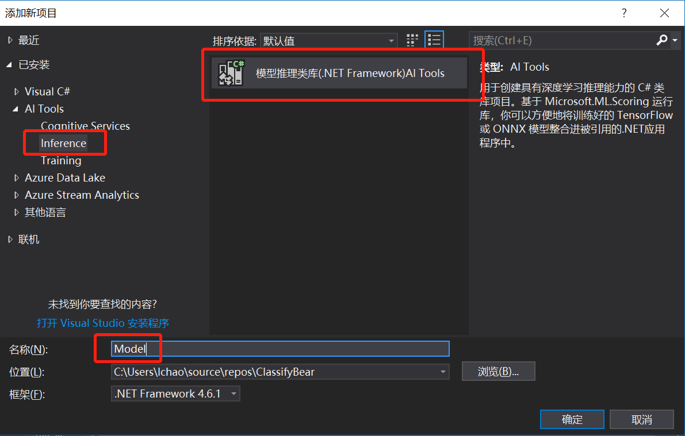
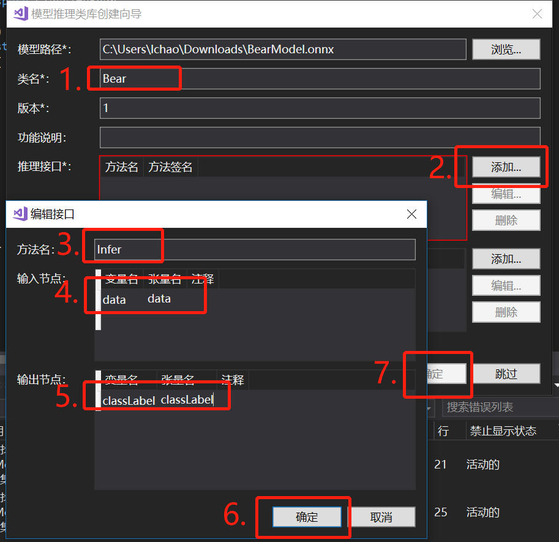
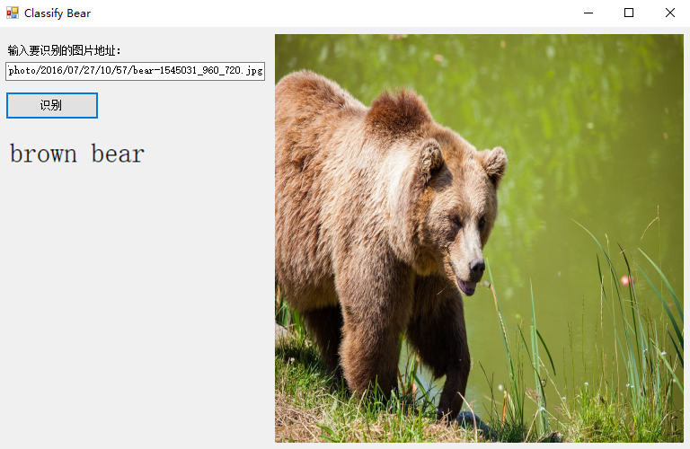

# 使用Tools for AI封装onnx模型并推理

进行这一步之前，请确保已正确安装配置了Visual Studio 2017 和
Microsoft Visual Studio Tools for
AI环境。

项目的代码也可以在[这里](./src/OnnxWithToolsForAI)找到，下面的步骤是带着大家从头到尾做一遍。

## 界面设计

创建Windows窗体应用(.NET
    Framework)项目，这里给项目起名ClassifyBear。

注意，项目路径不要包含中文。

在解决方案资源管理器中找到Form1.cs，双击，打开界面设计器。从工具箱中向Form中依次拖入控件并调整，最终效果如下图所示：


左侧从上下到依次是：

  - Label控件，将内容改为“输入要识别的图片地址：”

  - TextBox控件，可以将控件拉长一些，方便输入URL

  - Button控件，将内容改为“识别”

  - Lable控件，将label的内容清空，用来显示识别后的结果。因为label也没有边框，所以在界面看不出来。可以将此控件的字体调大一些，能更清楚的显示推理结果。

右侧的控件是一个PictureBox，用来预览输入的图片，同时，我们也从这个控件中取出对应的图片数据，传给我们的模型推理类库去推理。建议将控件属性的SizeMode更改为StretchImage，并将控件长和宽设置为同样的值，保持一个正方形的形状，这样可以方便我们直观的了解模型的输入，因为在前面查看模型信息的时候也看到了，该模型的输入图片应是正方形。

## 封装模型推理类库

由于目前模型推理用到的库只支持x64，所以这里需要将解决方案平台设置为x64。打开解决方案资源管理器，在解决方案上点右键，选择配置管理器。


在配置管理器对话框中，点开活动解决方案平台下拉框，选择新建


在新建解决方案平台对话框中，输入新平台名x64，点击确定即可


下面添加模型推理类库，再次打开解决方案资源管理器，在解决方案上点右键，选择添加，然后选择新建项目。

添加新项目对话框中，将左侧目录树切换到AI
Tools下的Inference，右侧选择模型推理类库，下方填入项目名称，这里用Model作为名称。



确定以后会出现检查环境的进度条，耐心等待一会就可以出现模型推理类库创建向导对话框。

点击模型路径后面的浏览按钮，选择前面下载的BearModel.onnx模型文件。

注意，这里会出现几处错误提示，我们需要手动修复一下。首先会看到“发现不支持的张量的数据类型”提示，可以直接点确定。


确定后如果弹出“正在创建项目…”的进度条，一直不消失，这里只需要在类名后面的输入框内点一下，切换下焦点即可。


然后，我们来手动配置一下模型的相关信息。类名输入框中填入模型推理类的名字，这里用Bear。然后点击推理接口右侧的添加按钮，在弹出的编辑接口对话框中，随便起个方法名，这里用Infer。输入节点的变量名和张量名填入data，输出节点的变量名和张量名填入classLabel，字母拼写要和之前查看模型时看到的拼写一模一样。然后一路确定，再耐心等待一会，就可以在解决方案资源管理器看到新建的模型推理类库了。



至此，模型推理类库封装完成。

## 使用模型推理类库

首先添加对模型推理类库的引用，切换到解决方案资源管理器，在ClassifyBear项目的引用上点右键，选择添加引用。


在弹出的引用管理器对话框中，选择项目、解决方案，右侧可以看到刚刚创建的模型推理类库，勾选该项目，点击确定即可。


在Form1.cs上点右键，选择查看代码，打开Form1.cs的代码编辑窗口。

添加两个成员变量
```C#
// 使用Netron查看模型，得到模型的输入应为227*227大小的图片
private const int imageSize = 227;

// 模型推理类
private Model.Bear model;
```

回到Form1的设计界面，双击Form的标题栏，会自动跳转到代码页面并添加了Form1\_Load方法，在其中初始化模型推理对象
```C#
private void Form1_Load(object sender, EventArgs e)
{
    // 初始化模型推理对象
    model = new Model.Bear();
}
```

回到Form1的设计界面，双击识别按钮，会自动跳转到代码页面并添加了button1\_Click方法，在其中添加以下代码：

首先，每次点击识别按钮时都先将界面上显示的上一次的结果清除
```C#
// 识别之前先重置界面显示的内容
label1.Text = string.Empty;
pictureBox1.Image = null;
pictureBox1.Refresh();
```

然后，让图片控件加载图片
```C#
bool isSuccess = false;
try
{
    pictureBox1.Load(textBox1.Text);
    isSuccess = true;
}
catch (Exception ex)
{
    MessageBox.Show($"读取图片时出现错误：{ex.Message}");
    throw;
}
```

如果加载成功，将图片数据传给模型推理类库来推理。
```C#
if (isSuccess)
{
    // 图片加载成功后，从图片控件中取出227*227的位图对象
    Bitmap bitmap = new Bitmap(pictureBox1.Image, imageSize, imageSize);

    float[] imageArray = new float[imageSize * imageSize * 3];

    // 按照先行后列的方式依次取出图片的每个像素值
    for (int y = 0; y < imageSize; y++)
    {
        for (int x = 0; x < imageSize; x++)
        {
            var color = bitmap.GetPixel(x, y);

            // 使用Netron查看模型的输入发现
            // 需要依次放置227 *227的蓝色分量、227*227的绿色分量、227*227的红色分量
            imageArray[y * imageSize + x] = color.B;
            imageArray[y * imageSize + x + 1* imageSize * imageSize] = color.G;
            imageArray[y * imageSize + x + 2* imageSize * imageSize] = color.R;
        }
    }

    // 模型推理类库支持一次推理多张图片，这里只使用一张图片
    var inputImages = new List<float[]>();
    inputImages.Add(imageArray);

    // 推理结果的第一个First()是取第一张图片的结果
    // 之前定义的输出只有classLabel，所以第二个First()就是分类的名字
    label1.Text = model.Infer(inputImages).First().First();
}
```

注意，这里的数据转换一定要按照前面查看的模型的信息来转换，图片大小需要长宽都是227像素，并且要依次放置所有的蓝色分量、所有的绿色分量、所有的红色分量，如果顺序不正确，不能达到最佳的推理结果。

## 测试

编译运行，然后在网上找一张[熊的图片](https://cdn.pixabay.com/photo/2016/07/27/10/57/bear-1545031_960_720.jpg)，把地址填到输入框内，然后点击识别按钮，就可以看到识别的结果了。注意，这个URL应该是图片的URL，而不是包含该图片的网页的URL。


