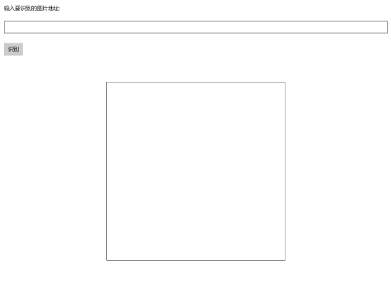

# 使用[Windows Machine Learning](https://docs.microsoft.com/zh-cn/windows/ai/)加载ONNX模型并推理

项目的完整代码在[这里](./src/OnnxWithWinML)可以找到，下面是详细步骤：

## 环境要求

[Windows Machine Learning](https://docs.microsoft.com/zh-cn/windows/ai/)支持在Windows应用程序中加载并使用训练好的机器学习模型。Windows 10从10.0.17763.0版本开始提供这套推理引擎，所以需要安装17763版本的Windows 10 SDK进行开发，并且需要运行在17763及以上版本的Windows 10中。

## 创建UWP项目

打开Visual Studio 2017，新建项目，在Visual C#分类中选择`空白应用(通用 Windows)`，填写项目名称为`ClassifyBear`，点击确定


在弹出的对话框中，设置目标版本和最低版本都是17763


## 添加模型文件到项目中

打开解决方案资源管理器中，在项目中的`Assets`目录上点右键->添加->现有项，添加模型文件`BearModel.onnx`

模型是在应用运行期间加载的，所以在编译时需要将模型复制到运行目录下。在模型文件上点右键，属性，然后在属性面板上，将`生成操作`属性改为`内容`，将`复制到输出目录`属性改为`如果较新则复制`。


打开解决方案资源管理器，应该可以看到在项目根目录自动生成了和模型同名的代码文件`BearModel.cs`，里面就是对该模型的一层封装，包括了输入输出的定义、加载模型的方法以及推理的方法。

> 如果在解决方案资源管理器中没有看到该文件，说明生成失败，失败的原因可能是路径中包含中文、或者onnx模型不合法、或者其它原因，可以尝试手动生成。
> 
> 在开始菜单中找到`VS 2017的开发人员命令提示符`并打开，运行如下命令
> 
> ```
> mlgen.exe -i d:\BearModel.onnx -o d:\BearModel.cs -l CS -n BearModel
> ```
>
> 其中，`-i`指定ONNX模型路径，`-o`指定要生成的封装代码的路径，`-l`指定代码的语言，`-n`指定代码使用的命名空间。注意，命令中不要出现中文字符。
>
> 生成成功后，可以手动将生成的BearModel.cs添加项目中；如果还是生成失败，需要根据错误信息继续排查原因

## 设计界面

打开`MainPage.xaml`，将整个Grid片段替换为如下代码：

``` xml
<Grid>
    <StackPanel Margin="12">
        <TextBlock Text="输入要识别的图片地址:" Margin="12"></TextBlock>
        <TextBox x:Name="tbImageUrl" Margin="12"></TextBox>
        <Button x:Name="tbRun" Content="识别" Tapped="TbRun_Tapped" Margin="12"></Button>
        <TextBlock x:Name="tbBearType" Margin="12"></TextBlock>
        <Grid BorderBrush="Gray" BorderThickness="1" Margin="12" Width="454" Height="454">
            <Image x:Name="imgBear" Stretch="Fill" ImageOpened="ImgBear_ImageOpened" ImageFailed="ImgBear_ImageFailed"></Image>
        </Grid>
    </StackPanel>
</Grid>
```

显示效果如下图：



- 输入框`tbImageUrl`中用来输入要识别的图片的URL
- 按钮`tbRun`用来触发加载图片
- 文本框`tbBearType`用来显示识别的结果
- 图片控件`imgBear`用来预览要识别的图片，同时，我们也从这个控件中取出对应的图片数据，传给我们的模型推理类库去推理。这里将图片控件设置为正方形并且将`Stretch`属性设置为`Fill`，可以保证图片拉伸显示为一个正方形的形状，这样可以方便我们直观的了解模型的输入，因为在前面查看模型信息的时候也看到了，该模型的输入图片应是227\*227的正方形。

上面的`XAML`片段中分别给按钮和图片控件添加了事件响应，我们在后续小节中添加对应的实现。

## 添加按钮的事件响应

前面`XAML`文件中给按钮添加事件，这里在`MainPage.xaml.cs`中完成对应的实现，从输入框中读入图片的URL，然后让图片控件加载该URL对应的图片：

``` C#
private void TbRun_Tapped(object sender, TappedRoutedEventArgs e)
{
    tbBearType.Text = string.Empty;

    Uri imageUri = null;
    try
    {
        imageUri = new Uri(tbImageUrl.Text);
    }
    catch (Exception)
    {
        tbBearType.Text = "URL不合法";
        return;
    }

    tbBearType.Text = "加载图片...";

    imgBear.Source = new BitmapImage(imageUri);
}
```

## 添加图片控件的事件响应

前面`XAML`文件中给图片控件添加了两个事件：图片加载完成的事件和加载失败的事件，这里在`MainPage.xaml.cs`中完成对应的实现：

``` C#
private void ImgBear_ImageOpened(object sender, RoutedEventArgs e)
{
    RecognizeBear();
}

private void ImgBear_ImageFailed(object sender, ExceptionRoutedEventArgs e)
{
    tbBearType.Text = "图片加载失败";
}
```

###处理模型的输入

打开自动生成的模型封装文件`BearModel.cs`可以看到需要的输入如下：

```C#
public sealed class BearModelInput
{
    public ImageFeatureValue data; // BitmapPixelFormat: Bgra8, BitmapAlphaMode: Premultiplied, width: 227, height: 227
}
```

这里需要一个`ImageFeatureValue`类型的数据，可以使用`ImageFeatureValue.CreateFromVideoFrame`从`VidelFrame`中创建。使用`ImageFeatureValue`时，你可以不用担心图片格式的转换和缩放，系统会自动处理图片来匹配模型需要的输入格式。目前支持的像素格式为Gray8、Rgb8和Bgr8，色值范围为0-255。

下面是处理图片输入的代码：

``` C#
private async Task<BearModelInput> GetInputData()
{
    // 将图片控件重绘到图片上
    RenderTargetBitmap rtb = new RenderTargetBitmap();
    await rtb.RenderAsync(imgBear);

    // 取得所有像素值
    var pixelBuffer = await rtb.GetPixelsAsync();

    // 构造模型需要的输入格式
    SoftwareBitmap softwareBitmap = SoftwareBitmap.CreateCopyFromBuffer(pixelBuffer, BitmapPixelFormat.Bgra8, rtb.PixelWidth, rtb.PixelHeight);
    VideoFrame videoFrame = VideoFrame.CreateWithSoftwareBitmap(softwareBitmap);
    ImageFeatureValue imageFeatureValue = ImageFeatureValue.CreateFromVideoFrame(videoFrame);

    BearModelInput bearModelInput = new BearModelInput();
    bearModelInput.data = imageFeatureValue;
    return bearModelInput;
}
```

## 加载模型并推理

这是最关键的一步，也是非常简单的一步。自动生成的模型封装文件`BearModel.cs`中已经封装了加载模型的方法和推理的方法，直接调用就可以：

``` C#
private async void RecognizeBear()
{
    // 加载模型
    StorageFile modelFile = await StorageFile.GetFileFromApplicationUriAsync(new Uri($"ms-appx:///Assets/BearModel.onnx"));
    BearModelModel model = await BearModelModel.CreateFromStreamAsync(modelFile);

    // 构建输入数据
    BearModelInput bearModelInput = await GetInputData();

    // 推理
    BearModelOutput output = await model.EvaluateAsync(bearModelInput);

    tbBearType.Text = output.classLabel.GetAsVectorView().ToList().FirstOrDefault();
}
```

## 测试

编译运行，然后在网上找一张[熊的图片](https://cdn.pixabay.com/photo/2016/07/27/10/57/bear-1545031_960_720.jpg)，把地址填到输入框内，然后点击识别按钮，就可以看到识别的结果了。注意，这个URL应该是图片的URL，而不是包含该图片的网页的URL。

