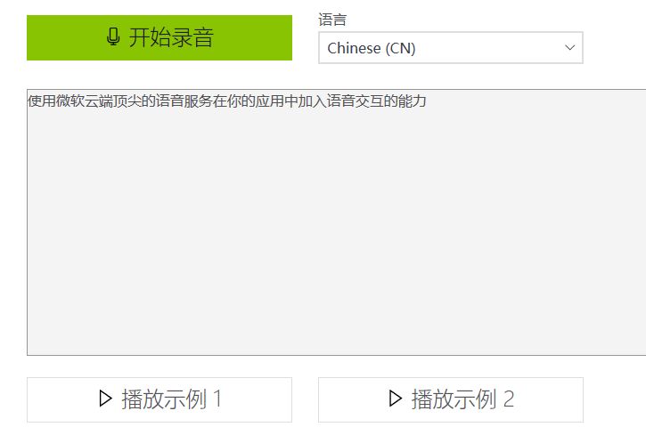
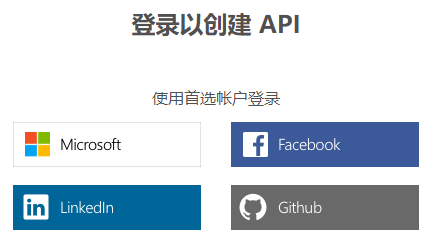
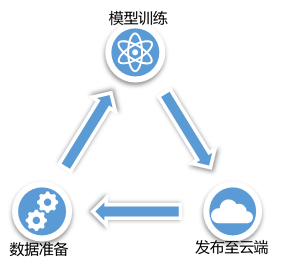
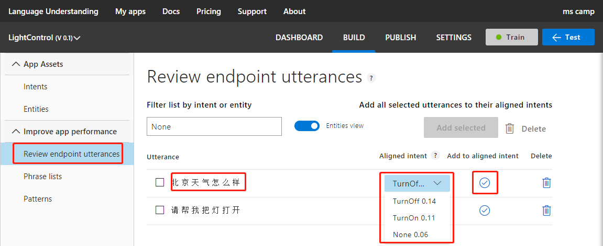
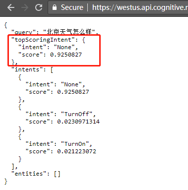
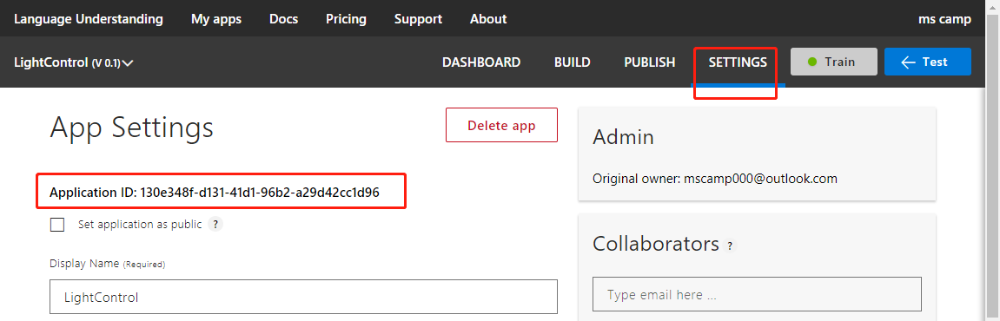
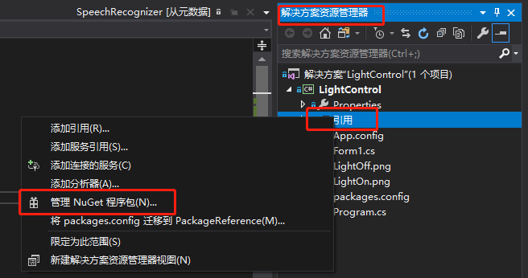

# 智能家居
Copyright © Microsoft Corporation. All rights reserved.
  适用于[License](https://github.com/Microsoft/ai-edu/blob/master/LICENSE.md)版权许可
  
**主要知识点：**

  - 了解微软认知服务 – 语音转文字服务

  - 了解微软认知服务 – 语言理解服务

  - 在线定制语言理解服务

  - 动手做一个智能家居应用

# 目录

- [概述](#概述)
  - [流程](#流程)
  - [语音转文本服务](#语音转文本服务)
    - [在线体验](#在线体验)
  - [申请试用](#申请试用)
  - [在Azure中申请使用](#在azure中申请使用)
- [语言理解服务](#语言理解服务)
  - [在线体验](#在线体验-1)
  - [基本术语](#基本术语)
    - [LUIS应用程序](#luis应用程序)
    - [意图(Intent)](#意图intent)
    - [实体(Entity)](#实体entity)
    - [语句(Utterance)](#语句utterance)
  - [定制语言理解服务](#定制语言理解服务)
    - [登录LUIS](#登录luis)
    - [创建LUIS应用](#创建luis应用)
    - [添加意图](#添加意图)
    - [添加实体](#添加实体)
    - [训练](#训练)
    - [测试](#测试)
    - [发布](#发布)
    - [迭代](#迭代)
    - [查看应用程序ID](#查看应用程序id)
  - [密钥管理](#密钥管理)
    - [创作密钥](#创作密钥)
    - [终结点密钥](#终结点密钥)
    - [分配密钥](#分配密钥)
- [构建智能家居应用](#构建智能家居应用)
  - [界面设计](#界面设计)
  - [集成语音服务SDK和语言理解服务SDK](#集成语音服务sdk和语言理解服务sdk)
- [扩展和习题](#扩展和习题)
- [代码](.微软-方案1/src)

# 概述

科技的不断发展带动着人们生活质量不断的提升，其中一方面就体现在日常家庭生活中，智能设备层出不穷，给人们的生活带来了很大的便利。

以电视为例，几十年前的电视还是按钮式的，每次换台还要跑到电视跟前；后来使用遥控器控制成为了主流，人们可以舒服的窝在沙发里看电视；再后来随着互联网及移动通信技术的发展，电视、机顶盒、空调等，都可以在手机上进行控制，再也不用几个遥控器之间来回倒腾了，还不耽误刷微博；近年来随着人工智能的发展，语音识别、合成技术日趋成熟，家电已经可以理解语音指令，能够按照人类的交流方式进行人机交互了，人们只需要动嘴说说话就可以完成各种操控。

一种智能家居的典型场景如下图所示，以智能音箱为核心，所有设备通过WiFi与智能音箱连接并可以接受智能音箱的控制指令。

人们可以和音箱打招呼，音箱能够自然的回答问好；也可以询问天气，音箱能够自动根据当前位置搜索并回答未来一天的天气；还可以直接对着音箱说一声“把灯关掉”，音箱应该能够控制关掉灯，或者主动询问“要关哪个灯”，在得到明确指令后再执行指定的操作。


本文将借助微软认知服务中的多个服务实现一个简单的智能家居应用，来模拟一个语音控制开关灯的场景，期望能给予大家一些启示，并期望大家可以利用更多的微软认知服务扩展出更多炫酷实用的功能。

# 流程

这一节我们看一下语音控制开关的流程是怎样的。

从场景上来看很简单，人直接说“开灯”，灯就可以打开，当然说“请把灯打开”，灯也应该能够打开。

但是对于传统的程序员来说，实现起来主要的难点在于如何让程序理解人类说的话，尤其是用户一般都是用很自然的语言去说，用户的习惯不一样，语法结构也不一样。

为了解决这个难点，这里我们将借助微软认知服务里的语音转文本服务和语言理解服务来赋予程序理解人类说话的能力。

要做到这些，主要分三个步骤：

第一步，借助语音转文本服务，将用户的语音输入识别成对应的文字，比如“开灯”、“请把灯打开”等等。

第二步，借助语言理解服务来将自然语言转为程序可以理解的意图。不管用户是说“开灯”还是“请把灯打开”，语言理解服务都可以识别出用户的意图是打开(TurnOn)。

第三步，按照识别出的用户的意图去控制灯打开或关闭。


# 语音转文本服务

语音转文本服务提供将音频流转录为文本的能力，微软的语音转文本服务采用了和微软小娜相同的技术。应用程序借助此服务可以轻松地将声音转录为文字，之后可以直接显示或做更进一步的使用。

语音服务提供SDK和REST
API两种使用方式。使用SDK可以将服务更方便的集成到应用程序中，并且可以提供额外的功能，如实时的中间转录结果、静默一段时间自动停止、转录超长的音频等。目前提供的SDK有.Net、C/C++、Java版本，如果使用其它编程语言，可以考虑更通用的REST
API方式，但是不能提供SDK中所有的功能。

## 在线体验

语音转文本服务的在线体验地址是<https://azure.microsoft.com/zh-cn/services/cognitive-services/speech-to-text/>，可以先通过此页面对该服务有个初步的认识。

如果设备有麦克风，可以点击开始录音，然后对着麦克风说话，查看语音转文本的效果；如果没有麦克风，也可以点击下方的两个示例体验一下。

可以看到网页在录音的过程中，同时显示语音转文本的中间结果，并按照最新播放的内容不断纠正旧文本、显示新文本，最终给出了一个最佳的文本结果。



## 申请试用

后面要在程序中调用语音转文本服务，必须要有服务密钥才可以。

试用密钥的有效期是 30 天，每月 5000 个事务，每分钟 20
    个。每个账号只能申请一次试用。

申请步骤：

1.  打开申请试用页面：<https://azure.microsoft.com/zh-cn/try/cognitive-services/?api=speech-services>

2.  找到语音服务，点击右侧的获取API密钥


3.  在弹出页面点击来宾7天试用下面的开始使用(不用管这里显示的7天，语音服务现在还是预览版，有30天的试用期，申请完成后显示30天)


4.  在服务条款页面勾选同意，选择国家/地区为中国，下一步


5.  选择要使用的账号，笔者这里选择Microsoft



6.  登录后可以看到密钥申请成功，如下图所示


这里要注意图中重点标出的部分，一个是终结点中westus，这个是当前密钥可使用的区域，试用密钥都是westus；另一个是下面的密钥1和密钥2。区域和密钥稍后在后面程序代码中要用到，大家可以单独记下来或者保持该网页不要关闭，方便后续使用。

## 在Azure中申请使用

上面30天的试用密钥过期后如果想继续免费使用该服务，还可以到Azure门户中申请密钥，前提是首先要有Azure账户。

如果还没有Azure账户，可以免费注册一个。打开免费注册页面，<https://azure.microsoft.com/zh-cn/free/ai/>，点击免费开始，然后按提示一步步补充完整注册信息。注册过程中需要验证手机号及信用卡，而且会看到1美元的预付款，不过不用担心，这1美元只是用来验证信用卡是否可用，会在几天后返还。

有了Azure账户后，打开Azure门户网站，<https://portal.azure.com/>，点击创建资源，搜索找到Speech(预览)，按提示一步步创建，就可以得到对应的密钥。

# 语言理解服务

语言理解服务，Language Understanding Intelligence
Service，简称LUIS。后面文中使用LUIS来代替语言理解服务。

LUIS提供在线的API服务，可以将用户输入的自然语言描述的文本，转换成为计算机能够直接使用的结构化的信息，这样应用程序就可以借助LUIS理解人类自然语言的输入。

## 在线体验

LUIS的在线体验场景是<https://azure.microsoft.com/zh-cn/services/cognitive-services/language-understanding-intelligent-service/>。

打开网页后，可以看到如下图所示的示例。可以选择一条指令来观察灯光的变化，也可以通过输入自定的指令文本来控制灯光，可以试试自己习惯的语法，看能否正确的控制灯光变化。


## 基本术语

### LUIS应用程序

在使用LUIS的过程中，我们最初会接触到app这个词，这里的app是指LUIS应用程序。一个LUIS应用程序其实对应的就是一个语言理解模型。通常情况下，一个LUIS应用程序（即一个模型），是用来解决一个特定域（主题）内的语言理解问题的。

举个例子，对于旅行相关的主题，如预订机票、酒店等，可以创建一个LUIS应用程序，而对于购物相关的主题，如搜索商品、下单，可以再创建另外一个LUIS应用程序。

### 意图(Intent)

意图(Intent)，表示用户想要执行的任务或操作。比如询问天气、预订机票等，都是意图，在控制开关灯的例子中，开灯和关灯就是意图。

### 实体(Entity)

实体(Entity)，想当于上面意图中的参数。比如对象、时间、地点等，都可以标记为实体。举个例子，帮我预定明天北京飞往西雅图的飞机，这里用到了三个实体：明天、北京、西雅图，分别表示了时间、始发地、目的地三个参数。

另外，实体在不同的意图之间是可以共享的。举个例子，明天天气怎么样，这个语句的意图是询问天气，而明天是其中的一个实体，表示时间参数，和上一个例子中的实体是一样的。

### 语句(Utterance)

语句(Utterance)，是LUIS应用需要处理的用户的输入。在训练时提供的语句应该是尽可能包含不同的说话方式或不同的语法的，这样训练出来的结果会更好一些。

## 定制语言理解服务

LUIS提供一些预先构建好的域、实体及意图，覆盖了比较全的场景。一种常见的做法是添加预构建的内容，然后迭代完成自定义的模型。

我们这里的演示的场景比较简单，直接动手从头定制一个语音控制开关灯需要用到的LUIS应用程序。

### 登录LUIS

打开LUIS网站<https://www.luis.ai>，并登录对应的微软账号。


如果是第一次登录，网站还会请求访问对应账号的一些信息，点Yes继续。网站首次加载较慢，需要耐心等待，必要的时候可以刷新重新再次加载。

如果页面跳转到了欢迎页面<https://www.luis.ai/welcome>，可以翻到页面最下方，点击Create LUIS
app，然后在下一个页面补充缺失的信息，将Country设为China，并勾选I agree条款，然后点击Continue。


直到看到My Apps页面，才算登录完成，如下图所示


### 创建LUIS应用

点击Create new
app，创建一个新的LUIS应用。注意，Culture要选择Chinese，Name随意，这里使用LightControl。然后点击Done完成创建。


### 添加意图

创建完LUIS应用程序后会直接进入Intents页面，也可以通过点击左侧的Intents进入。然后点Create new
intent创建一个新的意图。


在弹出窗中输入意图的名称，这里使用TurnOn表示开灯的意图，完成后点击Done。注意这里意图的名称在后面程序中会用到，拼写及大小写要保持前后一致。


完成后会进入TurnOn意图的设置页面，可以在输入框中输入不同的语句，然后回车就可添加到语句列表中。这里添加了4条语句：打开、开灯、请开灯、把灯打开。


点击左侧Intents回到意图页面，然后重复上面的步骤，添加TurnOff意图表示关灯，并添加4条语句：关闭、关灯、请关灯、关闭灯泡。

### 添加实体

意图是必需的，而实体不是必需的。可以根据具体的场景来决定是否添加实体，比如有需要控制客厅灯和卧室灯两个灯，应该定义个实体来标记房间是客厅还是卧室，而不是使用多个意图分别控制不同的灯。

LUIS支持多种类型的实体来应对各种复杂的情况，包括简单实体、列表实体、正则表达式、复合实体等，这里不详细展开，有兴趣的可以参考<https://docs.microsoft.com/zh-cn/azure/cognitive-services/luis/luis-concept-entity-types>里的介绍。

在我们下面的例子中只控制一个灯，这里就不添加实体了。

### 训练

添加完意图和实体后就可以训练了，可以看到右上角有个带红点的Train按钮，点击就可以直接训练。训练速度非常快，几秒种之后看到红点变成绿点就表示训练完成了。


### 测试

点击右上角的Test，会滑出Test侧边栏，在输入框中输入测试语句并回车，可以看到对应的意图及得分。这里使用的测试语句是请帮我把灯打开，可以看到识别到的意图是TurnOn，得分是0.86，意图正确且比较接近1，结果还不错。


### 发布

点击顶部的PUBLISH进入发布页面，在页面中点击Publish按钮就直接发布了。发布成功后可以看到右侧的版本号及发布时间。


将页面翻到底部可以找到服务发布后的区域、密钥和终结点。


可以直接使用终结点地址对发布后的服务进行测试。要注意这里的终结点是以q=结尾的，需要在终结点的最后拼上要测试的语句，比如请帮我把灯打开，得到一个完整的链接，然后再从浏览器里打开，就可以看到识别后的结果。

识别结果是以JSON格式返回的，其中topScoringIntent是最匹配的意图，我们后面要用到。


### 迭代

LUIS应用在发布后可以继续改进数据，添加新语句或意图或实体，然后再训练，再发布。在这样的周期中反复迭代，最终达到最佳的效果。



在上一步发布的终结点最后拼上一个新的语句“北京天气怎么样”，然后在浏览器进行测试，可以发现最终topScoringIntent是TurnOff，这显然是不对的，而且得分只有0.14，和其它几个意图的得分差不多。


我们需要对模型改进一下，再进行一次迭代。回到LUIS的意图页面，我们可以看到这里有一个None意图，这是创建完LUIS应用程序后自带的一个意图，可以直接打开该意图的页面，在其中添加一条语句无关语句，比如“北京天气怎么样”。


还一种做法是通过审查终结点上得到的语句来改进模型。点击左侧的Review endpoint
utterances，进入审查页面，可以看到我们刚才在终结点上查询的语句，我们可以把“北京天气怎么样”右侧的Aligned
Intent改为None，然后点击右侧的对勾，此时，该语句就会被自动加到了None意图中。



然后再次训练、发布，再使用之前的终结点查询“北京天气怎么样”，可以看到结果正确，topScoringIntent是None意图。



Tips：最佳实践是None意图中语句的数量应占总语句数量的10%~20%。

### 查看应用程序ID

点击SETTINGS进入应用程序设置页面就可以看到Application ID，某些情况下会用到。



## 密钥管理

如果要在程序中调用LUIS服务，必须要有密钥。LUIS
中有两种密钥：创作密钥和终结点密钥。

创作密钥是在首次登录LUIS时自动分配的，终结点密钥是在Azure门户申请的。终结点密钥不是必需的，可以在下面的示例中继续使用创作密钥。但是创作密钥的免费配额要比终结点密钥低得多，所以还是建议在LUIS应用程序发布后，申请一个终结点密钥并分配给LUIS应用程序供外部调用。

### 创作密钥

创作密钥是在登录LUIS时自动创建的免费密钥，创建的多个LUIS应用程序使用同一个密钥，且每月只能调用1千次。

创作密钥的值可以在User settings中找到，点击右上账户名出现下拉菜单，再点击Settings，就可以看到创作密钥：


也可以在发布页面的终结点处看到创作密钥：


### 终结点密钥

终结点密钥是在Azure门户中申请的密钥，申请的免费密钥的配额是月1万次调用，每秒最多5次调用，远大于创作密钥的配额。

终结点密钥的申请方法和前面介绍的在Azure门户中申请语音服务密钥的方法类似，在创建资源时搜索LUIS即可找到Language
Understanding服务，按步骤创建个免费密钥即可。

这里我们换一种申请方式，在Visual Studio中借助Tools for AI来申请密钥。

1.  确保已安装Visual Studio 2017并安装了Tools for AI扩展。

如果没有安装，请参考[AI应用开发实战 -
从零开始配置环境](https://www.cnblogs.com/ms-uap/p/9123033.html)中Windows下开发环境搭建的第1节安装VS和第5节安装Tools
for AI插件。

2.  确保Visual Studio中登录了对应的微软账号。

如果没有登录，可以在Visual Studio的右上角看到登录按钮，点击后按步骤登录。

3.  确保可以看到Azure订阅

在视图菜单中，选择Cloud Explorer，如下图点击账户管理，确保可以刷出你的订阅，如果没有刷出，请尝试重启Visual
Studio并稍后再试。


4.  创建认知服务

在视图菜单中，选择服务器资源管理器，找到AI工具，在Azure认知服务上点右键，创建新认知服务。


选择已有的订阅，新申请的账户通常会有个名为免费试用的订阅。选择一个已有的资源组，如果没有资源组，需要在Azure上先创建一个。API类型选择LUIS。服务名可以随便起，这里使用LUIS。位置可以先东亚，East
Asia。定价申请免费的，直接选F0。点击确定来创建。


创建成功后可以在Azure认知服务下看到名为LUIS的服务，右键选择管理密钥，就可以看到申请的密钥1和密钥2。新申请的密钥需要几分钟的部署时，之后才可以使用。


### 分配密钥

新申请的终结点密钥需要分配到LUIS应用程序中才可以使用对应的终结点进行查询。

回到LUIS的发布页面，翻到最下面的Resources and Keys，切换到Asia Regions，点击Add Key按钮。


在弹出的Assign a key to your app对话框中，依次选择刚才使用的订阅和创建的密钥，点击Add Key按钮。


可以看到Resoures and Keys中Asia
Regions下出现了终结点密钥和使用该密钥的终结点地址。

# 构建智能家居应用

程序的源代码在[这里](./src)，将源代码下载到本地后，用Visual
Studio
2017打开解决方案文件LightControl.sln。

## 界面设计

在解决方案资源管理器中找到Form1.cs，双击打开对应的设计界面，如下图所示。


左侧是一个图片控件，可以显示灯打开时和关闭时的图片，来模拟真实的开关灯操作。在解决方案资源管理器中可以看到LightOn.png和LightOff.png两张图片，用来显示灯处在不同的状态下。

右侧是一个文本框，用来显示一些日志，比如语音转文本过程中的中间结果、最终结果以及识别出的意图等信息。通过日志，我们可以看到语音服务和LUIS是否已正常连接并正常工作，如果出现异常，也会在这里显示异常信息，方便对问题进行排查。

在Form窗体上点右键，查看代码，打开该窗体的代码页面。

首先，在构造函数中，控件初始化完成后，让图片控件显示一张关闭着的灯的图片：

```C#
public Form1()
{
    InitializeComponent();
    pictureBox1.Load("LightOff.png");
}
```

然后，封装要用到的一些界面操作，例如，在右侧文本框中追加日志输出，模拟打开灯，关闭灯等：
```C#
private void Log(string message, params string[] parameters)
{
    MakesureRunInUI(() =>
    {
        if (parameters != null && parameters.Length > 0)
        {
            message = string.Format(message + "\r\n", parameters);
        }
        else
        {
            message += "\r\n";
        }
        textBox1.AppendText(message);
    });
}

private void OpenLight()
{
    MakesureRunInUI(() =>
    {
        pictureBox1.Load("LightOn.png");
    });
}

private void CloseLight()
{
    MakesureRunInUI(() =>
    {
        pictureBox1.Load("LightOff.png");
    });
}

private void MakesureRunInUI(Action action)
{
    if (InvokeRequired)
    {
        MethodInvoker method = new MethodInvoker(action);
        Invoke(action, null);
    }
    else
    {
        action();
    }
}
```

## 集成语音服务SDK和语言理解服务SDK

这个代码示例中，我们用语音服务SDK来处理音频转文本，用语言理解服务SDK来提取文本中的意图。

首先添加SDK的引用。切换到解决方案资源管理器，在LightControl下的引用上点右键，选择管理NuGet程序包。



在打开的NuGet包管理器中，依次搜索并安装下面3个引用：

  - Microsoft.CognitiveServices.Speech

  - Newtonsoft.Json

  - Microsoft.Azure.CognitiveServices.Language.LUIS.Runtime

> 本次案例中使用的这三个库的版本分别是v1.2.0、v12.0.1、v2.0.0，如果后期有新版本库出现，后续代码的实现可能略有不同。

然后回到Form1.cs的代码编辑页面，引用命名空间
```C#
using Microsoft.CognitiveServices.Speech;
using Microsoft.Azure.CognitiveServices.Language.LUIS.Runtime;
```

然后配置两个服务用到的密钥、区域及终结点

本文前面申请到的语音服务的30天试用密钥是`6d04e77c6c6f4a02a9cf942f6419ffaf`，区域是`westus`。前面定制的LUIS应用程序的ID是`130e348f-d131-41d1-96b2-a29d42cc1d96`，密钥这里示例先用创作者密钥`58c57e08c8d540a4aa2196588eb69f8a`，终结点字符串比较长，但是LUIS
SDK中只需配置到域名即可，不需要后面的路径，所以这里的终结点是`https://westus.api.cognitive.microsoft.com`
```C#
// 设置语音服务密钥及区域
const string speechKey = "6d04e77c6c6f4a02a9cf942f6419ffaf";
const string speechRegion = "westus";

// 设置语言理解服务终结点、密钥、应用程序ID
const string luisEndpoint = "https://westus.api.cognitive.microsoft.com";
const string luisKey = "58c57e08c8d540a4aa2196588eb69f8a";
const string luisAppId = "130e348f-d131-41d1-96b2-a29d42cc1d96";
```

然后初始化SDK

添加成员变量语音识别器和意图预测器，并在Form1\_Load函数中初始化，挂载对应的事件处理函数。

Tips：Form1\_Load函数需通过在Form窗体设计界面直接双击窗体的标题栏来添加。
```C#
// 语音识别器
SpeechRecognizer recognizer;

// 意图预测器
Prediction intentPrediction;

private void Form1_Load(object sender, EventArgs e)
{
    try
    {
        SpeechConfig config = SpeechConfig.FromSubscription(speechKey, speechRegion);
        config.SpeechRecognitionLanguage = "zh-cn";
        recognizer = new SpeechRecognizer(config);

        // 挂载识别中的事件
        // 收到中间结果
        recognizer.Recognizing += Recognizer_Recognizing;
        // 收到最终结果
        recognizer.Recognized += Recognizer_Recognized;
        // 发生错误
        recognizer.Canceled += Recognizer_Canceled;

        // 启动语音识别器，开始持续监听音频输入
        recognizer.StartContinuousRecognitionAsync();

        // 设置意图预测器
        LUISRuntimeClient client = new LUISRuntimeClient(new ApiKeyServiceClientCredentials(luisKey));
        client.Endpoint = luisEndpoint;
        intentPrediction = new Prediction(client);
    }
    catch (Exception ex)
    {
        Log(ex.Message);
    }
}
```

然后补充完整几个事件处理函数

语音转文本时会不断的接收到中间结果，这里把中间结果输出到日志窗口中
```C#
// 识别过程中的中间结果
private void Recognizer_Recognizing(object sender, SpeechRecognitionEventArgs e)
{
    if (!string.IsNullOrEmpty(e.Result.Text))
    {
        Log("中间结果: " + e.Result.Text);
    }
}
```

识别出现错误的时候，也把错误信息输出到日志窗口
```C#
// 出错时的处理
private void Recognizer_Canceled(object sender, SpeechRecognitionCanceledEventArgs e)
{
    Log("识别错误: " + e.ErrorDetails);
}
```

静默几秒后，SDK会认为语音结束，此时返回语音转文本的最终结果。这里拿到结果后，在日志窗口中显示最终结果，并进一步处理文本结果
```C#
// 获得音频分析后的文本内容
private void Recognizer_Recognized(object sender, SpeechRecognitionEventArgs e)
{
    if (!string.IsNullOrEmpty(e.Result.Text))
    {
        Log("最终结果: " + e.Result.Text);
        ProcessSttResultAsync(e.Result.Text);
    }
}
```

添加处理文本的函数，这里从文本中获取意图，然后根据意图的值，来执行开灯或关灯操作
```C#
private async void ProcessSttResultAsync(string text)
{
    // 调用语言理解服务取得用户意图
    string intent = await GetIntentAsync(text);

    // 按照意图控制灯
    if (!string.IsNullOrEmpty(intent))
    {
        if (intent.Equals("TurnOn", StringComparison.OrdinalIgnoreCase))
        {
            OpenLight();
        }
        else if (intent.Equals("TurnOff", StringComparison.OrdinalIgnoreCase))
        {
            CloseLight();
        }
    }
}
```

然后，添加对LUIS SDK的调用，可以从文本中获取意图
```C#
private async Task<string> GetIntentAsync(string text)
{
    try
    {
        var result = await intentPrediction.ResolveAsync(luisAppId, text);
        Log("意图: " + result.TopScoringIntent.Intent + "\r\n得分: " + result.TopScoringIntent.Score + "\r\n");
        return result.TopScoringIntent.Intent;
    }
    catch (Exception ex)
    {
        Log(ex.Message);
        return null;
    }
}
```

编译运行，并对着麦克风说出指令，就可以看到对应的效果了。同时我们可以看到语音转文本的中间结果在不断变化，说明服务端会根据后续接收到的音频不断进行调整，最终返回一个最佳的结果。


# 扩展和习题

本文通过介绍语音转文本服务及语言理解服务，并将两个服务集成在一个程序中完成了个模拟的智能家居应用。

回头看一下我们的场景非常简单，这里提出一些改进作为习题供大家练习：

  - 现在只能控制一个灯，可以考虑控制更多的灯，客厅灯，卧室灯，等等，可以考虑在LUIS中增加实体来实现这个目标。

  - 如果每次开灯或关灯时，智能家居都可以用人类的语音反馈给人“灯已打开”、“已经把灯关上了”，这样的话可以得到更好的体验。微软认知服务也提供了文本转语音的服务，在不久的将来还会支持开发者定义自己的语音字体，可以定制自己喜欢的声音，使得用户的体验更好。

  - 实现了多个灯的控制及语音反馈以后，还可以考虑让智能家居应用支持多轮对话。比如，当人说开灯的时候，智能家居可以询问“要打开哪里的灯”，并按照后续补充的指令打开对应的灯。

当然还可以举出更多的场景使得智能家居更完美，大家可以充分种用微软提供的认知服务，考虑并设计自己的智能家居应用。
