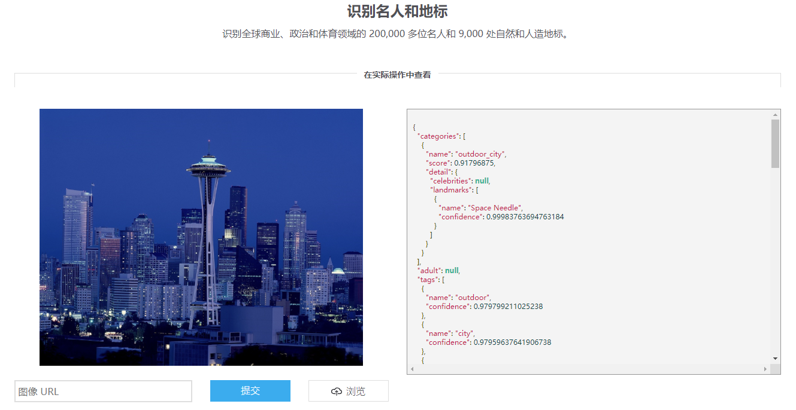

# 目录
Copyright © Microsoft Corporation. All rights reserved.
  适用于[License](https://github.com/Microsoft/ai-edu/blob/master/LICENSE.md)版权许可
  
[知识点](#知识点)

[不断演进的应用场景](#不断演进的应用场景)

> [初级应用场景—宅在家里](#初级应用场景宅在家里)
> 
> [中级应用场景—出门在外](#中级应用场景出门在外)
> 
> [高级应用场景—扩展信息](#高级应用场景扩展信息)
> 
> [终级的应用场景—并发处理](#终级的应用场景并发处理)
> 
> [重构](#重构)

[认知服务应用构建方式](#认知服务应用构建方式)

> [两种构建方式的比较](#两种构建方式的比较)
> 
> [另外一种分类方式](#另外一种分类方式)
> 
> [合理的应用架构](#合理的应用架构)

[从零开始构建中间服务层](#从零开始构建中间服务层)

> [环境要求与基本步骤](#环境要求与基本步骤)
> 
> [创建应用服务](#创建应用服务)
> 
> [两个基本概念](#两个基本概念)
> 
>> [依赖注入](#依赖注入)
> 
>> [发起HTTP请求](#发起http请求)
> 
> [文件目录组织方式和层次关系](#文件目录组织方式和层次关系)
> 
>> [基础服务层](#基础服务层)
> 
>> [集成服务层](#集成服务层)
> 
>> [任务调度层](#任务调度层)
> 
> [CognitiveServices文件夹](#cognitiveservices文件夹)
> 
> [MiddlewareService文件夹](#middlewareservice文件夹)
> 
> [Processors文件夹](#processors文件夹)
> 
> [其他文件的修改](#其他文件的修改)
> 
> [层次关系总结](#层次关系总结)
> 
> [完整的中间服务层系统堆栈](#完整的中间服务层系统堆栈)

[对中间服务层的测试](#对中间服务层的测试)

> [基本概念与环境搭建](#基本概念与环境搭建)
> 
> [负载测试 Load Test](#负载测试-load-test)
> 
>> [测试目的](#测试目的)
> 
>> [测试环境](#_Toc522280725)
> 
>> [测试方法与结果](#测试方法与结果)
> 
> [可靠性测试 Stability Test](#可靠性测试-stability-test)
> 
>> [测试目的](#测试目的-1)
> 
>> [测试环境](#测试环境-1)
> 
>> [测试方法与结果](#测试方法与结果-1)
> 
> [性能测试 Performance Test](#性能测试-performance-test)
> 
>> [测试目的](#测试目的-2)
> 
>> [测试环境](#测试环境-2)
> 
>> [测试方法与结果](#测试方法与结果-2)

[习题与进阶学习](#习题与进阶学习)

> [增加OCR服务以提供识别文字的功能](#增加ocr服务以提供识别文字的功能)
> 
> [部署到实际的Azure环境提供真实服务](#部署到实际的azure环境提供真实服务)
> 
> [开发Android/iOS应用来提供影像/视觉感知](#开发androidios应用来提供影像视觉感知)
> 
> [图像基本分类](#图像基本分类)

# 知识点

  - Visual Studio Tools for AI

  - 微软认知服务（影像服务/实体搜索服务）的使用

  - 商业应用软件的架构设计

  - ASP.NET Core Web Application

  - REST
API

  - 服务端的测试技术

  - 软件工程中的需求演进处理

# 不断演进的应用场景

下面我们会用讲故事的方式来说明这个问题，人物和情节纯属虚构。

## 初级应用场景—宅在家里

场景：Bob同学有一天在网上看到了一张建筑物的图片，大发感慨：“好漂亮啊！这是哪里？我要去亲眼看看！”Bob同学不想问别人，可笑的自尊心让他觉得这肯定是个著名的建筑，如果自己不知道多丢脸！怎么解决Bob同学的烦恼呢？


我们看看微软认知服务是否能帮助到Bob同学，打开这个链接：

<https://azure.microsoft.com/zh-cn/services/cognitive-services/computer-vision/>



向下卷滚屏幕，到“识别名人和地标”部分，在“图像URL”编辑框里输入了这张图片的[网络地址](https://www.publicdomainpictures.net/pictures/210000/velka/seattle-skyline-14904764209Wo.jpg)，然后点击“提交”，一两秒后，就能看到关于这张图片的文字信息了（见下图），原来这个建筑叫做“Space
Needle”！但是呢，不太人性化，因为是JSON文件格式的，幸好Bob同学是个程序员，Bob同学想把这个场景做成一个实际的应用，以帮助他人解决类似问题。

Bob同学刚学习了微软认知服务的应用教程，于是打开Windows 10 PC，启动VS2017，安装了Visual Studio Tools
for AI后，先在Server Explorer-\>AI Tools-\>Azure Cognitive
Services上点击鼠标右键，Create New Cognitive Service，API
Type选择ComputerVision
（如果已经有了就不需要重复申请了），得到了Key和Endpoint，按照教程所讲述的过程，花了一两个小时，就把应用做好了。


[开发技术文档在这个链接里面](https://westus.dev.cognitive.microsoft.com/docs/services/5adf991815e1060e6355ad44/operations/56f91f2e778daf14a499e1fd)。

目前Bob的同学的应用架构是这样的：

## 中级应用场景—出门在外

Bob同学很满意地试着自己的作品，长城，天安门，故宫……都能认出来！但是，Bob同学忽然想到，如果出门在外遇到一个漂亮建筑，没有PC，只有手机怎么办？于是Bob同学又启动了VS2017，创建了一个Xamarin项目，重用了PC上的code，把这个场景搞定了：拿起Android或者iOS手机，对着建筑物一框，几秒后就会有结果返回，告诉用户眼前的这个建筑叫什么名字。太方便啦！

所以，Bob同学的应用架构进化了一些：

## 高级应用场景—扩展信息

Bob同学用手机给很多同学们安装后显摆了几天，有人问他：“Space Needle是啥？”

“这个……这个……哦！你可以在Bing上搜索一下啊！”

“你的程序能不能顺便帮我们搜索一下呢？”

“嗯……啊……当然啦！”硬着头皮说了这句话后，Bob同学赶紧回去查微软认知服务的网站了。Bingo\!
在这里了：

<https://azure.microsoft.com/zh-cn/services/cognitive-services/bing-entity-search-api/>


与前面的教程里描述的类似，申请了搜索服务后，也得到了Endpoint和Key，照猫画虎地把客户端改了一下，增加了搜索服务的功能，衔接到了地标识别逻辑的后面，也就是把地标识别的结果”Space
Needle”作为关键字传送给实体搜索服务，然后再把结果展示出来。


注意这里要申请的API在Bing.Search.v7里面，[技术文档在这个链接里面](https://docs.microsoft.com/en-us/rest/api/cognitiveservices/bing-entities-api-v7-reference)。

于是Bob同学的应用架构变成了这个样子：

这个图的连接线看着好奇怪，黄色的线为什么不连接到左侧的客户端上呢？这里特意这样画，为了表示黄色的连接（REST
API调用）是接在蓝色的连接之后的，有依赖关系。在下一个场景里，大家会看到更复杂的例子。

## 终级的应用场景—并发处理

在一阵手忙脚乱的部署之后，所有的同学的手机都可以使用这个新App了，Bob同学很自豪。这时，学习委员走过来了（也是体育课代表），问Bob：“出门旅游的机会不多，我想用这个App做更多的日常的事情，比如扫一张照片，就能知道这个明星的名字和背景资料，或者是照一件衣服就能知道在哪里买，还有看到一个电话号码后，想用手机扫一下就能记录下来……这些能办到吗？”

Bob同学边听边镇静地点头，其实后背都湿透了，嘴上不能服软：“我回去想想办法吧！”

Bob同学翻阅了微软认知服务的所有技能，在纸上画了一个草图，来解决学习委员的问题：

同时有三根蓝线都从同一个客户端连接到不同的认知服务上，是因为客户端程序并不知道要识别的物体是建筑物呢，还是人脸呢，或是电话号码呢？需要一个个的去尝试调用三个API，如果返回有效的结果，就代表识别出了该实体的类型。

画完图后，本来以为会轻松的Bob同学，忽然发现他需要不断更新三个客户端的代码：PC，Android，iOS，来满足更多的学习委员的需要（如同右侧那个上下方向的箭头一样是可扩充的），然后再分别发布出去！并且他意识到了另外一个问题：每个客户端需要访问认知服务四次才能完成这个场景！不但网络速度对用户体验造成了影响，而且流量就是钱啊！如果将来需要支持更多的识别类型，连接线的增长速率将会是几何级别的！

怎么办？

## 重构

Bob同学想起了刚买到的《构建之法》第三版，仔细阅读了第9，10，11三章，明白了一些基本的概念：

1.  需求是不断演进的，任何一个软件都需要不断迭代

2.  定位典型用户（学习委员）和常用场景（出门旅游还是宅在家里）

3.  在需求分析阶段，要搞清楚在现实世界里，都有哪些实体，如何抽象出我们真正关心的属性和方法

4.  PM/用户提出的需求，程序员需要认真理解，深入到实际问题中进行抽象，找到实体和属性/方法在软件系统中的表现，构建框架，然后再编码（想明白了再动手，不能头疼医头，脚疼医脚）

“我要重构！”房间里响起了Bob同学的呐喊声。

小提示：需求的“演进”与“变化”是两回事儿，不要混为一谈来掩盖项目经理对需求的分析与把握的不足。简单地举例来说，当项目经理说“地标识别看上去很少有人用，废掉吧，咱们做个名人识别“，这个属于需求变化。

# 认知服务应用构建方式

## 两种构建方式的比较

微软认知服务应用方式有两大类：

  - 用客户端直接访问认知服务

  - 客户端通过中间服务层访问认知服务

第一种模式很好理解：微软认知服务7x24小时在云端提供服务，开发者在智能手机或者PC上编写客户端应用程序，调用REST
API直接访问云端。但是这种模式有一些潜在的问题，如：

  - 客户端代码量大逻辑复杂

  - 客户端需要密集发布并持续维护

  - 客户端与服务器端耦合度高

  - 客户端多次访问服务器

  - 网络安全性低

无论客户端有多少，依赖的认知服务有多少，其实还是下图所示的模式：

目前Bob同学就是使用这种方式，来不断演进他的应用，终于遇到了棘手的问题。

为什么呢？因为客户端一旦发布到用户手里，对发布者来说就比较被动了，需要非常小心地维护升级，每次都要全面测试，测试点多而复杂。即使有应用商店可以帮助发布，但要把所有用户都升级到最新版本，还是需要很长时间的，这意味着你还需要向后兼容。

第二种模式可以用简单的图来表示：

有规模的商业化应用，一般都采用这种模式搭建应用架构，以便得到以下好处：

  - 客户端代码量小逻辑简单

  - 客户端不需要密集发布和维护

  - 客户端与认知服务的耦合度低

  - 客户端单次访问服务器

  - 网络安全性高

拉个表格，一目了然：

|              | 直接访问模式                  | 中间服务层模式                   |
| ------------ | ----------------------- | ------------------------- |
| 客户端代码        | 量大，逻辑复杂                 | 量小，逻辑简单                   |
| 发布与维护        | 密集，改一点儿东西都需要重新发布新版本     | 中间层服务能屏蔽大量逻辑，不需要在客户端代码中体现 |
| 客户端与认知服务的耦合度 | 极高                      | 很低                        |
| 客户端与认知服务的通信量 | 频繁，多次                   | 单次                        |
| 对认知服务密钥的保护   | 低，用Fiddler就可以“看到”认知服务密钥 | 高，把费德勒叫来也不行               |
| 服务器端代码       | 无                       | 有                         |
| 多种客户端支持      | 复杂                      | 简单                        |

如果有了中间服务层，客户端的工作就简化到只做与中间服务层通信，提交请求，接收数据，用户交互等等，而复杂的商业逻辑，可以在中间服务层实现。而且在更新业务逻辑的时候，大多数情况下，只需要修改中间服务层的代码，无需更新客户端。

对于多种客户端的支持问题，用微软VS2017提供的跨平台Xamarin架构可以解决，开发者只需要写C\#程序，就可以把应用部署在Windows/Android/iOS设备上，一套代码搞定。

## 另外一种分类方式

如果关注于对认知服务的使用，也可以用另外一种分类方式：

  - 单独使用某个服务

  - 串行使用两个以上的服务

  - 并行使用两个以上的服务

  - 串并行混合使用三个以上的服务

比如上面的最后的场景，实际上是第四种方式：先并行使用了地标识别、名人识别、OCR，然后又串行使用了实体搜索服务。

## 合理的应用架构

我们来帮助Bob同学重新设计一下他的应用架构：

上图只是个粗略的架构，中间服务层具体如何实现呢？

# 从零开始构建中间服务层

## 环境要求与基本步骤

环境要求：

  - 强烈建议使用Windows 10 较新的版本（笔者使用的是Version 1803）。使用Windows
    7也应该可以，但是笔者没有做过具体测试。

  - 至少8G内存。只有4G的话可能会比较吃力。

  - CPU主频2.5GHz以上，最好是i7。1.9GHz + i5的配置比较吃力。

  - 可以访问互联网上的微软认知服务

基本步骤：

1.  安装Visual Studio 2017 Community或以上版本，注意要安装服务器开发包，否则找不到第4步的模板。

2.  下载安装Microsoft Visual Studio Tools for AI扩展包，安装完后重启VS2017。

3.  在Server Explorer中的AI Tools-\>Azure Cognitive
    Services菜单上，点击鼠标右键，申请两个认知服务：Bing.Search.V7和ComputerVision。关于如何申请服务，请看本系列文章的上一篇。

4.  在VS2017中创建一个ASP.NET Core Web Application，在里面编写中间服务层的逻辑代码。

5.  利用简单的客户端进行测试。

下面我们展开第4步做详细说明。

## 创建应用服务

在VS2017中创建一个新项目，选择Web-\>ASP.NET Core Web Application，如下图：


给项目取个名字叫做”CognitiveMiddlewareService”，Location自己随便选，然后点击OK进入下图：


在上图中选择”API”，不要动其他任何选项，点击OK，VS一阵忙碌之后，就会生成下图的解决方案：


这是一个最基本的ASP.NET Core Web
App的框架代码，我们将会在这个基础上增加我们自己的逻辑。在写代码之前，我们先一起搞清楚两个关于ASP.NET
Core框架的基本概念。

## 两个基本概念

### 依赖注入

ASP.NET Core 支持依赖关系注入 (DI) 软件设计模式，这是一种在类及其依赖关系之间实现[控制反转
(IoC)](https://deviq.com/inversion-of-control/)
的技术，[原文链接在这里](https://docs.microsoft.com/zh-cn/aspnet/core/fundamentals/dependency-injection?view=aspnetcore-2.1)。简单的说就是：

1.  定义一个接口

2.  定义一个类实现这个接口

3.  在框架代码Startup.cs中注册这个接口和类

4.  在要用到这个服务的类（使用者）的构造函数中引入该接口，并保存到成员变量中

5.  在使用者中直接使用该成员变量-\>方法名称

我们在后面的代码中会有进一步的说明。

### 发起HTTP请求

框架提供了一种机制，可以通过注册IHttpClientFactory用于创建HttpClient实例，这种方式带来以下好处：

  - 提供一个集中位置，用于命名和配置HttpClient实例

  - 通过委托HttpClient中的处理程序来提供中间层服务

  - 管理基础HttpClientMessageHandler实例的池和生存期，避免在手动管理HttpClient生存期时出现常见的DNS问题

  - 添加可配置的记录体验，以处理HttpClientFactory创建的客户端发送的所有请求

以上是原文提供的解释，[链接在这里](https://docs.microsoft.com/zh-cn/aspnet/core/fundamentals/http-requests?view=aspnetcore-2.1)。可能比较难理解，但坊间一直流传着HttpClient不能释放的问题，所以用IHttpClientFactory应该至少可以解决这个问题。

但是在使用它之前，我们需要安装一个NuGet包。在解决方案的名字上点击鼠标右键，在出现的菜单中选择“Manage NuGet
Packages…“，在出现的如下窗口中，输入”Microsoft.extensions.http“，然后安装Microsoft.Extensions.Http包：


安装完毕后，需要在Startup.cs文件里增加依赖注入：services.AddHttpClient()。

## 文件目录组织方式和层次关系

先在生成好的框架代码的基础上，建立下图所示的文件夹：


  - CognitiveServices

  - MiddlewareService

  - Processors

Controllers是基础框架带的文件夹，不需要自己创建。

创建这些文件夹的目的，是让我们自己能够缕清逻辑，写代码时注意调用和被调用的关系，用必要的层次来体现软件的抽象。以本案例来说，模块划分与层次抽象应该如下图所示（下图中带箭头的实线表示调用关系）：

### 基础服务层

蓝色的层，也就是CognitiveServices文件夹，包含了两个访问认知服务的基础功能：VisionService和EntitySearchService。

它们返回了最底层的结果：VisionResult和EntityResult。这一层的每个服务，只专注于自己的网络请求与接收结果的任务，不管其它的事情。如果认知服务编程接口有变化，只修改这一层的代码。

### 集成服务层

黄色的层，也就是MiddlewareService文件夹，是我们自己包装认知服务的逻辑层，在这个层中的代码，每一个服务都是用串行方式访问认知服务的：在用第一个输入（假设是图片）得到第一个认知服务的返回结果后（假设是文字），再把这个返回结果输入到第二个认知服务中去，得到内容更丰富的结果。

它们返回了集成后的结果：LandmarkResult和CelebrityResult，这两个结果的定义已经对认知服务返回的结果进行了进一步的抽象和隔离，其目的是让后面的逻辑代码只针对这一层的抽象进行处理，不必考虑更底层的数据结构。

### 任务调度层

绿色的层，也就是Processors文件夹，是包装业务逻辑的代码，在本层中做任务分发，用并行方式同时访问两个以上的认知服务，将返回的结果聚合在一起，并根据需要进行排序，最后生成要返回的结果AggregatedResult。

## CognitiveServices文件夹

在这个文件夹中，我们需要添加以下文件：

  - IVisionService.cs

  - VisionService.cs

  - VisionResult.cs

  - IEntitySearchService.cs

  - EntitySearchService.cs

  - EntityResult.cs

  - Helper.cs

IVisionService.cs - 访问影像服务的接口定义，需要依赖注入

```C#
using System.IO;
using System.Threading.Tasks;

namespace CognitiveMiddlewareService.CognitiveServices
{
    public interface IVisionService
    {
        Task<Landmark> RecognizeLandmarkAsync(Stream imgStream);

        Task<Celebrity> RecognizeCelebrityAsync(Stream imgStream);
    }
}
```

VisionService.cs - 访问影像服务的逻辑代码

```C#
using Newtonsoft.Json;
using System;
using System.IO;
using System.Net.Http;
using System.Net.Http.Headers;
using System.Threading.Tasks;

namespace CognitiveMiddlewareService.CognitiveServices
{
    public class VisionService : IVisionService
    {
        const string LandmarkEndpoint = "https://eastasia.api.cognitive.microsoft.com/vision/v2.0/models/landmarks/analyze";
        const string CelebrityEndpoint = "https://eastasia.api.cognitive.microsoft.com/vision/v2.0/models/celebrities/analyze";
        const string Key1 = "0e290876aed45d69f6fb97bb621f71";
        const string Key2 = "9799f09b87e4be6b2be132309b8e57";

        private readonly IHttpClientFactory httpClientFactory;

        public VisionService(IHttpClientFactory cf)
        {
            this.httpClientFactory = cf;
        }

        public async Task<Landmark> RecognizeLandmarkAsync(Stream imgStream)
        {
            VisionResult result = await this.MakePostRequest(LandmarkEndpoint, imgStream);
            if (result?.result?.landmarks?.Length > 0)
            {
                return result?.result?.landmarks[0];
            }
            return null;
        }

        public async Task<Celebrity> RecognizeCelebrityAsync(Stream imgStream)
        {
            VisionResult result = await this.MakePostRequest(CelebrityEndpoint, imgStream);
            if (result?.result?.celebrities?.Length > 0)
            {
                return result?.result?.celebrities[0];
            }
            return null;
        }

        private async Task<VisionResult> MakePostRequest(string uri, Stream imageStream)
        {
            try
            {
                using (HttpClient httpClient = httpClientFactory.CreateClient())
                {
                    using (StreamContent streamContent = new StreamContent(imageStream))
                    {
                        streamContent.Headers.ContentType = new MediaTypeHeaderValue("application/octet-stream");
                        using (var request = new HttpRequestMessage(HttpMethod.Post, uri))
                        {
                            request.Content = streamContent;
                            request.Headers.Add("Ocp-Apim-Subscription-Key", Key1);
                            using (HttpResponseMessage response = await httpClient.SendAsync(request))
                            {
                                if (response.IsSuccessStatusCode)
                                {
                                    string resultString = await response.Content.ReadAsStringAsync();
                                    VisionResult result = JsonConvert.DeserializeObject<VisionResult>(resultString);
                                    return result;
                                }
                                else
                                {
                                }
                            }
                        }
                        return null;
                    }
                }
            }
            catch (Exception ex)
            {
                return null;
            }
        }
    }
}
```

> 小提示：上面的代码中的Key1/Key2是不可用的，请用自己申请的Key和对应的Endpoint来代替。

VisionResult.cs – 认知服务返回的结果类，用于反序列化

```C#
using System;
using System.Collections.Generic;
using System.Linq;
using System.Threading.Tasks;

namespace CognitiveMiddlewareService.CognitiveServices
{
    public class VisionResult
    {
        public Result result { get; set; }
        public string requestId { get; set; }
    }

    public class Result
    {
        public Landmark[] landmarks { get; set; }
        public Celebrity[] celebrities { get; set; }
    }

    public class Landmark
    {
        public string name { get; set; }
        public double confidence { get; set; }
    }

    public class Celebrity
    {
        public virtual string name { get; set; }
        public virtual double confidence { get; set; }
    }
}
```

IEntitySearchService.cs – 访问实体搜索服务的接口定义，需要依赖注入

```C#
using System.Threading.Tasks;

namespace CognitiveMiddlewareService.CognitiveServices
{
    public interface IEntitySearchService
    {
        Task<string> SearchEntityAsync(string query);
    }
}
```

EntitySearchService.cs – 访问实体搜索服务的逻辑代码

```C#
using System.Diagnostics;
using System.Net.Http;
using System.Threading.Tasks;

namespace CognitiveMiddlewareService.CognitiveServices
{
    public class EntitySearchService : IEntitySearchService
    {
        const string SearchEntityEndpoint = "https://api.cognitive.microsoft.com/bing/v7.0/entities?mkt=en-US&q=";
        const string Key1 = "a0be81df8ad449481492a11107645b";
        const string Key2 = "0803e4673824f9abb7487d8c3db6dd";

        private readonly IHttpClientFactory httpClientFactory;

        public EntitySearchService(IHttpClientFactory cf)
        {
            this.httpClientFactory = cf;
        }

        public async Task<string> SearchEntityAsync(string query)
        {
            using (HttpClient hc = this.httpClientFactory.CreateClient())
            {
                string uri = SearchEntityEndpoint + query;
                string jsonResult = await Helper.MakeGetRequest(hc, uri, Key1);
                Debug.Write(jsonResult);
                return jsonResult;
            }
        }
    }
}
```

> 小提示：上面的代码中的Key1/Key2是不可用的，请用自己申请的Key和对应的Endpoint来代替。

EntityResult.cs – 认知服务返回的结果类，用于反序列化

```C#
using System;
using System.Collections.Generic;
using System.Linq;
using System.Threading.Tasks;

namespace CognitiveMiddlewareService.CognitiveServices
{
    public class EntityResult
    {
        public string _type { get; set; }
        public Querycontext queryContext { get; set; }
        public Entities entities { get; set; }
        public Rankingresponse rankingResponse { get; set; }
    }

    public class Querycontext
    {
        public string originalQuery { get; set; }
    }

    public class Entities
    {
        public Value[] value { get; set; }
    }

    public class Value
    {
        public string id { get; set; }
        public Contractualrule[] contractualRules { get; set; }
        public string webSearchUrl { get; set; }
        public string name { get; set; }
        public string url { get; set; }
        public Image image { get; set; }
        public string description { get; set; }
        public Entitypresentationinfo entityPresentationInfo { get; set; }
        public string bingId { get; set; }
    }

    public class Image
    {
        public string name { get; set; }
        public string thumbnailUrl { get; set; }
        public Provider[] provider { get; set; }
        public string hostPageUrl { get; set; }
        public int width { get; set; }
        public int height { get; set; }
        public int sourceWidth { get; set; }
        public int sourceHeight { get; set; }
    }

    public class Provider
    {
        public string _type { get; set; }
        public string url { get; set; }
    }

    public class Entitypresentationinfo
    {
        public string entityScenario { get; set; }
        public string[] entityTypeHints { get; set; }
    }

    public class Contractualrule
    {
        public string _type { get; set; }
        public string targetPropertyName { get; set; }
        public bool mustBeCloseToContent { get; set; }
        public License license { get; set; }
        public string licenseNotice { get; set; }
        public string text { get; set; }
        public string url { get; set; }
    }

    public class License
    {
        public string name { get; set; }
        public string url { get; set; }
    }

    public class Rankingresponse
    {
        public Sidebar sidebar { get; set; }
    }

    public class Sidebar
    {
        public Item[] items { get; set; }
    }

    public class Item
    {
        public string answerType { get; set; }
        public int resultIndex { get; set; }
        public Value1 value { get; set; }
    }

    public class Value1
    {
        public string id { get; set; }
    }

}
```

Helper.cs – 帮助函数

```C#
using Microsoft.AspNetCore.Http;
using System;
using System.IO;
using System.Net.Http;
using System.Threading.Tasks;

namespace CognitiveMiddlewareService.CognitiveServices
{
    public class Helper
    {
        public static byte[] GetBuffer(IFormFile formFile)
        {
            Stream stream = formFile.OpenReadStream();
            MemoryStream memoryStream = new MemoryStream();
            formFile.CopyTo(memoryStream);
            var buffer = memoryStream.GetBuffer();
            return buffer;
        }

        public static MemoryStream GetStream(byte[] buffer)
        {
            if (buffer == null)
            {
                return null;
            }

            return new MemoryStream(buffer, false);
        }

        public static async Task<string> MakeGetRequest(HttpClient httpClient, string uri, string key)
        {
            try
            {
                using (var request = new HttpRequestMessage(HttpMethod.Get, uri))
                {
                    request.Headers.Add("Ocp-Apim-Subscription-Key", key);
                    using (HttpResponseMessage response = await httpClient.SendAsync(request))
                    {
                        if (response.IsSuccessStatusCode)
                        {
                            string jsonResult = await response.Content.ReadAsStringAsync();
                            return jsonResult;
                        }
                    }
                }
                return null;
            }
            catch (Exception ex)
            {
                return null;
            }
        }
    }
}
```

## MiddlewareService文件夹

在这个文件夹中，我们需要添加以下文件：

  - ICelebrityService.cs

  - CelebrityService.cs

  - CelebrityResult.cs

  - ILandmarkService.cs

  - LandmarkService.cs

  - LandmarkResult.cs

ICelebrityService.cs – 包装多个串行的认知服务来实现名人识别的中间服务层的接口定义，需要依赖注入

```C#
using System.Threading.Tasks;

namespace CognitiveMiddlewareService.MiddlewareService
{
    public interface ICelebrityService
    {
        Task<CelebrityResult> Do(byte[] imgData);
    }
}
```

CelebrityService.cs – 包装多个串行的认知服务来实现名人识别中间服务层的逻辑代码

```C#
using CognitiveMiddlewareService.CognitiveServices;
using Newtonsoft.Json;
using System.Threading.Tasks;

namespace CognitiveMiddlewareService.MiddlewareService
{
    public class CelebrityService : ICelebrityService
    {
        private readonly IVisionService visionService;
        private readonly IEntitySearchService entityService;

        public CelebrityService(IVisionService vs, IEntitySearchService ess)
        {
            this.visionService = vs;
            this.entityService = ess;
        }

        public async Task<CelebrityResult> Do(byte[] imgData)
        {
            // get original recognized result
            var stream = Helper.GetStream(imgData);
            Celebrity celebrity = await this.visionService.RecognizeCelebrityAsync(stream);
            if (celebrity != null)
            {
                // get entity search result
                string entityName = celebrity.name;
                string jsonResult = await this.entityService.SearchEntityAsync(entityName);
                EntityResult er = JsonConvert.DeserializeObject<EntityResult>(jsonResult);
                if (er?.entities?.value.Length > 0)
                {
                    // isolation layer: decouple data structure then return abstract result
                    CelebrityResult cr = new CelebrityResult()
                    {
                        Name = er.entities.value[0].name,
                        Description = er.entities.value[0].description,
                        Url = er.entities.value[0].url,
                        ThumbnailUrl = er.entities.value[0].image.thumbnailUrl,
                        Confidence = celebrity.confidence
                    };
                    return cr;
                }
            }
            return null;
        }
    }
}
```

> 小提示：上面的代码中，用CelebrityResult接管了实体搜索结果和名人识别结果的部分有效字段，以达到解耦/隔离的作用，后面的代码只关心CelebrityResult如何定义的即可。

CelebrityResult.cs – 抽象出来的名人识别服务的返回结果

```C#
namespace CognitiveMiddlewareService.MiddlewareService
{
    public class CelebrityResult
    {
        public string Name { get; set; }
        public double Confidence { get; set; }
        public string Url { get; set; }
        public string Description { get; set; }
        public string ThumbnailUrl { get; set; }
    }
}
```

ILandmarkService.cs – 包装多个串行的认知服务来实现地标识别的中间服务层的接口定义，需要依赖注入

```C#
using CognitiveMiddlewareService.CognitiveServices;
using System;
using System.Collections.Generic;
using System.Linq;
using System.Threading.Tasks;

namespace CognitiveMiddlewareService.MiddlewareService
{
    public interface ILandmarkService
    {
        Task<LandmarkResult> Do(byte[] imgData);
    }
}
```

LandmarkService.cs – 包装多个串行的认知服务来实现地标识别的中间服务层的逻辑代码

```C#
using CognitiveMiddlewareService.CognitiveServices;
using Newtonsoft.Json;
using System;
using System.Collections.Generic;
using System.Linq;
using System.Threading.Tasks;

namespace CognitiveMiddlewareService.MiddlewareService
{
    public class LandmarkService : ILandmarkService
    {
        private readonly IVisionService visionService;
        private readonly IEntitySearchService entityService;

        public LandmarkService(IVisionService vs, IEntitySearchService ess)
        {
            this.visionService = vs;
            this.entityService = ess;
        }

        public async Task<LandmarkResult> Do(byte[] imgData)
        {
            // get original recognized result
            var streamLandmark = Helper.GetStream(imgData);
            Landmark landmark = await this.visionService.RecognizeLandmarkAsync(streamLandmark);
            if (landmark != null)
            {
                // get entity search result
                string entityName = landmark.name;
                string jsonResult = await this.entityService.SearchEntityAsync(entityName);
                EntityResult er = JsonConvert.DeserializeObject<EntityResult>(jsonResult);
                // isolation layer: decouple data structure then return abstract result
                LandmarkResult lr = new LandmarkResult()
                {
                    Name = er.entities.value[0].name,
                    Description = er.entities.value[0].description,
                    Url = er.entities.value[0].url,
                    ThumbnailUrl = er.entities.value[0].image.thumbnailUrl,
                    Confidence = landmark.confidence
                };
                return lr;
            }
            return null;
        }
    }
}
```

> 小提示：上面的代码中，用LandmarkResult接管了实体搜索结果和地标识别结果的部分有效字段，以达到解耦/隔离的作用，后面的代码只关心LandmarkResult如何定义的即可。

LandmarkResult.cs – 抽象出来的地标识别服务的返回结果

```C#
namespace CognitiveMiddlewareService.MiddlewareService
{
    public class LandmarkResult
    {
        public string Name { get; set; }
        public double Confidence { get; set; }
        public string Url { get; set; }
        public string Description { get; set; }
        public string ThumbnailUrl { get; set; }
    }
}
```

## Processors文件夹

在这个文件夹中，我们需要添加以下文件：

  - IProcessService.cs

  - ProcessService.cs

  - AggregatedResult.cs

IProcessService.cs – 任务调度层服务的接口定义，需要依赖注入

```C#
using System.Threading.Tasks;

namespace CognitiveMiddlewareService.Processors
{
    public interface IProcessService
    {
        Task<AggregatedResult> Process(byte[] imgData);
    }
}
```


ProcessService.cs – 任务调度层服务的逻辑代码

```C#
using CognitiveMiddlewareService.MiddlewareService;
using System.Collections.Generic;
using System.Threading.Tasks;

namespace CognitiveMiddlewareService.Processors
{
    public class ProcessService : IProcessService
    {
        private readonly ILandmarkService landmarkService;
        private readonly ICelebrityService celebrityService;

        public ProcessService(ILandmarkService ls, ICelebrityService cs)
        {
            this.landmarkService = ls;
            this.celebrityService = cs;
        }

        public async Task<AggregatedResult> Process(byte[] imgData)
        {
            // preprocess
            // todo: create screening image classifier to get a rough category, then decide call which service

            // task dispatcher: parallelized run 'Do'
            // todo: put this logic into Dispatcher service
            List<Task> listTask = new List<Task>();

            var taskLandmark = this.landmarkService.Do(imgData);
            listTask.Add(taskLandmark);
            var taskCelebrity = this.celebrityService.Do(imgData);
            listTask.Add(taskCelebrity);
            await Task.WhenAll(listTask);
            LandmarkResult lmResult = taskLandmark.Result;
            CelebrityResult cbResult = taskCelebrity.Result;

            // aggregator
            // todo: put this logic into Aggregator service
            AggregatedResult ar = new AggregatedResult()
            {
                Landmark = lmResult,
                Celebrity = cbResult
            };

            return ar;
  

            // ranker
            // todo: if there have more than one result in AgregatedResult, need give them a ranking

            // output generator
            // todo: generate specified JSON data, such as Adptive Card
        }
    }
}
```

> 小提示：大家可以看到上面这个文件中有很多绿色的注释，带有todo文字的，对于一个更复杂的系统，可以用这些todo中的描述来设计独立的模块。

AggregatedResult.cs – 任务调度层服务的最终聚合结果定义

```C#
using CognitiveMiddlewareService.MiddlewareService;

namespace CognitiveMiddlewareService.Processors
{
    public class AggregatedResult
    {
        public LandmarkResult Landmark { get; set; }

        public CelebrityResult Celebrity { get; set; }
    }
}
```

## 其他文件的修改

ValuesControllers.cs 注意Post的参数从\[FromBody\]变成了\[FromForm\]，以便接收上传的图片流数据

```C#
using System;
using System.Collections.Generic;
using System.Diagnostics;
using System.Linq;
using System.Threading.Tasks;
using CognitiveMiddlewareService.CognitiveServices;
using CognitiveMiddlewareService.Processors;
using Microsoft.AspNetCore.Http;
using Microsoft.AspNetCore.Mvc;
using Newtonsoft.Json;

namespace CognitiveMiddlewareService.Controllers
{
    [Route("api/[controller]")]
    public class ValuesController : Controller
    {
        private readonly IProcessService processor;

        public ValuesController(IProcessService ps)
        {
            this.processor = ps;
        }

        // GET api/values
        [HttpGet]
        public IEnumerable<string> Get()
        {
            return new string[] { "value1", "value2" };
        }

        // GET api/values/5
        [HttpGet("{id}")]
        public string Get(int id)
        {
            return "value";
        }

        // POST api/values
        [HttpPost]
        public async Task<string> Post([FromForm] IFormCollection formCollection)
        {
            try
            {
                IFormCollection form = await this.Request.ReadFormAsync();
                IFormFile file = form.Files.First();

                var bufferData = Helper.GetBuffer(file);
                var result = await this.processor.Process(bufferData);
                string jsonResult = JsonConvert.SerializeObject(result);
                // return json formatted data
                return jsonResult;
            }
            catch (Exception ex)
            {
                Debug.Write(ex.Message);
                return null;
            }
        }
    }
}
```

Startup.cs

```C#
using CognitiveMiddlewareService.CognitiveServices;
using CognitiveMiddlewareService.MiddlewareService;
using CognitiveMiddlewareService.Processors;
using Microsoft.AspNetCore.Builder;
using Microsoft.AspNetCore.Hosting;
using Microsoft.Extensions.Configuration;
using Microsoft.Extensions.DependencyInjection;

namespace CognitiveMiddleService
{
    public class Startup
    {
        public Startup(IConfiguration configuration)
        {
            Configuration = configuration;
        }

        public IConfiguration Configuration { get; }

        // This method gets called by the runtime. Use this method to add services to the container.
        public void ConfigureServices(IServiceCollection services)
        {
            services.AddMvc();
            services.AddScoped<IProcessService, ProcessService>();
            services.AddScoped<IVisionService, VisionService>();
            services.AddScoped<ILandmarkService, LandmarkService>();
            services.AddScoped<ICelebrityService, CelebrityService>();
            services.AddScoped<IEntitySearchService, EntitySearchService>();
            services.AddHttpClient();

        }

        // This method gets called by the runtime. Use this method to configure the HTTP request pipeline.
        public void Configure(IApplicationBuilder app, IHostingEnvironment env)
        {
            if (env.IsDevelopment())
            {
                app.UseDeveloperExceptionPage();
            }

            app.UseMvc();
        }
    }
}
```

除了第一行的services.AddMvc()以外，后面所有的行都是我们需要增加的依赖注入代码。

## 层次关系总结

总结一下，从调用关系上看，是这个次序：

Controller -\> ProcessService -\> LandmarkService/CelebrityService -\>
VisionService/EntitySearchService

其中:

  - Controller是个Endpoint

  - ProcessService负责任务调度

  - LandmarkService/CelebrityService是个集成服务，封装了串行调用底层服务的逻辑

  - VisionService/EntitySearchService是基础服务，相当于最底层的原子操作

从数据结构上看，进化的顺序是这样的：

VisionResult/EntityResult -\> CelebrityResult/LandmarkResult -\>
AggregatedResult

其中：

  - VisionResult/EntityResult是最底层返回的原始结果，主要用于反序列化

  - CelebrityResult/LandmarkResult是集成了多个原始结果后的抽象结果，好处是隔离了原始结果中的一些噪音，解耦，只返回我们需要的字段

  - AggregatedResult是聚合在一起的结果，主要用于排序和生成返回JSON数据

## 完整的中间服务层系统堆栈

有的人会问了：有必要搞这么复杂吗？这几个调用在一个帮助函数里不就可以搞定了吗？

确实是这样，如果不考虑应用扩展什么的，那就用一个帮助函数搞定；如果想玩儿点大的，那么下面这张图就是一个完整系统的Stack图，这个系统通过组合调用多种微软认知服务/微软地图服务/微软实体服务等，能够提供给用户的智能设备丰富的视觉对象识别体验。


上图包含了以下层次：

  - Endpoints
    
      - 两个Endpoint，一个处理图片输入，另一个处理文本输入

  - Processing and Classifier
    
      - 包含图像/文字的预处理/预分类

  - Task Dispatcher
    
      - 并行调用多种服务并协调同步关系

  - API agent and Recognizer
    
      - 组合调用各种API，内置的识别器（比如正则表达式）

  - APIs
    
      - 各种认知服务API

  - Processors
    
      - 隔离层/聚合层/排序器的组合称呼

  - Adaptive Card Generator
    
      - 生成微软最新推出的Adaptive Card技术的数据，供跨平台客户端接收并渲染

  - Assistant
Component
    
      - 其它辅助组件

# 对中间服务层的测试

## 基本概念与环境搭建

做好了一个中间层服务，不是说简单地向Azure上一部署就算完事儿了。任何一个商用的软件，都需要严格的测试，对于普通的手机/客户端软件的测试，相信很多人都知道，覆盖功能点，各种条件输入，等等等等。对于中间层服务，除了功能点外，性能方面的测试尤其重要。

如何进行测试呢？

ASP.NET Core Web
API有一套测试工具，请看这个链接：https://docs.microsoft.com/en-us/aspnet/core/test/?view=aspnetcore-2.1，它讲述了一些列的方法，我们不再赘述，本文所要描述的是三种面向场景的测试方法：负载（较重的压力）测试，（较轻的压力）性能测试，（中等的压力）稳定性测试。不是以show
code为主，而是以讲理念为主，懂得了理念，code容易写啦。

对于一个普通的App，我们用界面交互的方式进行测试。对于一个service，它的界面就相当于REST
API，我们可以从客户端发起测试，自动化程度较高。

在Visual Studio 2017，有专门的Load
Test工具可以帮助我们完成在客户端编写测试代码，调整各种测试参数，然后发起测试，[具体的链接在这里](https://docs.microsoft.com/en-us/vsts/test/load-test/run-performance-tests-app-before-release?view=vsts)。

在本文中，我们主要从概念上讲解一下针对含有认知服务的中间服务层的测试方法，因为认知服务本身如果访问量大的话，是要收取费用的！

> 小提示：各个认知服务的费用标准不同，请仔细阅读相关网页，以免在进行大量的测试时引起不必要的费用发生。

## 负载测试 Load Test

### 测试目的

模拟多个并发用户访问中间层服务，集中发生在一个持续的时间段内，以衡量服务质量。负载测试不断的发展下去，负载越来越大，就会变成极限测试，最终把机器跑瘫为止。

### 测试环境

注意！我们不是在测试认知服务的性能，是要测试自己的中间层服务的性能，所以如下图所示：

要把认知服务用一个模拟的mock up service来代替，这个mock up
service可以自己简单地用ASP.NET搭建一个，接收请求后，不做任何逻辑处理，直接返回JSON字符串，但是中间需要模拟认知服务的处理时间，故意延迟2~3秒。

另外一个原因是，认知服务比较复杂，可能不能满足很高的QPS的要求，而用自己的模拟服务可以到达极高的QPS，这样就不会正在测试中产生瓶颈。

网络环境为局域网内部，亦即客户端、中间层、模拟服务都在局域网内部即可，这样可以避免网络延迟带来的干扰。

### 测试方法与结果

在本例中，我们测试了8轮，每轮都模拟不同的并发用户数持续运行一小时，最终结果如下：

| concurrent users | Idle | 1 user | 3 users | 5 users | 10 users | 25 users | 50 users | 75 users | 100 users |
| --------------------- | --------- | ----------- | ------------ | ------------ | ------------- | ------------- | ------------- | ------------- | -------------- |
| **CPU**              | 0%        | \<1%        | \<1%         | 1%           | 2.5%          | 6%            | 12%           | 17%           | 21%            |
| **Memory(MB)**       | 110       | 116         | 150          | 158          | 164           | 176           | 260           | 301           | 335            |
| **Latency(s)**       | 0         | 2.61        | 2.61         | 2.61         | 2.62          | 2.63          | 2.64          | 2.67          | 2.7            |
| **Total Req.**       | 0         | 1,377       | 4,124        | 6,885        | 13,666        | 34,221        | 67,976        | 100,948       | 132,894        |
| **Failed Req.**      | 0         | 0           | 0            | 0            | 0             | 0             | 0             | 0             | 0              |
| **QPS**              | 0.00      | 0.38        | 1.15         | 1.91         | 3.80          | 9.51          | 18.88         | 28.04         | 36.92          |


从图表可以看出，CPU/Memory/QPS都是线性增长的，意味着是可以预测的。延迟（Latency）是平缓的，不会因为并发用户变多而变慢，很健康。

## 可靠性测试 Stability Test

### 测试目的

在一个足够长的时间内持续测试服务，以检查其可靠性。“足够长”一般定义为12小时、48小时、72小时等等。可以认为，被测对象只要跑够了预定的时长，就算是稳定性过关了。

### 测试环境

同理，我们要测试的是中间层服务，而不是认知服务。

测试环境与上面相同，也是使用模拟的认知服务，因为72小时的测试时间，会发送大量的请求，很可能超出了当月限额而收取费用。

网络环境仍然使用局域网。

### 测试方法与结果

模拟10个并发用户，持续向中间层服务发请求12小时，测试结果如下表：

| **Sample point**  | **CPU** | **Memory** | **Latency** | **Total Request** | **Failed** | **QPS** |
| ------------------ | -------- | ----------- | ------------ | ------------------ | ----------- | -------- |
| **1:00:00**       | 2.5%     | 140M        | 2.63 second  | 13,730             | 0           | 3.81     |
| **2:00:00**       | 2.5%     | 160M        | 2.61 second  | 13,741             | 0           | 3.82     |
| **3:00:00**       | 2.5%     | 150M        | 2.62 second  | 13,728             | 0           | 3.81     |
| **…...**          |          |             |              |                    |             |          |
| **Total/Average** | 2.5%     | 150M        | 2.62         | 164,772            | 0           | 3.81     |

从CPU/Memory/Latency/QPS上来看，在12个小时内，都保持得非常稳定，说明服务器不会因为长时间运行而变得不稳定。

## 性能测试 Performance Test

### 测试目的

测试端对端（e2e）的请求/响应时间。想得到具体的数值，所以不需要很大的负载压力。

### 测试环境

这次我们需要使用真实的认知服务，网络环境也使用真实的互联网环境。亦即需要把中间服务层部署到互联网上后进行测试，因为用模拟环境和局域网测试出来的数据不能代表实际的用户使用情况。

### 测试方法与结果

模拟1个用户，持续向中间服务层发送请求1小时。然后模拟3个并发用户，持续向中间服务层发送请求10分钟。这两种方法都不会对认知服务带来很大的压力。

在得到了一系列的数据以后，每组数据都会有响应时间，我们把它们按照从长（慢）到短（快）的顺序排列，得到下图（其中横坐标是用户数，纵坐标是响应时间）：


一般来说，我们要考察几个点，P90/P95/P99，比如P90的含义是：有90%的用户的响应时间小于等于2449ms。这意味着如果有极个别用户响应时间在10秒以上时，是一种正常的情况；如果很多用户（比如\>5%）都在10秒以上就不正常了，需要立刻检查服务器的运行状态。

最后得到的结果如下表，亦即性能指标：

| **Percentage**                  | **P90** | **P95** | **P99** | **Average** |
| -------------------------------- | -------- | -------- | -------- | ------------ |
| **KPI**                         | \<3000ms | \<3250   | \<4000   | N/A          |
| **Server-side processing time** | 2449ms   | 2652ms   | 3571ms   | 1675ms       |
| **Test client e2e latency**     | 3160ms   | 3368ms   | 4369ms   | 2317ms       |

Server-side processing time: 服务器端接收到请求到发出响应，所经过的时长。

Test client e2e latency:
客户端发出请求到接收到响应，所经过的时长。

# 习题与进阶学习

## 增加OCR服务以提供识别文字的功能

在集成服务层增加可以识别具有标准模式的文字的服务，比如电话号码、网络地址、邮件地址，这需要同时在基础服务层增加OCR底层服务，并在任务调度层增加一个并行任务。

## 部署到实际的Azure环境提供真实服务

在本地测试好服务器的基本功能后，部署到Azure上去，看看代码在实际环境中运行会有什么问题。因为我们不能实时地监控服务器，所以需要在服务层上增加log功能。

## 开发Android/iOS应用来提供影像/视觉感知

可以选择像Bob同学那样，先用第一种方式直接访问微软认知服务，然后一步步演进到中间层服务模式。建议使用VS2017 +
Xamarin利器来实现跨平台应用。

## 图像基本分类

在任务调度层，增加一个本地的图像分类器，如同”todo”里的preprocess，能够把输入图片分类成“有人脸”、“有地标”、“有文字”等，然后再根据信心指数调用名人服务或地标服务，以减轻服务器的负担，节省费用。比如，当“有地标”的信心指数小于0.5时，就终止后面的调用。这需要训练一个图片分类器，导出模型，再用Tools
for AI做本地推理代码。
