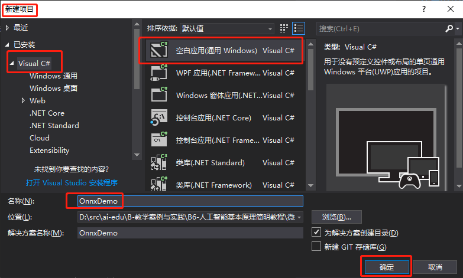
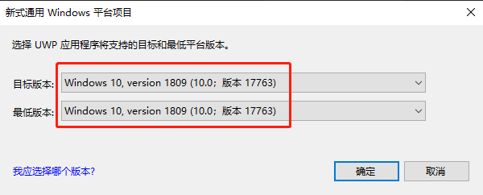
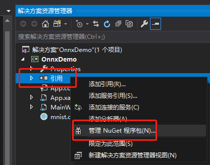
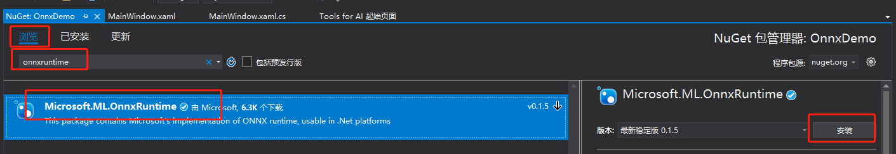
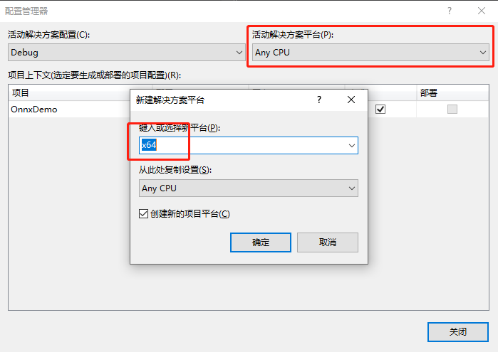
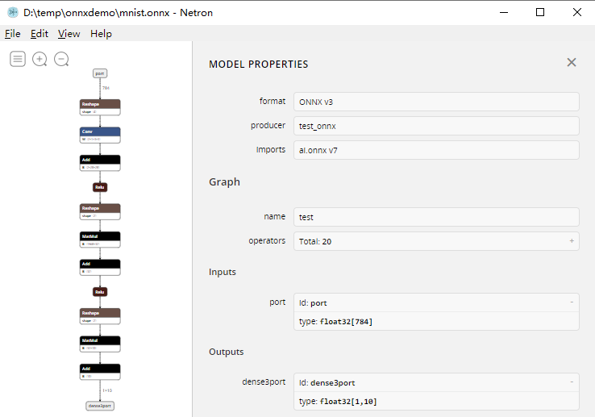
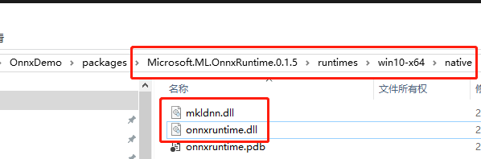

Copyright © Microsoft Corporation. All rights reserved.
  适用于[License](https://github.com/Microsoft/ai-edu/blob/master/LICENSE.md)版权许可

# 模型的部署

下面我们以实际生成的mnist模型为例，来看一下如何在应用中集成模型进行推理。

这里以Windows平台为例，应用程序使用C#语言。我们有两种方案：

- 使用[Windows Machine Learning](https://docs.microsoft.com/zh-cn/windows/ai/)加载模型并推理，这种方式要求系统必须是Windows 10，版本号大于17763
- 使用由微软开源的[OnnxRuntime](https://github.com/Microsoft/onnxruntime)库加载模型并推理，系统可以是Windows 7 或 Windows 10，但目前仅支持x64平台

---

## 使用[Windows Machine Learning](https://docs.microsoft.com/zh-cn/windows/ai/)

### 创建UWP项目

打开Visual Studio 2017，新建项目，在Visual C#分类中选择`空白应用(通用 Windows)`，填写项目名称为OnnxDemo，点击确定



在弹出的对话框中，设置目标版本和最低版本都是17763



### 添加模型文件到项目中

打开解决方案资源管理器中，在项目中的`Assets`目录上点右键->添加->现有项，找到模型文件并添加，这里示例用的模型文件是`mnist.onnx`


模型是在应用运行期间加载的，所以在编译时需要将模型复制到运行目录下。在模型文件上点右键，属性，然后在属性面板上，将`生成操作`属性改为`内容`，将`复制到输出目录`属性改为`如果较新则复制`。


打开解决方案资源管理器，应该可以看到在项目根目录自动生成了和模型同名的代码文件，这里是`mnist.cs`，里面就是对该模型的一层封装，包括了输入输出的定义、加载模型、推理。

> 如果在解决方案资源管理器中没有看到该文件，说明生成失败，失败的原因可能是路径中包含中文、或者onnx模型不合法、或者其它原因，可以尝试手动生成。
> 
> 在开始菜单中找到`VS 2017的开发人员命令提示符`并打开，运行如下命令
> 
> ```
> mlgen.exe -i d:\mnist.onnx -o d:\mnist.cs -l CS -n OnnxDemo
> ```
>
> 其中，`-i`指定你的onnx模型路径，`-o`指定要生成的封装代码的路径，`-l`指定代码的语言，`-n`指定代码使用的命名空间
>
> 生成成功后，可以手动将生成的mnist.cs添加项目中；如果还是失败，可以根据错误信息排查原因

### 设计界面

打开`MainPage.xaml`，将整个Grid片段替换为如下代码：

``` xml
<Grid>
    <StackPanel VerticalAlignment="Center" HorizontalAlignment="Center">
        <Grid x:Name="inkGrid" Background="Black" Width="336" Height="336">
            <InkCanvas x:Name="inkCanvas" />
        </Grid>

        <TextBlock x:Name="lbResult" FontSize="30"/>

        <Button x:Name="btnClean" Content="clean" FontSize="30" Tapped="btnClean_Tapped"/>
    </StackPanel>
</Grid>
```

显示效果如下图：


- `inkCanvas`是写数字的画布，由于训练mnist用的数据集是黑色背景白色字，所以这里将画布也设置为黑色背景。这个控件无法直接设置背景色，所以在外面包一层背景为黑色的`Grid`
- `lbResult`文本控件用来显示识别的结果
- `btnClean`按钮用来清除之前的画布

在`MainPage`构造函数中调用`InitInk`方法初始化画布，设置画笔颜色为白色：

``` C#
private void InitInk()
{
    inkCanvas.InkPresenter.InputDeviceTypes = CoreInputDeviceTypes.Mouse | CoreInputDeviceTypes.Touch;
    var attr = new InkDrawingAttributes();
    attr.Color = Colors.White;
    attr.IgnorePressure = true;
    attr.PenTip = PenTipShape.Circle;
    attr.Size = new Size(24, 24);
    inkCanvas.InkPresenter.UpdateDefaultDrawingAttributes(attr);

    inkCanvas.InkPresenter.StrokesCollected += InkPresenter_StrokesCollected;
}

private void InkPresenter_StrokesCollected(InkPresenter sender, InkStrokesCollectedEventArgs args)
{
    RecogNumberFromInk();
}
```

其中，`RecogNumberFromInk`就是对画布中的内容进行识别，在后面的小节中再添加实现。

添加`btnClean`按钮事件的实现：

``` C#
private void btnClean_Tapped(object sender, TappedRoutedEventArgs e)
{
    inkCanvas.InkPresenter.StrokeContainer.Clear();
    lbResult.Text = string.Empty;
}
```

### 画布数据预处理

打开生成的模型调用封装`mnist.cs`查看输入格式：

``` C#
public sealed class mnistInput
{
    public TensorFloat port; // shape(784)
}
```

可以知道该模型需要大小为784的float数组，对应的是28\*28大小图片的每个像素点的色值。

这里添加函数将画布渲染到bitmap，然后按模型的要求组织784大小的float数组：

``` C#
public async Task<float[]> GetInputDataFromInk()
{
    // 将画布渲染到大小为28*28的bitmap上，与模型的输入保持一致
    RenderTargetBitmap renderBitmap = new RenderTargetBitmap();
    await renderBitmap.RenderAsync(inkGrid, 28, 28);

    // 取出所有像素点的色值
    var buffer = await renderBitmap.GetPixelsAsync();
    var imageBytes = buffer.ToArray();

    float[] data = new float[784];
    for (int i = 0; i < 784; i++)
    {
        // 画布为黑白色的，可以直接取RGB中的一个分量作为此像素的色值
        int baseIndex = 4 * i;
        data[i] = imageBytes[baseIndex];
    }

    return data;
}
```

### 调用模型进行推理

整理好输入数据后，就可以调用模型进行推理并输出结果了。前面界面设计部分，`inkCanvas`添加了响应事件并调用了`RecogNumberFromInk`方法，这里给出对应的实现：

``` C#
private async void RecogNumberFromInk()
{
    // 从文件加载模型
    var modelFile = await StorageFile.GetFileFromApplicationUriAsync(new Uri($"ms-appx:///Assets/mnist.onnx"));
    var model = await mnistModel.CreateFromStreamAsync(modelFile);

    // 组织输入
    var inputArray = await GetInputDataFromInk();
    var inputTensor = TensorFloat.CreateFromArray(new List<long> { 784 }, inputArray);
    var modelInput = new mnistInput { port = inputTensor };

    // 推理
    var result = await model.EvaluateAsync(modelInput);

    // 得到每个数字的得分
    var scoreList = result.dense3port.GetAsVectorView().ToList();

    // 从输出中取出得分最高的
    var max = scoreList.IndexOf(scoreList.Max());

    // 显示在控件中
    lbResult.Text = max.ToString();
}
```

### 结果展示

运行程序并书写数字，即可看到模型推理结果


---

## 使用[OnnxRuntime](https://github.com/Microsoft/onnxruntime)

### 创建WPF项目

打开Visual Studio 2017，新建项目，在Visual C#分类中选择`WPF应用`，填写项目名称为OnnxDemo，点击确定，即可完成一个空白项目的创建。


### 添加模型文件到项目中

打开解决方案资源管理器中，在项目上点右键->添加->现有项


在弹出的对话框中，将文件类型过滤器改为所有文件，然后导航到模型所在目录，选择模型文件并添加。本示例中使用的模型文件是`mnist.onnx`。


模型是在应用运行期间加载的，所以在编译时需要将模型复制到运行目录下。在模型文件上点右键，属性，然后在属性面板上，将`生成操作`属性改为`内容`，将`复制到输出目录`属性改为`如果较新则复制`。


### 添加OnnxRuntime库

微软开源的[OnnxRuntime](https://github.com/Microsoft/onnxruntime)库提供了NuGet包，可以很方便的集成到Visual Studio项目中。

打开解决方案资源管理器，在引用上点右键，管理NuGet程序包。



在打开的NuGet包管理器中，切换到浏览选项卡，搜索`onnxruntime`，找到`Microsoft.ML.OnnxRuntime`包，当前版本是0.1.5，点击安装，稍等片刻，按提示即可完成安装。



当前NuGet发布的OnnxRuntime库只包含了x64架构的运行库，所以需要将项目的目标架构改为x64。

在解决方案上点右键，选择配置管理器。


在配置管理器对话框中，将活动解决方案平台切换为x64。如果没有x64，在下拉框中选择新建，按提示新建x64平台。



### 设计界面

打开`MainWindow.xaml`，将整个Grid片段替换为如下代码：

``` xml
<Grid>
    <StackPanel>
        <Grid Width="336" Height="336">
            <InkCanvas x:Name="inkCanvas" Width="336" Height="336" Background="Black"/>
        </Grid>

        <TextBlock x:Name="lbResult" FontSize="26" HorizontalAlignment="Center"/>

        <Button x:Name="btnClean" Content="Clean" Click="BtnClean_Click" FontSize="26"/>
    </StackPanel>
</Grid>
```

显示效果如下图：


- `inkCanvas`是写数字的画布，由于训练mnist用的数据集是黑色背景白色字，所以这里将画布也设置为黑色背景
- `lbResult`文本控件用来显示识别的结果
- `btnClean`按钮用来清除之前的画布

在`MainWindow`构造函数中调用`InitInk`方法初始化画布，设置画笔颜色为白色：

``` C#
private void InitInk()
{
    // 将画笔改为白色
    var attr = new DrawingAttributes();
    attr.Color = Colors.White;
    attr.IgnorePressure = true;
    attr.StylusTip = StylusTip.Ellipse;
    attr.Height = 24;
    attr.Width = 24;
    inkCanvas.DefaultDrawingAttributes = attr;

    // 每次画完一笔时，都触发此事件进行识别
    inkCanvas.StrokeCollected += InkCanvas_StrokeCollected;
}

private void InkCanvas_StrokeCollected(object sender, InkCanvasStrokeCollectedEventArgs e)
{
    // 从画布中进行识别
    RecogNumberFromInk(); 
}
```

其中，`RecogNumberFromInk`就是对画布中的内容进行识别，在后面的小节中再添加实现。

添加`btnClean`按钮事件的实现：

``` C#
private void BtnClean_Click(object sender, RoutedEventArgs e)
{
    // 清除画布
    inkCanvas.Strokes.Clear();
    lbResult.Text = string.Empty;
}
```

### 画布数据预处理

按照前面的介绍使用`Netron`打开mnist模型可以看到，输入`port`是一个大小784的float数组，对应的是28\*28大小图片的每个像素点的色值，输出`dense3port`是1\*10的float数组，分别代表识别为数字0-9的得分，值最大的即为识别结果。



因此这里需要添加几个函数对画布数据进行处理，转为模型可以接受的数据。以下几个函数分别是将画布渲染到28\*28的图片，读取每个像素点的值，生成模型需要数组：

``` C#
private BitmapSource RenderToBitmap(FrameworkElement canvas, int scaledWidth, int scaledHeight)
{
    // 将画布渲染到bitmap上
    RenderTargetBitmap rtb = new RenderTargetBitmap((int)canvas.Width, (int)canvas.Height, 96d, 96d, PixelFormats.Default);
    rtb.Render(canvas);

    // 调整bitmap的大小为28*28，与模型的输入保持一致
    TransformedBitmap tfb = new TransformedBitmap(rtb, new ScaleTransform(scaledWidth / rtb.Width, scaledHeight / rtb.Height));
    return tfb;
}

public byte[] GetPixels(BitmapSource source)
{
    if (source.Format != PixelFormats.Bgra32)
        source = new FormatConvertedBitmap(source, PixelFormats.Bgra32, null, 0);

    int width = source.PixelWidth;
    int height = source.PixelHeight;
    byte[] data = new byte[width * 4 * height];

    source.CopyPixels(data, width * 4, 0);
    return data;
}

public float[] GetInputDataFromInk()
{
    var bitmap = RenderToBitmap(inkCanvas, 28, 28);
    var imageBytes = GetPixels(bitmap);

    float[] data = new float[784];
    for (int i = 0; i < 784; i++)
    {
        // 画布为黑白色的，可以直接取RGB中的一个分量作为此像素的色值
        int baseIndex = 4 * i;
        data[i] = imageBytes[baseIndex];
    }

    return data;
}
```

### 调用模型进行推理

整理好输入数据后，就可以调用模型进行推理并输出结果了。前面界面设计部分，`inkCanvas`添加了响应事件并调用了`RecogNumberFromInk`方法，这里给出对应的实现：

``` C#
private void RecogNumberFromInk()
{
    // 从画布得到输入数组
    var inputData = GetInputDataFromInk();

    // 从文件中加载模型
    string modelPath = AppDomain.CurrentDomain.BaseDirectory + "mnist.onnx";

    using (var session = new InferenceSession(modelPath))
    {
        // 支持多个输入，对于mnist模型，只需要一个输入
        var container = new List<NamedOnnxValue>();

        // 输入是大小784的一维数组
        var tensor = new DenseTensor<float>(inputData, new int[] { 784 });

        // 输入的名称是port
        container.Add(NamedOnnxValue.CreateFromTensor<float>("port", tensor));

        // 推理
        var results = session.Run(container);

        // 输出结果是IReadOnlyList<NamedOnnxValue>，支持多个输出，对于mnist模型，只有一个输出
        var result = results.FirstOrDefault()?.AsTensor<float>()?.ToList();
        
        // 从输出中取出得分最高的
        var max = result.IndexOf(result.Max());

        // 显示在控件中
        lbResult.Text = max.ToString();
    }
}
```

至此，所有的代码就完成了，按`F5`即可开始调试运行。

### 添加缺失的库

当前0.1.5版本的OnnxRuntime库存在个小问题，编译的时候有几个库文件没有复制到执行目录下，运行时会出现如下错误：


此时需要手动将对应的库文件复制过去。这几个文件在NuGet包目录下，打开解决方案资源管理器，展开引用，在`Microsoft.ML.OnnxRuntime`上点右键，属性，找到`路径`属性，打开对应的文件夹，向上找到`Microsoft.ML.OnnxRuntime.0.1.5`目录，打开`runtimes\win10-x64\native`目录，将`mkldnn.dll`和`onnxruntime.dll`复制到程序运行目录即可。



### 结果展示

运行程序并书写数字，即可看到模型推理结果


