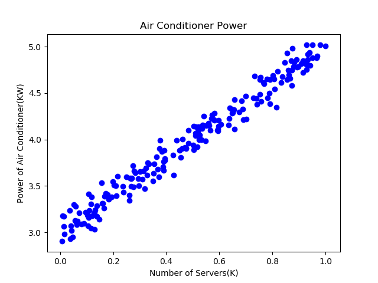

Copyright © Microsoft Corporation. All rights reserved.
适用于[License](https://github.com/Microsoft/ai-edu/blob/master/LICENSE.md)版权许可
  
# 学习要点

 - 一元线性回归
 - 梯度下降的三种模式
 - 反向传播的实现方式

# 提出问题

在互联网建设初期，各大运营商需要解决的问题就是保证服务器所在的机房的温度，保持在23摄氏度左右。那么一个机房安装多少台空调或者提供多大功率的空调合适呢？这个东西虽然能通过热力学计算得到公式，但是总会有误差，因此人们往往会在机房里装一个温控器，来控制空调的开关或者风扇的转速或者制冷能力。通过一些统计数据，我们得到了这张表格：

|样本序号|1|2|3|...|200|
|---|---|---|---|---|---|
|服务器数量(千)|0.928|0.0469|0.855|...|0.373|
|空调功率(千瓦)|4.824|2.950|4.643|...|3.594|

### 问题：在一个新建的机房里，如果有M台服务器，我们如何配置空调的最大功率？

这个数据是二维的，所以我们可以用可视化的方式来展示：


于是，我们把热力学计算的问题转换成为了一个统计问题，通过对上图的观察，我们可以判断它属于一个线性回归问题，而且是最简单的一元线性回归。


# 定义神经网络结构

我们是首次尝试建立神经网络，先搞一个最简单的单层单点神经元：

 

## 输入层

它在输入层只接受一个输入，经过参数w,b的计算后，直接输出结果。这样一个简单的“网络”，只能解决简单的一元线性回归问题，而且由于是线性的，我们不需要定义激活函数，这就大大简化了程序，而且便于大家循序渐进地理解各种知识点。下面，我们在这个最简的线性回归的例子中，来说明神经网络中最重要的反向传播和梯度下降的概念和过程以及编码实现。


最终，样本数据的样子是：

$$
X=\begin{pmatrix}
x_1 & x_2 & \dots & x_{200}
\end{pmatrix}
\\
Y=\begin{pmatrix}
y_1 & y_2 & \dots & y_{200}
\end{pmatrix}
$$

其中，x就是上图中红色点的横坐标值，y是纵坐标值。

## 权重W/B
因为是一元线性问题，所以W/B都是一个标量，记为w和b，我们认为这组数据有这个关系：$y = w*x+b$

## 输出层

输出层1个神经元，是上述预测公式的直接输出，但定义上有所变化，应该是$z = w*x+b$，z是我们的预测输出，y是实际的样本标签值。

# 下载训练数据

[点击下载训练数据X](https://github.com/Microsoft/ai-edu/blob/master/B-%E6%95%99%E5%AD%A6%E6%A1%88%E4%BE%8B%E4%B8%8E%E5%AE%9E%E8%B7%B5/B6-%E4%BA%BA%E5%B7%A5%E6%99%BA%E8%83%BD%E5%9F%BA%E6%9C%AC%E5%8E%9F%E7%90%86%E7%AE%80%E6%98%8E%E6%95%99%E7%A8%8B/Data/TemperatureControlXData.npy)

[点击下载标签数据Y](https://github.com/Microsoft/ai-edu/blob/master/B-%E6%95%99%E5%AD%A6%E6%A1%88%E4%BE%8B%E4%B8%8E%E5%AE%9E%E8%B7%B5/B6-%E4%BA%BA%E5%B7%A5%E6%99%BA%E8%83%BD%E5%9F%BA%E6%9C%AC%E5%8E%9F%E7%90%86%E7%AE%80%E6%98%8E%E6%95%99%E7%A8%8B/Data/TemperatureControlYData.npy)

请把数据拷贝到你的python文件运行的当前目录。

# 读取文件数据
```Python
def ReadData():
    Xfile = Path(x_data_name)
    Yfile = Path(y_data_name)
    if Xfile.exists() & Yfile.exists():
        X = np.load(Xfile)
        Y = np.load(Yfile)
        return X,Y
    else:
        return None,None
```

# 前向计算

def ForwardCalculation(w,b,x):
    z = w * x + b
    return z

# 定义代价函数

一般我们不区分损失函数和代价函数，但实际上代价函数的意思是单个样本的误差，损失函数是所有样本的误差综合。

我们用传统的均方差函数: $loss = \frac{1}{2}(Z-Y)^2$，其中，Z是每一次迭代的预测输出，Y是样本标签数据。我们使用所有样本参与训练，因此损失函数实际为：

$$loss = \frac{1}{2m}\sum_{i=1}^{m}(Z_i - Y_i) ^ 2$$

其中的分母中有个2，实际上是想在求导数时把这个2约掉，没有什么原则上的区别。

由于loss是所有样本的集合，我们先对其中的所有值求总和，样本数量是m，然后除以m来求一个平均值。

下面是Python的code，用于计算损失：

```Python
# w:weight, b:bias, X,Y:sample data, count: count of sample, prev_loss:last time's loss
def check_diff(w, b, X, Y, count, prev_loss):
    Z = w * X + b
    LOSS = (Z - Y)**2
    loss = LOSS.sum()/count/2
    diff_loss = abs(loss - prev_loss)
    return loss, diff_loss
```

我们计算这个loss值的目的是计算前后两次迭代的loss值差异，当足够小时，就结束训练。


```Python
# z:predication value, y:sample data label, x:sample data, count:count of sample data
def dJwb_batch(X,Y,Z,count):
    p = Z - Y
    db = sum(p)/count
    q = p * X
    dw = sum(q)/count
    return dw, db

def dJwb_single(x,y,z):
    p = z - y
    db = p
    dw = p * x
    return dw, db

```
上面有两个求梯度函数，第一个用于数组数据（当输入的X/Y/Z都是数组时），第二个用于标量数据(x/y/z都是标量)，但最后输出的dw/db都是标量，因为只有一个神经元。

# 每次迭代后更新w,b的值

```Python
def update_weights(w, b, dw, db, eta):
    w = w - eta*dw
    b = b - eta*db
    return w,b
```
# 

# 帮助函数
第一个show_result函数用于最后输出结果。第二个print_progress函数用于训练过程中的输出。

```Python
def show_result(X, Y, w, b, iteration, loss_his, w_his, b_his, n):
    # draw sample data
#    plt.figure(1)
    plt.subplot(121)
    plt.plot(X, Y, "b.")
    # draw predication data
    Z = w*X +b
    plt.plot(X, Z, "r")
    plt.subplot(122)
    plt.plot(loss_his[0:n], "r")
    plt.plot(w_his[0:n], "b")
    plt.plot(b_his[0:n], "g")
    plt.grid(True)
    plt.show()
    print(iteration)
    print(w,b)

def print_progress(iteration, loss, diff_loss, w, b, loss_his, w_his, b_his):
    if iteration % 10 == 0:
        print(iteration, diff_loss, w, b)
    loss_his = np.append(loss_his, loss)
    w_his = np.append(w_his, w)
    b_his = np.append(b_his, b)
    return loss_his, w_his, b_his
```

# 主程序初始化
```Python
# count of samples
m = 200
# initialize_data
eta = 0.01
# set w,b=0, you can set to others values to have a try
w, b = 0, 0
eps = 1e-10
iteration, max_iteration = 0, 10000
# calculate loss to decide the stop condition
prev_loss, loss, diff_loss = 0,0,0
# create mock up data
X, Y = create_sample_data(m)
# create list history
loss_his, w_his, b_his = list(), list(), list()
```

# 训练方式的选择

接下来，我们会用三种方式来训练神经网络（神经元）：

1. 随机梯度下降SGD (Stochastic Gradient Descent)：每次迭代只使用一个样本进行训练，每次都更新梯度值
2. 批量梯度下降BGD (Batch Gradient Descent)：把所有样本整批的输入网络进行训练，每批样本更新一次梯度值
3. 小批量梯度下降MBGD (Mini-batch Gradient Descent)：每次用一部分样本进行训练，每小批样本更新一次梯度值

Pseudo code如下：

第一种方式：逐个样本训练即随机梯度下降
```Python
repeat:
    for 每个样本x,y:
        标量计算得到z的单值 z = w * x + b
        计算w的梯度
        计算b的梯度
        更新w,b的值
        计算本次损失
        与上一次的损失值比较，足够小的话就停止训练
    end for
until stop condition
```

第二种方式：批量样本训练即批量梯度下降

```Python
repeat:
    矩阵前向计算得到Z值 = w * X + b（其中X是所有样本的数组）
    计算w的梯度
    计算b的梯度
    更新w,b的值
    计算本批损失
    与上一批的损失值比较，足够小的话就停止训练
until stop condition
```

第三种方式：小批量样本训练即批量梯度下降

```Python
repeat:
    从样本集X中获得一小批量样本Xn
    矩阵前向计算得到Z值 = w * Xn + b（其中Xn是一小批样本的数组）
    计算w的梯度
    计算b的梯度
    更新w,b的值
    计算本批损失
    与上一批的损失值比较，足够小的话就停止训练
until stop condition
```

我们看完它们的训练结构后再来比较它门的好坏。

## 随机梯度下降方式 - SGD

针对200个数据，每次迭代只使用一个样本进行训练，每次都更新梯度值。

### 程序主循环

```Python
while iteration < max_iteration:
    for i in range(m):
        # get x and y value for one sample
        x = X[i]
        y = Y[i]
        # get z from x,y
        z = forward_calculation(w, b, x)
        # calculate gradient of w and b
        dw, db = dJwb_single(x, y, z)
        # update w,b
        w, b = update_weights(w, b, dw, db, eta)
        # calculate loss for this batch
        loss, diff_loss = check_diff(w,b,X,Y,m,prev_loss)
        # condition 1 to stop
        if diff_loss < eps:
            break
        prev_loss = loss
        
    iteration += 1
    loss_his, w_his, b_his = print_progress(iteration, loss, diff_loss, w, b, loss_his, w_his, b_his)
    if diff_loss < eps:
        break

show_result(X, Y, w, b, iteration, loss_his, w_his, b_his, 200)
```

### 程序运行结果

```Python
1 0.0013946089980010831 1.7082689753500857 2.8635473444149815
2 1.2964547916170625e-05 1.8540100768184453 3.06775776515801
3 7.79019593934345e-07 1.8807160337440225 3.0745103188170186
......
19 8.734980997196495e-09 1.9871421670235265 3.0189893623564035
20 6.770768725197773e-09 1.9888753203686051 3.0180574393623383
21 1.4217967081453509e-13 1.9909568305589769 3.0231282539481192
21
1.9909568305589769 3.0231282539481192
```
一共迭代了21次（实际是21*200次），由于diff_loss小于1e-10，所以停止了。但是，可以看到w=1.99..，b=3.023...，与实际值w=2, b=3还有差距。
下图右侧图，红色线是loss值的变化，蓝色线是w值的变化，绿色线是b值的变化。这三个值都很快从初始值趋近于理想值，可见这种方式的收敛速度较快。

  


## 批量梯度下降方式 - BGD

### 程序主循环

```Python
# condition 2 to stop
while iteration < max_iteration:
    # using current w,b to calculate Z
    Z = forward_calculation(w,b,X)
    # get gradient value
    dW, dB = dJwb_batch(X, Y, Z, m)
    # update w and b
    w, b = update_weights(w, b, dW, dB, eta)
#   print(iteration,w,b)
    iteration += 1
    # condition 1 to stop
    loss, diff_loss = check_diff(w,b,X,Y,m,prev_loss)
    if diff_loss < eps:
        break
    prev_loss = loss
    iteration += 1
    loss_his, w_his, b_his = print_progress(iteration, loss, diff_loss, w, b, loss_his, w_his, b_his)

show_result(X, Y, w, b, iteration, loss_his, w_his, b_his, 200)
```
### 程序运行结果
```Python
15580 1.0078619969849933e-10 1.9970527059142416 3.013622182124774
15590 1.0010891421385892e-10 1.9970570862183055 3.0136197497927952
15591
1.9970579605084025 3.013619264309657
```
训练过程迭代了15591次，loss的前后差值小于1e-10了，达到了停止条件。可以看到最后w = 1.997, b = 3.0136。
下图右侧图，红色线是loss值的变化，蓝色线是w值的变化，绿色线是b值的变化。到第400次迭代时，w/b两个值还没有到达理想值。loss的下降速度很快，但是在后期的变化很小，不能给w/b提供有效的反馈。

  

## 小批量梯度下降方式 - MBGD
### 程序主循环
```Python
batchNumber = 20 # 设置每批的数据量为20

# condition 2 to stop
while iteration < max_iteration:
    # generate current batch
    batchX, batchY = generate_batch(X, Y, iteration, batchNumber, m)
    # using current w,b to calculate Z
    Z = forward_calculation(w,b,batchX)
    # get gradient value
    dW, dB = dJwb_batch(batchX, batchY, Z, batchNumber)
    # update w and b
    w, b = update_weights(w, b, dW, dB, eta)
    # calculate loss
    loss, diff_loss = check_diff(w,b,X,Y,m,prev_loss)
    # condition 1 to stop
    if diff_loss < eps:
        break
    prev_loss = loss
    iteration += 1

    loss_his, w_his, b_his = print_progress(iteration, loss, diff_loss, w, b, loss_his, w_his, b_his)

show_result(X, Y, w, b, iteration, loss_his, w_his, b_his, 300)
```
### 程序运行结果
```Python
4450 1.2225522157127688e-10 1.9753608229361126 3.0087345373193264
4460 1.1451271614976166e-10 1.9753871799671467 3.008717691199392
4470 1.068962461950318e-10 1.975413384400498 3.0087009426124025
4479
1.975439437119652 3.0086842909936786
```
训练过程迭代了4479次，最后w=1.9754, b=3.0086。
下图右侧图，红色线是loss值的变化，蓝色线是w值的变化，绿色线是b值的变化。到第300次迭代时，w/b值已经接近理想值了。loss的下降速度慢，但是在后期仍然可以给w/b有效的反馈。

  

# 三种方式的比较
下图是三种方式在向目标解迭代靠近时的示意图：

  

图中的折线的数量就是迭代步骤的示意，但并不代表随机梯度SGD比其它两种迭代次数多，只是表示其曲折程度。

## 随机梯度下降
1. 每次用一个样本训练，然后立刻更新权重，训练速度最快。可以简单地理解为“神经过敏”性格。
2. 可以设置一个适中（更多）的迭代次数，以便得到更好的解
3. 由于使用单个样本数据，会受数据噪音的影响，且前后两个样本的训练效果可能会相互抵消。从轨迹上来看，跳跃性较大。
3. 由于数据随机，所以有可能受训练样本噪音影响而跳到全局最优解，但是不保证。在某些博客中说“本方法只能获得局部最优解”，这实际上是不对的。

## 批量梯度下降
1. 每次用整批样本训练后，才更新一次权重，训练速度最慢。可以简单地理解为“老成持重”性格。
2. 特定的样本如果误差较大，不会影响整体的训练质量
3. 从轨迹上来看，比较平稳地接近中心，但是在接近最优解时的迭代次数太多，非常缓慢
4. 如果只有一个极小值，可以得到相对全局较优的解。如果实际数据有两个极小值，不一定能得到全局最优解。在某些博客中说“本方法可以获得全局最优解”，这实际上是不能保证的，取决于初始值设置。

## 小批量梯度下降
1. 每次使用一小批数据训练，速度适中。可以简单地理解为“稳重而不失灵活”的性格。
2. 多了一个batchNumber参数需要设置，大家可以试验一下分别设置为10，20，25，40，50，训练效果如何
3. 从轨迹上来看，有小的跳跃，但是下降方向还算是稳定，不会向反方向跳跃


孔子说：点赞是人类的美德！如果觉得有用，关闭网页前，麻烦您给点个赞！然后准备学习下一周的内容。

