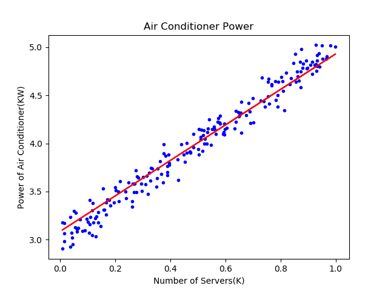

Copyright © Microsoft Corporation. All rights reserved.
  适用于[License](https://github.com/Microsoft/ai-edu/blob/master/LICENSE.md)版权许可

“铁柱”是一名老师，在神经网络中穿梭多年，挂了满身的蜘蛛网。“木头”是一名刚入门者，木头木脑的，有问题经常向铁柱请教。

# 线性回归

铁柱：木头同学，你还记得什么是线性回归吗？

木头：记得！回归的目的是通过几个已知数据来预测另一个数值型数据的目标值。假设特征和结果满足线性关系，即满足一个计算公式$y=f(x)$，这个公式的自变量就是已知的数据x，函数值$f(x)$就是要预测的目标值。这个计算公式称为回归方程，得到这个方程的过程就称为回归。线性回归就是假设这个方式是一个线性方程，一个多元一次方程，其形式为：

$$y=a_0+a_1x_1+a_2x_2+\dots+a_kx_k$$

铁柱：记性不错！为了简化起见，我们用一元一次的线性回归来举例，即$z = wx+b$（z,w,x,b都是标量），因为这个函数的形式和神经网络中的$Z = WX + B$（Z,W,X,B等都是矩阵）非常近似，可以起到用简单的原理理解复杂的事情的作用。

### 最小二乘法与均方差

木头：老师，我还学过最小二乘法，也能解决这次的问题。那为什么我们还要用神经网络呢？

铁柱：问得好！其实最小二乘法的来源，也是对损失值求导而得出的最终方程。我们来看看过程：

线性回归试图学得 $z(x_i)=wx_i+b$，使得$z(x_i) \simeq y_i$。如何学得w和b呢？均方差(MSE - mean squared error)是回归任务中常用的手段：
$$
Error = \frac{1}{m}\sum_{i=1}^m(z(x_i)-y_i)^2 = \frac{1}{m}\sum_{i=1}^m(y_i-wx_i-b)^2
$$
其中，$x_i和y_i$是样本值，$z_i$是预测值。
实际上就是试图找到一条直线，使所有样本到直线上的欧氏距离之和最小。

  

假设我们计算出初步的结果是红色虚线所示，这条直线是否合适呢？我们来计算一下图中每个点到这条直线的距离（黄色线），把这些距离的值都加起来（都是正数，不存在互相抵消的问题）成为Error。

因为上图中的几个点不在一条直线上，所以不能有一条直线能同时穿过它们。所以，我们只能想办法不断改变红色直线的角度和位置，让Error最小（不可能是0），就意味着整体偏差最小，那么最终的那条红色直线就是我们要的结果。

如果想让Error的值最小，通过对w和b求导，再令导数为0（到达最小极值），就是w和b的最优解：

$$
w = \frac{\sum{y_i(x_i-\bar{x})}}{\sum{x_i^2}-\frac{1}{m}(\sum{x_i})^2}\tag{求和均为i=1到m}
$$
$$
b=\frac{1}{m}\sum_{i=1}^m(y_i-wx_i)
$$

木头：好！我们先试一下上面这两个公式是否好用（劈里啪啦写code，铁柱看了一眼木头用的机械键盘，暗暗叹气：够吵的！）
```Python
x_sum = sum(X)                          # 求x之和
x_mean = x_sum/m                        # 求x平均
x_square = sum(X*X)                     # 求x平方之和
x_square_mean = x_sum * x_sum / m       # 求x之和之平方之均
xy = sum(Y*(X-x_mean))                  # 求w的公式的分子部分
w = xy / (x_square - x_square_mean)     # 求w
print(w)
b = sum(Y-w*X) / m                      # 求b
print(b)

结果为：
w=1.9983541668129974
b=3.0128994960012876
```
木头：老师，这两个值计算好了，w=1.998, b=3.013。

铁柱：好，现在回答你的问题：既然我们已经可以用纯数学方法的最小二乘法得到w,b的值，为什么还要学机器学习的方法呢？因为最小二乘法能做的事情有两种：
$$y=a_0+a_1x+a_2x^2+ \dots + a_mx^m \tag{一元多次方程}$$
$$y=a_0+a_1x_1+a_2x_2+ \dots + a_mx_m \tag{多元一次线性方程}$$

而且有一个最重要的前提条件是：我们根据经验预估到方程的形式是上面中的两种，才能求解。

当面对更复杂的形式时，就比较吃力甚至无能为力了，比如下面两个公式：

$$y=0.4x^2 + 0.3xsin(15x) + 0.01cos(50x)-0.3 \tag{一元二次复合三角函数}$$
$$y=3x_1^2 + 4x_2 \tag{二元二次线性}$$

而在客观世界中或实际的生产环境中，我们其实根本不知道要拟合的曲线是什么形式，就根本无从下手，这时只能用神经网络来拟合了，而拟合的结果也不是一个公式，而是一个神经网络模型，一个黑盒子。

# 定义针对w和b的梯度函数

木头：哦！我明白了，神经网络是一种通用的方法，而且适合于机器学习！

铁柱：你得到了它(you got it)！从代码中我们可以看到，是迭代方式，这非常适合计算机来做。

木头：看到BackPropagation函数，我还是一头雾水，为什么那么写呢？

铁柱：这就是神经网络中反向传播的精髓啦，你再复习一下第二章的内容《反向传播与梯度下降》，然后咱们一起推导一下。

## 求w的梯度
因为：

$$z = wx+b \tag{z是预测值}$$

$$loss = \frac{1}{2}(z-y)^2 \tag{y是样本标签值}$$

所以我们用loss的值作为基准，去求w对它的影响，也就是loss对w的偏导数（链式求导）：

$$
\frac{\partial{loss}}{\partial{w}} = \frac{\partial{loss}}{\partial{z}}*\frac{\partial{z}}{\partial{w}}
$$

因为：

$$
\frac{\partial{loss}}{\partial{z}} = \frac{\partial{}}{\partial{z}}[\frac{1}{2}(z-y)^2] = z-y
$$
$$
\frac{\partial{z}}{\partial{w}} = \frac{\partial{}}{\partial{w}}(wx+b) = x
$$

所以组合起来：

$$
\frac{\partial{loss}}{\partial{w}} = \frac{\partial{loss}}{\partial{z}}*\frac{\partial{z}}{\partial{w}} = (z-y)x
$$

## 求b的梯度

$$
\frac{\partial{loss}}{\partial{b}} = \frac{\partial{loss}}{\partial{z}}*\frac{\partial{z}}{\partial{b}}
$$

其中第一项前面算w的时候已经有了，而：

$$
\frac{\partial{z}}{\partial{b}} = \frac{\partial{(wx+b)}}{\partial{b}} = 1
$$

所以：

$$
\frac{\partial{loss}}{\partial{b}} = \frac{\partial{loss}}{\partial{z}}*\frac{\partial{z}}{\partial{b}} = z-y
$$

所以，我们最后的代码是这样写的：

```Python
def BackPropagation(x,y,z):
    dZ = z - y
    dB = dZ
    dW = dZ * x
    return dW, dB
```

$dW = (z-y)*x，dB = z-y$，这个和公式推导完全一样。之所以有个dZ是想保存中间计算结果，不重复劳动。因为这个函数是每次内循环都被调用的，所以要尽量优化。

木头：哦！我明白了，原来大名鼎鼎的反向传播，其实就是把推导的结果转化为数学公式和代码，直接放在迭代过程里！

# 提高准确度

木头：老师，我还有一个疑问，我用最小二乘法计算得到$w=1.998, b=3.013$，而用神经网络得到的值$w=1.846，b=3.085$。貌似神经网络的准确率不够啊？因为我猜这个问题的原始值是$w=2，b=3$。从下图来看，红色线是斜着穿过蓝色点区域的。



铁柱：咱们初次使用神经网络，一定有水土不服的地方。你先看看训练过程。

木头：按Ctrl+F5，又跑了一遍，得到如下值：
```
...
4 70 0.0062622239834859775 3.040018033133307e-06 1.817982185419965 3.09913859521956
4 80 0.006264788539052248 9.789116275048249e-08 1.8165390016725496 3.0961961839012964
4 90 0.006257137457044219 1.7100626370147518e-06 1.8168224848735113 3.0948663477844973
4 100 0.006243584411147867 5.506896334616512e-07 1.8198555211282639 3.0994342531405676
4 110 0.006217967312627983 2.924269079569025e-06 1.8210080077794943 3.0977603667631675
4 120 0.006197963094089578 2.3210522640474372e-05 1.8241198576543065 3.0991870528124683
4 130 0.006197404572478427 1.909039118266377e-06 1.822953564580557 3.0978445270183865
4 140 0.006184883779166377 2.3108417939593506e-09 1.8244852504656695 3.0982053375529484
4 150 0.006160513906817824 1.706333857341702e-06 1.825740688244519 3.0968880361539783
4 160 0.006165769984362322 7.929929792399593e-07 1.8237555428823133 3.0944739178531053
4 170 0.00615769098725895 2.13393824869193e-06 1.8249161128469003 3.095369123402939
4 180 0.006155076948780629 2.2234697959616634e-06 1.8236558088297872 3.0910181050409595
4 190 0.00611461568831969 2.1914684343628255e-06 1.8267943529408501 3.091269615915353
5 0 0.006120159999135144 1.2009652453964445e-06 1.8312142243480052 3.097772305613894
5 10 0.006073203594364276 1.1772907436284272e-05 1.831137231350995 3.0928363231603813
5 20 0.006049604289083901 7.67314600198972e-06 1.831165695543875 3.087887090899276
5 30 0.006059444109512858 3.659631539572848e-06 1.830326313175099 3.0849068623931832
5 40 0.006012645951331416 1.4719745189475941e-05 1.8339352568349323 3.0869957870812854
5 50 0.005990091563514147 5.8798631328658285e-06 1.8380332261538173 3.0908243413681675
5 60 0.005990296311484632 4.078185144281224e-07 1.8388661657161034 3.0916510274493563
5 70 0.005936581700694071 2.8400092830704535e-06 1.8407103884285836 3.087008882777885
5 80 0.0059428545653986194 1.4969085298122825e-07 1.8390464877217432 3.0840160805533583
5 90 0.005937770740839632 9.032939380822225e-07 1.839328910803281 3.0831343597287186
5 100 0.005926818505192391 4.0412530567801586e-07 1.8420827424352728 3.087564520184162
5 110 0.005906229148551065 2.4693482668829494e-06 1.8431800378293361 3.0860773079847728
5 120 0.005892071000787975 2.065333823656878e-05 1.8461207123070738 3.0876445431736905
5 130 0.0058934408890011425 1.457698360598364e-06 1.8448673439328895 3.086528798781168
5 140 0.005885594300204946 4.338876324200269e-10 1.8462936634401175 3.087084461213847
5 150 0.005866258703477269 1.842835157602092e-06 1.8474598613770785 3.085964609200796
0.005871560167933436 1.1068005886794019e-11
5
1.8459035859541528 3.0847579785840957
```
铁柱：我来解释一下打印的内容：
- 第一个数字4或者5，表示外循环次数，我们叫它迭代次数。
- 第二数是内循环次数，就是样本的批次。
- 第三个值是Loss值，从最开始到现在可以看到有不断减小的趋势，说明网络收敛了。但是在上面这段输出里，可以看到Loss值似乎是在增大。但你如果看整体情况就可以看到它是不断的震荡下降的趋势。
- 第四个值是diff_loss值，前后两次loss的差的绝对值。我们这设置了eps=1e-10，最后一次的diff_loss=1.1068005886794019e-11，小于eps，所以训练停止了。
- 后面两个数是w和b

所以，咱们的训练停止比较偶然，因为从历史数据看，diff_loss一直在1e-6左右徘徊，忽然有个1e-11的，就停止了。

木头：哦，那是偶然事件啦！为什么会发生这种情况呢？

铁柱：这就是所谓的“局部最优解”了，从图上看，红色直线两侧的蓝色点分布很平均。有两种简单的方法可以立刻试验一下：
- 停止条件再苛刻一些
- 迭代次数再多一些

木头：哦，那我把eps设置到1e-11试试......（1分钟后）


```
99 170 0.004905135048277225 8.738646069712808e-07 1.994674720722254 3.008114360038958
99 180 0.004908231994613034 3.6906216367964956e-06 1.992358085638915 3.004210578988115
99 190 0.004903514255671252 2.2020789827133583e-06 1.9943375397089336 3.0070971328308125
99
1.996588277123395 3.010989771559764
```
木头：老师，这次结果很不错啊，非常接近真实值了。从上图看，红色直线是从蓝色点区域正中央穿过的。但是迭代了100次，所以1e-11这个停止条件没触发。

铁柱：所以看起来1e-10已经是一个比较理想的停止条件了，但问题是被偶然触发。所以，干脆就用迭代次数来控制吧。你再试试200轮迭代。

木头：...（1分钟）...哎，结果没有什么提高，虽然迭代次数增加了一倍：
```
199
1.996588734022976 3.0109895328616325
```
铁柱：其实呢，我们这次用的方法叫做随机梯度下降法，就是每次用一个样本训练，每次都改变权重值，并计算整体误差。但是这可能造成前后两个样本之间的作用互相抵消，因为样本是随机使用的。形象一些的比喻就是，前一个样本让直线向上移动了一点点，后一个样本却又让直线向下移动了一点点，等于白做功。我们以后会学习更好一些的方法，来避免这种偶然性发生。

木头：好呀好呀！
