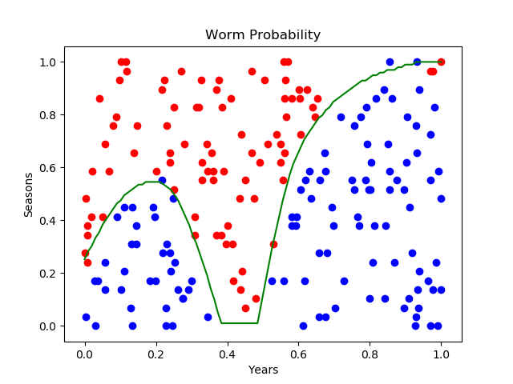
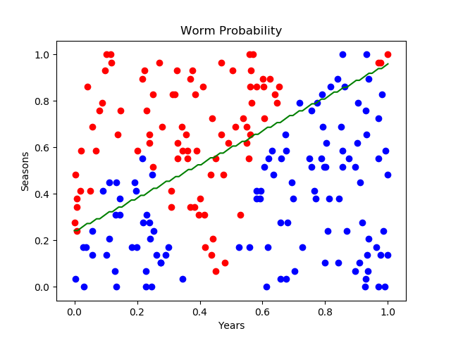

Copyright © Microsoft Corporation. All rights reserved.
  适用于[License](https://github.com/Microsoft/ai-edu/blob/master/LICENSE.md)版权许可

“铁柱”是一名老师，在神经网络中穿梭多年。“木头”是一名刚入门者，木头木脑的，有问题经常向铁柱请教。

# 可视化训练结果

木头：训练结果出来了，我们如何知道它的对错呢？

铁柱：一般来说，训练一个神经网络，我们需要准备训练集，验证集，测试集。验证集用于和训练集一起调参，等同于参与了训练。而测试集完全不能用于训练，只能告诉你最后的结果好坏，比如准确率95%等等。

木头：那么我们为什么不使用这种方式来展示这个非线性二分类的结果呢？

铁柱：因为我们的数据一共只有200个，而且是试验数据，没必要搞这么复杂。咱们可以想办法用可视化的方式来展现结果。

木头：哦！我想起来了，在第6章中，同样有一个“可视化训练结果”小节，但那是为了展示线性多分类的结果，利用W的矩阵值，就可以得到边界条件，从而画出分类直线。在第8章中，我们在拟合复杂曲线时，同样使用了两层神经网络，但也可以轻松展示结果，为什么不能照猫画虎呢？

铁柱：在这里，我们遇到的是非线性分类，不可能画出直线来，所以需要另外想办法。在第8章中，想想看我们的输出层是如何定义的？

木头：输出层只定义了一个$Z2=W2*A1+B2$。

铁柱：对的，那么咱们这里如何定义的呢？

木头：我们在本章里除了Z2外，还有一个$A2=Sigmoid(Z2)$。

铁柱：正确。加了一个Sigmoid函数，相当于做了一个分类，回忆一下这个激活函数的样子：


铁柱：正数输入时，会得到0.5以上的激活值输出。负数输入时，会得到小于0.5的输出值。我们完全可以根据A2的值来确定当前的分类。

木头：可是我们并不知道0.5这个点的具体位置啊？

铁柱：我们画一个示意图，你就明白了：


铁柱：我们先把X1等分成小碎片，0.01为步长，每个步长画出一条竖线来。然后再把这根竖线等分，同样是0.01的步长，这样会得到一系列的(x1,x2)的组合值，其中x1都相同，x2从小到大递增，然后对每个(x1,x2)的组合调用ForwardCalculation()，看看得到的a2值是多少，一旦发现非常靠近0.5，就记录下来。

木头：哦！明白了！第二条X1应该是等于0.01，同样计算这条竖线上a2值为0.5的位置，标记下来，最后的连线就是我们要的分界线了！

铁柱：木头不笨吗！这个特点是Sigmoid带来的，它以0.5为界限分类。所以，我们的代码可以这样写：

```Python
def FindBoundary(dict_Param):
    count = 100
    XT = np.zeros((2,count))
    XT[0,:] = np.linspace(0,1,num=count)
    for i in range(count):
        prev_diff = 10
        Y = np.linspace(0,1,num=count)
        for j in range(count):
            XT[1,i] = Y[j]
            A2, cache = ForwardCalculation(XT[:,i].reshape(2,1), dict_Param)
            current_diff = np.abs(A2[0][0] - 0.5)
            if current_diff > prev_diff:
                break
            prev_diff = current_diff

    return XT
```
上面的FindBoundary是两层循环，i循环是x1，从0变到1，j循环是每条x1竖线上的循环，也是0到1。用current_diff和prev_diff来发现距离0.5最近的点的x2的值。其中XT是一个2x100的数组，第一行是x1的值，第二行是输出值为0.5的x2的值，有可能是从0到1之间的所有值。
下面的ShowResult函数，把分割线和原始数据画在了一起。

```Python
def ShowResult(X, Y):
    XT = FindBoundary(dict_Param)
    plt.plot(XT[0,:],XT[1,:],'g')

    for i in range(X.shape[1]):
        x1 = X[0,i]
        x2 = X[1,i]
        if Y[i] == 0:
            plt.scatter(x1, x2, c='r')
        else:
            plt.scatter(x1, x2, c='b')

    plt.xlabel("Years")
    plt.ylabel("Seasons")
    plt.title("Worm Probability")
    plt.show()

```

在下图中，红色点和蓝色点被一条神秘的曲线所分割，亦即横纵坐标都以0.01为步长画出一个网格，在每个网格的(x1,x2)值，作为前向计算函数的输入，输出为0.5的所有坐标点的连线。



# 权重矩阵初始化

木头：老师，我还注意到我们用InitialParameters函数初始化了权重矩阵，以前在第8章时我们也这么用过，但是当时没有注意到。

铁柱：你可以试试不初始化权重矩阵会得到什么结果。

木头：好的。我把初始化的最后一个参数写0就可以了，表示用全0初始化，看看运行结果：
```
W1: 
[[ 3.16291448 -4.3999407 ]
 [ 3.16291448 -4.3999407 ]
 [ 3.16291448 -4.3999407 ]
 [ 3.16291448 -4.3999407 ]
 [ 3.16291448 -4.3999407 ]
 [ 3.16291448 -4.3999407 ]
 [ 3.16291448 -4.3999407 ]
 [ 3.16291448 -4.3999407 ]
 [ 3.16291448 -4.3999407 ]
 [ 3.16291448 -4.3999407 ]]
B1: 
[[1.78179727]
 [1.78179727]
 [1.78179727]
 [1.78179727]
 [1.78179727]
 [1.78179727]
 [1.78179727]
 [1.78179727]
 [1.78179727]
 [1.78179727]]
W2: 
[[1.04107205 1.04107205 1.04107205 1.04107205 1.04107205 1.04107205
  1.04107205 1.04107205 1.04107205 1.04107205]]
B2: 
[[-7.12598567]]
```


木头：哦！所有矩阵里的值都一样！而且最后的结果也不正确！

铁柱：是的！在多层网络中，如果不初始化权重，将会什么也学不到，因为所有反向传播的值都一样，最后的结果也就是都一样。

# 代价（损失）函数
木头：老师，我们这次使用了一个以前没用到过的代价函数？

铁柱：嗯，是交叉熵代价函数，形式是：

$$loss = - \sum_{i}y(x_i)log(a(x_i)) + (1 - y(x_i))log(1 - a(x_i))$$
其中，$y(x_i)$是真实分布，$a(x_i)$是神经网络输出的概率分布，可以简写为：

$$loss = -[Y*lnA + (1-Y)*ln(1-A)]$$

木头：这次为什么不用均方差损失函数了呢？

铁柱：因为在二分类问题里的标准使用方式就是最后一层网络用Sigmoid激活函数输出，再接交叉熵函数。这是从信息论里面推导出来的，有兴趣可以去读一下。

木头：（猛烈摇头）哦...好...我先记住结论吧！（憨笑）

铁柱：嗯，也可以。第10章中我们还会用到另一种形式的交叉熵呢！
