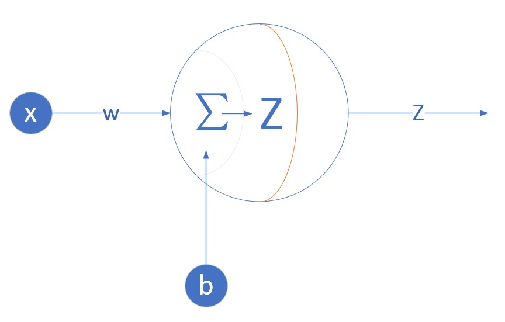
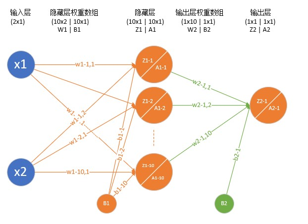
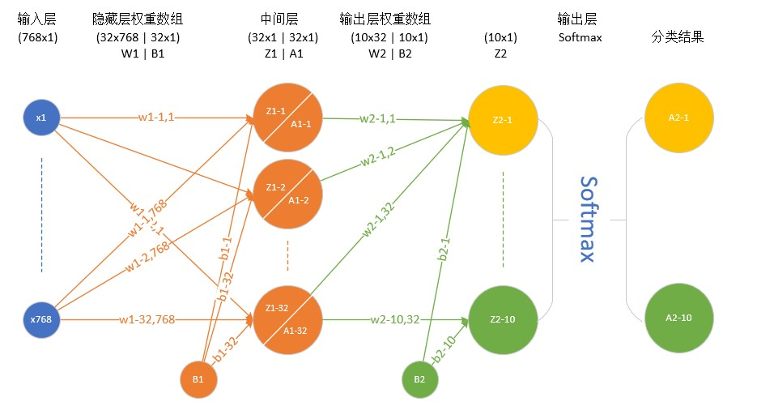

# AI-神经网络基本原理简明教程目录
Copyright © Microsoft Corporation. All rights reserved.
适用于[License](https://github.com/Microsoft/ai-edu/blob/master/LICENSE.md)版权许可

## 如何浏览本系列教程

1. 如果使用浏览器在线观看的话，可以使用Chrome浏览器，[加这个Math展示控件](https://chrome.google.com/webstore/detail/mathjax-plugin-for-github/ioemnmodlmafdkllaclgeombjnmnbima)

2. 也可以clone全部内容到本地，然后用VSCode浏览，但VSCode中需要安装能读取Markdown格式的扩展，比如Markdown Preview Enhanced.

## 写在前面，为什么要出这个系列的教程呢？

总的说来，我们现在有了很多非常厉害的深度学习框架，比如Tensorflow，CNTK，PaddlePaddle，Caffe2等等。然而，我们用这些框架在搭建我们自己的深度学习模型的时候，到底做了一些什么样的操作呢？我们试图去阅读框架的源码来理解框架到底帮助我们做了些什么，但是……很难！很难！很难！因为深度学习是需要加速啦，分布式计算啦，框架做了很多很多的优化，也让像我们这样的小白难以理解这些框架的源码。

这取决于你是想真正地掌握“深度学习”的思想，还是只想成为一个调参师？在我们看来，如TensorFlow，CNTK这些伟大的深度学习工具，是为了解决实际的应用问题而生的，而不是用来学习“深度学习”知识和思想的。所以我们根据自己亲身经历的学习轨迹，归纳出了以下教程，可以帮助小白做到真正的从入门到精通。

通过以下循序渐进地学习与动手实践，一方面可以帮助读者深刻理解“深度学习”的基础知识，更好地理解并使用现有框架，另一方面可以助力读者快速学习最新出现的各种神经网络的扩展或者变型，跟上快速发展的AI浪潮。

对于这份教程的内容，如果没有额外的说明，我们通常使用如下表格的命名约定：

| 符号 | 含义|
|:------------:|-------------|
|X|输入样本 |
|Y|输入样本的标签 |
|Z|线性运算的结果|
|A|激活函数结果|
|W|权重矩阵|
|B|偏移矩阵|
|大写字母|矩阵或矢量，如A,W,B|
|小写字母|变量，标量，如a,w,b|
|$x_{1,2}$|第1个样本的第2个特征值|
|$w_{2,3}$|第L+1层第2个神经元对第L层第3个神经元的权重值
|矩阵的行|一批样本的某一个特征值的集合|
|矩阵的列|一批样本的某一个样本的所有特征值|

## 适用范围
  
  没有各种基础想学习却无从下手哀声叹气的玩家，请按时跟踪最新博客，推导数学公式，跑通代码，并及时提出问题，以求最高疗效；

  深度学习小白，有直观的人工智能的认识，强烈的学习欲望和需求，请在博客的基础上配合代码食用，效果更佳；

  调参师，训练过模型，调过参数，想了解框架内各层运算过程，给玄学的调参之路添加一点心理保障；

  超级高手，提出您宝贵的意见，给广大初学者指出一条明路！

## 前期准备

  环境：
  
  windows（Linux也行），python（最好用3），anaconda（或者自己装numpy之类的），tensorflow（嫌麻烦地请看这里[《AI应用开发实战 - 从零开始配置环境》](https://mp.weixin.qq.com/s/-vG9kg48mt9vcmqDlWtxKw)，tools for AI（按照链接教程走的就不用管这个了）。
  
  自己：

  清醒的头脑（困了的同学请自觉泡茶），纸和笔（如果像跟着推公式的话），闹钟（防止久坐按时起来转转），厚厚的衣服（有暖气的同学请忽略）

## 目录
+ [0-基本数学导数公式](./0-基本数学导数公式.md)
+ [1-神经网络的基本工作原理](./1-神经网络的基本工作原理.md)
+ [2-神经网络中反向传播与梯度下降的基本概念](./2-反向传播与梯度下降.md)
+ [3-损失函数](./3-损失函数.md)
+ [4-单入单出的一层神经网络：机房空调功率预测（一元线性回归）](./4-单入单出的一层神经网络.md)
+ [4-扩展阅读：线性回归](./4-扩展阅读.md)
+ [5-多入单出的一层神经网络：北京房价预测（多元线性回归）](./5-多入单出的一层神经网络.md)
+ [5-扩展阅读：数据归一化](./5-扩展阅读.md)
+ [6-多入多出的一层神经网络：大气污染物分类（多元线性多分类）](./6-多入多出的一层神经网络.md)
+ [6-扩展阅读：可视化训练结果](./6-扩展阅读.md)
+ [7.1-分类函数](./7.1-分类函数.md)
+ [7.2-激活函数](./7.2-激活函数.md)
+ [8-单入单出的两层神经网络：复杂函数曲线拟合（一元非线性回归）](./8-单入单出的两层神经网络.md)
+ [8-扩展阅读：多层神经网络的反向传播求导过程](./8-扩展阅读.md)
+ [9-多入单出的两层神经网络：果树虫害预警（多元非线性二分类）](./9-多入单出的两层神经网络.md)
+ [9-扩展阅读：权重矩阵初始化](./9-扩展阅读.md)
+ [10-多入多出的两层神经网络：MNIST手写数字识别（复杂非线性多分类）](./10-多入多出的两层神经网络.md)
+ [10-扩展阅读（数据集的使用）](./10-扩展阅读.md)
+ [11-模型的导出](./11.1-模型的导出.md)
+ [11-Windows模型的部署](./11.2-Windows模型的部署.md)
+ [11-Android模型的部署](./11.3-Android模型的部署.md)

|网络结构名称|网络结构图|前向计算图|应用领域与案例|
|:--:|----|----|----|
|单入 单出 一层||Layer1   Z = W * X + B = w * x + b   代价函数：均方差|一元线性回归/拟合 一般用于拟合直线，根据单输入值预测单输出值 例：机房空调功率预测|
|多入 单出 一层||Layer1   Z = W * X + B   = w1 * x1+ w2 * x2 + w3 * x3 + b   代价函数：均方差|多元线性回归 根据一组输入值预测单输出值 例：北京房价预测|
|多入 多出 一层||Layer1   Z = W * X + B   A = Softmax(Z)   代价函数：交叉熵|多元线性分类 例：大气污染物成分分类|
|单入 单出 两层||Layer1   Z1 = W1 * X + B1   A1 = Sigmoid(Z1)   Layer2   Z2 = W2 * A1 + B2   代价函数：均方差|一元非线性回归/拟合 可以拟合任意复杂函数 例：复杂函数拟合|
|多入 单出 两层||Layer1   Z1 = W1 * X + B1   A1 = Sigmoid(Z1)   Layer2   Z2 = W2 * A1 + B2   A2 = Sigmoid(Z2)   代价函数：交叉熵|多元非线性二分类 可以做任意复杂边界的二分类 例：果树虫控决策|
|多入 多出 两层||Layer1   Z1 = W1 * X + B1   A1 = Sigmoid(Z1)   Layer2   Z2 = W2 * A1 + B2   A2 = Softmax(Z2)   代价函数：交叉熵|多元非线性多分类 例：MNIST手写数字识别（分类）|

