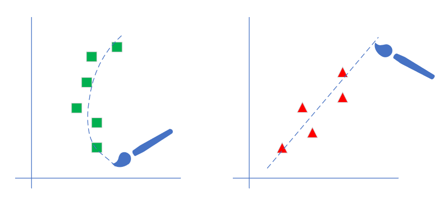

Copyright © Microsoft Corporation. All rights reserved.
适用于[License](https://github.com/Microsoft/ai-edu/blob/master/LICENSE.md)版权许可

 # 回归

回归分析是一种数学模型。当因变量和自变量为线性关系时，它是一种特殊的线性模型。

最简单的情形是一元线性回归，由大体上有线性关系的一个自变量和一个因变量组成，模型是：

$$Y=a+bX+ε$$

X是自变量，Y是因变量，ε是随机误差。

通常假定随机误差的均值为0，方差为σ^2（σ^2﹥0，σ^2与X的值无关）。若进一步假定随机误差遵从正态分布，就叫做正态线性模型。一般的，若有k个自变量和1个因变量，则因变量的值分为两部分：一部分由自变量影响，即表示为它的函数，函数形式已知且含有未知参数；另一部分由其他的未考虑因素和随机性影响，即随机误差。

- 当函数为参数未知的线性函数时，称为线性回归分析模型
- 当函数为参数未知的非线性函数时，称为非线性回归分析模型
- 当自变量个数大于1时称为多元回归
- 当因变量个数大于1时称为多重回归

 

如上图所示，左侧为非线性回归，右侧为线性回归。

# 提出问题

在互联网建设初期，各大运营商需要解决的问题就是保证服务器所在的机房的温度，保持在23摄氏度左右。那么一个机房安装多少台空调或者提供多大功率的空调合适呢？这个东西虽然能通过热力学计算得到公式，但是总会有误差。因此人们往往会在机房里装一个温控器，来控制空调的开关或者风扇的转速或者制冷能力。更先进的做法是直接把机房建在海底，用海水冷却。

通过一些统计数据，我们得到了这张表格：

|样本序号|1|2|3|...|200|
|---|---|---|---|---|---|
|服务器数量(千台)|0.928|0.0469|0.855|...|0.373|
|空调功率(千瓦)|4.824|2.950|4.643|...|3.594|

**问题：在一个新建的机房里，如果有346台服务器，我们如何配置空调的功率？**

这个数据是二维的，所以我们可以用可视化的方式来展示：

于是，我们把热力学计算的问题转换成为了一个统计问题，因为实在是不能精确地计算出每块电路板或每台机器到底能产生多少热量。通过对上图的观察，我们可以判断它属于一个线性回归问题，而且是最简单的一元线性回归。

# 线性回归

铁柱：木头同学，你还记得什么是线性回归吗？

木头：记得！回归的目的是通过几个已知数据来预测另一个数值型数据的目标值。假设特征和结果满足线性关系，即满足一个计算公式$y=f(x)$，这个公式的自变量就是已知的数据x，函数值$f(x)$就是要预测的目标值。这个计算公式称为回归方程，得到这个方程的过程就称为回归。线性回归就是假设这个方式是一个线性方程，一个多元一次方程，其形式为：

$$y=a_0+a_1x_1+a_2x_2+\dots+a_kx_k$$

铁柱：记性不错！为了简化起见，我们用一元一次的线性回归来举例，即$z = wx+b$（z,w,x,b都是标量），因为这个函数的形式和神经网络中的$Z = WX + B$（Z,W,X,B等都是矩阵）非常近似，可以起到用简单的原理理解复杂的事情的作用。

【课后作业】

1. 用神经网络的回归能力训练实现逻辑非门
2. 调整学习率、批大小等参数，观察神经网络训练的过程与结果
