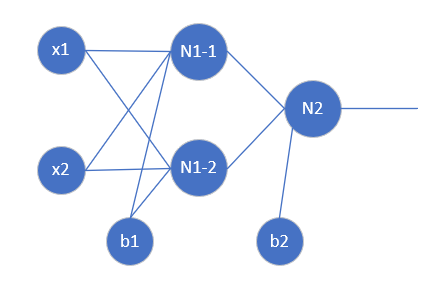

Copyright © Microsoft Corporation. All rights reserved.
  适用于[License](https://github.com/Microsoft/ai-edu/blob/master/LICENSE.md)版权许可

# 实现逻辑异或门

当年一位大佬指出，单层神经网络（感知机）无法完成异或任务，导致了神经网络的寒冬的到来。因为当时还没有BP算法，所以深层神经网络无法实现。进入到两层神经网络后，我们将可以轻松地解决这个问题。

看下图：


因为单层神经网络只能做线性分割，而上图中所示红蓝两色样本，用一条直线是不能分开的，于是人们脑补了那条曲线的分割方式，相当的fancy。但是神经网络真的会这样工作吗？

我们前边学习过来如何实现与、与非、或、或非，我们看看如何用已有的逻辑搭建异或：


||||||
|----|----|----|----|----|
|x1|0|0|1|1|
|x2|0|1|0|1|
|s1=NAND|1|1|1|0|
|s2=OR|0|1|1|1|
|y=AND|0|1|1|0|

经过以上组合运算后，可以看到y的输出与x1,x2的输入相比，就是异或逻辑了。

所以，我们可以模拟这个思路，用两层神经网络搭建如下模型：



隐层的两个神经元接收x1,x2的输入，输出层有一个神经元负责分类。


|||
|---|---|
|||
|||
|||
|||


以下是隐层为两个神经元时的结果输出：

```
epoch=6039, loss=0.005000
epoch=6040, loss=0.004999
epc=6040,ite=3,los=0.0050
w=[[-7.00777143 -7.01121059]
 [ 5.51518649  5.51451102]]
b=[[ 2.86885647]
 [-8.53863829]]

w=[[-12.0633545  -12.23675401]]
b=[[5.95925939]]

testing...
x=[[0] [0]] y=[[0]] output=[[0.00424183]]
True
x=[[0] [1]] y=[[1]] output=[[0.99453265]]
True
x=[[1] [0]] y=[[1]] output=[[0.99452718]]
True
x=[[1] [1]] y=[[0]] output=[[0.00476486]]
True
```

后面的testing...为测试结果，精度为1e-2。


||1|2|3|4|
|---|---|---|---|---|
|x1|0|0|1|1|
|x2|0|1|0|1|
|y|0|1|1|0|
|Z1|2.86885647|-4.14235412|-4.13891495|-11.15012554|
||-8.53863829|-3.02412727|-3.0234518|2.49105922|
|A1|9.46285253e-01|1.56370110e-02|1.56900366e-02 |1.43732759e-05|
||1.95718330e-04|4.63477089e-02|4.63775738e-02|9.23512657e-01|
|Z2|-5.45851003|5.20347907|5.20247396|-5.3417112|
|A2|0.00424183|0.99453265|0.99452718|0.00476486|