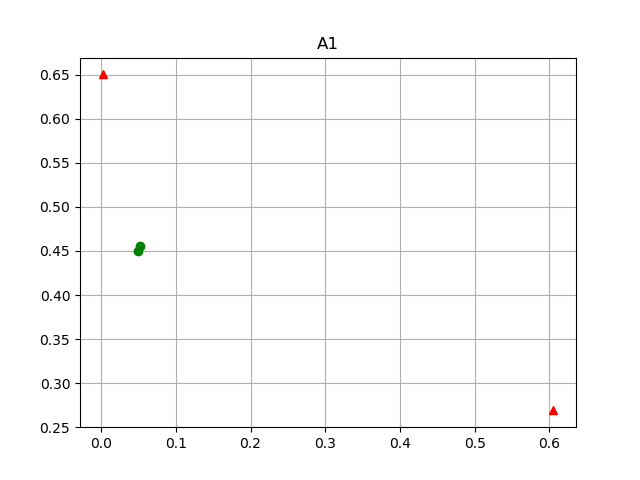
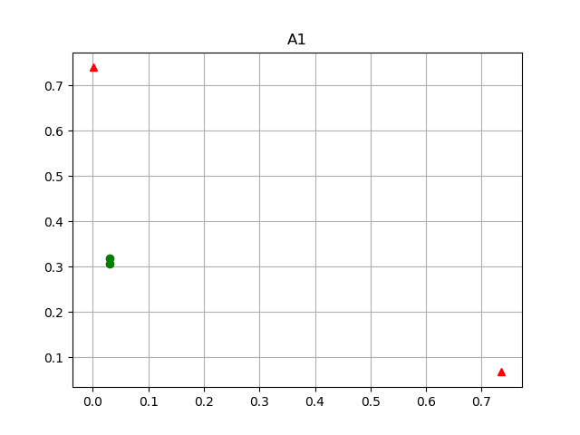
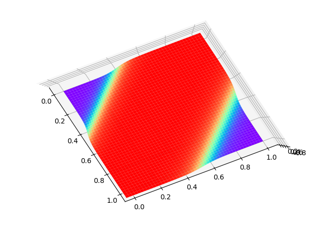
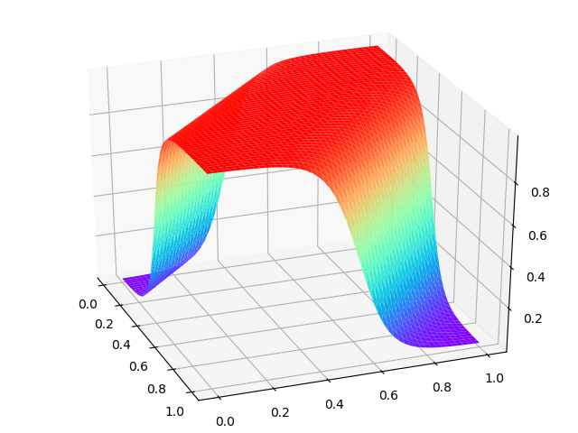

Copyright © Microsoft Corporation. All rights reserved.
  适用于[License](https://github.com/Microsoft/ai-edu/blob/master/LICENSE.md)版权许可

# 理解工作原理

我们在上一节课的代码基础上再增加些东西，来理解神经网络针对这个异或问题的工作原理。

## 隐层神经元数量的选择

一般来说，隐层的神经元数量要大于等于输入特征的数量，在本例中是2。我们从下图可以看到，如果隐层只有一个神经元的话，是不能完成分类任务的。

|||
|---|---|
|||
|1个神经元|2个神经元，迭代6040次到达精度要求|
|||
|3个神经元，迭代5228次到达精度要求|4个神经元，迭代4331次到达精度要求|
|||
|6个神经元，迭代3903次到达精度要求|8个神经元，迭代4107次到达精度要求|
|||
|12个神经元，迭代4667次到达精度要求|16个神经元，迭代4402次到达精度要求|

以上各情况的迭代次数是在Xavier初始化的情况下测试一次得到的数值，并不意味着7个神经元一定比6个神经元差。但可以推理的是，并不是隐层的神经元越多越好，合适才好。2个神经元肯定是足够的，4个神经元肯定要轻松一些，更多的神经元也并不是更轻松。

## 隐层有两个神经元的工作原理

以下是隐层为两个神经元时的结果输出：

```
w=[[-7.00777143 -7.01121059]
 [ 5.51518649  5.51451102]]
b=[[ 2.86885647]
 [-8.53863829]]
```

我们使用上面的权重矩阵结果，把4个样本数据代入到前向计算公式中，依次求得Z1,A1,Z2,A2的值，并列表如下：

||1|2|3|4|
|---|---|---|---|---|
|x1|0|0|1|1|
|x2|0|1|0|1|
|y|0|1|1|0|
|Z1|2.86885647|-4.14235412|-4.13891495|-11.15012554|
||-8.53863829|-3.02412727|-3.0234518|2.49105922|
|A1|9.46285253e-01|1.56370110e-02|1.56900366e-02 |1.43732759e-05|
||1.95718330e-04|4.63477089e-02|4.63775738e-02|9.23512657e-01|
|Z2|-5.45851003|5.20347907|5.20247396|-5.3417112|
|A2|0.00424183|0.99453265|0.99452718|0.00476486|

### 完成了分割任务的二维图示分析

|||
|---|---|
|||
|1) 原始x1做横轴，x2做纵轴的4个点，处于4个角落|2) 线性变换结果，用Z1[0,0]做横轴，Z1[1,0]做纵轴的4个点，两个绿点接近重合|
|||
|3) Z1的Sigmoid结果，用A1[0,0]做横轴，A1[1,0]做纵轴的4个点，两个绿点接近重合|4) A1点经过第二次线性变化，4个点归类到横轴上的0点两侧，位置大概是-5.7和+5.7处（Z2的位置）。A2可以匹配到Sigmoid曲线上|


### 完成学习的过程

#### 损失函数值的变化与分类效果对比

|损失函数值||
|---|---|
|||
|500次迭代时损失值为0.67|500次迭代两种颜色基本平分
|||
|800次迭代时损失值为0.53|800次迭代粉色区域逐渐向左下方移动|
|||
|1000次迭代时损失值为0.346|1000次迭代右上角出现黄色区域|
|||
|6000次迭代时损失值为0.005|6000次迭代完美分割|


#### Z1和A1的演进

Z1为线性变换结果，A1是Z1的Sigmoid压缩结果。

|Z1：值域较大|A1：值域在[0,1]之内|
|---|---|
|||
|500次迭代时两个绿点较为分散|500次迭代绿点较散|
|||
|800次迭代时绿点接近，红点向两侧拉开|800次迭代绿点接近|
|||
|1000次迭代时趋势更明显，但相对位置不变|1000次迭代|
|||
|6000次迭代时绿点重合，红点拉到最远|6000次迭代|

#### Z2:A2的演进

下图是用Z2做横坐标，A2做纵坐标绘制，因为Z2,A2都是一个标量，或者说是直线上的点。

|Z2:A2||
|---|---|
|||
|500次迭代分类不清|800次迭代起色不大，红绿点还没分开|
|||
|1000次迭代向两极靠拢|6000次迭代完美分割|

## 隐层有三个神经元的工作原理

最终输出的权重矩阵值：

```
[[ 6.70984241 -6.82710114]
 [ 6.22781451 -5.99280808]
 [-2.74806343  2.4870413 ]]
b=[[-3.51362288]
 [ 3.15804745]
 [-1.4773994 ]]

w=[[12.31224597 -9.738143    3.80483026]]
b=[[3.05151459]]
```

迭代5000次到达精度要求的各层的网络输出：

||1|2|3|4|
|---|---|---|---|---|
|x1|0|0|1|1|
|x2|0|1|0|1|
|y|0|1|1|0|
|Z1|3.51362288|-10.34072402|3.19621952|-3.63088162|
||3.15804745|-2.83476063|9.38586196|3.39305388|
||-1.4773994|1.00964189|-4.22546284|-1.73842154|
|A1|2.89270940e-02| 3.22898922e-05 |9.60691763e-01| 2.58090628e-02|
||9.59224645e-01| 5.54744264e-02| 9.99916105e-01| 9.67486745e-01|
||1.85820545e-01| 7.32950061e-01| 1.44079436e-02| 1.49513539e-01|
|Z2|-5.22637905|  5.30044483 | 5.19728163 |-5.48336852|
|A2|0.00534423 |0.9950354 | 0.99449885 |0.00413811|


我们可以把Z1,A1看作是一个三维的坐标点，并比较迭代200次与迭代5000次的结果，从而了解神经网络的工作过程：


||迭代200次|迭代5000次|
|---|---|---|
|初始x1:x2||
|Z1：观察角度1|||
||两个红色点距离较远|两个红色点距离很近|
|Z1：观察角度2|||
||绿色点从一开始就已经分得很开|绿色点的距离越来越远|
|A1：观察角度1|||
||红点较散|红点聚集到了一个角落里，绿点拉开距离|
|A1：观察角度2|||
|Z2:A2|||
||两种颜色的点没有分开|彻底分开了|
|结果|||
||尚未完成分类任务|已经得到了理想分类结果|

到底是把两个红点变换到一起去，还是变换绿点，取决于随机初始化结果。


## 深度挖掘工作原理

但是，神经网络真的是在平面上工作的吗？我们再深度挖掘一下！

平面上分割两类的直线，实际上是我们的想象：使用0.5为门限值像国界一样把两部分数据分开。但实际上，神经网络的输出是个概率，即，它可以告诉你某个点属于某个类别的概率是多少，我们人为地设定为当概率大于0.5时属于正类，小于0.5时属于负类。所以我们可以把过渡区也展示出来，让大家更好地理解。

基本思路是：

1. 在[0,1]区间定义50x50个坐标点，这样就有了X和Y
2. 加载用Level1训练好的Weights and Bias for W1, B1, W2, B2，但是需要的网络配置是隐层有两个神经元
3. 把X,Y,W,B代入前向计算公式（此时相当于做Inference），计算每个点的Z值（就是输出的A2值，经过Sigmoid的，所以是个[0,1]之间的数值）
4. 在3D图上画出X,Y,Z的曲面

如下图所示：

|上方视角|斜侧视角|
|---|---|
|||

生成的3D图，从上方看，和二维平面上的效果一样。从侧面看，是一个立体的门。异或问题的四个点，其中两个对角顶点处于蓝色区域位置，另外两个对角点处于红色区域部分，这样神经网络就可以在Z=0.5出画一个平面，完美地分开对角顶点。


代码位置：ch09, Level2(两个神经元的情况), Level3(三个神经元的情况)
