Copyright © Microsoft Corporation. All rights reserved.
  适用于[License](https://github.com/Microsoft/ai-edu/blob/master/LICENSE.md)版权许可

# 理解工作原理

我们在上一节课的代码基础上再增加些东西，来理解神经网络针对这个异或问题的工作原理。

## 隐层神经元数量的选择

一般来说，隐层的神经元数量要大于等于输入特征的数量，在本例中是2。我们从下图可以看到，如果隐层只有一个神经元的话，是不能完成分类任务的。

|||
|---|---|
|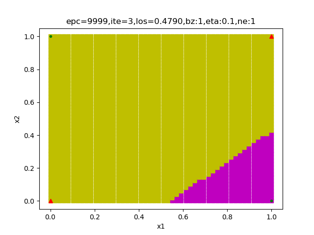|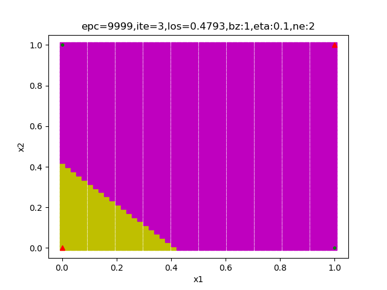|
|1个神经元|2个神经元，迭代6040次到达精度要求|
||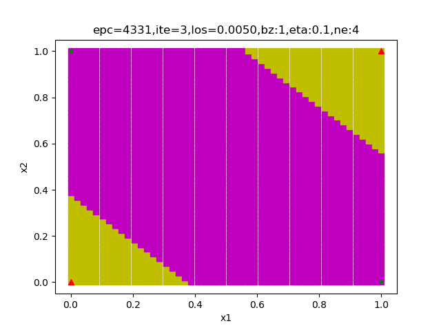|
|3个神经元，迭代5228次到达精度要求|4个神经元，迭代4331次到达精度要求|
||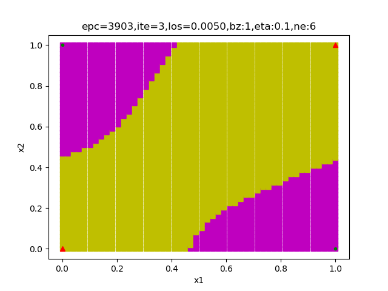|
|5个神经元，迭代4171次到达精度要求|6个神经元，迭代3903次到达精度要求|
|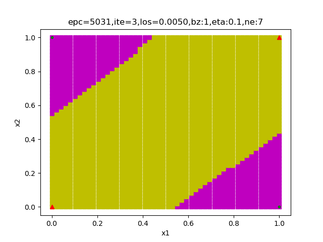||
|7个神经元，迭代5031次到达精度要求|8个神经元，迭代4107次到达精度要求|

## 隐层有两个神经元的工作原理

以下是隐层为两个神经元时的结果输出：

```
w=[[-7.00777143 -7.01121059]
 [ 5.51518649  5.51451102]]
b=[[ 2.86885647]
 [-8.53863829]]
```

我们使用上面的权重矩阵结果，把4个样本数据代入到前向计算公式中，依次求得Z1,A1,Z2,A2的值，并列表如下：

||1|2|3|4|
|---|---|---|---|---|
|x1|0|0|1|1|
|x2|0|1|0|1|
|y|0|1|1|0|
|Z1|2.86885647|-4.14235412|-4.13891495|-11.15012554|
||-8.53863829|-3.02412727|-3.0234518|2.49105922|
|A1|9.46285253e-01|1.56370110e-02|1.56900366e-02 |1.43732759e-05|
||1.95718330e-04|4.63477089e-02|4.63775738e-02|9.23512657e-01|
|Z2|-5.45851003|5.20347907|5.20247396|-5.3417112|
|A2|0.00424183|0.99453265|0.99452718|0.00476486|

|||
|---|---|
|||
||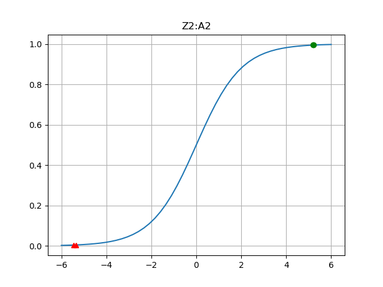|


|损失函数值||
|---|---|
|||
|500次迭代|800次迭代|
||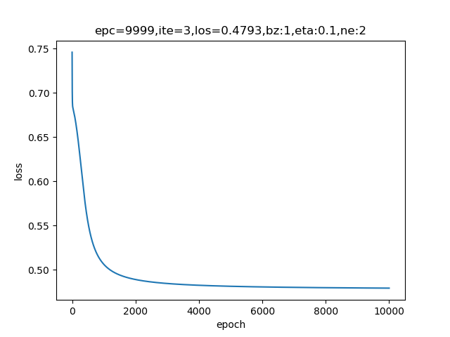|
|1000次迭代|6000次迭代|

|Z1||
|---|---|
|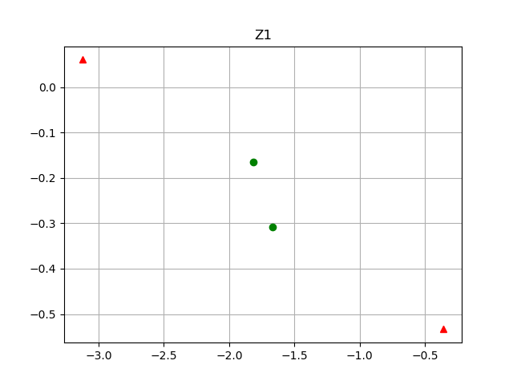|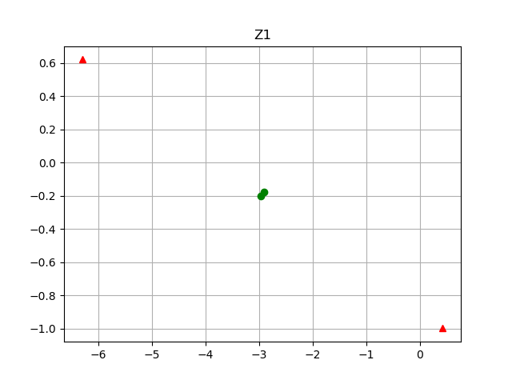|
|500次迭代|800次迭代|
|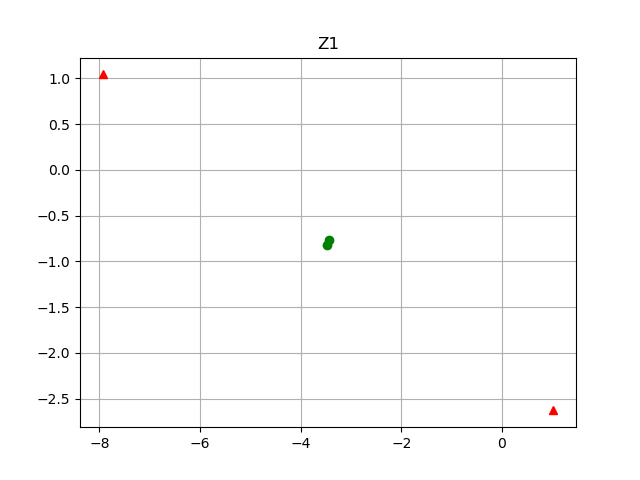||
|1000次迭代|6000次迭代|

|A1||
|---|---|
|||
|500次迭代|800次迭代|
|||
|1000次迭代|6000次迭代|

|Z1:A1||
|---|---|
|||
|500次迭代|800次迭代|
|||
|1000次迭代|6000次迭代|

|分类结果||
|---|---|
||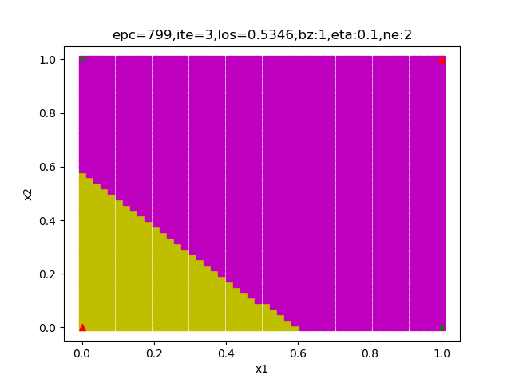|
|500次迭代|800次迭代|
|||
|1000次迭代|6000次迭代|


## 隐层有三个神经元的工作原理

最终输出的权重矩阵值：

```
[[ 6.70984241 -6.82710114]
 [ 6.22781451 -5.99280808]
 [-2.74806343  2.4870413 ]]
b=[[-3.51362288]
 [ 3.15804745]
 [-1.4773994 ]]

w=[[12.31224597 -9.738143    3.80483026]]
b=[[3.05151459]]
```

迭代5000次到达精度要求的各层的网络输出：

||1|2|3|4|
|---|---|---|---|---|
|x1|0|0|1|1|
|x2|0|1|0|1|
|y|0|1|1|0|
|Z1|3.51362288|-10.34072402|3.19621952|-3.63088162|
||3.15804745|-2.83476063|9.38586196|3.39305388|
||-1.4773994|1.00964189|-4.22546284|-1.73842154|
|A1|2.89270940e-02| 3.22898922e-05 |9.60691763e-01| 2.58090628e-02|
||9.59224645e-01| 5.54744264e-02| 9.99916105e-01| 9.67486745e-01|
||1.85820545e-01| 7.32950061e-01| 1.44079436e-02| 1.49513539e-01|
|Z2|-5.22637905|  5.30044483 | 5.19728163 |-5.48336852|
|A2|0.00534423 |0.9950354 | 0.99449885 |0.00413811|


我们可以把Z1,A1看作是一个三维的坐标点，并比较迭代200次与迭代5000次的结果，从而了解神经网络的工作过程：


||迭代200次|迭代5000次|
|---|---|---|
|初始||
|Z1-1||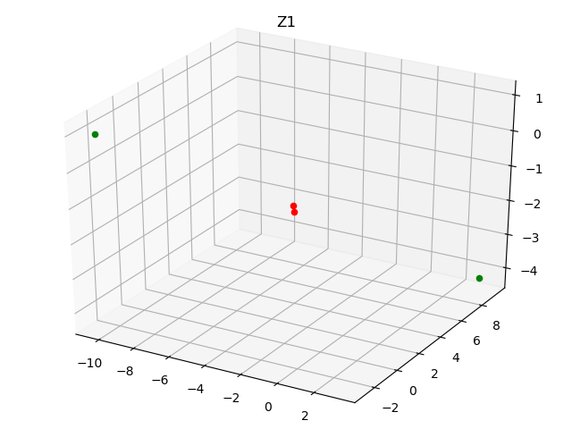|
||两个红色点距离较远|两个红色点距离很近|
|Z1-2|||
||绿色点从一开始就已经分得很开|绿色点的距离越来越远|
|Z1-3|||
||从某一角度看4个点在一条直线上||
|A1-1|||
||红点较散|红点缩到了一个角落里|
|A1-2|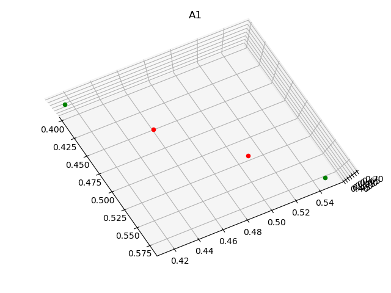|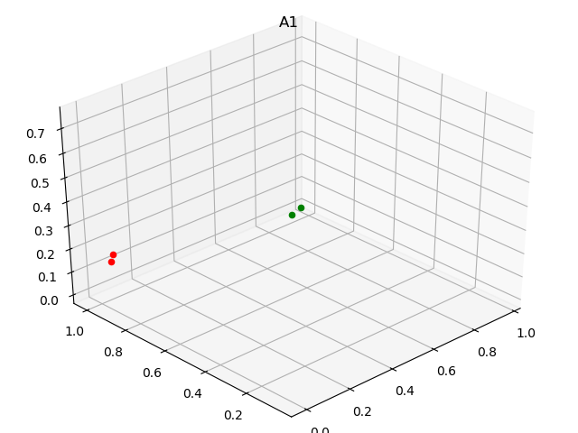|
|A1-3||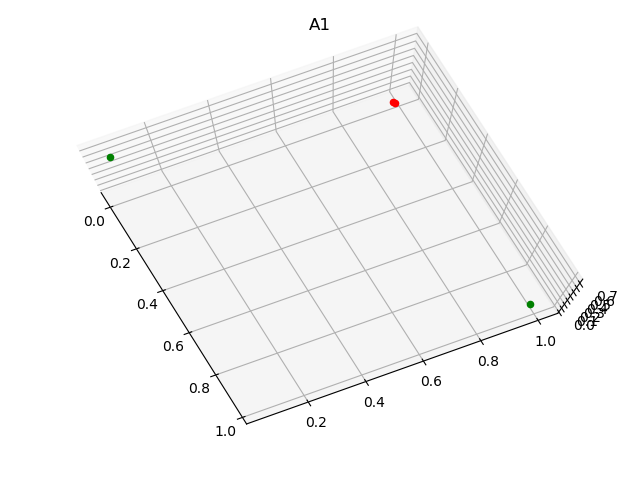|
|Z2|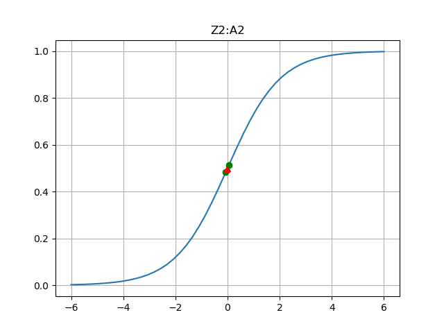||
||两种颜色的点没有分开|彻底分开了|
|A2|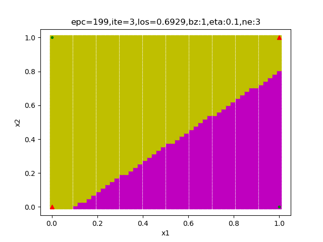||
||没有完成|理想分类|


代码位置：ch09, Level2_HowXorGateEorks(两个神经元的情况), Level2_LogicXorGate3D(三个神经元的情况)
