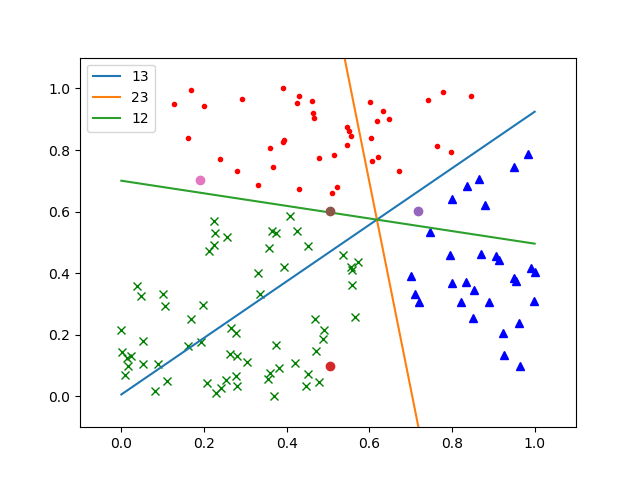
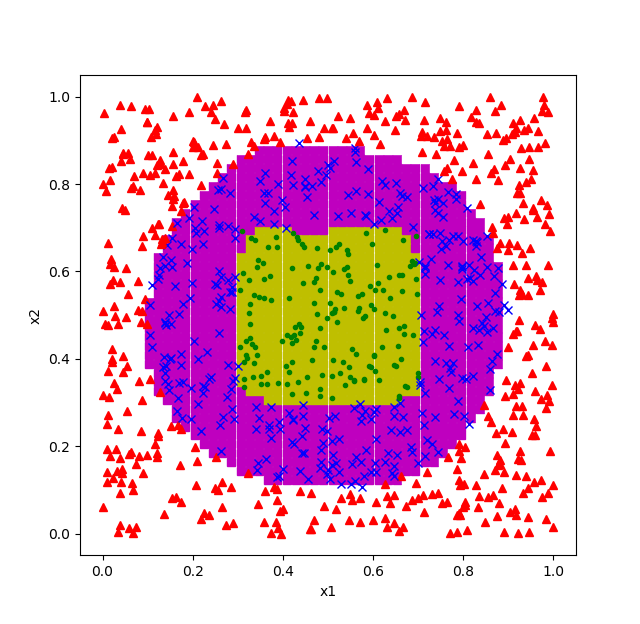

Copyright © Microsoft Corporation. All rights reserved.
  适用于[License](https://github.com/Microsoft/ai-edu/blob/master/LICENSE.md)版权许可

# 可视化训练结果

木头：对于线性问题，我们还有可能画出直线来分割不同区域。对于非线性结果，我们怎么才能知道对错呢？

铁柱：所幸我们遇到的这个问题是个平面分类问题，所以还有可能在二维平面上画出图来。我们先来看一下第7章中的线性分类的结果图：



从表面上看，神经网络是在寻找三条直线，来做两两分类，比如红点区域，是通过蓝色直线区分红点和蓝点，又通过绿色直线区分红点和绿点。但实际上，三条直线只是三个区域的边界，神经网络真正做的事是对于坐标系内的每个点，都计算一个三元的概率，比如[p1, p2, p3]，其中p1是该点属于红色区域的概率，p2是该点属于蓝色区域的概率，p3是该点属于绿色区域的概率，比较三者，那个数值大，就属于哪个区域。

根据这个原理，我们可以以任意精度来给不同的区域着色，从而在视觉上理解神经网络的工作结果。

```Python
    def ShowAreaResult(self, X, dict_weights):
        count = 50
        x1 = np.linspace(0,1,count)
        x2 = np.linspace(0,1,count)
        for i in range(count):
            for j in range(count):
                x = np.array([x1[i],x2[j]]).reshape(2,1)
                dict_cache = self.ForwardCalculationBatch(x, dict_weights)
                output = dict_cache["Output"]
                r = np.argmax(output, axis=0)
                if r == 0:
                    plt.plot(x[0,0], x[1,0], 's', c='m')
                elif r == 1:
                    plt.plot(x[0,0], x[1,0], 's', c='y')
                # end if
            # end for
        # end for
    #end def

    def ShowData(self, X, Y):
        for i in range(X.shape[1]):
            if Y[0,i] == 1:
                plt.plot(X[0,i], X[1,i], '^', c='g')
            elif Y[0,i] == 2:
                plt.plot(X[0,i], X[1,i], 'x', c='r')
            elif Y[0,i] == 3:
                plt.plot(X[0,i], X[1,i], '.', c='b')
            # end if
        # end for
        plt.xlabel("x1")
        plt.ylabel("x2")
        plt.show()
```

ShowAreaResult()函数的工作原理：
1. 首先把显示区域分成50x50的点阵，如果需要更高的精度，可以用100x100，但是绘图所需时间要多4倍。
2. 然后依次访问这2500个点，用其坐标值代入前向计算公式进行推理，得到上面描述的[p1, p2, p3]
3. 然后取其最大值，会得到[0, 1, 2]这三个值中的一个，表示对应到三个区域。
4. 再根据返回值着色，于是得到了下面这张图



ShowData()函数，是再前面的着色区基础上，把原始数据叠加上去，以便让大家直观地看到工作结果。
