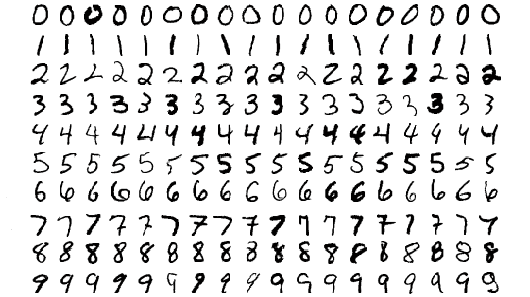

Copyright © Microsoft Corporation. All rights reserved.
  适用于[License](https://github.com/Microsoft/ai-edu/blob/master/LICENSE.md)版权许可

# 知识点

- [数据集使用之验证与测试](10.1-数据集使用之验证与测试.md)
- [三层神经网络的实现](10.2-三层神经网络的实现.md)
- [梯度检查](10.3-梯度检查.md)
- [手工测试训练效果](10.4-手工测试训练效果.md)

# 提出问题

手写识别是人工智能的重要课题之一。MNIST数字手写体识别图片集，大家一定不陌生，下面就是一些样本。

由于这是从欧美收集的数据，从图中可以看出有几点和中国人的手写习惯不一样：

- 数字2，下面多一个圈
- 数字4，很多横线不出头
- 数字6，上面是直的
- 数字7，中间有个横杠

不过这些细节不影响咱们学习课程，正好还可以验证一下中国人的手写习惯是否能够被正确识别。

由于不是让我们识别26个英文字母或者3500多个常用汉字，所以问题还算是比较简单，不需要图像处理只是。咱们可以试试用一个两三层的神经网络能不能解决，把每个图片的像素都当作一个向量来看，而不是作为点阵。

# 下载训练数据

MNIST数字手写体识别图片集，大家一定不陌生，[这是该网站的地址](http://yann.lecun.com/exdb/mnist/)。但是从上述地址下载的文件是压缩的，在解压缩过程中很可能会出现意想不到的问题，比如长度不对，后面补零等等，所以我们也准备了解压缩好的数据。

[点击下载训练及标签数据](https://github.com/Microsoft/ai-edu/tree/master/B-%E6%95%99%E5%AD%A6%E6%A1%88%E4%BE%8B%E4%B8%8E%E5%AE%9E%E8%B7%B5/B6-%E7%A5%9E%E7%BB%8F%E7%BD%91%E7%BB%9C%E5%9F%BA%E6%9C%AC%E5%8E%9F%E7%90%86%E7%AE%80%E6%98%8E%E6%95%99%E7%A8%8B/Data/Mnist.zip)

把下载的数据解压到一个目录中，最好是你的.py文件所在目录的.\Mnist子目录下，一共8个文件：
- Mnist-10-train-images.dat，0~9训练样本集
- Mnist-10-train-labels.dat，0~9训练标签集
- Mnist-10-test-images.dat，0~9测试样本集
- Mnist-10-test-labels.dat，0~9测试标签集
- Mnist-2-train-images.dat，0~1训练标签集
- Mnist-2-train-labels.dat，0~1训练标签集
- Mnist-2-test-images.dat，0~1测试样本集
- Mnist-2-test-labels.dat，0~1测试标签集

数据格式和原网站上的一致。可以用0~1样本先试验一下，因为样本量小，训练时间会很短。

