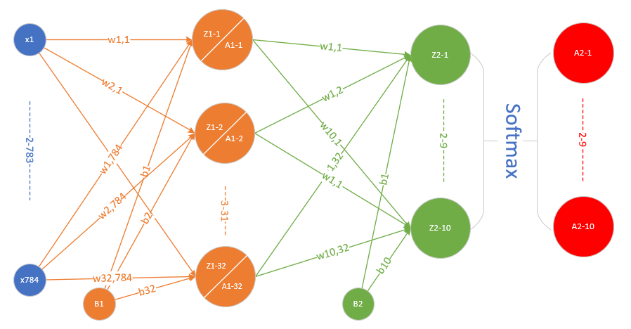

Copyright © Microsoft Corporation. All rights reserved.
  适用于[License](https://github.com/Microsoft/ai-edu/blob/master/LICENSE.md)版权许可

# 两层神经网络结构

我们先复习一下两层的神经网络。



前向计算：

$$W1^{(32,784)} \cdot X^{(784,1)} + B1^{(32,1)} => Z1^{(32,1)}$$

$$Sigmoid(Z1) => A1^{(32,1)}$$

$$W2^{(10,32)} \cdot A1^{(32,1)} + B2^{(10,1)} => Z2^{(10,1)}$$

$$Softmax(Z2) => A2{(10,1)}$$

## 输入层

我们的约定是行是样本，列一个样本的所有特征，这里是784个特征，因为图片高和宽是28x28，总共784个点，把每一个点的值做为特征向量。

## 隐层

定义32个神经元，使用Sigmoid激活函数。

## 输出层

输出层10个神经元，再加上一个Softmax计算，最后有a1,a2,...a10十个输出，分别代表0-9的10个数字。

## 运行结果

损失函数值曲线：


测试结果：

```
58000 0.18780564757446586
59000 0.1802561773995475
0
Testing...
rate=9400 / 10000 = 0.94
```

准确率94%。当然，没有精调网络，而且是随机初始化，只训练了一个epoch，所以每次测试得到的准确度在92%~94%之间。

# 三层神经网络


## 前向计算

$$W1^{(64,784)} \cdot X^{(784,1)} + B1^{(64,1)} => Z1^{(64,1)} \tag{1}$$

$$Sigmoid(Z1) => A1^{(64,1)} \tag{2}$$

$$W2^{(16,64)} \cdot A1^{(64,1)} + B2^{(16,1)} => Z2^{(16,1)} \tag{3}$$

$$Tanh(Z2) => A2^{(16,1)} \tag{4}$$

$$W3^{(10,16)} \cdot A2^{(16,1)} + B3^{(10,1)} => Z3^{(10,1)} \tag{5}$$

$$Softmax(Z3) => A3^{(10,1)} \tag{6}$$

## 输入层

我们的约定是行为样本，列为一个样本的所有特征，这里是784个特征，因为图片高和宽是28x28，总共784个点，把每一个点的值做为特征向量。

## 隐层

两个隐层，分别定义64个神经元和16个神经元。第一个隐层用Sigmoid激活函数，第二个隐层用Tanh激活函数。

## 输出层

输出层10个神经元，再加上一个Softmax计算，最后有a1,a2,...a10十个输出，分别代表0-9的10个数字。

## 反向传播

和以前的两层网络没有多大区别，只不过多了一层，而且用了tanh激活函数，目的是想把更多的梯度值回传，因为tanh函数比sigmoid函数稍微好一些，比如原点对称，零点梯度值大。

### 输出层

$$dZ3 = A3-Y \tag{7}$$

$$dW3=dZ3 \times A2^T \tag{8}$$

$$dB3=dZ3 \tag{9}$$

### 隐层2

$$dZ2 = W3^T \times dZ3 \odot (1-A2 \odot A2) \tag{10}$$

$$dW2=dZ2 \times A1^T \tag{11}$$

$$dB2=dZ2 \tag{12}$$

### 隐层1

$$dZ1 = W2^T \times dZ2 \odot A1 \odot (1-A1) \tag{13}$$

$$dW1= dZ1 \times X^T \tag{14}$$

$$dB1= dZ1 \tag{15}$$

## 运行结果

设置学习率为0.02，损失函数值：


测试得到精确度为94.59%。

```
58000 0.1773592175984359
59000 0.14726815726941017
0
Testing...
rate=9459 / 10000 = 0.9459
```

我们可以看到，三层网络比双层网络没有多大精确度的提高，主要原因是：
1. 两者都只走了一个epoch
2. 没有用交叉验证做参数精调
3. 单样本SGD，没有用任何优化器

代码位置：ch10, Level1, Level2, Level3