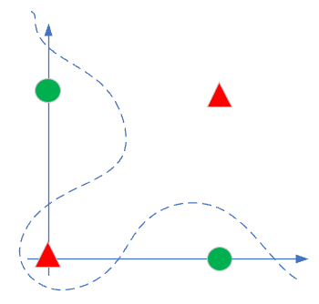

Copyright © Microsoft Corporation. All rights reserved.
  适用于[License](https://github.com/Microsoft/ai-edu/blob/master/LICENSE.md)版权许可

# 实现逻辑异或门

## 简单证明异或的可能性

在1969年，一本著名的书《Perceptrons》（感知器，Minsky、Papert,1969）证明了无法使用单层网络（当时称为感知器）来表示最基本的异或逻辑功能。这本书带来了毁灭性的影响，对于神经网络这一新生领域的资金支持及兴趣都消失了。

50年前的书，就不要去找了，咱们自己简单地证明一下。先看样本数据：

|样本|1|2|3|4|
|----|----|----|----|---|
|x1|0|0|1|1|
|x2|0|1|0|1|
|y|0|1|1|0|

用单个神经元（感知机）的话，就是下图：

|神经元|激活函数 Sigmoid|
|-|-|
|||

前向计算公式：

$$Z = w1 \cdot x1 + w2 \cdot x2 + b \tag{1}$$
$$A = Sigmoid(Z) \tag{2}$$

对于第一个样本数据，x1=0, x2=0, 如果需要A=0的话，从Sigmoid函数曲线看，需要Z<0，于是有：
$$w1 \cdot x1 + w2 \cdot x2 + b < 0$$
因为x1=0, x2=0, 所以：
$$b < 0 \tag{3}$$

同理，第二个样本和第三个样本的y值为1，要求Z值大于0，不等式为：

$$w2 + b > 0 \tag{4}$$
$$w1 + b > 0 \tag{5}$$

第四个样本要求Z小于0：

$$w1 + w2 + b < 0 \tag{6}$$

把公式6两边都加b，并把公式3接续：

$$(w1 + b) + (w2 + b) < b < 0 \tag{7}$$

再看公式(4)(5)，不等式左侧两个因子都大于0，其和必然也大于0，不可能小于b。因此公式7不成立，无论如何也不能满足所有的4个样本的条件，所以单个神经元做异或是不可能的。

## 脑补理想的分类结果

因为当时还没有BP算法，所以深层神经网络无法实现。进入到两层神经网络后，我们将可以轻松地解决这个问题。看下图：



因为单层神经网络只能做线性分割，而上图中所示红蓝两色样本，用一条直线是不能分开的，于是人们脑补了那条曲线的分割方式，相当的fancy。但是神经网络真的会这样工作吗？

## 利用已有的知识解决问题

我们前边学习过如何实现与、与非、或、或非，我们看看如何用已有的逻辑搭建异或门：


|样本|1|2|3|4|
|----|----|----|----|----|
|x1|0|0|1|1|
|x2|0|1|0|1|
|x1 AND x2|0|0|0|1|
|s1=x1 NAND x2|1|1|1|0|
|s2=x1 OR x1|0|1|1|1|
|y=s1 AND s2|0|1|1|0|

经过以上组合运算后，可以看到y的输出与x1,x2的输入相比，就是异或逻辑了。所以，实践证明两层神经网络可以解决问题。我们可以模拟这个思路，用两层神经网络搭建如下模型：

## 搭建神经网络


- 输入层两个特征值x1, x2
- 隐层2x2的权重矩阵和2x1的偏移矩阵
- 隐层由两个神经元构成
- 输出层有一个神经元使用Sigmoid函数进行分类

## 前向计算

根据网络结构，我们有了前向计算图：


$$Z1 = W1 \cdot X + B1 \tag{10}$$
$$A1 = Sigmoid(Z1) \tag{11}$$
$$Z2 = W2 \cdot A1 + B2 \tag{12}$$
$$A2 = Sigmoid(Z2) \tag{13}$$

**注意：公式13的Sigmoid在这里不是激活函数，不是激活函数，不是激活函数（重要的概念说三遍），是用作分类函数。**

## 损失函数

我们把异或问题归类成二分类问题，所以使用二分类交叉熵损失函数：

$$
J(w,b) = -{1 \over m} \sum^m_{i=1}y_i \ln (a_i)+(1-y_i) \ln (1-a_i) \tag{14}
$$

可以简写为：

$$
J = -Y \ln A + (1-Y) \ln (1-A) \tag{15}
$$


## 反向传播


### 梯度生成

对损失函数求导，可以得到损失函数对输出层的梯度值，即上图中的Z2部分。

根据公式15，求A2和Z2的导数：

$${\partial{J} \over \partial{Z2}}={\partial{J} \over \partial{A2}} \cdot {\partial{A2} \over \partial{Z2}}$$
$$= {A2-Y \over A2(1-A2)} \cdot A2(1-A2)$$
$$=A2-Y \tag{15} => dZ2$$

### 求W2和B2的梯度

$${\partial{J} \over \partial{W2}}={\partial{J} \over \partial{Z2}}{\partial{Z2} \over \partial{W2}}=dZ2 \times A1^T => dW2\tag{16}$$

$${\partial{J} \over \partial{B2}}={\partial{J} \over \partial{Z2}}{\partial{Z2} \over \partial{B2}}=dZ2 => dB2 \tag{17}$$

### 求损失函数对隐层的梯度

$$
\frac{\partial{J}}{\partial{Z1}} = \frac{\partial{J}}{\partial{Z2}} \cdot \frac{\partial{Z2}}{\partial{A1}} \cdot \frac{\partial{A1}}{\partial{Z1}}
$$
$$=W2^T \times dZ2 \odot A1 \odot (1-A1)=>dZ1 \tag{18}$$

### 求W1和B1的梯度

$$
\frac{\partial{J}}{\partial{W1}} = \frac{\partial{J}}{\partial{Z1}} \frac{\partial{Z1}}{\partial{W1}}= dZ1 \times X^T => dW1\tag{19}
$$

$$
\frac{\partial{J}}{\partial{B1}} = \frac{\partial{J}}{\partial{Z1}} \frac{\partial{Z1}}{\partial{B1}}= dZ1 => dB1\tag{20}
$$

## 运行结果

```
w=[[-7.00777143 -7.01121059]
 [ 5.51518649  5.51451102]]
b=[[ 2.86885647]
 [-8.53863829]]
```


代码位置：ch10, Level1