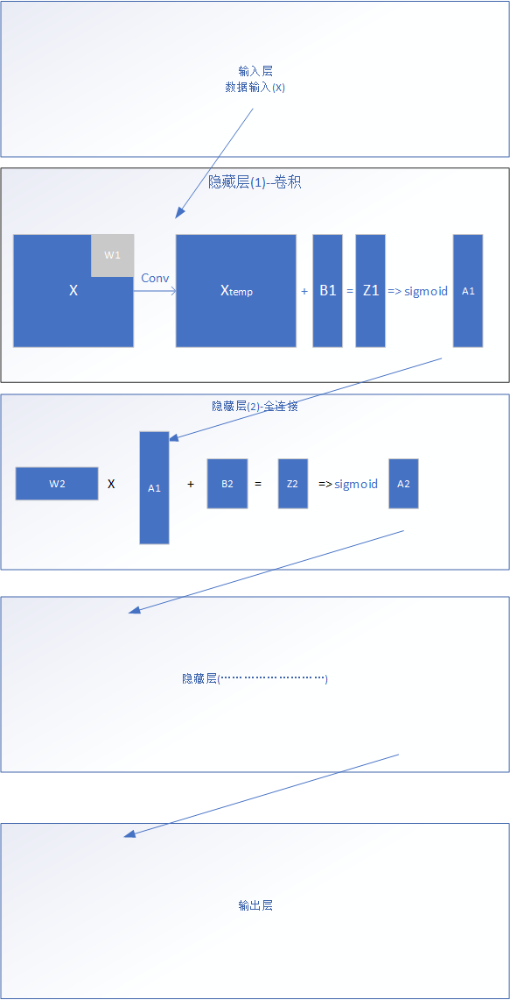

Copyright © Microsoft Corporation. All rights reserved.
  适用于[License](https://github.com/Microsoft/ai-edu/blob/master/LICENSE.md)版权许可

# 知识点

- 模型的保存格式
- 不同格式模型之间的转换
- 模型的部署

# 提出问题

在我们辛辛苦苦经过短则数分钟，长则几天几个月训练之后，我们得到了一个能够满足我们需求的模型，给这个模型一些数据，模型能够给出对应的输出。
我们应该如何使用这个模型呢？

- Choice1
  把验证过可以训练出结果的训练代码放入预测代码中，每次使用前重新训练

- Choice2
  把训练的结果保存下来，每次使用的时候直接把训练结果导入

从直觉上来说，如果没有保存模型的话，每次重新训练模型，这对于计算资源有限的情况下是难以接受的。比方说，每次打开一个网站等待需要等待一天，因为这个时候后台在训练一个很大的模型，需要一天的时间结束训练，然后花十秒钟给出我们想要的结果。

这样子的应用是可以接受的嘛？

不急着回答，来看第二个选项，在花费一天时间得到模型之后，把这个模型保存下来。需要使用的时候，花费10秒钟，把这个模型重新加载进入程序，再花10秒钟把结果输出给用户！只需要20秒，这个应用运行结束了！

第二种方式的优势是巨大的。所以，这个保存模型，具体是一种什么操作呢？

# 模型结构

我们的目标是保存一个模型，那么什么是一个模型？换句话说，要保存哪些东西才能算是保存了一个模型，让下次可以使用呢？
想想在之前几章的时候，我们要训练一个模型的时候经过了哪些步骤？
首先，我们定义了网络结构，准备了训练数据，然后设定了学习率，更新方法，之后通过训练（反向传播），得到了最终用于预测的网络各层的参数。
之后，在检验这个模型的时候，我们将测试数据直接输入模型，通过每一层的计算，得到了对应的结果。
参与这个过程的参数有哪些？训练数据并没有在预测过程中出现，因为没有参数更新，因此学习率和更新方法也并没有发挥作用。
所以，在这个过程中发挥作用的是，数据经过每一层之后，和这一层的参数一起，按照当前层规定的运算方式进行处理。处理完成的数据被送入下一层，重复和上一层类似的操作，也就是下图示意的过程



下面我们来看一个真正的框架输出模型的保存结果是不是像我们推论的那样，保存了一个模型的计算流程和需要用到的参数。

## 神经网络模型

为了阐述的方便，我们以一个tensorflow生成的模型作为例子。

首先，我们使用代码生成一个非常简单的深度学习模型，由一个卷积层，一个relu激活函数组成，

```python
import tensorflow as tf
SEED = 46
def main():
    # first generate weights and bias used in conv layers
    conv1_weights = tf.Variable(
      tf.truncated_normal([5, 5, 3, 8],  # 5x5 filter, depth 8.
                          stddev=0.1,
                          seed=SEED))
    conv1_biases = tf.Variable(tf.zeros([8]))

    # data and out is placeholder used for input and output data in practice
    data = tf.placeholder(dtype=tf.float32, name="data", shape=[8, 32, 32, 3])
    out = tf.placeholder(dtype=tf.float32, name="out", shape=[8, 32, 32, 8])

    # as the structure of the simple model
    def model():
        conv = tf.nn.conv2d(data,
                        conv1_weights,
                        strides=[1, 1, 1, 1],
                        padding='SAME', name="conv")
        out = tf.nn.relu(tf.nn.bias_add(conv, conv1_biases), name="relu")

    # saver is used for saving model
    saver = tf.train.Saver()
    with tf.Session() as sess:
        model()
        # initialize all variables
        tf.global_variables_initializer().run()
        # save the model in the file path
        saver.save(sess, './model')
```

在上面这份代码中，我们生成了一个输入大小是8\*32\*32\*3，输出尺寸是8\*32\*32\*8，卷积核大小是5\*5，输入通道数是3，输出通道数是8的只有一个卷积层的神经网络。我们甚至没有给这个神经网络进行训练，就直接进行了保存。这样一个神经网络模型文件里是一个什么样的结构呢？是像一般的程序一样，编译完了程度就被转化成了一堆逻辑指令呢？还是继续维持着这样一个模型文件的结构呢？

在运行完上面的代码后，在当前路径下应该多了四个文件，checkpoint，model.index， model.meta， model.data-00000-of-00001，如果没有的话请重新运行文件生成这样的文件。这样四个文件里面保存了什么呢？按照官方文档的解释，meta文件保存了序列化后的计算图，index文件则保存了数据文件的索引，包括变量名等等，data文件是保存了类似于变量值这样的数据的文件，checkpoint记录了最新的模型文件的名称或者序号。什么是计算图呢？直接用图形来做说明吧，


上面的计算图就描述了一个将两个数相乘之后输出的计算过程。模型文件中的计算图描述的也是一个计算过程，不过要比这种简单的过程要复杂很多。

怎么查看一个模型文件中的内容呢？这里要使用[Tools for AI](https://visualstudio.microsoft.com/zh-hans/downloads/ai-tools-vs/?rr=https%3A%2F%2Fwww.msra.cn%2Fzh-cn%2Fnews%2Ffeatures%2Ftools-for-ai)工具里查看模型的功能了，


点击view Model按钮，会弹出来这样一个窗口


选择Open Model，选择我们之前生成的那个简单的模型文件，稍等片刻，会看到这样一张截图：


哇，我不是只写了一个卷积层吗？为什么会多出来这么多东西？

下面呢，让我们来仔细分析下这张图的成分

首先看右半部分，


每个方框是不是很眼熟？conv2D就是我们执行卷积操作的部分，按照箭头标示的数据流走向，经过卷积层处理的数据会进入BiasAdd部分，加上偏置，之后进入Relu部分进行relu操作，经过relu的数据会进行输出。这也就是我们在tensorflow代码中显示构建的部分。

下面我们从各个结点单独入手进行分析。

以卷积层的卷积核这样一个参数结点为例，


从右侧窗口看到这个变量的尺寸是[5, 5, 3, 8]，正是我们初始化所预期的一个大小。那这个结点有4个和其他结点的联系，我们来逐个看一看。

首先是和左上侧结点之间的联系，


这一条支路上的联系对应的是代码中

```python
conv1_weights = tf.Variable(
      tf.truncated_normal([5, 5, 3, 8],  # 5x5 filter, depth 8.
                          stddev=0.1,
                          seed=SEED))
```

这样的生成一个截断的正态分布的初始化过程。也许有人会好奇这个初始化不是就一步吗？为什么这里会有四个结点进行这样一个过程呢？

分别来看看各个节点的作用吧。这里将依次展示四个结点的性质描述


这是第一个结点的性质描述，该结点的功能也就是生成一个标准的截断的正态分布，也就是标准差是1，平均值是0的标准正态分布。


这是乘法结点的性质描述，看这个结点的两个输入，一个是根据上一个结点输出的正态分布结果，另一个输入就是我们在代码中规定的标准差了，这个结点的作用就是将标准化的正态分布的标准差改变成我们在代码中期望的标准差。


这个结点是一个执行加法操作的结点。在我们对卷积核使用截断的正态分布进行初始化的过程中，我们可以给出期望的两个参数，分别是用于初始化的正太分布的标准差和均值。在上一个乘法结点中，我们对所生成的标准分布的标准差进行了修改，也就是说，输入这个加法结点的是一个标准差是所期望的标准差，但是均值是零的一个正态分布。在加法结点中，我们采取对数据加上所期望的均值的方法将用于初始化的正态分布由标准正态分布转化成一个标准差是输入的stddev参数规定的标准差，均值是输入的mean参数规定的均值的一个正态分布。


在前三步结点的操作中，我们只是生成了这样一个用于初始化的标准正态分布的有关数据，还没有把这个正态分布的值和我们要初始化的卷积核联系起来。这个结点的作用就是建立了这样的一个联系，将初始化操作得到的值赋给卷积核结点。

再看最右边的连接路径


在这部分的计算图中，data结点就是我们在代码中声明的输入结点，Identity结点的作用是将我们的输入tensor进行一侧复制，将复制的结果传入conv2D结点进行卷积计算操作。

也就是说，这一部分就是我们预期的在前向传播中进行的操作的步骤。

那么另外两条路径的作用是什么呢？

再看我们之前的代码，建立模型的部分已经在计算图中体现了，对参数进行初始化的步骤也在最左边的连接中进行过了，还有哪个部分没有讲到呢？

还剩下的部分也就是我们在计算图中剩余的部分，对模型的存储操作了。不过，存储的目的是为了之后能够将模型从新导入代码文件中进行直接的使用，也就是说，虽然我们在代码中只体现了存储的部分，但是tensorlfow这个框架会自动的帮我们补全模型重载需要的操作，这一部分也会体现在计算图中。

而这一个保存，一个重载，也就是剩下的两条连接所对应的内容了。


我们之前说，在index文件中保存的是数据文件的索引，是一张表，这样的表里存放了什么呢？从这张计算图中看，在saveV2这样一个结点中，保存了变量的名称，由这个模型的名字，也就是在这份代码中的函数名称"model"加上变量自己的名称构成一个全局的变量名，保证不会出现重复的tensor名称。之后会存储的是这个tensor的大小，也就是shape_and_slices这个域中的内容，再之后保存的就会是这个tensor本身的值。

restore的过程是一个逆过程。程序会根据tensor的名称和对应的尺寸，从存下的文件中读取对应的tensor的值，经过一个赋值的assign结点，将保存下来的具体数值再重新放入对应的变量中，在目前这个例子中，也就是卷积核这个变量中。

另外一个variable结点对应的连接与我们上面所述的结点完全相似，大家可以自己动手来把这个结点的连接分析出来！

### 阶段小结

从上面的对模型推导过程和对框架输出模型的分析，我们看到，在模型保存过程中，真正需要注意的是，对数据处理过程的记录（也就是计算图）和在这个处理过程中需要用到的参数的记录（计算图中各个计算结点需要用到的参数）。

# ONNX模型结构

在之前几节的内容中，我们没有借助任何框架的内容，而是用了python或者Julia去手写网络，去训练得到结果。现在假设我们已经保存了训练的结果，也就是说，我们保存了训练得到的计算图和对应的权重，那我们如何把训练得到的模型和主流框架中的模型结构统一起来呢？也就是说，让我们训练得到的结果可以直接放在主流框架里使用呢？

当然这个问题有暴力解法，反正是简单的网络结构，而且权重是已经知道的，那我就干脆就用各种框架从新把网络结构写一遍，然后把对应的权重参数读入，放到对应的层里面去，这不就大功告成了嘛！

这个解法不够那么优雅，作为一个还有头发的优雅程序员，我们要优雅的做这样一个转换：给定一个模型和目标对象，让程序来帮我们转换成目标的框架下对应的模型！换句话说，造一个能和主流框架接轨的轮子。

不会复用轮子的程序员不是好程序员！在这个方向有什么轮子是可以拿来用的呢？在这里我们选择ONNX作为复用的轮子。

## ONNX是什么？

关于这个问题，你已经是个成熟的轮子了，应该会自己介绍自己了，所以，请你来一段[自我介绍](https://github.com/onnx/onnx)可好？

简单来说，onnx模型可以帮助我们把我们自己的模型转换为任何一种主流深度学习框架可以识别的模型，也就是说，让我们训练得到的模型接入主流深度学习框架的轨道。

## 如何将模型保存为ONNX格式？

在ONNX的设定中，计算是依靠“结点”的结构来实现的，每个结点拥有自己的输入输出和操作类型，两个结点之间的连接是依靠寻找相同名字的输入输出来实现连接的，也就是说，相同名字的变量会被认为是同一个变量，如果一个结点的输出名字和另一个结点的输入名字相同，这两个结点会被认为是连接在一起的。如何生成一个ONNX的结点呢？这里我们要依靠ONNX的[python API](https://github.com/onnx/onnx/blob/9afc06c5f3b92344bdbedd488ab399d7763d17ce/onnx/helper.py#L20)，也就是下图这样一些代码，

```python
def make_node(
        op_type,  # type: Text
        inputs,  # type: Sequence[Text]
        outputs,  # type: Sequence[Text]
        name=None,  # type: Optional[Text]
        doc_string=None,  # type: Optional[Text]
        domain=None,  # type: Optional[Text]
        **kwargs  # type: Any
):  # type: (...) -> NodeProto
    """Construct a NodeProto.

    Arguments:
        op_type (string): The name of the operator to construct
        inputs (list of string): list of input names
        outputs (list of string): list of output names
        name (string, default None): optional unique identifier for NodeProto
        doc_string (string, default None): optional documentation string for NodeProto
        domain (string, default None): optional domain for NodeProto.
            If it's None, we will just use default domain (which is empty)
        **kwargs (dict): the attributes of the node.  The acceptable values
            are documented in :func:`make_attribute`.
    """
```

onnx目前支持的op_type类型可以在[这里](https://github.com/onnx/onnx/blob/master/docs/Operators.md)进行查找。

我们来尝试进行一次卷积层的转换，首先，我们进入到op_type中对应卷积的[部分](https://github.com/onnx/onnx/blob/master/docs/Operators.md#Conv)，
在这里，我们可以看到卷积层对应的参数有很多，比如group，dilations等等。我们先来考虑一个简单的情况，就是一个仅仅只设置了strides和pads的卷积层，应该如何进行转换。

先来看Conv部分下的example：

```python
x = np.array([[[[0., 1., 2., 3., 4.],  # (1, 1, 5, 5) input tensor
                [5., 6., 7., 8., 9.],
                [10., 11., 12., 13., 14.],
                [15., 16., 17., 18., 19.],
                [20., 21., 22., 23., 24.]]]]).astype(np.float32)
W = np.array([[[[1., 1., 1.],  # (1, 1, 3, 3) tensor for convolution weights
                [1., 1., 1.],
                [1., 1., 1.]]]]).astype(np.float32)

# Convolution with padding
node_with_padding = onnx.helper.make_node(
    'Conv',
    inputs=['x', 'W'],
    outputs=['y'],
    kernel_shape=[3, 3],
    # Default values for other attributes: strides=[1, 1], dilations=[1, 1], groups=1
    pads=[1, 1, 1, 1],
)
y_with_padding = np.array([[[[12., 21., 27., 33., 24.],  # (1, 1, 5, 5) output tensor
                             [33., 54., 63., 72., 51.],
                             [63., 99., 108., 117., 81.],
                             [93., 144., 153., 162., 111.],
                             [72., 111., 117., 123., 84.]]]]).astype(np.float32)
expect(node_with_padding, inputs=[x, W], outputs=[y_with_padding],
       name='test_basic_conv_with_padding')

# Convolution without padding
node_without_padding = onnx.helper.make_node(
    'Conv',
    inputs=['x', 'W'],
    outputs=['y'],
    kernel_shape=[3, 3],
    # Default values for other attributes: strides=[1, 1], dilations=[1, 1], groups=1
    pads=[0, 0, 0, 0],
)
y_without_padding = np.array([[[[54., 63., 72.],  # (1, 1, 3, 3) output tensor
                                [99., 108., 117.],
                                [144., 153., 162.]]]]).astype(np.float32)
expect(node_without_padding, inputs=[x, W], outputs=[y_without_padding],
       name='test_basic_conv_without_padding')
```

这是一个pad为1，步长为1，卷积核大小是3的卷积层，输入是数据(X)和对应的卷积核(W)，输出(Y)。需要注意的是，这里的x,w,y均是名称，对应的数据是通过名称输入到卷积层中进行操作的。

仿照这个例子，我们来自己写一个卷积层转换的函数。这个转换函数需要哪些参数呢？在现在我们只考虑有strides和pads的情况下，我们要接受的是卷积核的名称，输入数据的名称，输出数据的名称，步长和pads的大小这样一些参数，然后仿照这个例子进行一个书写。Talk is cheap, Show me the code!

```python

def make_conv(
    input_name,  # a string
    output_name, # a string
    weights,     # a numpy array stored the weights, [W, H, inputChannels, outputChannels]
    strides = [1, 1], # a list stored the strides, default [1, 1]
    pads=[1, 1, 1, 1],# a list stored the pads, default [1, 1, 1, 1]
    node_list=[],     # a list stored all the nodes, default [] 
):

    # transform the weights axes
    # since the weights in the onnx is stored in the format [outputChannels, inputChannels, H, W]
    # whether use the two swapaxes depends on your own implementation in the conv forward process
    weights = np.swapaxes(weights, 0, 3)
    weights = np.swapaxes(weights, 1, 2)

    # use a constant node to store the weights
    # since the weights is constant during the forward process
    node_list.append(
        helper.make_node(
            "Constant",
            inputs=[],
            outputs=[input_name + "weights"],
            value=helper.make_tensor(
                name=node[input_name + "weights"],
                data_type=TensorProto.FLOAT,
                dims=weights.shape,
                vals=weights.flatten().astype(float),
                    ),
                )
            )

    # now we have the input's, output's and weights' name; pads list, strides list
    # we can make the conv node
    kernel_shape=weights.shape[2:4]
    node_list.append(
                helper.make_node(
                    "Conv",
                    [input_name, input_name + "weights"],
                    [output_name],
                    kernel_shape=kernel_shape,
                    strides=strides,
                    pads=pads
                )
            )

    return node_list, output_name
```

通过这样一个代码，给定对应的参数，我们就拥有了一个存储着可以执行卷积操作的结点和他对应的参数，之后将这样一个结点的集合(node_list)转换成图(make_graph)和模型(make_model)，我们就得到了一个onnx格式的模型啦！

其他各种类型的转换代码希望大家能够自行实现，[这里](https://github.com/Microsoft/ai-edu/blob/master/B-%E6%95%99%E5%AD%A6%E6%A1%88%E4%BE%8B%E4%B8%8E%E5%AE%9E%E8%B7%B5/B6-%E4%BA%BA%E5%B7%A5%E6%99%BA%E8%83%BD%E5%9F%BA%E6%9C%AC%E5%8E%9F%E7%90%86%E7%AE%80%E6%98%8E%E6%95%99%E7%A8%8B/%E5%BE%AE%E8%BD%AF-%E6%96%B9%E6%A1%881/0-1mnist/transfer.py)我们也提供了一套转换代码作为参考(Note!: 具体代码细节与大家实现卷积层全连接层时候的实现细节有关，请在参考基础上作出适当改动)
