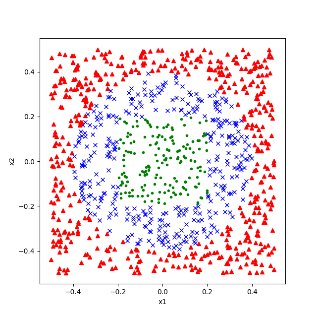
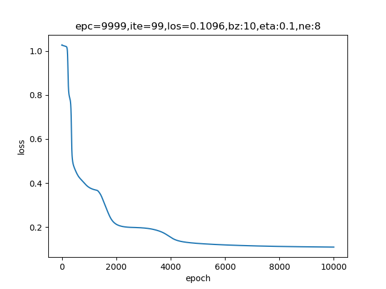
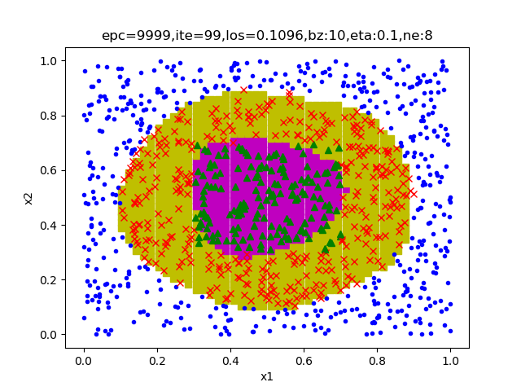

Copyright © Microsoft Corporation. All rights reserved.
  适用于[License](https://github.com/Microsoft/ai-edu/blob/master/LICENSE.md)版权许可

# 非线性多分类

# 提出问题

前面用异或问题学习了二分类，现在我们看看如何用它来做非线性多分类。

我们有如下1000个样本和标签：

|样本序号|1|2|3|...|1000|
|---|---|---|---|---|---|
|x1|0.0091867|0.10245588|-0.41033773|...|-0.20625644|
|x2|0.00666677|0.20947882|0.18172314|...|0.19683694|
|y|1|2|3|...|2|

还好这个数据只有两个特征，所以我们可以用可视化的方法展示，如下图：

1. 绿色点
2. 红色点
3. 蓝色点

**问题：如何用两层神经网络实现这个三分类问题？**

三种颜色的点有规律地占据了一个单位平面内(-0.5,0.5)的不同区域，从图中可以明显看出，这不是线性可分问题，而单层神经网络只能做线性分类，如果想做非线性分类，需要至少两层神经网络来完成。

木头：我觉得红蓝两色是圆形边界分割，红绿两色是个矩形边界，都是有规律的。

铁柱：学习神经网络，要忘记“规律”这个词，对于神经网络来说，数学上的“有规律”或者“无规律”是没有意义的，对于它来说都是无规律，训练难度是一模一样的。另外，边界也是无意义的，要用概率来理解。

# 下载训练数据

[点击下载训练样本数据X](https://github.com/Microsoft/ai-edu/tree/master/B-%E6%95%99%E5%AD%A6%E6%A1%88%E4%BE%8B%E4%B8%8E%E5%AE%9E%E8%B7%B5/B6-%E7%A5%9E%E7%BB%8F%E7%BD%91%E7%BB%9C%E5%9F%BA%E6%9C%AC%E5%8E%9F%E7%90%86%E7%AE%80%E6%98%8E%E6%95%99%E7%A8%8B/Data/X9_3.npy)

[点击下载训练样本数据Y](https://github.com/Microsoft/ai-edu/tree/master/B-%E6%95%99%E5%AD%A6%E6%A1%88%E4%BE%8B%E4%B8%8E%E5%AE%9E%E8%B7%B5/B6-%E7%A5%9E%E7%BB%8F%E7%BD%91%E7%BB%9C%E5%9F%BA%E6%9C%AC%E5%8E%9F%E7%90%86%E7%AE%80%E6%98%8E%E6%95%99%E7%A8%8B/Data/Y9_3.npy)

## 定义神经网络结构

- 输入层两个特征值x1, x2
- 隐层8x2的权重矩阵和8x1的偏移矩阵
- 隐层由8个神经元构成
- 输出层有3个神经元负责3分类，使用Softmax函数进行分类

## 前向计算

单样本矩阵运算过程：
$$W_1^{(8 \times 2)} \cdot X^{(2 \times 1)} + B_1^{(8 \times 1)} => Z_1^{(8 \times 1)}$$
$$Sigmoid(Z1) => A_1^{(8 \times 1)}$$
$$W_2^{(3 \times 8)} \times A_1^{(8 \times 1)} + B_2^{(3 \times 1)} => Z_2^{(3 \times 1)}$$
$$Softmax(Z2) => A_2^{(3 \times 1)}$$

## 损失函数

使用多分类交叉熵损失函数：

$$
J(w,b) = -{1 \over m} \sum^m_{i=1} \sum^n_{j=1} y_{ij} \ln (a_{ij})
$$

m为样本数，n为类别数。

可以简写为：

$$
J = -Y \ln A
$$

## 反向传播

在第6.4章中的多分类原理中，已经讲过了如何推导反向传播公式，咱们把结论拿过来复习一下。

$$\frac{\partial{J}}{\partial{A2}} \frac{\partial{A2}}{\partial{Z2}} = A2-Y => dZ2$$

虽然这个求导结果和二分类一样，但是过程截然不同，详情请看6.4。

后续的梯度求解与9.1节一样，只拷贝结论在这里：

$$dW2=dZ2 \times A1^T \tag{2}$$

$$dB2=dZ2 \tag{3}$$

$$W2^T \times dZ2 \odot A1 \odot (1-A1) => dZ1 \tag{4}$$

$$dW1= dZ1 \cdot X^T \tag{5}$$

$$dB1= dZ1 \tag{6}$$

损失函数记录：

迭代了10000次，没有到底损失函数小于0.06的条件。

分类结果图示：

因为没达到精度要求，所以分类效果一般。

代码位置：ch09, Level4
