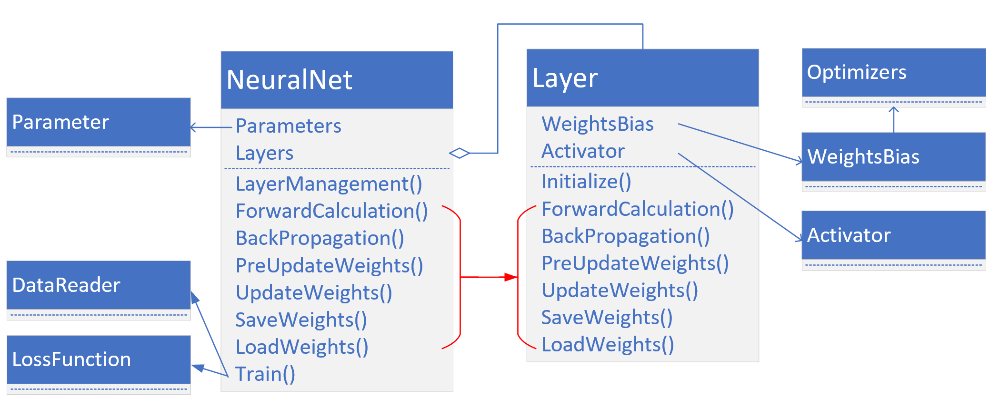

Copyright © Microsoft Corporation. All rights reserved.
  适用于[License](https://github.com/Microsoft/ai-edu/blob/master/LICENSE.md)版权许可

# 功能/模式分析

比较第12章中的三层神经网络的代码，我们可以看到大量的重复之处，比如前向计算中：

```Python
def forward3(X, dict_Param):
    ...
    # layer 1
    Z1 = np.dot(W1,X) + B1
    A1 = Sigmoid(Z1)
    # layer 2
    Z2 = np.dot(W2,A1) + B2
    A2 = Tanh(Z2)
    # layer 3
    Z3 = np.dot(W3,A2) + B3
    A3 = Softmax(Z3)
    ...    
```

1，2，3三层的模式完全一样：矩阵运算+激活/分类函数。

再看看反向传播：

```Python
def backward3(dict_Param,cache,X,Y):
    ...
    # layer 3
    dZ3= A3 - Y
    dW3 = np.dot(dZ3, A2.T)
    dB3 = np.sum(dZ3, axis=1, keepdims=True)
    # layer 2
    dZ2 = np.dot(W3.T, dZ3) * (1-A2*A2) # tanh
    dW2 = np.dot(dZ2, A1.T)
    dB2 = np.sum(dZ2, axis=1, keepdims=True)
    # layer 1
    dZ1 = np.dot(W2.T, dZ2) * A1 * (1-A1)   #sigmoid
    dW1 = np.dot(dZ1, X.T)
    dB1 = np.sum(dZ1, axis=1, keepdims=True)
    ...
```
每一层的模式也非常相近：计算本层的dZ，再根据dZ计算dW和dB。

因为三层网络比两层网络多了一层，所以会在初始化、前向、反向、更新参数等四个环节有所不同，但却是有规律的。再加上前面章节中，为了实现一些辅助功能，我们已经写了很多类。所以，现在可以动手搭建一个深度学习的mini框架了。

# 抽象与设计



## NeuralNet

我们首先需要一个NeuralNet类，来包装基本的神经网络结构和功能：

- Layers - 神经网络各层的容器，按添加顺序维护一个列表
- Parameters - 基本参数  
- LayerManagement() - 添加神经网络层
- ForwardCalculation() - 调用各层的前向计算方法
- BackPropagation() - 调用各层的反向传播方法
- PreUpdateWeights() - 预更新各层的权重参数
- UpdateWeights() - 更新各层的权重参数
- Train() - 训练
- SaveWeights() - 保存各层的权重参数
- LoadWeights() - 加载各层的权重参数

## Layer

是一个抽象类，以及更加需要增加的实际类，比如Full Connection Layer, Convolution Layer, Max Pool Layer等等。

 - WeightsBias - 本层的权重参数
 - Activator - 本层的激活函数
 - Initialize() - 初始化层
 - ForwardCalculation() - 调用本层的前向计算方法
 - BackPropagation() - 调用本层的反向传播方法
 - PreUpdateWeights() - 预更新本层的权重参数
 - UpdateWeights() - 更新本层的权重参数
 - SaveWeights() - 保存本层的权重参数
 - LoadWeights() - 加载本层的权重参数
 
 ## Parameters

 基本神经网络运行参数

 - 学习率
 - 最大epoch
 - batch size
 - 损失函数定义
 - 初始化方法
 - 优化器类型
 - 停止条件

## LossFunction

损失函数及帮助方法

- 均方差函数
- 交叉熵函数二分类
- 交叉熵函数多分类
- 记录损失函数
- 显示损失函数历史记录
- 获得最小函数值时的权重参数

## GDOptimizer

优化器

- SGD
- Momentum
- Nag
- AdaGrad
- AdaDelta
- RMSProp
- Adam

## Activator

激活函数和分类函数

- Identity - 直传函数，即没有激活处理
- Sigmoid
- Tanh
- Relu
- Softmax

## WeightsBias

权重矩阵

- 初始化 
  - Zero, Normal, MSRA (HE), Xavier
  - 保存初始化值
  - 加载初始化值
- Pre_Update - 预更新
- Update - 更新
- Save - 保存训练结果值
- Load - 加载训练结果值

## DataReader

样本数据读取器

- ReadData - 从文件中读取数据
- NormalizeX - 归一化样本值
- NormalizeY - 归一化标签值
- GetBatchSamples - 获得批数据
- ToOneHot - 标签值变成OneHot编码用于多分类
- ToZeorOne - 标签值变成0/1编码用于二分类
- Shuffle - 打乱样本顺序

# 搭积木

有了上面的Mini框架后，我们可以用搭积木的方式来构建神经网络，如下面的代码片段：

```Python
  ...
  params = CParameters(learning_rate, max_epoch, batch_size, eps,
                        LossFunctionName.CrossEntropy3, 
                        InitialMethod.Xavier, 
                        OptimizerName.SGD)
  net = NeuralNet(params)
  fc1 = FcLayer(num_input, num_hidden1, Relu())
  net.add_layer(fc1, "fc1")
  fc2 = FcLayer(num_hidden1, num_hidden2, Relu())
  net.add_layer(fc2, "fc2")
  fc3 = FcLayer(num_hidden2, num_output, Softmax())
  net.add_layer(fc3, "fc3")
  net.train(dataReader, loss_history)
  ...
```

1. 先构造一个参数集合CParameters，包括：
   1. 学习率
   2. 最大epoch，
   3. 批大小，
   4. eps停止条件，
   5. 损失函数形态(default为CrossEntropy3)，
   6. 初始化方法(default为Xavier)
   7. 优化器选择default为(SGD)
2. 构造网络NeuralNet，传入参数
3. 构造第一个FC层，指定输入样本特征数量和输出（num_hidden1）神经元个数值，及ReLU激活函数
4. 构造第二个FC层，指定神经元数（num_hidden2）值，及ReLU激活函数
5. 构造第三个FC层，指定分类数（num_output)，及Softmax分类函数
6. 开始训练，并传入DataReader和LossHistory帮助类的实例

net.train()函数是一个阻塞函数，只有当训练完毕后才返回

