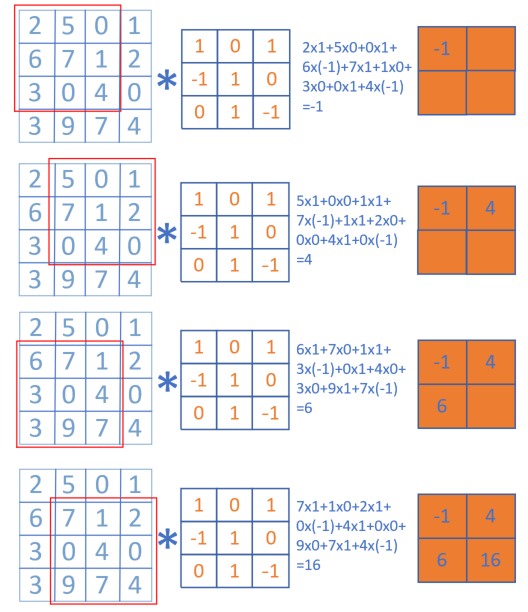
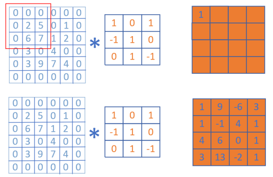
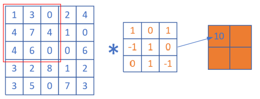

Copyright © Microsoft Corporation. All rights reserved.
  适用于[License](https://github.com/Microsoft/ai-edu/blob/master/LICENSE.md)版权许可

# 卷积的数学定义

$$h(x)=(f*g)(x) = \int_{-\infty}^{\infty} f(t)g(x-t)dt \tag{1}$$

卷积与傅里叶变换有着密切的关系。利用一点性质，即两函数的傅里叶变换的乘积等于它们卷积后的傅里叶变换，能使傅里叶分析中许多问题的处理得到简化。

离散定义

$$h(x) = (f*g)(x) = \sum^{\infty}_{t=-\infty} f(t)g(x-t) \tag{2}$$

离散实例

有两枚骰子f和g，掷出后二者相加为4的概率

【图14.1.1】$f(1)g(3), 3+1=4$

【图14.1.2】$f(2)g(2), 2+2=4$

【图14.1.3】$f(3)g(1), 1+3=4$

因此，两枚骰子点数加起来为4的概率为：

$$h(4) = f(1)g(3)+f(2)g(2)+f(3)g(1)$$

符合卷积的定义，把它写成标准的形式就是：

$$(f*g)(4)=\sum _{t=1}^{3}f(t)g(4-t)$$

图像处理

在传统的图像处理中，卷积操作多用来进行滤波，锐化或者边缘检测啥的。我们可以认为卷积是利用某些设计好的参数组合(卷积核)去提取图像空域上相邻的信息。

【图14.1.4】

padding

【图14.1.5】

stride

【图14.1.6】

【图14.1.7】

参考：

https://www.zhihu.com/question/22298352

https://zhuanlan.zhihu.com/p/33773140
