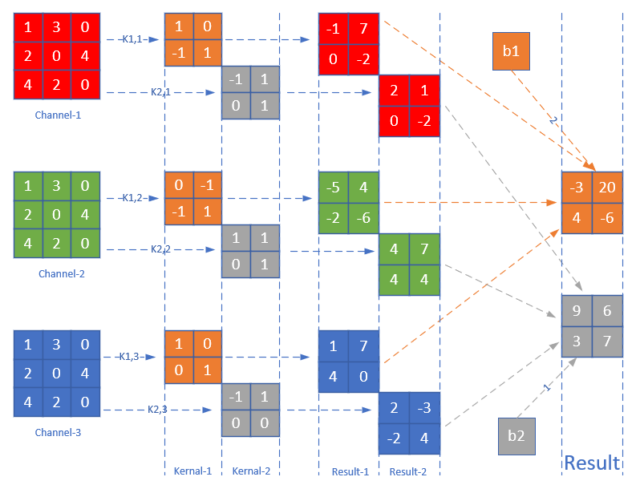

Copyright © Microsoft Corporation. All rights reserved.
  适用于[License](https://github.com/Microsoft/ai-edu/blob/master/LICENSE.md)版权许可

# 卷积的数学定义

$$h(x)=(f*g)(x) = \int_{-\infty}^{\infty} f(t)g(x-t)dt \tag{1}$$

卷积与傅里叶变换有着密切的关系。利用一点性质，即两函数的傅里叶变换的乘积等于它们卷积后的傅里叶变换，能使傅里叶分析中许多问题的处理得到简化。

离散定义

$$h(x) = (f*g)(x) = \sum^{\infty}_{t=-\infty} f(t)g(x-t) \tag{2}$$

离散实例

有两枚骰子f和g，掷出后二者相加为4的概率

【图14.1.1】$f(1)g(3), 3+1=4$

【图14.1.2】$f(2)g(2), 2+2=4$

【图14.1.3】$f(3)g(1), 1+3=4$

因此，两枚骰子点数加起来为4的概率为：

$$h(4) = f(1)g(3)+f(2)g(2)+f(3)g(1)$$

符合卷积的定义，把它写成标准的形式就是：

$$h(4)=(f*g)(4)=\sum _{t=1}^{3}f(t)g(4-t)$$

图像处理

在二位图片上做卷积，如果把图像Image简写为$I$，把卷积核Kernal简写为$K$，则目标图片的第$(i,j)$个像素的卷积值为：

$$
h(i,j) = (I*K)(i,j)=\sum_m \sum_n I(m,n)K(i-m,j-n) \tag{3}
$$

可以看出，这和一维情况下的公式2是一致的。从卷积的可交换性，我们可以把公式3等价地写作：

$$
h(i,j) = (I*K)(i,j)=\sum_m \sum_n I(i-m,j-n)K(m,n) \tag{4}
$$

公式4的成立，是因为我们将Kernal进行了翻转，但是在神经网络中，一般会实现一个互相关函数，而卷积运算几乎一样，但不反转Kernal：

$$
h(i,j) = (I*K)(i,j)=\sum_m \sum_n I(i+m,j+n)K(m,n) \tag{5}
$$

所以，从数学意义上说，机器学习实现的互相关函数，而不是原始含义上的卷积。但我们本着实用主义精神，也把公式5称作为卷积。这就是卷积的来源。

结论：

1. 我们实现的卷积操作不是原始数学含义的卷积，而是工程上的卷积，可以简称为卷积
2. 在实现卷积操作时，并不会反转卷积核

在传统的图像处理中，卷积操作多用来进行滤波，锐化或者边缘检测啥的。我们可以认为卷积是利用某些设计好的参数组合(卷积核)去提取图像空域上相邻的信息。

按照公式5，我们可以在下面这张4x4的图片上，用一个3x3的卷积核，通过卷积运算得到一个2x2的图片：

【图14.1.4】

步长 stride

上图中，每次卷积核向右或者向下移动一个单元，即步长stride = 1。在下面这个卷积操作中，卷积核每次向右或向下移动两个单元，即stride = 2。

【图14.1.5】

【图14.1.6】

填充 padding

如果原始图为4x4，用3x3的卷积核进行卷积后，目标图片变成了2x2。如果我们想保持目标图片和原始图片为同样大小改怎么办呢？一般我们会向原始图片周围填充一圈0，然后再做卷积。如下图：

【图14.1.7】

综合以上所有情况，可以得到卷积后的输出图片的大小的公式：

$$
H_{Output}= {H_{Input} - H_{Kernal} + 2Padding \over Stride} + 1
$$

$$
W_{Output}= {W_{Input} - W_{Kernal} + 2Padding \over Stride} + 1
$$

以图14.1.5为例：

$$H_O={5 - 3 + 2 \times 0 \over 2}+1=2$$

以图14.1.7为例：

$$H_O={4 - 3 + 2 \times 1 \over 1}+1=4$$

两点注意：

1. 一般情况下，我们用正方形的卷积核，且为奇数
2. 如果计算出的输出图片尺寸为小数，则取整，不做四舍五入

## 三维卷积

一张图片，通常是彩色的，具有红绿蓝三个通道。我们可以有两个选择来处理：

1. 变成灰度的，每个像素只剩下一个值，就可以用二维卷积
2. 对于三个通道，每个通道都使用一个卷积核，分别处理红绿蓝三种颜色的信息

显然第2种方法可以从图中学习到更多的特征。

参考：

https://www.zhihu.com/question/22298352

https://zhuanlan.zhihu.com/p/33773140
