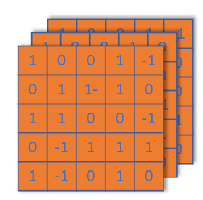
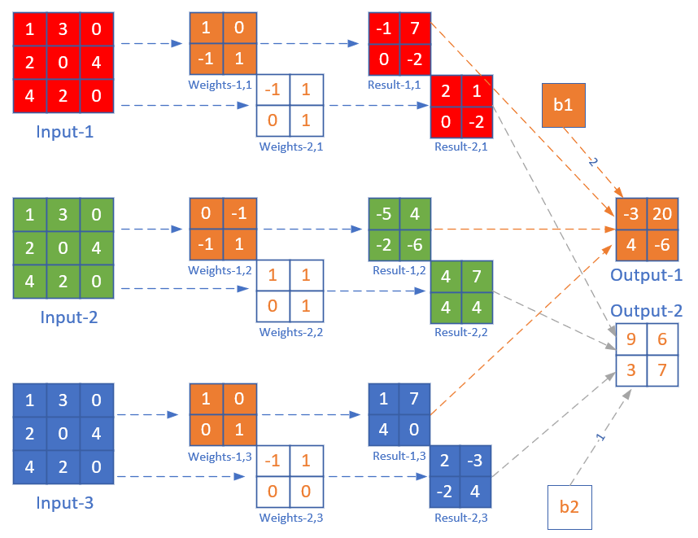
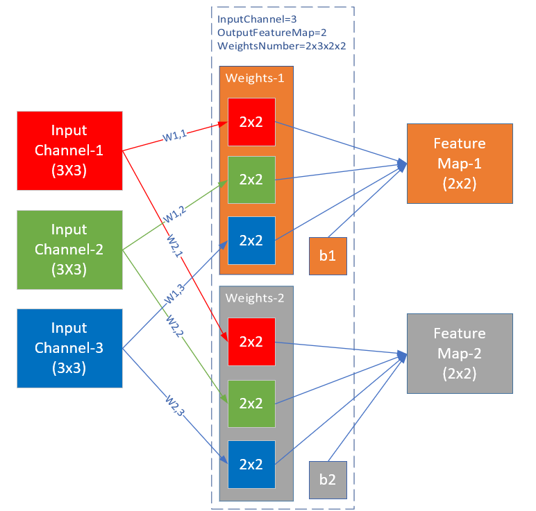
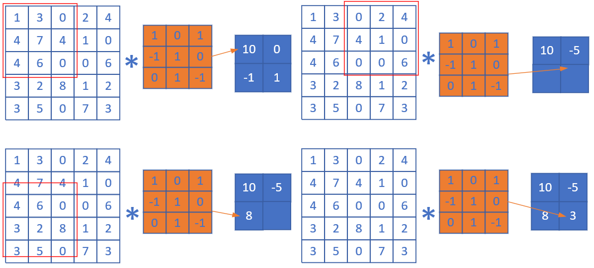

Copyright © Microsoft Corporation. All rights reserved.
  适用于[License](https://github.com/Microsoft/ai-edu/blob/master/LICENSE.md)版权许可

# 卷积的数学定义

$$h(x)=(f*g)(x) = \int_{-\infty}^{\infty} f(t)g(x-t)dt \tag{1}$$

卷积与傅里叶变换有着密切的关系。利用这点性质，即两函数的傅里叶变换的乘积等于它们卷积后的傅里叶变换，能使傅里叶分析中许多问题的处理得到简化。

## 离散定义

$$h(x) = (f*g)(x) = \sum^{\infty}_{t=-\infty} f(t)g(x-t) \tag{2}$$

# 一维卷积实例

有两枚骰子$f,g$，掷出后二者相加为4的概率如何计算？

【图14.1.1】

第一种情况：$f(1)g(3), 3+1=4$

【图14.1.2】

第二种情况：$f(2)g(2), 2+2=4$

【图14.1.3】

第三种情况：$f(3)g(1), 1+3=4$

因此，两枚骰子点数加起来为4的概率为：

$$h(4) = f(1)g(3)+f(2)g(2)+f(3)g(1)$$
$$=f(1)g(4-1) + f(2)g(4-2) + f(3)g(4-3)$$

符合卷积的定义，把它写成标准的形式就是公式2：

$$h(4)=(f*g)(4)=\sum _{t=1}^{3}f(t)g(4-t)$$

# 单入单出的二维卷积

二维卷积一般用于图像处理上。在二位图片上做卷积，如果把图像Image简写为$I$，把卷积核Kernal简写为$K$，则目标图片的第$(i,j)$个像素的卷积值为：

$$
h(i,j) = (I*K)(i,j)=\sum_m \sum_n I(m,n)K(i-m,j-n) \tag{3}
$$

可以看出，这和一维情况下的公式2是一致的。从卷积的可交换性，我们可以把公式3等价地写作：

$$
h(i,j) = (I*K)(i,j)=\sum_m \sum_n I(i-m,j-n)K(m,n) \tag{4}
$$

公式4的成立，是因为我们将Kernal进行了翻转。在神经网络中，一般会实现一个互相关函数(corresponding function)，而卷积运算几乎一样，但不反转Kernal：

$$
h(i,j) = (I*K)(i,j)=\sum_m \sum_n I(i+m,j+n)K(m,n) \tag{5}
$$

在图像处理中，自相关函数和互相关函数定义如下：

- 自相关：设原函数是f(t)，则$h=f(t) \star f(-t)$，其中$\star$表示卷积
- 互相关：设两个函数分别是f(t)和g(t)，则$h=f(t) \star g(-t)$

互相关函数的运算，是两个序列滑动相乘，两个序列都不翻转。卷积运算也是滑动相乘，但是其中一个序列需要先翻转，再相乘。所以，从数学意义上说，机器学习实现的是互相关函数，而不是原始含义上的卷积。但我们为了简化，把公式5也称作为卷积。这就是卷积的来源。

结论：

1. 我们实现的卷积操作不是原始数学含义的卷积，而是工程上的卷积，可以简称为卷积
2. 在实现卷积操作时，并不会反转卷积核

在传统的图像处理中，卷积操作多用来进行滤波，锐化或者边缘检测啥的。我们可以认为卷积是利用某些设计好的参数组合（卷积核）去提取图像空域上相邻的信息。

按照公式5，我们可以在下面这张4x4的图片上，用一个3x3的卷积核，通过卷积运算得到一个2x2的图片：

【图14.1.4】

# 单入多出的升维卷积

原始输入是一维的图片，但是我们可以用多个卷积核分别对其计算，从而得到多个特征输出。如下图所示：

【图14.1.7】

一张4x4的图片，用两个卷积核并行地处理，输出为2个2x2的图片。在训练过程中，这两个卷积核会完成不同的特征学习。

# 多入单出的降维卷积

一张图片，通常是彩色的，具有红绿蓝三个通道。我们可以有两个选择来处理：

1. 变成灰度的，每个像素只剩下一个值，就可以用二维卷积
2. 对于三个通道，每个通道都使用一个卷积核，分别处理红绿蓝三种颜色的信息

显然第2种方法可以从图中学习到更多的特征，于是出现了三维卷积，即一个卷积核内有三个子核，三个子核的尺寸是一样的，比如都是5x5，这样的话，这个卷积核就是一个3x5x5的立体核，所以称为三维卷积。

【图14.1.8】

此时，我们可以用一个卷积核来处理这张彩色图片，但是这个卷积核里必须有三个过滤器，如下图所示：

在上图中，每一个颜色过滤器对应着左侧相同颜色的输入通道，三个过滤器的值并不一定相同。对三个通道各自做卷积后，得到右侧的三张特征图，然后在按照原始值不加权地相加在一起，得到最右侧的黑色特征图，这张图里面已经把三种颜色的特征混在一起了，所以画成了黑色。

虽然输入图片是多个通道的，或者说是三维的，但是在相同数量的过滤器的计算后，相加在一起的结果是一个通道，即2维数据，所以称为降维。这当然简化了对多通道数据的计算难度，但同时也会损失多通道数据自带的颜色信息。

# 多入多出的同维卷积

在上面的例子中，卷积核是一个Kernal，内含三个过滤器。我们假设有一个彩色图片为3x3的，如果有两个2x2的过滤器的卷积核的话，会做什么样的卷积计算？看下图：

【图14.1.9】

第一个卷积核Kernal-1为棕色所示，它有三个子核(Filters)，命名为Filter-1,1，Filter-1,2，Filter-1,3，分别在红绿蓝三个输入通道上进行卷积操作，生成三个2x2的输出Result-1,n。然后三个Result-1,n相加，并再加上b1偏移值，形成最后的棕色输出Output-1。

对于白色的卷积核Kernal-2,n也是一样，先生成三个Result-2,n，然后相加再加b2，最后得到Output-2。

之所以Result-m,n还用红绿蓝三色表示，是因为在此时，它们还保留着红绿蓝三种色彩的各自的信息，一旦相加后得到Output，这种信息就丢失了。

上图侧重于解释数值计算过程，而下图侧重于解释输入(Input Channel)、卷积核组(Weights)、卷积核(kernal)、过滤器(Filter)、输出(Feature Map)的关系：

【图14.1.10】

在此例中，输入是三维数据（3x3x3），经过2x3x2x2的卷积后，输出为三维（2x2x2），维数并没有变化，只是每一维内部的尺寸有了变化，一般都是要向更小的尺寸变化，以便于简化计算。

对于三维卷积，有以下特点：

1. 预先定义输出的feature map的数量，而不是根据前向计算自动计算出来
2. 对于每个输出，都有一个对应的卷积核Weights，卷积核的大小一般是奇数如：1x1, 3x3, 5x5, 7x7等
3. 每个卷积核内都有一个或多个Filters与每个输入(Input Channel)对应
4. 每个卷积核Weights有一个b值，不论卷积核内有多少个Filters

对于上图，我们完全可以用在全连接神经网络中的学到的知识来理解：

1. 每个Input Channel就是特征输入，在上图中是3个
2. 卷积层的卷积核相当于隐层的神经元，上图中隐层有2个神经元
3. $W(m,n), m=[1,2], n=[1,3]$相当于隐层的权重矩阵$w_{11},w_{12},......$
4. 每个卷积核（神经元）有1个偏移值

# 步长 stride

前面的例子中，每次计算后，卷积核会向右或者向下移动一个单元，即步长stride = 1。而在下面这个卷积操作中，卷积核每次向右或向下移动两个单元，即stride = 2。

在后续的步骤中，由于每次移动两格，所以最终得到一个2x2的图片。

# 填充 padding

如果原始图为4x4，用3x3的卷积核进行卷积后，目标图片变成了2x2。如果我们想保持目标图片和原始图片为同样大小，该怎么办呢？一般我们会向原始图片周围填充一圈0，然后再做卷积。如下图：

综合以上所有情况，可以得到卷积后的输出图片的大小的公式：

$$
H_{Output}= {H_{Input} - H_{Kernal} + 2Padding \over Stride} + 1
$$

$$
W_{Output}= {W_{Input} - W_{Kernal} + 2Padding \over Stride} + 1
$$

以上上图为例：

$$H_{Output}={5 - 3 + 2 \times 0 \over 2}+1=2$$

以上图为例：

$$H_{Output}={4 - 3 + 2 \times 1 \over 1}+1=4$$

两点注意：

1. 一般情况下，我们用正方形的卷积核，且为奇数
2. 如果计算出的输出图片尺寸为小数，则取整，不做四舍五入

参考：

https://www.zhihu.com/question/22298352

https://zhuanlan.zhihu.com/p/33773140
