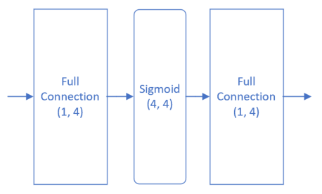
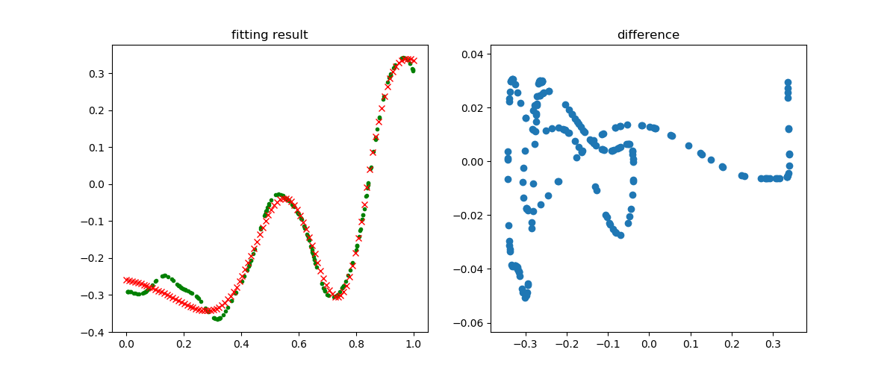
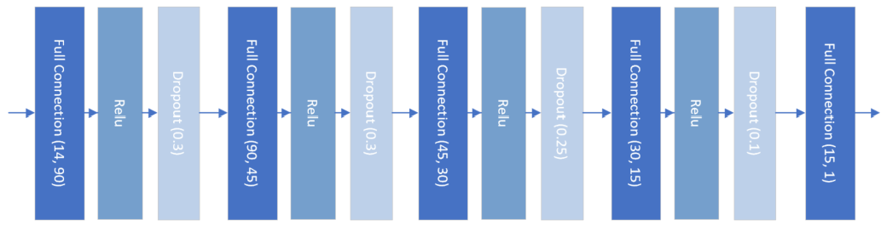
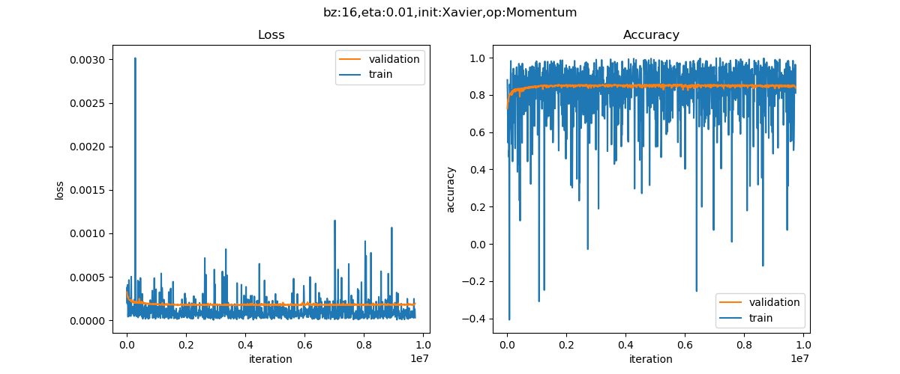

Copyright © Microsoft Corporation. All rights reserved.
  适用于[License](https://github.com/Microsoft/ai-edu/blob/master/LICENSE.md)版权许可

在第九章中，我们用一个两层的神经网络，验证了万能近似定理。当时是用hard code方式写的，现在我们用mini框架来搭建一下，然后再进行一个真实数据集的训练。

# 重现万能近似定理

## 数据

```Python
train_file = "../../Data/09_Train.npz"
test_file = "../../Data/09_Test.npz"

def LoadData():
    dr = DataReader(train_file, test_file)
    dr.ReadData()
    dr.Shuffle()
    dr.GenerateValidationSet()
    return dr
```

数据部分的code，基本是通用的。对于本例，X和Y值已经处于[0,1]空间了，不需要归一化，所以没有调用Normalize方法。

## 模型



```Python
def model():
    dataReader = LoadData()
    num_input = 1
    num_hidden1 = 4
    num_output = 1

    max_epoch = 10000
    batch_size = 10
    learning_rate = 0.5
    eps = 0.001

    params = CParameters(
        learning_rate, max_epoch, batch_size, eps,
        LossFunctionName.MSE, 
        InitialMethod.Xavier, 
        OptimizerName.SGD)

    net = NeuralNet(params, "Level1_CurveFittingNet")
    fc1 = FcLayer(num_input, num_hidden1, params)
    net.add_layer(fc1, "fc1")
    sigmoid1 = ActivatorLayer(Sigmoid())
    net.add_layer(sigmoid1, "sigmoid1")
    fc2 = FcLayer(num_hidden1, num_output, params)
    net.add_layer(fc2, "fc2")

    net.train(dataReader, checkpoint=100, need_test=True)
    net.ShowLossHistory()
    ShowResult(net, dataReader)
```

- 输入层1个神经元，因为只有一个x值
- 隐层4个神经元，对于此问题来说应该是足够了，因为特征很少
- 输出层1个神经元，因为是拟合任务
- 最大epoch=10000轮
- 批量=10
- 学习率=0.5
- 损失函数值低限=0.001
- 均方差MSE损失函数
- Xavier初始化
- SGD随机梯度下降算法
- 每100个epoch检查一次损失值
- 最后需要用测试集测试

## 训练结果



损失函数值在一段平缓期过后，开始陡降，这种现象在神经网络的训练中是常见的，最有可能的是当时处于一个梯度变化的平缓地带，算法在艰难地寻找下坡路，然后忽然就找到了。这种情况同时也带来一个弊端：我们会经常遇到缓坡，到底要不要还继续训练？是不是再坚持一会儿就能找到出路呢？抑或是模型能力不够，永远找不到出路呢？这个问题没有准确答案，只能靠试验和经验了。


上图左边是拟合的情况，绿色点是测试集数据，红色点是神经网路的推理结果，可以看到除了最左侧开始的部分，其它部分都拟合的不错。注意，这里我们不是在讨论过拟合、欠拟合的问题，我们在这个章节的目的就是更好地拟合一条曲线。

上图右侧是用这个代码生成的：

```Python
    y_test_real = net.inference(dr.XTest)
    axes.scatter(y_test_real, y_test_real-dr.YTestRaw, marker='o')
```
以测试集的真实值为横坐标，以真实值和预测值的差为纵坐标。最理想的情况是所有点都在y=0处排成一条横线。从图上看，真实值和预测值二者的差异明显，但是请注意横坐标和纵坐标的间距相差一个数量级，所以差距其实不大。

再看打印输出的最后部分：
```
epoch=5399, total_iteration=485999
loss_train=0.000359, accuracy_train=0.988535
loss_valid=0.000814, accuracy_valid=0.964413
time used: 49.394742488861084
save parameters
testing...
0.9886318990771166
0.9886318990771166
```
由于我们设置了eps=0.001，所以在5000多个epoch时便达到了要求，训练停止。最后用测试集得到的准确率为98.8%，已经非常不错了。如果训练更多的轮，可以得到更好的结果。

# 房价预测实例

## 数据来源

数据集来自：https://www.kaggle.com/harlfoxem/housesalesprediction

此数据集是King County地区2014年五月至2015年五月的房屋销售信息，适合于训练回归模型。

## 数据字段解读

- id：唯一id
- date：售出日期
- price：售出价格（标签值）
- bedrooms：卧室数量
- bathrooms：浴室数量
- sqft_living：居住面积
- sqft_lot：停车场面积
- floors：楼层数
- waterfront：泳池
- view：有多少次看房记录
- condition：房屋状况
- grade：评级
- sqft_above：地面上的面积
- sqft_basement：地下室的面积
- yr_built：建筑年份
- yr_renovated：翻修年份
- zipcode：邮政编码
- lat：维度
- long：经度
- sqft_living15：2015年翻修后的居住面积
- sqft_lot15：2015年翻修后的停车场面积

一些考虑：

- 唯一id在数据库中有用，在训练时并不是一个特征，所以要去掉
- 售出日期，由于是在一年内的数据，所以也没有用
- sqft_liging15的值，如果非0的话，应该替换掉sqft_living
- sqft_lot15的值，如果非0的话，应该替换掉sqft_lot
- 邮政编码对应的地理位置过于宽泛，只能引起噪音，应该去掉
- 返修年份，笔者认为它如果是非0值的话，可以替换掉建筑年份
- 看房记录次数多并不能代表该房子价格就高，而是因为地理位置、价格、配置等满足特定人群的要求，所以笔者认为它不是必须的特征值

所以最后只留下13个字段。

## 数据处理

原始数据只有一个数据集，所以需要我们自己把它分成训练集和测试集，比例大概为4:1。此数据集为csv文件格式，为了方便，我们把它转换成了两个扩展名为npz的numpy压缩形式：
- house_Train.npz，训练数据集
- house_Test.npz，测试数据集

## 加载数据

```Python
train_file = "../../Data/house_Train.npz"
test_file = "../../Data/house_Test.npz"

def LoadData():
    dr = HouseDataReader(train_file, test_file)
    dr.ReadData()
    dr.NormalizeX()
    dr.NormalizeY(YNormalizationMethod.Regression)
    dr.Shuffle()
    dr.GenerateValidationSet(k=10)
    return dr
```
与上面第一个例子的代码相似，但是房屋数据属性繁杂，所以需要做归一化，房屋价格也是至少6位数，所以也需要做归一化。上面代码中的NormalizeX()做属性归一化，NormalizeY(YNormalizationMethod.Regression)做标签数据的归一化。

这里有个需要注意的地方，即训练集和测试集的数据，需要合并在一起做归一化，然后再分开使用。为什么要先合并呢？假设训练集样本中的房屋面积的范围为150到220，而测试集中的房屋面积有可能是160到230，两者不一致。分别归一化的话，150变成0，160也变成0，这样预测就会产生误差。

最后还需要在训练集中用GenerateValidaionSet(k=10)分出一个1:9的验证集。

## 模型

在不知道一个问题的实际复杂度之前，我们不妨把模型设计得复杂一些。如下图所示，这个模型包含了四组全连接层-Relu层-Dropout层的组合，最后是一个单输出做拟合。



```Python
def model():
    dr = LoadData()

    num_input = dr.num_feature
    num_hidden1 = 32
    num_hidden2 = 16
    num_hidden3 = 8
    num_hidden4 = 4
    num_output = 1

    max_epoch = 10000
    batch_size = 16
    learning_rate = 0.01
    eps = 1e-6

    params = CParameters(
        learning_rate, max_epoch, batch_size, eps,
        LossFunctionName.MSE, 
        InitialMethod.Xavier, 
        OptimizerName.Momentum)

    net = NeuralNet(params, "HouseSingle")

    fc1 = FcLayer(num_input, num_hidden1, params)
    net.add_layer(fc1, "fc1")
    r1 = ActivatorLayer(Relu())
    net.add_layer(r1, "r1")

    fc2 = FcLayer(num_hidden1, num_hidden2, params)
    net.add_layer(fc2, "fc2")
    r2 = ActivatorLayer(Relu())
    net.add_layer(r2, "r2")

    fc3 = FcLayer(num_hidden2, num_hidden3, params)
    net.add_layer(fc3, "fc3")
    r3 = ActivatorLayer(Relu())
    net.add_layer(r3, "r3")

    fc4 = FcLayer(num_hidden3, num_hidden4, params)
    net.add_layer(fc4, "fc4")
    r4 = ActivatorLayer(Relu())
    net.add_layer(r4, "r4")

    fc5 = FcLayer(num_hidden4, num_output, params)
    net.add_layer(fc5, "fc5")

    net.load_parameters()

    net.train(dr, checkpoint=10, need_test=True)
```

先构造一个参数集合CParameters，包括：
   1. 学习率=0.01
   2. 最大epoch=10000
   3. 批大小=16
   4. eps停止条件
   5. 损失函数形态(MSE均方差)
   6. 初始化方法(default为Xavier)
   7. 优化器选择Momentum动量法，可以比一般的SGD收敛速度快些

net.train()函数是一个阻塞函数，只有当训练完毕后才返回。

```Python
    output = net.inference(dr.XTest)
    real_output = dr.DeNormalizeY(output)
    mse = np.sum((dr.YTestRaw - real_output)**2)/dr.YTest.shape[0]/10000
    print("mse=", mse)
    
    net.ShowLossHistory()

    ShowResult(net, dr)
```

在train后面的部分，是用测试集来测试该模型的准确度，使用了数据城堡(Data Castle)的官方评测方法，用均方差除以10000，得到的数字越小越好。一般的模型大概是一个7位数的结果，稍微好一些的是6位数。

## 训练结果



由于标签数据也做了归一化，变换为都是0至1间的小数，所以均方差的数值很小，需要观察小数点以后的第4位。从上图中可以看到，损失函数值很快就降到了0.0005以下，然后就很缓慢地下降。而精度值在不断的上升，相信更多的迭代次数会带来更高的精度。

再看下面的打印输出部分，用R2_Score法得到的值为0.867，而用数据城堡官方的评测标准，得到的MSE值为1711852，还比较大，说明模型精度还应该有上升的空间。

```
epoch=9999, total_iteration=9729999
loss_train=0.000029, accuracy_train=0.810638
loss_valid=0.000192, accuracy_valid=0.837924
time used: 2718.652097225189
save parameters
testing...
0.8677652253507482
mse= 1711852.5022083137
```

# 代码位置

ch14, Level1

