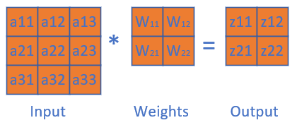
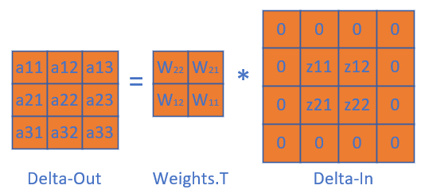
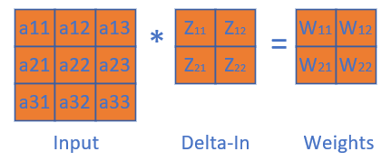

Copyright © Microsoft Corporation. All rights reserved.
  适用于[License](https://github.com/Microsoft/ai-edu/blob/master/LICENSE.md)版权许可

# 卷积层的训练

正向公式：

$$Z = W * A + B \tag{0}$$

其中，B在图中未画出，*表示卷积（互相关）计算，A为Layer1的输入项，Z为Layer1的输出项，但尚未经过激活函数处理。

$$z_{11} = w_{11} \cdot a_{11} + w_{12} \cdot a_{12} + w_{21} \cdot a_{21} + w_{22} \cdot a_{22} + b \tag{1}$$
$$z_{12} = w_{11} \cdot a_{12} + w_{12} \cdot a_{13} + w_{21} \cdot a_{22} + w_{22} \cdot a_{23} + b \tag{2}$$
$$z_{21} = w_{11} \cdot a_{21} + w_{12} \cdot a_{22} + w_{21} \cdot a_{31} + w_{22} \cdot a_{32} + b \tag{3}$$
$$z_{22} = w_{11} \cdot a_{22} + w_{12} \cdot a_{23} + w_{21} \cdot a_{32} + w_{22} \cdot a_{33} + b \tag{4}$$

$$
\frac{\partial J}{\partial a_{11}}=\frac{\partial J}{\partial z_{11}} \frac{\partial z_{11}}{\partial a_{11}}=\delta_{z11}\cdot w_{11} \tag{5}
$$

求J对a12的梯度时，先看正向公式，发现a12对z11和z12都有贡献，因此需要二者的偏导数相加：

$$
\frac{\partial J}{\partial a_{12}}=\frac{\partial J}{\partial z_{11}} \frac{\partial z_{11}}{\partial a_{12}}+\frac{\partial J}{\partial z_{12}} \frac{\partial z_{12}}{\partial a_{12}}=\delta_{z11} \cdot w_{12}+\delta_{z12} \cdot w_{11} \tag{6}
$$

最复杂的是求a22的梯度，因为从正向公式看，所有的输出都有a22的贡献，所以：

$$
\frac{\partial J}{\partial a_{22}}=\frac{\partial J}{\partial z_{11}} \frac{\partial z_{11}}{\partial a_{22}}+\frac{\partial J}{\partial z_{12}} \frac{\partial z_{12}}{\partial a_{22}}+\frac{\partial J}{\partial z_{21}} \frac{\partial z_{21}}{\partial a_{22}}+\frac{\partial J}{\partial z_{22}} \frac{\partial z_{22}}{\partial a_{22}} 
$$
$$
=\delta_{z11} \cdot w_{22} + \delta_{z12} \cdot w_{21} + \delta_{z21} \cdot w_{12} + \delta_{z22} \cdot w_{11} \tag{7}
$$

同理可得所有a的梯度。

观察公式7中的w的顺序，貌似是把原始的卷积核旋转了180度，再与传入误差项做卷积操作，即可得到Layer1中的所有元素的误差项。而公式5和公式6并不完备，是因为二者处于角落，这和卷积操作正向计算中的padding是相同的。因此，我们把Layer2的误差矩阵做一个zero padding，再乘以转置的卷积核，就是Layer1的误差矩阵：

最后可以统一成为一个简洁的公式：

$$\delta_{out} = \delta_{in} * W^T \tag{8}$$

这个误差矩阵可以继续回传到下一层。

# 有多个卷积核时的梯度计算

# 步长不为1时的梯度计算

# 权重层梯度计算

要求J对w11的梯度，从正向公式可以看到，w11对所有的z都有贡献，所以：

$$
\frac{\partial J}{\partial w_{11}} = \frac{\partial J}{\partial z_{11}}\frac{\partial z_{11}}{\partial w_{11}} + \frac{\partial J}{\partial z_{12}}\frac{\partial z_{12}}{\partial w_{11}} + \frac{\partial J}{\partial z_{21}}\frac{\partial z_{21}}{\partial w_{11}} + \frac{\partial J}{\partial z_{22}}\frac{\partial z_{22}}{\partial w_{11}}
$$
$$
=\delta_{z11} \cdot a_{11} + \delta_{z12} \cdot a_{12} + \delta_{z21} \cdot a_{21} + \delta_{z22} \cdot a_{22} \tag{9}
$$

对W22也是一样的：

$$
\frac{\partial J}{\partial w_{12}} = \frac{\partial J}{\partial z_{11}}\frac{\partial z_{11}}{\partial w_{12}} + \frac{\partial J}{\partial z_{12}}\frac{\partial z_{12}}{\partial w_{12}} + \frac{\partial J}{\partial z_{21}}\frac{\partial z_{21}}{\partial w_{12}} + \frac{\partial J}{\partial z_{22}}\frac{\partial z_{22}}{\partial w_{12}}
$$
$$
=\delta_{z11} \cdot a_{12} + \delta_{z12} \cdot a_{13} + \delta_{z21} \cdot a_{22} + \delta_{z22} \cdot a_{23} \tag{10}
$$

观察公式8和公式9，其实也是一个标准的卷积（互相关）操作过程，因此，可以把这个过程看成下图：

总结成一个公式：

$$\delta_w = A * \delta_{in} \tag{11}$$

# 偏移的梯度计算

根据前向计算公式1，2，3，4，可以得到：

$$
\frac{\partial J}{\partial b} = \frac{\partial J}{\partial z_{11}}\frac{\partial z_{11}}{\partial b} + \frac{\partial J}{\partial z_{12}}\frac{\partial z_{12}}{\partial b} + \frac{\partial J}{\partial z_{21}}\frac{\partial z_{21}}{\partial b} + \frac{\partial J}{\partial z_{22}}\frac{\partial z_{22}}{\partial b}
$$
$$
=\delta_{z11} + \delta_{z12}  + \delta_{z21} + \delta_{z22} \tag{12}
$$

所以：

$$
\delta_b = \delta_{in} \tag{13}
$$