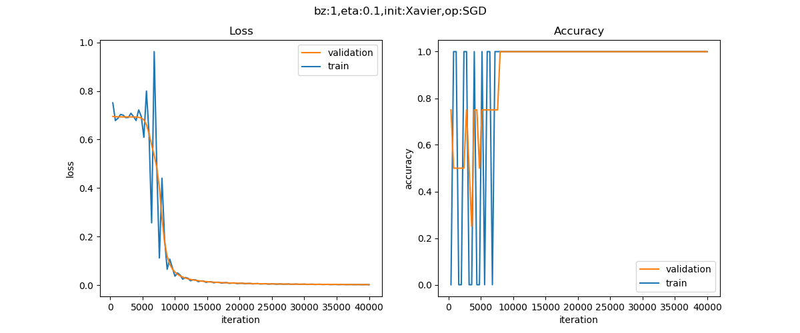

Copyright © Microsoft Corporation. All rights reserved.
  适用于[License](https://github.com/Microsoft/ai-edu/blob/master/LICENSE.md)版权许可

在第十章中，我们用一个两层的神经网络，实现了异或逻辑。这次我们先用mini框架重现一下异或逻辑的结果，以保证mini框架工作的正确性，相当于一个功能测试。然后我们将会尝试一个新的数据集，来测试一下mini框架对实际数据的二分类任务的支持程度。

# 重现异或逻辑门

## 建立数据集

在MiniFramework目录中已经有了一个DataReader类，我们在这个类的基础上，派生出一个异或数据类。

```Python
class XOR_DataReader(DataReader):
    def __init__(self):
        pass

    def ReadData(self):
        self.XTrain = np.array([[0,0],[1,1],[0,1],[1,0]])
        self.YTrain = np.array([0,0,1,1]).reshape(4,1)
        self.num_train = 4
        self.num_feature = 2
        self.num_category = 1
        
        self.XVld = self.XTrain
        self.YVld = self.YTrain

        self.XTest = self.XTrain
        self.YTest = self.YTrain
```
由于异或数据非常简单，只有一共4条记录，所以我们把Validation和Test数据设置成和Train数据一样，这是为了不改框架程序主要逻辑的前提下，做的一个临时处理。在实际的训练过程中，我们将会忽略验证集的结果。

## 主过程

```Python
if __name__ == '__main__':
    dr = XOR_DataReader()
    dr.ReadData()
    
    num_input = 2
    num_hidden = 2
    num_output = 1

    max_epoch = 10000
    batch_size = 1
    learning_rate = 0.1
    eps = 0.001

    params = CParameters(
        learning_rate, max_epoch, batch_size, eps,
        LossFunctionName.CrossEntropy2,
        InitialMethod.Xavier, 
        OptimizerName.SGD)

    net = NeuralNet(params, "XOR")

    fc1 = FcLayer(num_input, num_hidden, params)
    net.add_layer(fc1, "fc1")
    sigmoid1 = ActivatorLayer(Sigmoid())
    net.add_layer(sigmoid1, "sigmoid1")
    
    fc2 = FcLayer(num_hidden, num_output, params)
    net.add_layer(fc2, "fc2")
    sigmoid2 = ClassificationLayer(Sigmoid())
    net.add_layer(sigmoid2, "sigmoid2")

    net.train(dr, checkpoint=100, need_test=True)
    net.ShowLossHistory()
    ShowResult2D(net)
```

同前面的章节中解决异或问题的方案一样，这里采用了一个两层的结构：一个隐层，一个输出层。其中：
- 输入层神经元数为2
- 隐层的神经元数为2，使用Sigmoid激活函数
- 由于是二分类任务，所以输出层只有一个神经元，用Sigmoid做二分类函数

其它参数：
- max_epoch=10000，最多训练10000轮
- batch_size=1，每次用一个数据训练
- learning_rate=0.1
- eps停止条件=0.001，根据经验，当损失函数值到达0.001时，就能很好地完成异或的二分类任务
- checkpoint=100，每隔100个epoch计算一次损失函数值
- need_test=True，最后需要用XTest数据集测试一下是否和YTest的值相等

## 运行结果



上面的运行结果图看上去有些怪异，其实是因为数据量太小造成的波动，只要趋势正确就行了。再看下面的运行结果：

```
epoch=9999, total_iteration=39999
loss_train=0.0026, accuracy_train=1.000000
loss_valid=0.0031, accuracy_valid=1.000000
time used: 3.1409988403320312
save parameters
total weights abs sum= 52.24225818496042
total weights = 6
little weights = 0
zero weights = 0
testing...
1.0
```
训练一共进行了10000轮，最关键的是最后的testing...的结果是1.0，表示100%正确，这初步说明mini框架在这个基本case上工作得很好。

其实，在最开始的时候，mini框架并没有正确地解决这个异或问题，经过debug后，才能正确工作，这也给我们提供了一种解决问题的思路：遇到复杂问题时，先用简单问题验证工具的正确性，然后再去试图走下一步。

# 数据来源

我们用一个真实的数据级来实现一个二分类任务：收入调查。此数据集是从1994 Census数据库中提取的，用于预测收入是否可以大于$50K/年。


以下是原始数据集的链接：
https://archive.ics.uci.edu/ml/datasets/Census+Income

Dua, D. and Graff, C. (2019). UCI Machine Learning Repository [http://archive.ics.uci.edu/ml]. Irvine, CA: University of California, School of Information and Computer Science. 

感谢数据集的提供者：
```
Ronny Kohavi and Barry Becker 
Data Mining and Visualization 
Silicon Graphics. 
e-mail: ronnyk '@' sgi.com for questions. 
```
# 数据字段解读

标签值：>50K，<=50K。

属性字段：

- age: continuous. 
- workclass: Private, Self-emp-not-inc, Self-emp-inc, Federal-gov, Local-gov, State-gov, Without-pay, Never-worked. 
- fnlwgt: continuous. 
- education: Bachelors, Some-college, 11th, HS-grad, Prof-school, Assoc-acdm, Assoc-voc, 9th, 7th-8th, 12th, Masters, 1st-4th, 10th, Doctorate, 5th-6th, Preschool. 
- education-num: continuous. 
- marital-status: Married-civ-spouse, Divorced, Never-married, Separated, Widowed, Married-spouse-absent, Married-AF-spouse. 
- occupation: Tech-support, Craft-repair, Other-service, Sales, Exec-managerial, Prof-specialty, Handlers-cleaners, Machine-op-inspct, Adm-clerical, Farming-fishing, Transport-moving, Priv-house-serv, Protective-serv, Armed-Forces. 
- relationship: Wife, Own-child, Husband, Not-in-family, Other-relative, Unmarried. 
race: White, Asian-Pac-Islander, Amer-Indian-Eskimo, Other, Black. 
- sex: Female, Male. 
- capital-gain: continuous. 
- capital-loss: continuous. 
- hours-per-week: continuous. 
- native-country: United-States, Cambodia, England, Puerto-Rico, Canada, Germany, Outlying-US(Guam-USVI-etc), India, Japan, Greece, South, China, Cuba, Iran, Honduras, Philippines, Italy, Poland, Jamaica, Vietnam, Mexico, Portugal, Ireland, France, Dominican-Republic, Laos, Ecuador, Taiwan, Haiti, Columbia, H

中文含义：

- 年龄：连续值
- 工作性质：枚举型，类似私企、政府之类的
- 权重：连续值
- 教育程度：枚举型，如学士、硕士等
- 受教育的时长：连续值
- 婚姻状况：枚举型，已婚、未婚、离异等
- 职业：枚举型，包含的种类很多，如技术支持、维修工、销售、农民渔民、军人等
- 家庭角色：枚举型，丈夫、妻子等
- 性别：枚举型
- 资本收益：连续值
- 资本损失：连续值
- 每周工作时长：连续值
- 祖籍：枚举型

# 数据处理

数据分析和数据处理实际上是一门独立的课，超出类本书的范围，所以我们只做一些简单的数据处理，以便神经网络可以用之训练。

对于连续值，我们可以直接使用原始数据。对于枚举型，我们需要把它们转成连续值。以性别举例，Female=0，Male=1即可。对于其它枚举型，都可以用从0开始的整数编码。

一个小技巧是利用python的list功能，取元素下标，即可以作为整数编码：
```Python
sex_list = ["Female", "Male"]
array_x[0,9] = sex_list.index(row[9].strip())
```
strip()是trim掉前面的空格，因为是csv格式。index是取列表下标，这样对于字符串"Female"取出的下标为0，对于字符串"Male"取出的下标为1。

把所有数据按行保存到numpy数组中，最后用npz格式存储：
```Python
np.savez(data_npz, data=self.XData, label=self.YData)
```
原始数据已经把train data和test data分开了，所以我们针对两个数据集分别调用数据处理过程一次，保存为Income_Train.npz和Income_Test.npz。

# 搭建模型

## 加载数据
```Python
train_file = "../../Data/Income_Train.npz"
test_file = "../../Data/Income_Test.npz"

def LoadData():
    dr = DataReader(train_file, test_file)
    dr.ReadData()
    dr.NormalizeX()
    dr.Shuffle()
    dr.GenerateValidationSet()
    return dr
```

## 主程序

```Python
if __name__ == '__main__':
    dr = LoadData()
    
    num_input = dr.num_feature
    num_hidden1 = 32
    num_hidden2 = 8
    num_output = 1

    max_epoch = 100
    batch_size = 16
    learning_rate = 0.1
    eps = 0.001

    params = CParameters(
        learning_rate, max_epoch, batch_size, eps,
        LossFunctionName.CrossEntropy2,
        InitialMethod.Xavier, 
        OptimizerName.SGD)

    net = NeuralNet(params, "Income")

    fc1 = FcLayer(num_input, num_hidden1, params)
    net.add_layer(fc1, "fc1")
    a1 = ActivatorLayer(Relu())
    net.add_layer(a1, "relu1")
    
    fc2 = FcLayer(num_hidden1, num_hidden2, params)
    net.add_layer(fc2, "fc2")
    a2 = ActivatorLayer(Relu())
    net.add_layer(a2, "relu2")

    fc3 = FcLayer(num_hidden2, num_output, params)
    net.add_layer(fc3, "fc3")
    sigmoid3 = ClassificationLayer(Sigmoid())
    net.add_layer(sigmoid3, "sigmoid3")

    net.load_parameters()

    net.train(dr, checkpoint=1, need_test=True)
    net.ShowLossHistory()
```

1. 先构造一个参数集合CParameters，包括：
   1. 学习率
   2. 最大epoch
   3. 批大小
   4. eps停止条件
   5. 损失函数形态(MSE均方差)
   6. 初始化方法(default为Xavier)
   7. 优化器选择default为(SGD)
2. 构造网络NeuralNet，传入参数
3. 构造第一个FC层，指定输入样本特征数量和输出（num_hidden1）神经元个数值，及Sigmoid激活函数
4. 构造第二个FC层，指定输入和输出尺寸，因为是回归任务，所以没有分类函数
5. 开始训练，并传入DataReader实例

net.train()函数是一个阻塞函数，只有当训练完毕后才返回。


# 代码位置

ch14, Level2
