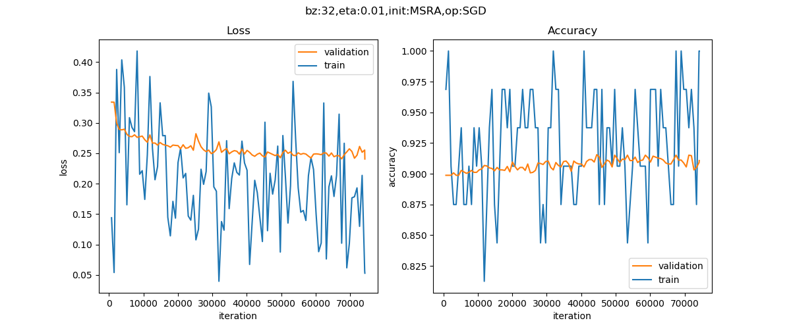

Copyright © Microsoft Corporation. All rights reserved.
  适用于[License](https://github.com/Microsoft/ai-edu/blob/master/LICENSE.md)版权许可

在第11章里，我们讲解了如何使用神经网络做多分类。在本节我们将会用Mini框架重现那个教学案例，然后使用一个真实的案例验证多分类的用法。

# 重现“铜钱孔分类”问题

## 数据

```Python
train_file = "../../Data/11_Train.npz"
test_file = "../../Data/11_Test.npz"

def LoadData():
    dr = DataReader(train_file, test_file)
    dr.ReadData()
    dr.NormalizeX()
    dr.NormalizeY(YNormalizationMethod.MultipleClassifier, base=1)
    dr.Shuffle()
    dr.GenerateValidationSet()
    return dr
```

与前面几个例子不同的是，本小节在NormalizeY()时使用了YNormalizationMethod.MultipleClassifier参数，并且设置base=1，其含义是：把原始数据中的分类标签变成One-Hot编码形式，由于原始数据中的标签值是[1，2，3]，所以，我们要指定base=1，以便变成[0，1，2]的形式。

## 模型

```Python
def model():
    dataReader = LoadData()
    num_input = dataReader.num_feature
    num_hidden1 = 8
    num_output = 3

    max_epoch = 1000
    batch_size = 10
    learning_rate = 0.1
    eps = 0.06

    params = CParameters(
        learning_rate, max_epoch, batch_size, eps,
        LossFunctionName.CrossEntropy3, 
        InitialMethod.Xavier, 
        OptimizerName.SGD)

    net = NeuralNet(params, "chinabank")

    fc1 = FcLayer(num_input, num_hidden1, params)
    net.add_layer(fc1, "fc1")
    r1 = ActivatorLayer(Relu())
    net.add_layer(r1, "Relu1")

    fc2 = FcLayer(num_hidden1, num_output, params)
    net.add_layer(fc2, "fc2")
    softmax1 = ClassificationLayer(Softmax())
    net.add_layer(softmax1, "softmax1")

    net.train(dataReader, checkpoint=10, need_test=True)
    net.ShowLossHistory()
    
    ShowResult(net, params.toString())
    ShowData(dataReader)
```

模型很简单，隐层8个神经元，输出层3个神经元用于3分类。

1. 先构造一个参数集合CParameters，包括：
   1. 学习率=0.1
   2. 最大epoch=1000
   3. 批大小=10
   4. eps停止条件=0.06
   5. 损失函数形态(多分类交叉熵)
   6. 初始化方法(default为Xavier)
   7. 优化器选择default为(SGD)
2. 构造网络NeuralNet，传入参数
3. 构造第一个FC层，指定输入样本特征数量和输出（num_hidden1）神经元个数值，及Relu激活函数
4. 构造第二个FC层，指定输入和输出尺寸
5. 因为是多分类函数，指定Softmax分类函数
6. 开始训练，并传入DataReader实例

net.train()函数是一个阻塞函数，只有当训练完毕后才返回。


## 运行结果

这是损失函数值曲线和精度曲线的变化：


以下是打印输出的最后一部分：

```
......
epoch=4999, total_iteration=449999
loss_train=0.029924, accuracy_train=1.000000
loss_valid=0.120869, accuracy_valid=0.960000
time used: 29.496403455734253
save parameters
testing...
0.968
```

最后得到的测试精度位96.8%。从下面的可视化结果来看，两个蓝色的边界基本上把点分成了三部分，但为什么边界是个多边形呢？


```
epoch=4999, total_iteration=449999
loss_train=0.003172, accuracy_train=1.000000
loss_valid=0.224162, accuracy_valid=0.950000
time used: 31.67906141281128
save parameters
testing...
0.978
```

我们把模型中的Relu()函数改为Sigmoid()函数，再训练一次，得到如下可视化结果：


可以看到这个图中的边界要平滑许多，这也就是Relu()和Sigmoid()的区别，Relu是用分段线性拟合曲线，Sigmoid有真正的曲线拟合能力，而且最后的测试精度也达到了97.8%，运行时间比用Relu()函数多了2秒，因为Sigmoid的计算量大。

但是Sigmoid也有缺点，看分类的边界，使用Relu函数的分类边界比较清晰，而使用Sigmoid函数的分类边界要平缓一些，过渡区较宽。

用一句简单的话来描述二者的差别：Relu能直则直，Sigmoid能弯则弯。

# Cifar10图像分类

我们在第12章学习了MNIST手写数字识别数据集，本章我们认识一下另外一个比较常用的数据集CIFAR-10，这个数据集中包含10类图片，每类6000张，其中5000张用于训练，1000张用于测试。所以，一共有50000张训练图片，10000张测试图片。

下面是10类数据和随机抽取的图片：


## 数据读取

```Python
file_1 = "..\\Data\\data_batch_1.bin"
file_2 = "..\\Data\\data_batch_2.bin"
file_3 = "..\\Data\\data_batch_3.bin"
file_4 = "..\\Data\\data_batch_4.bin"
file_5 = "..\\Data\\data_batch_5.bin"
test_file = "..\\Data\\test_batch.bin"

def LoadData():
    print("reading data...")
    dr = CifarImageReader(file_1, file_2, file_3, file_4, file_5, test_file)
    dr.ReadData()
    dr.NormalizeX()
    dr.NormalizeY(YNormalizationMethod.MultipleClassifier)
    dr.GenerateValidationSet(k=20)
    print(dr.num_validation, dr.num_example, dr.num_test, dr.num_train)
    return dr
```

每张图都是彩色的，但是只有32x32点阵，比较小，放大了反而看不清楚。为了简化问题，我们把彩色图片转成灰度的：

```Python
gray_data = np.dot([0.299,0.587,0.114], color_data.reshape(3,-1)).reshape(1,1024)
```
由于我们想沿用处理MNIST数据集的思想，所以在转换成灰度图后，又之间用reshape(1,1024)转成了一个行向量。

## 模型

一共4个隐层，都用Relu()激活函数连接，最后的输出层是10分类：


以下是主要参数设置：

```Python
    num_input = num_feature
    num_hidden1 = 128
    num_hidden2 = 64
    num_hidden3 = 32
    num_hidden4 = 16
    num_output = 10
    max_epoch = 50
    batch_size = 32
    learning_rate = 0.01
    eps = 0.08

    params = CParameters(
        learning_rate, max_epoch, batch_size, eps,
        LossFunctionName.CrossEntropy3, 
        InitialMethod.MSRA, 
        OptimizerName.SGD)    
```
## 运行结果



```
epoch=49, total_iteration=74249
loss_train=0.052677, accuracy_train=1.000000
loss_valid=0.240593, accuracy_valid=0.910800
time used: 208.8354775905609
save parameters
testing...
0.9071
```

最后的识别精度位90.71%，在这个数据集上的最好结果是用CNN实现的

根据cifar10的[官方网站](http://www.cs.toronto.edu/~kriz/cifar.html)上的说明，一般的识别错误率是18%，即精度为82%，如果做了数据扩展，则可以到达89%的精度。我们在这个例子中，用彩色图片灰度化的方式，并且只用全连接网络，就达到了90%的精度，结果已经非常好了。

# 代码位置

ch14, Level3
