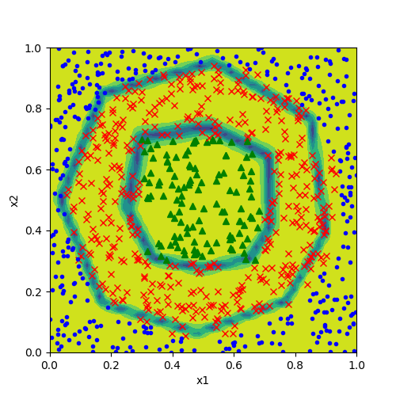
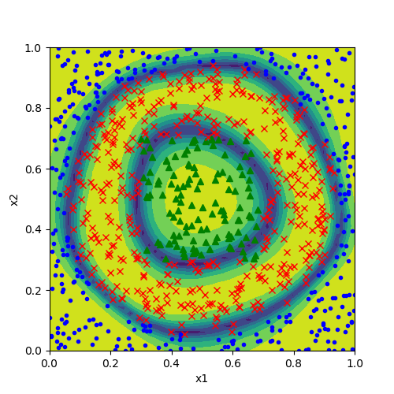

Copyright © Microsoft Corporation. All rights reserved.
  适用于[License](https://github.com/Microsoft/ai-edu/blob/master/LICENSE.md)版权许可

在第11章里，我们讲解了如何使用神经网络做多分类。在本节我们将会用Mini框架重现那个教学案例，然后使用一个真实的案例验证多分类的用法。

# 重现“铜钱形分类”问题

## 数据

```Python
train_file = "../../Data/11_Train.npz"
test_file = "../../Data/11_Test.npz"

def LoadData():
    dr = DataReader(train_file, test_file)
    dr.ReadData()
    dr.NormalizeX()
    dr.NormalizeY(YNormalizationMethod.MultipleClassifier, base=1)
    dr.Shuffle()
    dr.GenerateValidationSet()
    return dr
```

与前面几个例子不同的是，本小节在NormalizeY()时使用了YNormalizationMethod.MultipleClassifier参数，并且设置base=1，其含义是：把原始数据中的分类标签变成One-Hot编码形式，由于原始数据中的标签值是[1，2，3]，所以，我们要指定base=1，以便变成[0，1，2]的形式。

## 模型

```Python
def model():
    dataReader = LoadData()
    num_input = dataReader.num_feature
    num_hidden1 = 8
    num_output = 3

    max_epoch = 1000
    batch_size = 10
    learning_rate = 0.1
    eps = 0.06

    params = CParameters(
        learning_rate, max_epoch, batch_size, eps,
        LossFunctionName.CrossEntropy3, 
        InitialMethod.Xavier, 
        OptimizerName.SGD)

    net = NeuralNet(params, "chinabank")

    fc1 = FcLayer(num_input, num_hidden1, params)
    net.add_layer(fc1, "fc1")
    r1 = ActivatorLayer(Relu())
    net.add_layer(r1, "Relu1")

    fc2 = FcLayer(num_hidden1, num_output, params)
    net.add_layer(fc2, "fc2")
    softmax1 = ClassificationLayer(Softmax())
    net.add_layer(softmax1, "softmax1")

    net.train(dataReader, checkpoint=10, need_test=True)
    net.ShowLossHistory()
    
    ShowResult(net, params.toString())
    ShowData(dataReader)
```

模型很简单，隐层8个神经元，输出层3个神经元用于3分类。

1. 先构造一个参数集合CParameters，包括：
   1. 学习率=0.1
   2. 最大epoch=1000
   3. 批大小=10
   4. eps停止条件=0.06
   5. 损失函数形态(多分类交叉熵)
   6. 初始化方法(default为Xavier)
   7. 优化器选择default为(SGD)
2. 构造网络NeuralNet，传入参数
3. 构造第一个FC层，指定输入样本特征数量和输出（num_hidden1）神经元个数值，及Relu激活函数
4. 构造第二个FC层，指定输入和输出尺寸
5. 因为是多分类函数，指定Softmax分类函数
6. 开始训练，并传入DataReader实例

net.train()函数是一个阻塞函数，只有当训练完毕后才返回。


## 运行结果

这是损失函数值曲线和精度曲线的变化：


以下是打印输出的最后一部分：

```
......
epoch=999, total_iteration=89999
loss_train=0.055064, accuracy_train=1.000000
loss_valid=0.109942, accuracy_valid=0.960000
time used: 6.5376129150390625
save parameters
testing...
0.936
```

最后得到的测试精度位93.6%。从下面的可视化结果来看，两个蓝色的边界基本上把点分成了三部分，但为什么边界是个多边形呢？



我们把模型中的Relu()函数改为Sigmoid()函数，再训练一次，得到如下可视化结果：



可以看到这个图中的边界要平滑许多，这也就是Relu()和Sigmoid()的区别，Relu是用分段线性拟合曲线，Sigmoid有真正的曲线拟合能力。


# 代码位置

ch14, Level3
