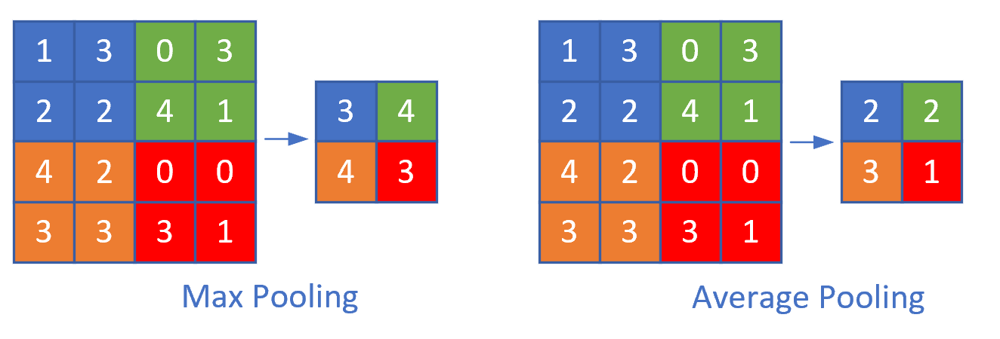

Copyright © Microsoft Corporation. All rights reserved.
  适用于[License](https://github.com/Microsoft/ai-edu/blob/master/LICENSE.md)版权许可

# 池化

池化分为两种，一种是最大值池化，一种是平均值池化，如下图所示：

一般我们都是用最大值池化。

# 池化的反向传播

我们假设下面的2x2的图片中，是上一层网络回传的残差，那么对于最大值池化，改残差值会回传到当初最大值的位置上，而其它三个位置的残差都是0。

对于平均值池化，残差值会平均到原始的4个位置上。

# 池化的其它方式

在上面的池化中，我们使用了size=2x2，stride=2的模式，这是我们通用的模式，即步长与池化尺寸相同。

我们很少使用步长值与池化尺寸不同的配置，所以只是提一下：

上图是stride=1, size=2x2的情况，可以看到，右侧的结果中，有一大堆的3和4，基本分不开了，所以其池化效果并不好。
