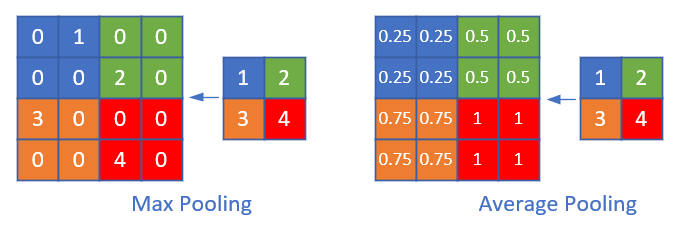

Copyright © Microsoft Corporation. All rights reserved.
  适用于[License](https://github.com/Microsoft/ai-edu/blob/master/LICENSE.md)版权许可

# 池化

池化 pooling，又称为下采样，downstream sampling or sub-sampling。

分为两种，一种是最大值池化 Max Pooling，一种是平均值池化 Mean/Average Pooling。如下图所示：

【图14.3.1 池化运算】

- 最大值池化，是取当前池化视野中所有元素的最大值，输出到下一层特征图中。
- 平均值池化，是取当前池化视野中所有元素的平均值，输出到下一层特征图中。

其目的是：

- 降维；在保留图片局部特征的前提下，使得图片更小，更易于计算
- 平移不变性，轻微扰动不会影响输出：比如上如中最大值池化的4，即使向右偏一个像素，其输出值仍为4
- 维持同尺寸图片，便于后端处理：假设输入的图片不是一样大小的，就需要用池化来转换成同尺寸图片

一般我们都是用最大值池化。

**问题：最小值池化有意义吗？**

# 池化的其它方式

在上面的池化中，我们使用了size=2x2，stride=2的模式，这是我们通用的模式，即步长与池化尺寸相同。

我们很少使用步长值与池化尺寸不同的配置，所以只是提一下：

上图是stride=1, size=2x2的情况，可以看到，右侧的结果中，有一大堆的3和4，基本分不开了，所以其池化效果并不好。

假设输入图片的形状是 $W_1 \times H_1 \times D_1$，其中W是图片宽度，H是图片高度，D是图片深度（多个图层），F是池化的视野（正方形），S是池化的步长，则输出图片的形状是：

- $W_2 = (W_1 - F)/S + 1$
- $H_2 = (H_1 - F)/S + 1$
- $D_2 = D_1$

池化层不会改变图片的深度，即D值前后相同。

# 池化层的训练

我们假设下面的2x2的图片中，$[[1,2],[3,4]]$是上一层网络回传的残差，那么：

- 对于最大值池化，残差值会回传到当初最大值的位置上（请对照图14.3.1），而其它三个位置的残差都是0。
- 对于平均值池化，残差值会平均到原始的4个位置上。

【图14.3.2 池化层的反向传播】

直观看是这样的，严格的数学推导过程以下图为例：

## Max Pooling

正向公式：

$$w = max(a,b,c,d)$$

反向公式（假设Input Layer中的最大值是b）：

$${\partial w \over \partial a} = 0$$
$${\partial w \over \partial b} = 1$$
$${\partial w \over \partial c} = 0$$
$${\partial w \over \partial d} = 0$$

因为a,c,d对w都没有贡献，所以偏导数自然为0，只有b有贡献，偏导数为1。

$$\delta_a = {\partial J \over \partial a} = {\partial J \over \partial w} {\partial w \over \partial a} = 0$$

$$\delta_b = {\partial J \over \partial b} = {\partial J \over \partial w} {\partial w \over \partial b} = \delta_w \cdot 1 = \delta_w$$

$$\delta_c = {\partial J \over \partial c} = {\partial J \over \partial w} {\partial w \over \partial c} = 0$$

$$\delta_d = {\partial J \over \partial d} = {\partial J \over \partial w} {\partial w \over \partial d} = 0$$

## Mean Pooling

正向公式：

$$w = \frac{1}{4}(a+b+c+d)$$

反向公式（假设Layer-1中的最大值是b）：

$${\partial w \over \partial a} = \frac{1}{4}$$
$${\partial w \over \partial b} = \frac{1}{4}$$
$${\partial w \over \partial c} = \frac{1}{4}$$
$${\partial w \over \partial d} = \frac{1}{4}$$

因为a,c,d对w都没有贡献，所以偏导数自然为0，只有b有贡献，偏导数为1。

$$\delta_a = {\partial J \over \partial a} = {\partial J \over \partial w} {\partial w \over \partial a} = \frac{1}{4}\delta_w$$

$$\delta_b = {\partial J \over \partial b} = {\partial J \over \partial w} {\partial w \over \partial b} = \frac{1}{4}\delta_w$$

$$\delta_c = {\partial J \over \partial c} = {\partial J \over \partial w} {\partial w \over \partial c} = \frac{1}{4}\delta_w$$

$$\delta_d = {\partial J \over \partial d} = {\partial J \over \partial w} {\partial w \over \partial d} = \frac{1}{4}\delta_w$$

无论是max pooling还是mean pooling，都没有要学习的参数，所以，在卷积网络的训练中，池化层需要做的只是把误差项向后传递，不需要计算任何梯度。