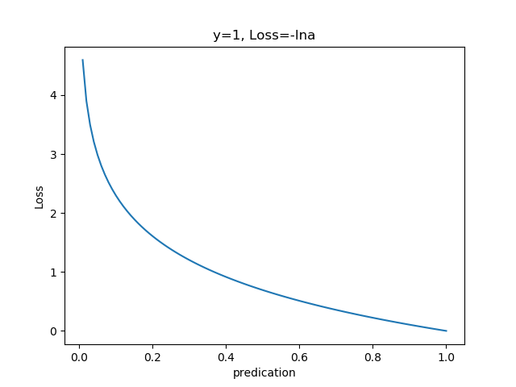

Copyright © Microsoft Corporation. All rights reserved.
  适用于[License](https://github.com/Microsoft/ai-edu/blob/master/LICENSE.md)版权许可
  
在这一章，我们将简要介绍一下损失函数，因为在下一章的内容中要首次用到损失函数的概念。

在各种材料中经常看到的中英文词汇有：误差，偏差，Error，Cost，Loss，损失，代价......意思都差不多，在本系列文章中，使用损失函数和Loss Function这两个词汇。

**损失**就是所有样本的**误差**的总和，亦即：$$损失 = \sum_i(误差_i)$$所以有时候损失函数可以和误差函数混用概念。

在黑盒子的例子中，我们如果说“某个样本的损失”是不对的，只能说“某个样本的误差”，如果我们把神经网络的参数调整到完全满足一个样本的输出误差为0，通常会令其它样本的误差变得更大，这样作为误差之和的损失函数值，就会变得更大。所以，我们通常会在根据某个样本的误差调整权重后，计算一下整体样本的损失函数值，来判定网络是不是已经训练到了可接受的状态。

在上面的例子中，我们使用单个样本进行训练。在批量样本训练中，实际写code时，经常会出现的问题是，忘记用样本误差之和除以样本数量，结果得到了比实际误差大很多的数值，造成网络训练结果波动。

最初的损失函数的概念，应该是从经济学引用过来的。比如一套新的营销策略，消费者是不是真的买账，还要拿到市场上去检验。市场就是个黑盒子，我们只能从最后的收支情况来判别营销策略的好坏：如果你挣钱了，就是好的策略；如果你赔钱了，有损失了，就是不合适的策略，损失越大，说明策略背离实际情况越多。

# 机器学习常用损失函数

**符号规则：a是预测值，y是样本标签值，Loss是损失函数值**

- Gold Standard Loss，又称0-1误差（蓝色）
$$
Loss=\begin{cases} 0 & a=y \\ 1 & a \ne y \end{cases}
$$

- 绝对值损失函数

$$
L = |y-a|
$$

- Hinge Loss，铰链/折页损失函数或最大边界损失函数（红色），主要用于SVM（支持向量机）中

$$
Loss=max(0,1-y \cdot a), y=\pm 1
$$

- Log Loss，对数损失函数，又叫交叉熵损失函数(cross entropy error)（黄色）

$$
Loss = -\frac{1}{m} \sum_i^m y_i log(a_i) + (1-y_i)log(1-a_i),  y_i \in \{0,1\}
$$

- Squared Loss，均方差损失函数（黑色）
$$
Loss=\frac{1}{2m} \sum_i^m (a_i-y_i)^2
$$

- Exponential Loss，指数损失函数（绿色）
$$
Loss = \frac{1}{m}\sum_i^m e^{-y_i \cdot a_i}
$$

以上内容参考了[这篇博客的内容。](http://kubicode.me/2016/04/11/Machine%20Learning/Say-About-Loss-Function/)

# 神经网络中常用的损失函数

## MSE 均方差函数
    
  该函数就是最直观的一个损失函数了，计算预测值和真实值之间的欧式距离。预测值和真实值越接近，两者的均方差就越小。
  
  **均方差函数常用于线性回归(linear regression)，即函数拟合(function fitting)**。
### 公式

$$
Loss=\frac{1}{2m} \sum_i^m (a_i-y_i)^2
$$

### 工作原理

要想得到预测值a与真实值y的差距，最朴素的想法就是用$Loss=a_i-y_i$。

对于单个样本来说，这样做没问题，但是多个样本累计时，$a_i-y_i$有可能有正有负，就会导致相互抵消，从而失去价值。所以有了绝对值差的想法，即$Loss=|a_i-y_i|$。

假设y=[1,1,1]，

当a=[1,2,3]时，用绝对值损失：
$$Loss=(1-1)+(2-1)+(3-1)=3$$

当a=[1,3,3]时，用绝对值损失：
$$Loss=(1-1)+(3-1)+(3-1)=4$$

三个数中已经有两个数有重大偏移了，但看起来3和4的差距只是1而已，似乎没有那么严重的偏离。再看看均方差的结果：

当a=[1,2,3]时，用绝对值损失：
$$Loss=(1-1)^2+(2-1)^2+(3-1)^2=0+1+4=5$$

当a=[1,3,3]时，用绝对值损失：
$$Loss=(1-1)^2+(3-1)^2+(3-1)^2=0+4+4=8$$

可以看到5比3已经大了很多，8比4大了一倍，而8比5也放大了某个样本的局部损失对全局带来的影响，用不通俗的语言说，就是“对某些偏离大的样本比较敏感”，从而引起监督训练过程的足够重视。所以，我们就有了均方差函数：

$$
Loss=\frac{1}{2m} \sum_i^m (a_i-y_i)^2
$$

### 实际案例

假设有一组数据如下，我们想找到一条拟合的直线：

下面四张图，前三张显示了一个逐渐找到最佳拟合直线的过程。
- 第一张，用均方差函数计算得到Loss=0.5559
- 第二张，直线向上平移一些，误差计算Loss=0.1651，比图一的误差小很多
- 第三张，又向上平移了一些，误差计算Loss=0.02441，此后还可以继续尝试平移（改变b值）或者变换角度（改变w值），得到更小的Loss值
- 第四张，偏离了最佳位置，误差值Loss=0.1336，这种情况，算法会让尝试方向反向向下

我们把四张图叠加在一起看一下，绿色的线是第三张图Loss值最小的情况。

比较第二张和第四张图，由于均方差的Loss值都是正值，如何判断是向上移动还是向下移动呢？

在实际的训练过程中，是没有必要计算Loss值的，因为Loss值会体现在反向传播的过程中。我们来看看均方差函数的导数：

$$
\frac{\partial{Loss}}{\partial{a_i}} = a_i-y_i
$$
虽然$(a_i-y_i)^2$永远是正数，但是$a_i-y_i$却可以是正数（直线在点下方时）或者负数（直线在点上方时），这个正数或者负数被反向传播回到前面的计算过程中，就会引导训练过程朝相反的方向尝试。

在上面的例子中，我们有两个变量，一个w，一个b，这两个值的变化都会影响最终的Loss值的。

我们假设该拟合直线的方程是y=3x+1，当我们固定w=3，把b值从0到2变化时，看看Loss值的变化：

我们假设该拟合直线的方程是y=3x+1，当我们固定b=1，把w值从2到4变化时，看看Loss值的变化：

**练习：以y=3x+1为基准函数，用Python代码实现当w,b变化时，计算损失函数的过程，画出上面两张图**
其中w的变化可以是[2,4]，b的变化可以是[0,2]，取50个点。

## 交叉熵函数

**交叉熵函数常用于逻辑回归(logistic regression)，也就是分类(classification)。**

### 公式

$$
Loss = -\frac{1}{m} \sum_i^m [y_i log(a_i) + (1-y_i)log(1-a_i)],  y_i \in \{0,1\}
$$
单个样本：
$$
Loss = -[y \cdot lna+(1-y) \cdot ln(1-a)]
$$
### 工作原理

当y=1时：

$$
Loss = -lna
$$

此时，损失值与预测值的关系是：

横坐标是预测输出，纵坐标是损失函数值。y=1意味着当前样本标签值是1，当预测输出越接近1时，Loss值越小，训练结果越准确。当预测输出越接近0时，Loss值越大，训练结果越糟糕。

当y=0时：
$$
Loss = -ln(1-a)
$$

此时，损失值与预测值的关系是：

横坐标是预测输出，纵坐标是损失函数值。y=0意味着当前样本标签值是0，当预测输出越接近0时，Loss值越小，训练结果越准确。当预测输出越接近1时，Loss值越大，训练结果越糟糕。

### 推导过程

标签值为1的概率：

$$a=P(y=1|x)$$

很明显，当前样本标签为 0 的概率就可以表达成：

$$1−a=P(y=0|x)$$

从极大似然性的角度出发，把上面两种情况整合到一起：

$$
P(y|x)=a^y⋅(1−a)^{1−y}
$$

当真实样本标签 y = 0 时，上面式子第一项就为 1，概率等式转化为：

$$P(y=0|x)=1−a$$

当真实样本标签 y = 1 时，上面式子第二项就为 1，概率等式转化为：

$$
P(y=1|x)=a
$$

两种情况下概率表达式跟之前的完全一致，只不过我们把两种情况整合在一起了。

我们希望的是概率 P(y|x) 越大越好。我们对 P(y|x) 引入 log 函数，因为 log 运算并不会影响函数本身的单调性。则有：

$$
log P(y|x)=log(a^y⋅(1−a)^{1−y})=y \cdot loga+(1−y) \cdot log(1−a)
$$

我们希望 log P(y|x) 越大越好，反过来，只要 log P(y|x) 的负值 -log P(y|x) 越小就行了。那我们就可以引入损失函数，且令 Loss = -log P(y|x)即可。则得到损失函数为：

$$
loss=-[y \cdot loga+(1−y) \cdot log(1−a)]
$$

### 交叉熵函数的使用

分类问题中，包含二分类和多分类两种情况：

二分类：最后输出层使用Sigmoid激活函数，用如下交叉熵损失函数形式：

$$
loss = -[y_i \ln a_i + (1-y_i) \ln (1-a_i)]
$$

多分类：最后输出层使用Softmax激活函数，用如下交叉熵损失函数形式：
$$
loss = -y_i \ln a_i
$$

## 均方差和交叉熵的比较

主要是在经过Sigmoid之后的输出值，在求导后，Sigmoid本身的导数是否存在的问题。
在神经网络中，假设在损失函数之前的激活函数是Sigmoid函数：

$$
a=\frac{1}{1+e^{-z}}
$$

以均方差函数为损失函数，对z求导：

$$
\frac{\partial{Loss}}{\partial{z}}=\frac{\partial{Loss}}{\partial{a}} \cdot \frac{\partial{a}}{\partial{z}}$$$$
=(a-y) \cdot a(1-a)
$$

其中，a(1-a)项是Sigmoid函数的导数，注意上图中红色的导数曲线，其最大值只有0.25，意味着从最后端传回来的误差值，最多只能以0.25倍的比例向前传，这就给反向传播的效果打了折扣。

以交叉熵函数为损失函数，对z求导：

$$
\frac{\partial{Loss}}{\partial{z}}=\frac{\partial{Loss}}{\partial{a}} \cdot \frac{\partial{a}}{\partial{z}}$$$$
= \frac{a-y}{a(1-a)} \cdot a(1-a) = a-y
$$

比较上述两个求导结果可以得出结论：
1. **均方差函数适用于回归（函数拟合）**。当均方差函数前面有Sigmoid激活函数时，当误差很大时，比如大于5时，a(1-a)项的数值会非常小，造成了反向传播的力度很小。所以我们在做线性回归（函数拟合）时，不用Sigmoid函数做激活函数，而是直接用最后一层的线性输出作为Loss函数的输入。

2. **交叉熵函数一般用于分类**。因为交叉熵函数前面连接了激活函数时，激活函数的导数的不良性质不会影响反向传播的力度，从公式看就是只有a-y这样一项。
