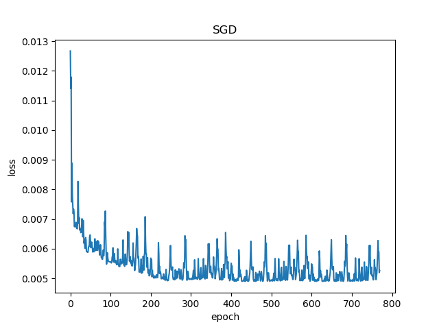
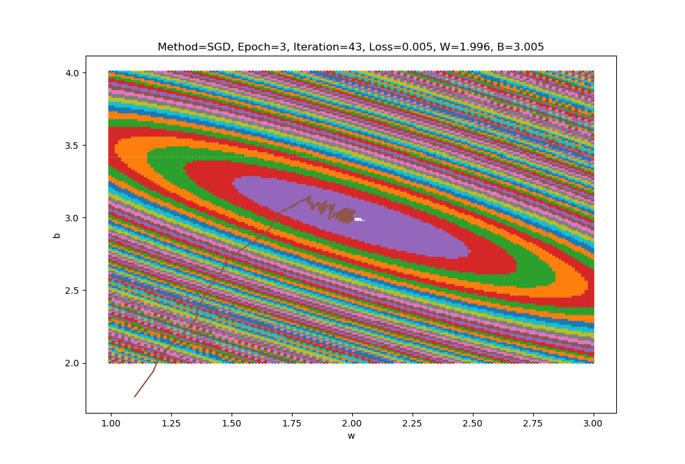
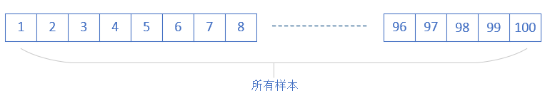
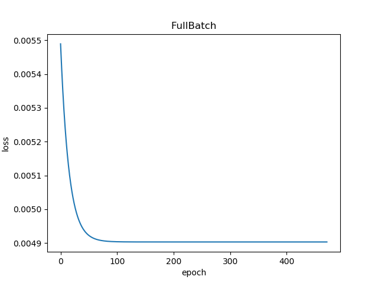
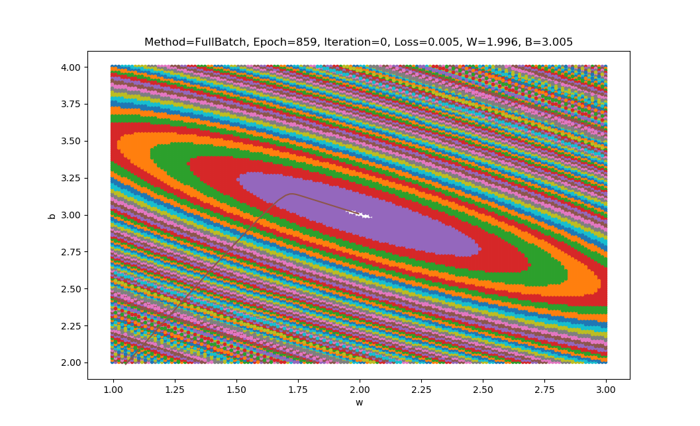
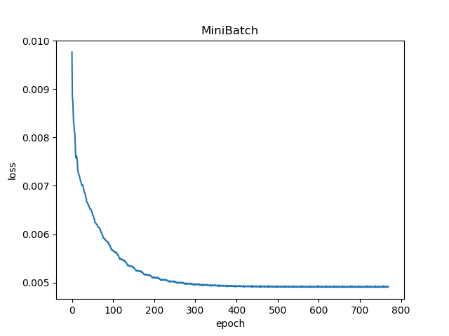
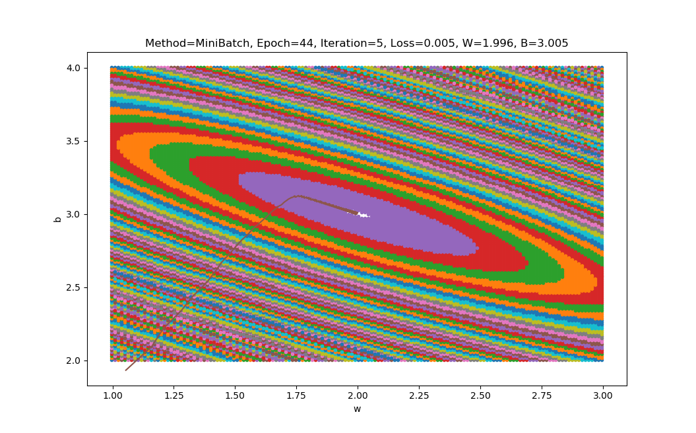

Copyright © Microsoft Corporation. All rights reserved.
适用于[License](https://github.com/Microsoft/ai-edu/blob/master/LICENSE.md)版权许可
  

# 如何提高准确度

木头：老师，我还有一个疑问，列在下表中：

|方法|w|b|
|----|----|----|
|最小二乘法|1.9962|3.0054|
|梯度下降法|1.9182|3.0778|
|神经网络法|1.9182|3.0778|

因为我猜这个问题的原始值是可能是$w=2，b=3$。貌似神经网络的准确率不够啊？从下图来的神经网络的训练结果来看，红色线是斜着穿过蓝色点区域的，并没有在正中央。

铁柱：咱们初次使用神经网络，一定有水土不服的地方。最小二乘法是数学方法，所以它的结果是可信的。梯度下降法和神经网络法，实际是一回事儿，只是梯度下降没有使用神经元模型而已。

所以，咱们一起看看如何调整这个神经网络的训练过程，也就是“调参”。一般来说，神经网络的训练，只跑一轮是不够的，会欠拟合。

# 梯度下降的三种方法

## 随机梯度下降 SDG(Stochastic Grident Descent)

正向计算过程：

$$Z^{n \times 1}=W^{n \times f} \cdot X^{f \times 1} + B^{n \times 1}$$$$A^{n \times 1}=a(Z)$$

反向计算过程：

$$ \Delta Z^{n \times 1} = J'(W,B) = A^{n \times 1} - Y^{1 \times 1}$$$$
W^{n \times f} = W^{n \times f} - \eta \cdot (\Delta Z^{n \times 1} \cdot X_T^{1 \times f})$$$$
B^{n \times 1} = B^{n \times 1} - \eta \cdot \Delta Z^{n \times 1}$$

其中：

$$f=特征值数，m=样本数，n=神经元数，\eta=步长 \\
A=预测值，Y=标签值，X=输入值，X_T=X的转置$$

- 训练样本：每次使用一个样本数据进行一次训练，更新一次梯度，重复以上过程。
- 优点：训练开始时损失值下降很快，随机性大，找到最优解的可能性大。
- 缺点：受单个样本的影响最大，损失函数值波动大，到后期徘徊不前，在最优解附近震荡。不能并行计算。

上图，迭代时，Loss值毛刺波动非常大，受样本差异影响。

上图，梯度下降时，开始收敛较快，到后期波动较大，找不到准确的方向。

## 全批量梯度下降 Batch Gradient Descent

正向计算过程：

$$Z^{n \times m}=W^{n \times f} \cdot X^{f \times m} + B^{n \times 1}$$$$A^{n \times m}=a(Z)$$

反向计算过程：

$$ \Delta Z^{n \times m} = J'(W,B) = A^{n \times m} - Y^{1 \times m}$$$$
W^{n \times f} = W^{n \times f} - \eta \cdot \frac{1}{m} (\Delta Z^{n \times m} \cdot X_T^{m \times f})$$$$
B^{n \times 1} = B^{n \times 1} - \eta \cdot \frac{1}{m} \sum (\Delta Z^{n \times m}, axis=1) \tag{按列相加变成nx1}$$

其中：

$$f=特征值数，m=样本数，n=神经元数，\eta=步长 \\
A=预测值，Y=标签值，X=输入值，X_T=X的转置$$

- 训练样本：每次使用全部数据集进行一次训练，更新一次梯度，重复以上过程。
- 优点：受单个样本的影响最小，一次计算全体样本速度快，损失函数值没有波动，到达最优点平稳。方便并行计算。
- 缺点：数据量较大时不能实现（内存限制），训练过程变慢。初始值不同，可能导致获得局部最优解，并非全局最优解。

上图，迭代时，Loss值没有毛刺波动。

上图，梯度下降时，直接了当达到最佳点。

## 小批量梯度下降 Mini-Batch Gradient Descent

正向计算过程：

$$Z^{n \times k}=W^{n \times f} \cdot X^{f \times k} + B^{n \times 1}$$$$A^{n \times k}=a(Z)$$

反向计算过程：

$$ \Delta Z^{n \times k} = J'(W,B) = A^{n \times k} - Y^{1 \times k}$$$$
W^{n \times f} = W^{n \times f} - \eta \cdot \frac{1}{k} (\Delta Z^{n \times k} \cdot X_T^{k \times f})$$$$
B^{n \times 1} = B^{n \times 1} - \eta \cdot \frac{1}{k} \sum (\Delta Z^{n \times k}, axis=1) \tag{按列相加变成nx1}$$

其中：

$$f=特征值数，k=批样本数，n=神经元数，\eta=步长 \\
A=预测值，Y=标签值，X=输入值，X_T=X的转置$$

结合了前两种的优点，又避免了前两者的缺点。

- 训练样本：选择一小部分样本进行训练，更新一次梯度，然后再选取另外一小部分样本进行训练，再更新一次梯度/
- 优点：不受单样本噪声影响，训练速度较快。
- 缺点：batch size的数值选择很关键，会影响训练结果。

一些概念：

- Batch Size：批大小，一次训练的样本数量。
- Iteration：迭代，一次正向+一次反向。
- Epoch：所有样本被使用了一次，叫做一个Epoch。

假设一共有样本1000个，batch size=20，则一个Epoch中，需要1000/20=50次Iteration才能训练完所有样本。

上图，迭代时，Loss值毛刺波动较小。

上图，梯度下降时，在接近中心时有小波动。(图太小看不清楚，可以和全批量的图比较，靠近中心的线比较粗，说明有微小波动，而全批量是一根单直线)

**课堂练习：用纸笔推算一下矩阵运算的维度：**
假设：
- X (2x4)
- W (3x2)
- B (3x1)

**课后作业：调整以下参数，通过观察结果来理解神经网络的超参：**
- 学习率 η
- 批大小 batch size
- w和b的初始值
- 最大循环次数 max epoch
