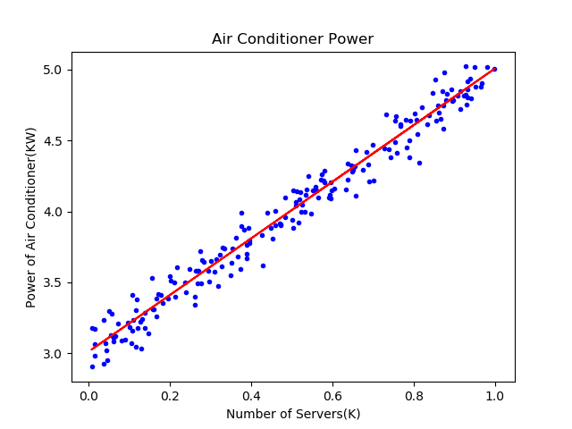

Copyright © Microsoft Corporation. All rights reserved.
适用于[License](https://github.com/Microsoft/ai-edu/blob/master/LICENSE.md)版权许可
  

# 提高准确度

木头：老师，我还有一个疑问，列在下表中：
|方法|w|b|
|----|----|----|
|最小二乘法|1.9962|3.0054|
|梯度下降法|1.9182|3.0778|
|神经网络法|1.9182|3.0778|

因为我猜这个问题的原始值是可能是$w=2，b=3$。貌似神经网络的准确率不够啊？从下图来的神经网络的训练结果来看，红色线是斜着穿过蓝色点区域的，并没有在正中央。


铁柱：咱们初次使用神经网络，一定有水土不服的地方。最小二乘法是数学方法，所以它的结果是可信的。梯度下降法和神经网络法，实际是一回事儿，只是梯度下降没有使用神经元模型而已。

所以，咱们一起看看如何调整这个神经网络的训练过程，也就是“调参”。一般来说，神经网络的训练，只跑一轮是不够的，会欠拟合。


你先看看训练过程。

木头：按Ctrl+F5，又跑了一遍，得到如下值：
```
...
4 70 0.0062622239834859775 3.040018033133307e-06 1.817982185419965 3.09913859521956
4 80 0.006264788539052248 9.789116275048249e-08 1.8165390016725496 3.0961961839012964
4 90 0.006257137457044219 1.7100626370147518e-06 1.8168224848735113 3.0948663477844973
4 100 0.006243584411147867 5.506896334616512e-07 1.8198555211282639 3.0994342531405676
4 110 0.006217967312627983 2.924269079569025e-06 1.8210080077794943 3.0977603667631675
4 120 0.006197963094089578 2.3210522640474372e-05 1.8241198576543065 3.0991870528124683
4 130 0.006197404572478427 1.909039118266377e-06 1.822953564580557 3.0978445270183865
4 140 0.006184883779166377 2.3108417939593506e-09 1.8244852504656695 3.0982053375529484
4 150 0.006160513906817824 1.706333857341702e-06 1.825740688244519 3.0968880361539783
4 160 0.006165769984362322 7.929929792399593e-07 1.8237555428823133 3.0944739178531053
4 170 0.00615769098725895 2.13393824869193e-06 1.8249161128469003 3.095369123402939
4 180 0.006155076948780629 2.2234697959616634e-06 1.8236558088297872 3.0910181050409595
4 190 0.00611461568831969 2.1914684343628255e-06 1.8267943529408501 3.091269615915353
5 0 0.006120159999135144 1.2009652453964445e-06 1.8312142243480052 3.097772305613894
5 10 0.006073203594364276 1.1772907436284272e-05 1.831137231350995 3.0928363231603813
5 20 0.006049604289083901 7.67314600198972e-06 1.831165695543875 3.087887090899276
5 30 0.006059444109512858 3.659631539572848e-06 1.830326313175099 3.0849068623931832
5 40 0.006012645951331416 1.4719745189475941e-05 1.8339352568349323 3.0869957870812854
5 50 0.005990091563514147 5.8798631328658285e-06 1.8380332261538173 3.0908243413681675
5 60 0.005990296311484632 4.078185144281224e-07 1.8388661657161034 3.0916510274493563
5 70 0.005936581700694071 2.8400092830704535e-06 1.8407103884285836 3.087008882777885
5 80 0.0059428545653986194 1.4969085298122825e-07 1.8390464877217432 3.0840160805533583
5 90 0.005937770740839632 9.032939380822225e-07 1.839328910803281 3.0831343597287186
5 100 0.005926818505192391 4.0412530567801586e-07 1.8420827424352728 3.087564520184162
5 110 0.005906229148551065 2.4693482668829494e-06 1.8431800378293361 3.0860773079847728
5 120 0.005892071000787975 2.065333823656878e-05 1.8461207123070738 3.0876445431736905
5 130 0.0058934408890011425 1.457698360598364e-06 1.8448673439328895 3.086528798781168
5 140 0.005885594300204946 4.338876324200269e-10 1.8462936634401175 3.087084461213847
5 150 0.005866258703477269 1.842835157602092e-06 1.8474598613770785 3.085964609200796
0.005871560167933436 1.1068005886794019e-11
5
1.8459035859541528 3.0847579785840957
```
铁柱：我来解释一下打印的内容：
- 第一个数字4或者5，表示外循环次数，我们叫它迭代次数。
- 第二数是内循环次数，就是样本的批次。
- 第三个值是Loss值，从最开始到现在可以看到有不断减小的趋势，说明网络收敛了。但是在上面这段输出里，可以看到Loss值似乎是在增大。但你如果看整体情况就可以看到它是不断的震荡下降的趋势。
- 第四个值是diff_loss值，前后两次loss的差的绝对值。我们这设置了eps=1e-10，最后一次的diff_loss=1.1068005886794019e-11，小于eps，所以训练停止了。
- 后面两个数是w和b

所以，咱们的训练停止比较偶然，因为从历史数据看，diff_loss一直在1e-6左右徘徊，忽然有个1e-11的，就停止了。

木头：哦，那是偶然事件啦！为什么会发生这种情况呢？

铁柱：这就是所谓的“局部最优解”了，从图上看，红色直线两侧的蓝色点分布很平均。有两种简单的方法可以立刻试验一下：
- 停止条件再苛刻一些
- 迭代次数再多一些

木头：哦，那我把eps设置到1e-11试试......（1分钟后）


```
99 170 0.004905135048277225 8.738646069712808e-07 1.994674720722254 3.008114360038958
99 180 0.004908231994613034 3.6906216367964956e-06 1.992358085638915 3.004210578988115
99 190 0.004903514255671252 2.2020789827133583e-06 1.9943375397089336 3.0070971328308125
99
1.996588277123395 3.010989771559764
```
木头：老师，这次结果很不错啊，非常接近真实值了。从上图看，红色直线是从蓝色点区域正中央穿过的。但是迭代了100次，所以1e-11这个停止条件没触发。

铁柱：所以看起来1e-10已经是一个比较理想的停止条件了，但问题是被偶然触发。所以，干脆就用迭代次数来控制吧。你再试试200轮迭代。

木头：...（1分钟）...哎，结果没有什么提高，虽然迭代次数增加了一倍：
```
199
1.996588734022976 3.0109895328616325
```
铁柱：其实呢，我们这次用的方法叫做随机梯度下降法，就是每次用一个样本训练，每次都改变权重值，并计算整体误差。但是这可能造成前后两个样本之间的作用互相抵消，因为样本是随机使用的。形象一些的比喻就是，前一个样本让直线向上移动了一点点，后一个样本却又让直线向下移动了一点点，等于白做功。我们以后会学习更好一些的方法，来避免这种偶然性发生。

木头：好呀好呀！
