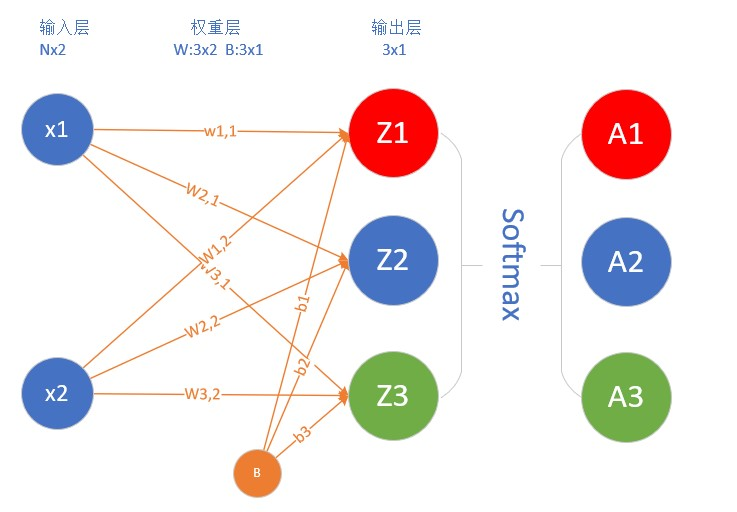
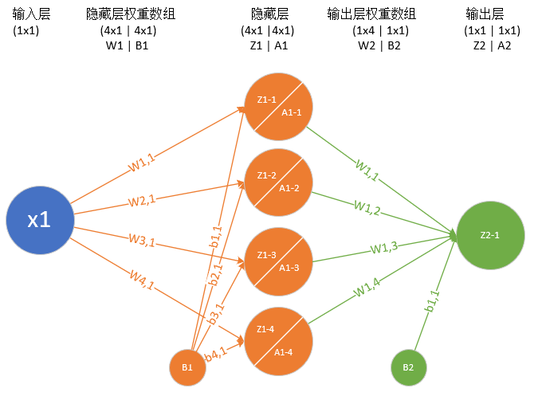
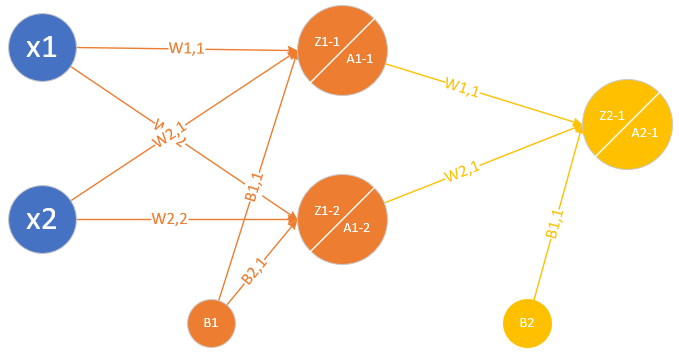
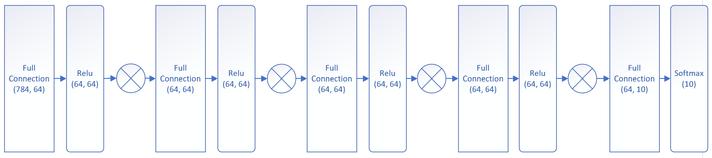
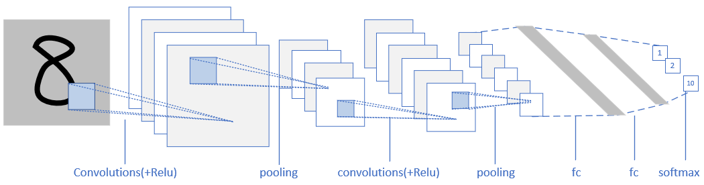
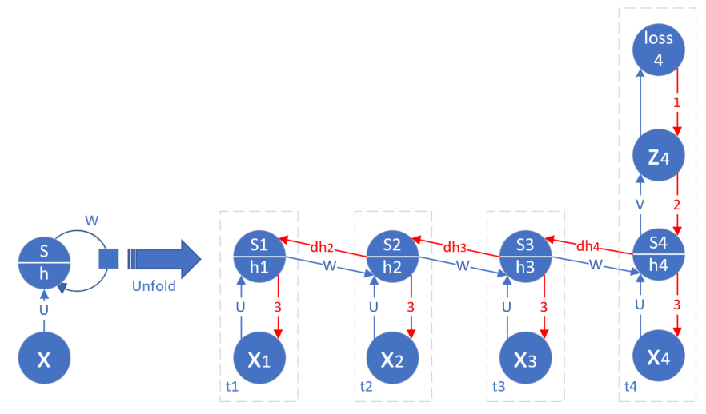

<!--Copyright © Microsoft Corporation. All rights reserved.
  适用于[License](https://github.com/Microsoft/ai-edu/blob/master/LICENSE.md)版权许可-->

# 神经网络基本原理教程说明

## 写在前面

如果您觉得这个教程对您有用，请不要忘记给本站加星（点击网页顶部的Star标签），星越多说明本教程越对大家有帮助，我们就越会努力完善本站。

## 如何浏览本系列教程

1. 如果使用浏览器在线观看的话，可以使用Chrome浏览器，[加这个Math展示控件](https://chrome.google.com/webstore/detail/mathjax-plugin-for-github/ioemnmodlmafdkllaclgeombjnmnbima)

2. 也可以clone全部内容到本地，然后用VSCode浏览，但VSCode中需要安装能读取Markdown格式的扩展，比如Markdown AllInOne插件。

## 写在前面，为什么要出这个系列的教程呢？

总的说来，我们现在有了很多非常厉害的深度学习框架，比如Tensorflow，CNTK，PaddlePaddle，Caffe2等等。然而，我们用这些框架在搭建我们自己的深度学习模型的时候，到底做了一些什么样的操作呢？我们试图去阅读框架的源码来理解框架到底帮助我们做了些什么，但是……很难！很难！很难！因为深度学习是需要加速啦，分布式计算啦，框架做了很多很多的优化，也让像我们这样的小白难以理解这些框架的源码。

这取决于你是想真正地掌握“深度学习”的思想，还是只想成为一个调参师？在我们看来，如TensorFlow，CNTK这些伟大的深度学习工具，是为了解决实际的应用问题而生的，而不是用来学习“深度学习”知识和思想的。所以我们根据自己亲身经历的学习轨迹，归纳出了以下教程，可以帮助小白做到真正的从入门到精通。

通过以下循序渐进地学习与动手实践，一方面可以帮助读者深刻理解“深度学习”的基础知识，更好地理解并使用现有框架，另一方面可以助力读者快速学习最新出现的各种神经网络的扩展或者变型，跟上快速发展的AI浪潮。

## 适用范围
  
  没有各种基础想学习却无从下手哀声叹气的玩家，请按时跟踪最新博客，推导数学公式，跑通代码，并及时提出问题，以求最高疗效；

  深度学习小白，有直观的人工智能的认识，强烈的学习欲望和需求，请在博客的基础上配合代码食用，效果更佳；

  调参师，训练过模型，调过参数，想了解框架内各层运算过程，给玄学的调参之路添加一点心理保障；

  超级高手，提出您宝贵的意见，给广大初学者指出一条明路！

## 前期准备

  环境：
  
  - Windows 10 version 1809
  - Python 3.6.6
  - Visual Studio 2017 Community or above
  - VS Code
  
  自己：

  清醒的头脑（困了的同学请自觉泡茶），纸和笔（如果想跟着推公式的话），闹钟（防止久坐按时起来转转），厚厚的衣服（有暖气的同学请忽略）

## 网络结构概览

|网络结构名称|网络结构图|应用领域|
|---|----|----|
|单入 单出 一层||一元线性回归|
|多入 单出 一层||多元线性回归|
|多入 单出 一层||线性二分类 |
|多入 多出 一层||线性多分类 |
|单入 单出 两层||一元非线性回归/拟合 可以拟合任意复杂函数|
|多入 单出 两层||非线性二分类|
|多入 多出 两层||非线性多分类|
|多入 多出 三层||非线性多分类|
|多层全连接网络||非线性多分类|
|带批归一化层的多层全连接网络||非线性多分类|
|带丢弃层的多层全连接网络||非线性多分类|
|简单的卷积神经网络||非线性多分类|
|复杂的卷积神经网络||非线性多分类|
|单向循环神经网络||非线性多分类|
|双向循环神经网络||非线性多分类|
|深度循环神经网络||非线性多分类|

## 写在后面

加星点赞是一种良好的Open Source的程序员素养，作者的目标是得到10000颗星！星越多，我们的创作团队越努力！
送人玫瑰，手有余香，传播给你的朋友，让大家一起进步！
