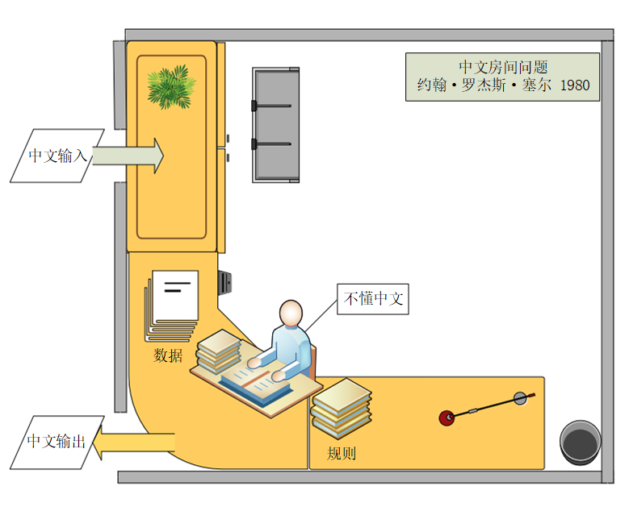
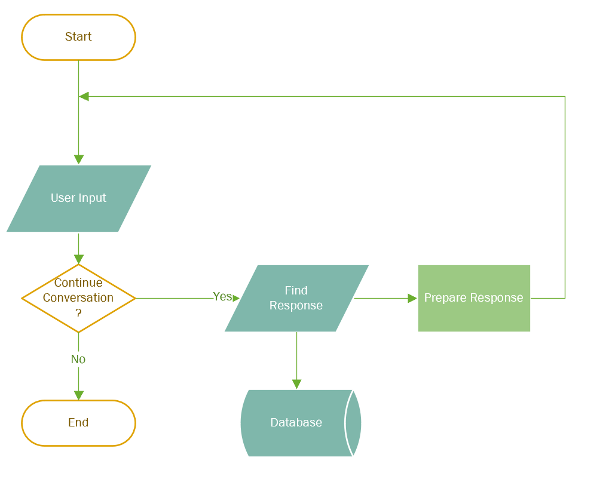
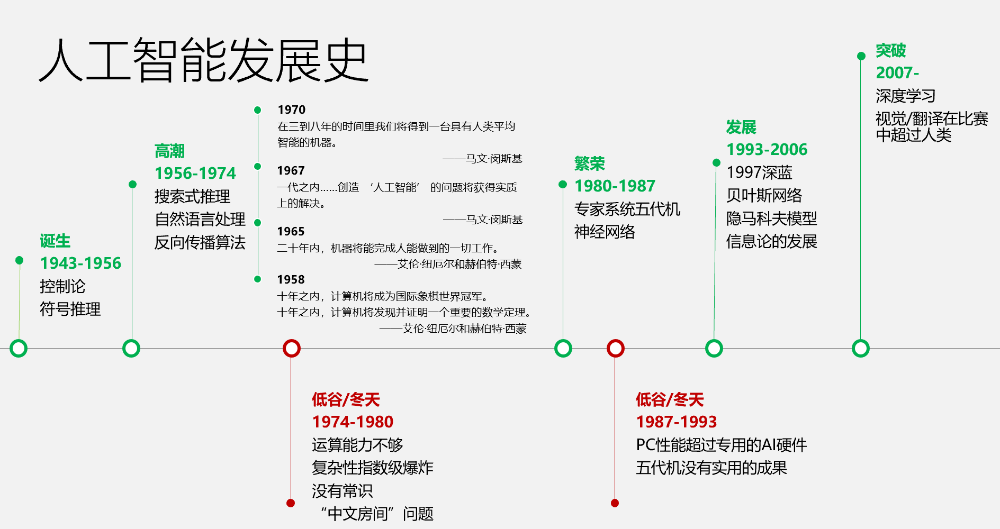
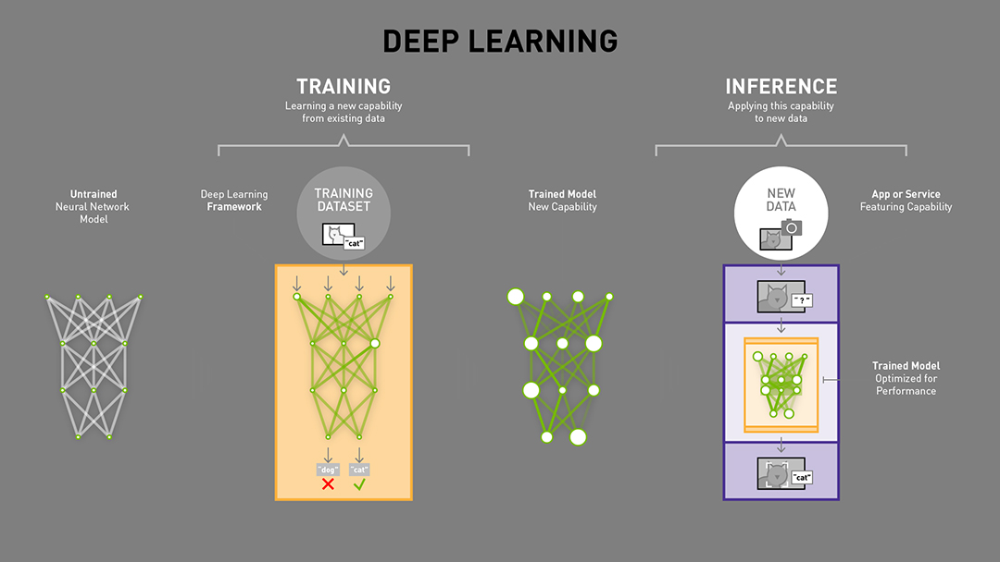
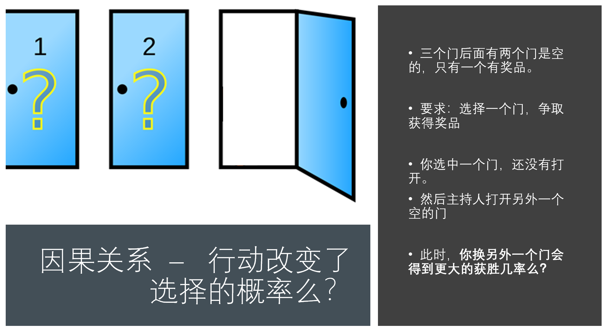
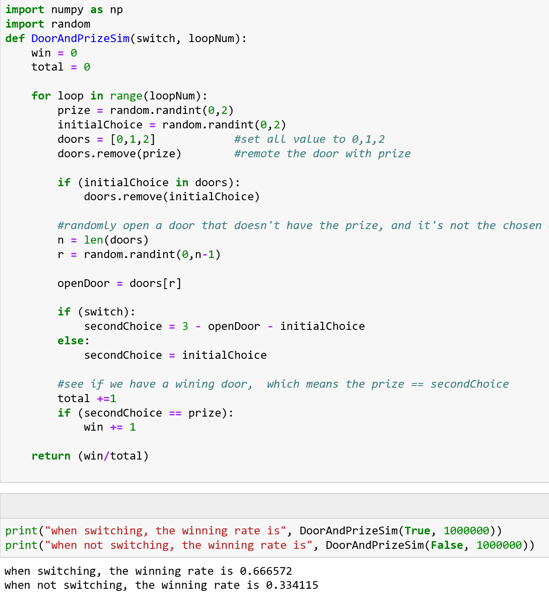
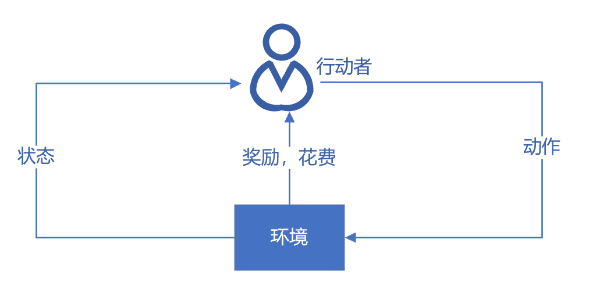

<!--Copyright © Microsoft Corporation. All rights reserved.
  适用于[License](https://github.com/Microsoft/ai-edu/blob/master/LICENSE.md)版权许可-->

# 第1章 概论

人工智能发展简史
================

既然这本书是人工智能入门书，我们就要先讲清楚一些定义。我们从"智能"开始。从计算机科学出现之时，科学家就开始探讨计算机是否能有
"智能"。

1950年，英国科学家艾伦图灵发表了论文讨论创造出具有真正智能的机器的可能性，并提出了著名的图灵测试：如果一台机器能够与人类展开对话而不能被辨别出其机器身份，那么称这台机器具有智能。现在活跃于电脑，手机，还有各种硬件上的
"智能助手" 在各自的功能领域，通常被大众认为挺有智能的。

但是那些"智能助手"，聊天机器人真的有智能么？ 1980年就有学者（John
Searle）提到了中文房间问题：

一个对中文一窍不通，只说英语的人关在一个封闭房间中。房间里有一本用英文写成的手册，指示该如何处理收到的汉语信息及如何以汉语相应地回复。房外的人向房间内递进用中文写成的问题。房内的人便按照手册的说明，查找到合适的指示，将相应的中文字符组合成对问题的解答，并将答案递出。

房间外面的人看到自己递进去的中文输入能得到回答，很可能就会认为房间内的人有智能，懂中文，就像现在的聊天机器人那样，那么这是"智能"
么？读者们如果写过一些程序，
就会想，我也可以写一个程序，根据一些规则和已有的数据，和用户进行某种程度的智能对话，
那么AI 和我的程序有区别么？一个非常简单的程序流程图可以是下面这样：

  ------------------------------------------------------------------------------------------
  
  ------------------------------------------------------------------------------------------

程序接到用户的输入句子后，如果不是结束会话的指令，就在一个数据库中寻找合适的回答句子，然后根据情况准备输出，然后再继续循环...
...

从1956年的达特茅斯会议开始，人工智能（Artificial
Intelligence，AI）作为一个专门的研究领域出现，经历了超过半个世纪的起伏，终于在2007年前后，迎来了又一次大发展。下表展现了人工智能历史的一些里程碑事件。

="6.0in"
height="3.176388888888889in"}

从上面的图表我们可以看出，人工智能的发展，有这样起伏的模式：

1.  研究（包括技术）取得进展

2.  研究的进展让人们看到人工智能的潜力，产生非常乐观的期望，例如在1958年到1970年间科学家对人工智能各种突破的预计，当然他们的绝大多数预计都太乐观了。

3.  上述过高的期望让产业界开始热情地开发各种应用

4.  但应用未能全部满足期望，于是人工智能行业进入低谷，直到下一波研究和技术取得突破性进展...
    在2007年之后，是大规模的数据和廉价的计算能力，让神经网络技术再度兴起，成为AI
    领域的明星技术。

现在（2019年），人们口中的人工智能其实是一个非常庞杂的概念，从人们对人工智能的期待，
技术，和应用角度，都有很多不同的概念。 我们详细分析如下：

第一个层面，人们对人工智能的**期待**可以分为：

-   智能地把某件特定的事情做好，在某个领域增强人类的智慧，这种方式又叫做智能增强
    --
    像搜索引擎，自动语言翻译，某个领域的智能助手那样的程序，帮助人类完成某种特定任务。这也叫做
    "弱人工智能"，或者 "狭义人工智能"。

-   **像人类一样能认知，思考，判断：模拟人类的智能** -
    像人类一样能认知，思考，判断的智能软件。这是人工智能学科一开始就有的梦想。这样的智能也叫做
    "通用人工智能" （Artificial General Intelligence， AGI）， 或
    "强人工智能"。
    对于这样的人工智能，科幻小说有很多描写，也有一些研究，但是在实际的应用还没有什么突破。有学者认为，AGI
    是不可能通过目前人们编程程序的方式实现的[^1]。
    尽管如此，社会上还是有人担忧有一天电脑的 AGI
    会超过人类的智能，人类再也赶不上电脑，从而永远受制于电脑。

第二个层面，
技术的特点来看，要实现某种狭义的人工智能，我们很自然地想到，如果我们能让运行程序的电脑来学习并自动掌握某些规律，那该多好啊，这就是
"机器学习"。机器学习在几十年的发展历史中，产生了很多技术，这些技术都有下面的共性：

如果一个程序解决任务（T）的效能（用P
表示）随着经验（E）得到了提高，那么，这个程序就能从经验（E）中学到了关于任务（T）的知识，并让衡量值（P）得到提高。[^2]

"A computer program is said to learn from experience E with respect to
some class of tasks T and performance measure P if its performance at
tasks in T, as measured by P, improves with experience E."

1\. 选择一个模型结构（例如逻辑回归，决策树等），这就是上面说的程序。

2\. 用训练数据（输入和输出）输入模型。这就是上面的经验（E）。

3\. 通过不断执行任务（T）并衡量结果（P），让P
不断提高，直到达到一个满意的值。

那么，机器学习的各种方法是如何从经验中学习呢？我们可以大致地分为下面三种类型：

1.  监督学习（Supervised Learning）

    通过标注的数据来学习，例如，程序通过学习标注了正确答案的手写数字的图像数据，它就能认识其他的手写数字。

2.  无监督学习（Unsupervised Learning）

    通过没有标注的数据来学习。这种算法可以发现数据中自然形成的共同特性（聚类），可以用来发现不同数据之间的联系，例如，买了商品A
    的顾客往往也购买了商品B。

3.  强化学习（Reinforcement Learning）

    我们可以让程序选择和它的环境互动（例如玩一个游戏），环境给程序的反馈是一些
    "奖励"（例如游戏中获得高分），程序要学习到一个模型，能在这种环境中得到高的分数，不仅是当前局面要得到高分，而且最终的结果也要是高分才行。

综合来看，如果我们把机器学习当作一个小孩，那么，教育小孩的方式就有根据正确答案指导学习（监督学习）；
根据小孩实践的过程给予各种鼓励（强化学习）；
还有自由探索世界，让小孩自己总结规律（无监督学习）。

机器学习领域出现了各种模型，其中，神经网络模型是一个重要的方法，它的原型在1943就出现了，在生物神经网络中，每个神经元与其他神经元相连，当它兴奋时，就会像相邻的神经元发送化学物质，从而改变这些神经元内的电位；如果某神经元的电位超过了一个阈值，那么它就会被激活（兴奋），向其他神经元发送化学物质。把许多这样的神经元按照一定的层次结构连接起来，我们就构建了一个神经网络。[^3]

图：M-P 神经元模型

随着数据的丰富和机器算力的增强，人们不断增加神经网络的层次数目，相邻层次之间的输入输出由非线性函数来控制，这就产生了DNN（深度神经网络）。DNN
在最近十年给人工智能领域带来了新的生机，并在图像分类、语音识别、自然语言处理等方面取得了重大突破。

随着人们不断的调整网络结构，DNN也演变成许多不同的网络拓扑结构，例如CNN（卷积神经网络），RNN（循环神经网络），LSTM（长期短期记忆），GAN（生成对抗网络），Transfer
Learning (迁移学习)等，这些模型还在不断演化中。

训练AI
模型，需要一系列专门的工具，业界有不少成熟的训练平台（TensorFlow，PyTorch，MXNet等），这些平台也在不断演化，支持新的模型，提高训练的效率，改进易用性，等等。当然我们也可以自己开发平台来训练，本书的大部分章节就是带领读者自己动手打造一个小型的开发平台。

第三个层面，**从应用的角度来看**，我们看到狭义人工智能在各个领域都取得了很大的成果。

一种是标杆式的任务，例如ImageNet，考察AI
模型能否识别图像的类别，2015年，AI
取得了超过人类的成果。在其它的领域中，我们也看到了AI
取得了达到或超过人类最高水平的成绩：

翻译领域 （微软的中英翻译超过人类）

阅读理解（SQuAD 比赛）

下围棋 （2016）德州扑克（2019）麻将（2019）

另一种，是AI
技术和各种其他技术结合，解决政府，企业，个人用户的需求。在政府方面，把所有计算，数据，云端和物联网终端的设备联系起来，搭建一个能支持智能决定的系统，现代社会的城市管理，金融，医疗，物流和交通管理等等都运行在这样的系统上。专家称之为智能基础建设[^4]。

一个案例是，微软亚洲研究院与某大型船运公司在深度强化学习领域展开了研究合作。船运公司经营着数百条货轮，在上百个港口搬运集装箱，其中装有不同种类、不同优先级和不同目的地的货物，经常会出现某港口有大量空的集装箱，而另外的港口却急需集装箱的情况。如何能最大化地利用货轮的运输能力，避免过多转运空的货柜集装箱？双方合作开发了一套基于大数据和强化学习的全新解决方案，能够在货船抵达港口时就预估出需要装载或者卸载的空集装箱的最优数量。这个方案大幅度降低了港口货柜短缺的情况，提高了效率。

在个人用户方面，AI
技术出现在各种各样的应用程序和服务中，解决用户旅游时的外语翻译、照片美颜、和个人定制化的学习等需求。

回过头来看，本书（连同相关的网上社区）的内容，其实是庞大AI
系统中几个微小的部分，下图显示了弱人工智能领域中机器学习部分的内容：

从这个角度说，本书的名字 "智能之门"
也只能说明这本书是进入人工智能领域的一个小门而已。 还有其他很多门道。

那么，一个典型的机器学习的模型是怎么得来的，又是怎么在应用中使用的呢？

  ----------------------------------------------------------------------------------
  
  ----------------------------------------------------------------------------------

（todo: 翻译成MNist 的例子并用中文描述）

我们看到，首先我们要设计一个模型，然后用已经标注过的数据来训练这个模型，在训练过程中，模型的各个参数在多次训练中不断得到调整，最后得到了一个达到要求的模型。这个模型会被用于一个推理模型中，和其它程序模块一起组成一个APP
或者是服务，能处理新的数据，满足用户的需求。

在现代软件开发流程中，程序的开发，和AI模型的开发的生命周期应该如何协作呢？软件工程师和数据科学家并肩工作，一个完善代码库，另一个完善模型库，最后的产品通过各种途径（网页/桌面程序/手机/IoT
设备）交到用户手中。

范式的演化
==========

在很多人眼里，AI
来势汹汹，看样子会颠覆很多领域，这些新技术的出现有规律可循么？还会有什么别的技术突然出现让我们措手不及？这当然是有规律可循的。人类一直在试图了解客观规律，这种科学历史上发生了几次颠覆性的改变（范式转换）呢？
我们通过 Jim Gray 的文章[^5]可以看到，我们现在谈论的 AI 大潮是属于 data
exploration 这个范式转换的一部分：

\[来源：同Jim Gray 的文章，考虑翻译\]

翻译：

科学范式的演化

第一阶段：经验

从几千年前到几百年前，人们描述自然现象，归纳总结一些规律。

人类最早的科学研究，主要以记录和描述自然现象为特征，不妨称之为称为
"经验归纳"
（第一范式）。人们看到自然现象，凭着自己的体验总结一些规律，并把规律推广到其他领域。这些规律通常是定性的，不是定量的。有时看似符合直觉，其实原理是错误的；有时在某个局部有效，但是推广到其他领域则不能适用；有些论断来自权威，导致错误总结也流传了很多年无人挑战。例如，我们看到日月星辰都围绕我们转，
地心说很自然就产生了； 我们在生活中观察不同质量的物体运动的情况，
也凭直觉推断
"物体的下落速度和重量成正比"。人们对于不同的观点，也没有严谨地定义试验来证明。例如中国古代
"两小儿辩日"的故事：

> 孔子东游，见两小儿辩日，问其故。
>
> 一儿曰："我以日始出时去人近，而日中时远也。"
>
> 一儿以日初出远，而日中时近也。
>
> 一儿曰："日初出大如车盖，及日中则如盘盂，此不为远者小而近者大乎？"
>
> 一儿曰："日初出沧沧凉凉，及其日中如探汤，此不为近者热而远者凉乎？"
>
> 孔子不能决也。
>
> 两小儿笑曰："孰为汝多知乎？"

两个小孩通过视觉效果和身体对温度的感觉来判断太阳和地球的距离变化，而且小孩子们把主观的
"我觉得它远" 完全等同于 "物体离我远" 这样一个客观事实。
这是一个多么大胆的思维跳跃啊，孔子当时也没有能设计一个试验来证伪某一个观点，只能诚实地表示"不能决"，还遭到小孩笑话。

第二阶段：理论

这一阶段，科学家们开始明确定义，速度是什么，质量是什么，化学元素是什么
(不再是五行和燃素) ...
也开始构建各种模型，在模型中尽量撇除次要和无关因素，例如我们在中学的物理实验中，要假设
"斜面足够光滑，无摩擦力"，"空气阻力可以忽略不计"，等等。在在这个理论演算（Theoretical）阶段，以伽利略为代表的科学家，开启了现代科学之门。他在比萨斜塔做的试验推翻了两千多年来大家想当然的
"定律"。

在理论演算阶段，不但要定性，而且要定量，要通过数学公式严格的推导得到结论。我们现在知道真空中自由落体下落的公式：

> $h = \frac{1}{2}gt^{2}$
> （h是下落的高度，g是重力加速度，t是运动时间。）

这个公式里没有物体的质量，所以我们可以说，在真空中，自由落体下落的速度的确和物体的质量无关。

第三阶段：计算仿真

从二十世纪中期开始，利用电子计算机对科学实验进行模拟仿真的模式得到迅速普及，人们可以对复杂现象通过模拟仿真，推演更复杂的现象，典型案例如模拟核试验、天气预报等。
这样计算机仿真越来越多地取代实验，逐渐成为科研的常规方法。科学家先定义问题，确认假设，再利用数据进行分析和验证。

第四阶段：数据探索

最后我们到了 "数据探索"（Data
Exploration）阶段。在这个阶段，科学家收集数据，分析数据，探索新的规律。
在深度学习的浪潮中出现的许多结果就是基于海量数据学习得来的。有些数据并不是从现实世界中收集而来，而是由计算机程序自己生成，例如，在AlphaGo
算法训练的过程中，它和自己对弈了数百万局，这个数量大大超过了所有记录下来的职业选手棋谱的数量。

作为一个小例子，我们可以看看各个阶段的方法论如何解一个我们姑且称为
"智能之门"[^6] 的问题：

顾客参加一个抽奖活动，三个关闭的门后面只有一个有奖品，顾客选择一个门之后，主持人会打开一个没有奖品的门，并给顾客一次改变选择的机会。
此时，改选另外一个门会得到更大的获奖几率么？

怎么解决这个问题呢？ 我们用各种范式来看看：

1.  经验归纳

    我们生活中的确碰到过各种抽奖时刻，有时候我们看似有很多赚大钱的机会，但是往往赢家不是自己。
    从这些生活经验出发，我们的直觉告诉我们要怎么选择呢？
    （我们做了调查，同学们的"基于生活经验的直觉"是这样分布的：X：Y
    ）很多人会是从生活经验出发，感觉自己会中计，因此决定"我换了就上当了，我不换"，
    "我改变选择对运气不好，我不换"
    。当然，我们还可以用类比推理的办法，如果是100扇门，
    只有一扇门后面有奖品，我选中了一扇门，裁判打开了另外98个没有奖品的门，
    这个时候，我要换门么？

2.  理论推导

本书的读者大多学过基本的概率知识，我们可以用概率的基本方法来解这一道题目

设A为第一次选到了中奖门的概率，B为改变选择后选到了中奖门的概率，C为未改变选择后选到了中奖门的概率。

P(A)=1/3, （初始选择就是获奖门的获奖概率是 1/3）

P(A\')=2/3, （当选中一个门之后， 其它两个门的获奖概率是 2/3）

P(B\|A)=0, （用户先选择了一个门，奖品在这个门后，
用户后来改变选择，他的获奖概率是 0）

P(C\|A)=1,
（用户选择了一个门，奖品在门后，后来他不改变选择，他的获奖概率是 1）

P(B\|A\')=1, P(C\|A\')=0, （类似地， 用户首次选择的门后面没有奖品，
他改变选择后，获奖概率是 1， 不改变选择，那么获奖概率是 0）

P(B)=P(B\|A) \* P(A) + P(B\|A\') \* P(A\')=2/3,
（所以，改变选择后中奖的概率，等于 2/3）

P(C)=P(C\|A\') \* P(A\') + P(C\|A) \* P(A)=1/3,
（不改变选择而中奖的概率，等于 1/3，和A 一样）

结论：P(B)\>P(C)

3.  数据模拟

我们还可以用数据模拟的方法，来看看在各种情况下，换或者不换的结果如何。

看我们的Python 程序示例。

我们看到，当我们随机模拟一百万轮换门（switching）和不换门（not
switching）的情况后，我们得到了这样的结果：

换门：最后得奖的概率是0.666572 （约2/3）

不换门：最后得奖的概率是 0.334115 (约 1/3)

4.  数据探索

当人类探索客观世界的时候，大部分情况下，我们是不了解新环境的运行规则的。这个时候，我们可以观察自己的行动和客观世界的反馈，判断得失，再总结出规律。
这种学习方法，叫强化学习（Reinforcement
Learning），使用这种方法来找出适合的策略。

我们假设顾客就是下图的行动者（Agent），他身处环境中，有一定的状态，他为了达到一定的目的（总的奖励），不断地采取一系列的动作去尝试与环境进行交互，这些交互会给他带来奖励，同时改变他的状态，
他可以交互中根据反馈不断地调整策略，试图了解到状态、动作和总的奖励关系。强化学习可以通过表格来跟踪和调整这些关系（例如Q-Learning
方法）或者通过神经网络来达到同样的目的。

下面是伪代码的程序示例（使用 Q-Learning 的方法）：

+-----------------------------------------------------------------------+
| //维护一个表格，命名为Q，存储Agent 所在的 "状态" 和 "收益"            |
|                                                                       |
| 1.  起始状态，表格Q 所有内容都清零                                    |
|                                                                       |
| 2.  在每一个选择的机会时候                                            |
|                                                                       |
| 3.  查找目前状态中可能收益最大的动作                                  |
|                                                                       |
| 4.  执行动作，得到收益，进入下一个状态                                |
|                                                                       |
| 5.  按照规则，更新表格Q 中的收益，规则是                              |
|                                                                       |
| 6.  新收益 = 原来的收益 + （新收益 +未来可能获得的最大收益）\* 折扣率 |
+-----------------------------------------------------------------------+

完整的可执行代码在网上社区里（链接）。
通过学习和运行示例程序，我们看到这段程序通过强化学习的手段和客观环境交互，学到了一个获利机会更大的策略。这个过程，和大家玩游戏是不是很类似呢？

从这个例子和我们最初看到的依赖事先设计好的逻辑的聊天程序，
和依赖事先准备好的数据的
"中文房间"程序，很不一样，这个例子中程序是从和环境交互的过程中学习，不断完善。
当然，深度学习还有很多更强有力的学习方法，我们在下面的章节中，我们一步一步地介绍。
如何构建各种神经网络，完成各种层次的数据探索任务。

问题和讨论
==========

详细讨论在课程社区中，读者可以去参与讨论。

1.  如果一个人工智能专业的大学生毕业了，刚好遇到人工智能的"冬天"，他/
    她应该怎么办？

> 人工智能经历很多起起伏伏，其中有两个AI
> 的冬天，我们从中学到什么规律呢？AI
> 的冬天来自于认识和期望值的巨大落差，外行对AI的效果有巨大的期望值，内行则挣扎于各种具体困难中。
> 正如Roy Amara
> 指出的那样，"我们总是高估一项科技所带来的短期效益，却又低估它的长期影响"。经过几十年积累下来的AI
> 技术，在计算机算力提高，数据大量丰富的背景下，终于找到了爆发的突破口，神经网络和反向传播这些"旧"技术重新找到了用武之地，在过去的10年中不断给我们带来惊喜。这些惊喜又导致了巨大的期望值。
>
> 现在全国各地高校新建立了七十多个AI
> 学院和专业，这么快的速度的确和巨大的期望值有关。
> 我们不妨问自己，如果AI 的发展在几年后又会出现寒冬，那时候我们培养的AI
> 专业的学生刚刚毕业，他们还能通过自己的"人工智能"专业找到如意的工作么？
> 那时候需要什么样的技能呢？

2.  中文房间问题：

    请问：房间中的人懂中文么？
    我们可以把房间内的人等同于电脑的CPU，房间内的说明书相当于程序，房间外的人等同于用户。那么，我们看到用户和电脑在用中文交流，就像用户和中文聊天机器人程序交互一样。
    这个电脑真的懂中文么？它有智能么？ 请阐述你同意或反对的理由。

[^1]: 参见： David Deutsch, 2012: Creative blocks --- the very laws of
    physics imply that artificial intelligence must be possible. What's
    holding us up? Aeon (online magazine). Available from:
    https://aeon.co/essays/how-close-are-we-to-creating-artificial-intelligence.

[^2]: 定义翻译自：Mitchell, Tom (1997). Machine Learning. McGraw Hill

[^3]: 定义参考了周志华的 《机器学习》 清华大学出版社 2016 ISBN
    978-7-302-42328-7

[^4]: 智能基础建设，智能增强，模拟人类的智能的分析来自于 Michael I.
    Jordan 的论述，参见： 网页。

[^5]: 参见：The Fourth Paradigm: Data-Intensive Scientific Discovery，
    作者：Tony Hey, Stewart Tansley, Kristin Tolle, Published by
    Microsoft Research, October 2009, ISBN: 978-0-9825442-0-4

[^6]: 这个问题由经典的 "羊车门" 问题简化而来
